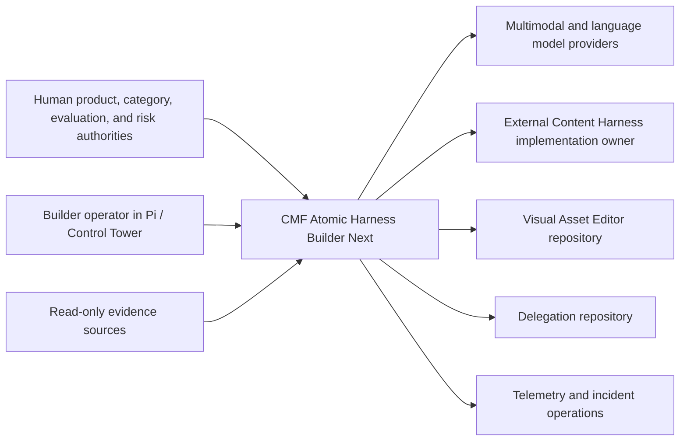
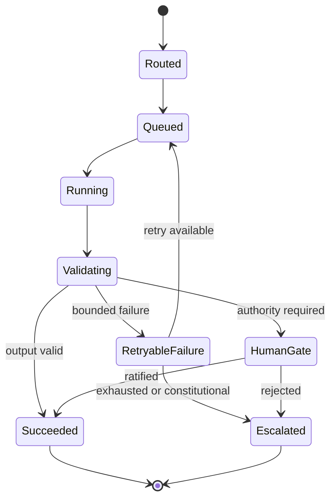
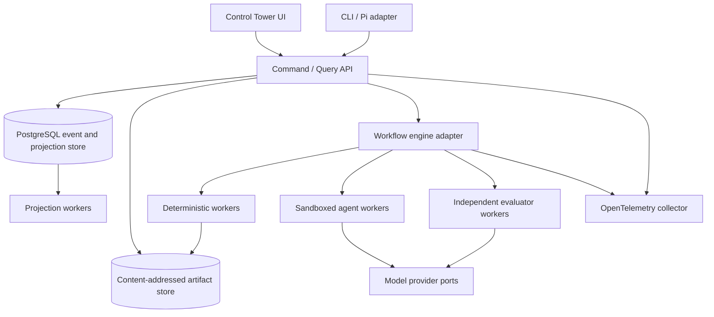

# CMF Atomic Harness Builder Next Architecture

Status: `RATIFIED_WITH_OPEN_EXTERNAL_AND_EMPIRICAL_BLOCKERS`

Architecture completion gate: `FAIL_PENDING_EXTERNAL_AND_EMPIRICAL_INPUTS`

## 1. Authority And Purpose

This architecture implements the product boundaries in the Activative Intelligence Constitution V1.1, Builder PRD V1.2, D001-D033, binding anti-goals, Readiness Hard Gates, Architecture Handoff, and TS-00 through TS-15. It does not substitute the historical V2.1 definition.

Priority order:

1. Current explicit human direction.
2. Activative Intelligence Constitution V1.1.
3. Builder PRD V1.2, amendment, and current-effect governance registries.
4. Accepted ADRs and technical specifications.
5. Planning artifacts and historical addenda.

All architecture recommendations were ratified by the human product authority on 2026-07-14. External and empirical blockers still prevent implementation readiness.

### V1.2 alignment boundary

| Implementation owner | Component boundary | Data / contract | Failure behavior | Test seam | Acceptance criteria | Migration / compatibility |
| --- | --- | --- | --- | --- | --- | --- |
| cross_product_architecture | Builder compiles, validates, preserves lineage, and emits handoffs; source/human/downstream owners retain capture, merge, and execution authority | precedence contract, five-category and conversational profile registries, V1.2 contract schemas, HG-015 | Block missing rich lineage, order inversion, semantic mutation, false certification, or external runtime execution | contract-schema, authority, three-target/five-category, dual-order, and no-external-runtime tests | TS-00 through TS-15 and six affected ADRs contain complete bounded requirements; all accepted ADR decisions remain unchanged | Additive V1.2 overlay; D031 retained historically; ADR-014 and approved Control Tower UX preserved |

## 2. Architecture Goals

- Compile a hash-locked evidence workspace into one canonical typed Harness IR.
- Execute Builder work through a separate typed Workflow IR with explicit human, agent, and deterministic actors.
- Preserve authority, provenance, category boundaries, exact artifact identity, and downstream semantic ownership.
- Make every transition, decision, compilation, evaluation, repair, and authorization reconstructible from events and receipts.
- Prove Release 1 through Format 02 Minimal Coach Theatre without implementing the final Content Harness or external products inside Builder.
- Fail closed on unsupported evidence, missing authority, contract contradiction, benchmark leakage, hidden orchestration, or false readiness.

## 3. Non-Goals And Frozen Boundaries

- No universal creative engine or general software factory.
- No final Atomic Content Harness runtime.
- No Visual Asset Editor production behavior.
- No shared Delegation Protocol implementation.
- No ComfyUI, model serving, LoRA training, GPU scheduling, or generated-harness execution.
- No V2.1 migration while authoritative V2.1 implementation artifacts are absent.
- No direct editing of canonical state through the Control Tower or generated documents.

## 4. System Context



External target arrows carry versioned schemas, compiled packages, fixtures, or signed result receipts. They do not grant Builder ownership of external runtime behavior.

## 5. Architecture Style

Release 1 uses a modular monolith with ports and isolated workers:

- One domain model and command boundary preserve transaction, authority, and traceability coherence.
- Separate worker processes isolate deterministic, agent, evaluator, projection, and compiler workloads.
- External persistence, workflow, model, sandbox, telemetry, and target interfaces are adapters.
- Modules communicate through application commands, typed contracts, and domain events, never direct table mutation.
- Physical extraction into services is permitted only after measured scaling or isolation evidence and an ADR.

Proposed package boundaries:

```text
src/cmf_builder/
  domain/          # IR, IDs, values, graphs, policies, events, receipts
  application/     # commands, queries, transactions, authority
  evidence/        # source profiles, adapters, locks, indexes, saturation
  visual/          # normalization, parser ports, syntax/grammar induction
  genesis/         # atomicity, decisions, recommendations, ratification
  skills/          # registry, adaptations, recipes, capsule compiler
  evaluation/      # corpora, runners, evaluators, maturity, hard gates
  workflow/        # Workflow IR, profiles, router, executors, checkpoints
  compilers/       # human, machine, OpenSpec, target, capsule outputs
  control_tower/   # projections, commands, query API
  adapters/        # persistence, CAS, workflow, provider, sandbox, telemetry
  cli/             # operator shell over application commands
```

Dependency rule: domain imports nothing outside domain; application imports domain and ports; adapters implement ports; API/CLI/UI invoke application services; no presentation or adapter module writes domain tables directly.

## 6. Logical Components

| ID | Component | Primary responsibility | Governing spec | ADRs |
|---|---|---|---|---|
| C01 | Run Governance | lifecycle, target selection, authority, checkpoints | TS-01 | ADR-001, ADR-003, ADR-005 |
| C02 | Evidence Workspace | source profiles, immutable locks, indexing, saturation | TS-02 | ADR-003, ADR-007, ADR-012 |
| C03 | Visual Understanding | normalization, syntax/temporal parse, grammar induction | TS-03 | ADR-008, ADR-012 |
| C04 | Atomicity | candidate boundaries, risk, Draft Harness Model, ratification | TS-04 | ADR-005, ADR-008, ADR-014 |
| C05 | Genesis | decision graph, recommendations, transactions, cascade lock | TS-05 | ADR-003, ADR-005 |
| C06 | Harness IR And Compilers | canonical IR, schemas, artifacts, drift, manifests | TS-06 | ADR-002, ADR-003, ADR-004 |
| C07 | Architecture Graphs | ownership, modules, phase/context/contracts/references/repair | TS-07 | ADR-001, ADR-002, ADR-004, ADR-005 |
| C08 | Skill Ecology | capability registry, skill design, maturity | TS-08 | ADR-009, ADR-010 |
| C09 | JIT Capsule Compiler | adaptations, recipes, bindings, deterministic capsules | TS-09 | ADR-004, ADR-009 |
| C10 | Evaluation | corpora, independent evaluators, scorecards, maturity | TS-10 | ADR-003, ADR-010 |
| C11 | Category And Target Compilers | constitutions, profiles, sequence, target packages | TS-11 | ADR-013, ADR-014, ADR-018 |
| C12 | Control Tower | event projections, queries, governed commands, exports | TS-12 | ADR-003, ADR-011, ADR-016 |
| C13 | Repair, Authorization, Handoff | repair, gates, receipts, Development Capsule | TS-13 | ADR-003, ADR-004, ADR-005, ADR-010 |
| C14 | Workflow Runtime | Workflow IR, routing, node execution, isolation, incidents | TS-14 | ADR-002, ADR-006, ADR-012, ADR-016, ADR-017 |
| C15 | Format 02 Reference Slice | Release 1 end-to-end proof and downstream evidence | TS-15 | ADR-014, ADR-018 |
| C16 | Persistence And Artifact Plane | event ledger, snapshots, projections, CAS, backups | Cross-cutting | ADR-003, ADR-016 |
| C17 | Security And Sandbox Plane | identity, grants, secrets, network/tools, disposal | Cross-cutting | ADR-005, ADR-012 |
| C18 | External Contract Ports | model providers, targets, downstream certification | Cross-cutting | ADR-008, ADR-013, ADR-015, ADR-018 |

## 7. Canonical State And Identity

### 7.1 Aggregates

- `Run`: lifecycle, target profile, active source/IR/workflow/checkpoint identities.
- `HarnessIR`: canonical harness definition and every governed product graph.
- `WorkflowIR`: canonical executable Builder workflow definition.
- `Registry`: target, category, reference, skill, evaluator, workflow, and policy entries.
- `EvaluationRun`: cases, trials, exact subject/evaluator identities, scorecard, maturity.

Aggregates use UUIDv7 identifiers with a kind prefix. Every authoritative command includes actor identity, idempotency key, expected stream version, correlation/causation IDs, and policy versions.

### 7.2 Governed Values

Material values use:

```text
GovernedValue<T> {
  value,
  knowledge_status,
  authority,
  evidence_refs,
  decision_ref?,
  confidence?,
  created_by,
  created_at
}
```

Knowledge status is one of measured observation, deterministic derivation, bounded hypothesis, human decision, generated proposal, or external signed result. Promotion between statuses requires an explicit command and authority receipt.

### 7.3 Events And Receipts

The Run Ledger is append-only. An event contains `event_id`, stream, stream version, event type/version, actor, occurred/recorded time, command/idempotency IDs, correlation/causation, payload, policy hashes, and prior-event hash. Receipts bind exact input/output identities and validation results.

Event history is authoritative for transitions and decisions. IR snapshots are authoritative aggregate snapshots bound to stream position and hash. Read models are rebuildable projections.

## 8. Persistence And Consistency

ADR-003 proposes PostgreSQL for event streams, snapshots, registries, command receipts, and projections, with SHA-256 content-addressed storage for immutable media and artifacts.

One command transaction:

1. Authorize actor and validate expected version.
2. Rehydrate aggregate from snapshot/events.
3. Execute pure domain decision.
4. Stage immutable artifacts and verify hashes.
5. Append events and command receipt atomically.
6. Commit snapshot pointer/outbox entry.
7. Publish projection/workflow notifications after commit.

The outbox is delivery infrastructure, not a second source of truth. Artifact bytes become authoritative only when referenced by a committed event/manifest. Orphan staging objects are garbage-collected after retention.

## 9. Harness IR And Compilation

Harness IR is versioned canonical JSON with deterministic serialization and SHA-256 identity. Generated Markdown, OpenSpec, JSON Schema, graph views, target packages, tests, stories, and Development Capsules are compiler views.

Each compiler declares consumed IR paths, target/profile identity, compiler version, configuration hash, and emitted artifacts. Compilation occurs in an empty network-denied workspace. The manifest commits atomically only after schema, cross-artifact, secret, reference, and drift checks pass.

Manual artifact edits are non-authoritative. A desired change must enter as a typed IR patch with evidence/authority, then regenerate outputs.

## 10. Builder Workflow Runtime

Workflow IR is separate from Harness IR. A workflow node declares actor, inputs, outputs, validators, retry/timeout/circuit policy, budget, sandbox, idempotency, events, and failure owner.



ADR-006 proposes a Temporal adapter for durable scheduling and an in-memory deterministic adapter for tests. Engine history remains operational; Builder events and receipts remain canonical product state. Activities invoke application commands and cannot mutate product storage directly.

Release 1 production profiles proposed in ADR-017: new harness compilation, evidence refresh, benchmark regression, repair/re-certification, and constrained incident hotfix.

## 11. Evidence-To-Genesis Flow

```mermaid
flowchart LR
    A["Target profile and candidate"] --> B["Source diagnostics"]
    B --> C["Immutable source lock"]
    C --> D["Normalize specimens"]
    D --> E["Visual and temporal syntax"]
    E --> F["Grammar and draft hypotheses"]
    F --> G["Saturation"]
    G --> H["Atomicity assessment"]
    H --> I["Human boundary ratification"]
    I --> J["Unratified Draft Harness Model"]
    J --> K["Dependency-driven Genesis"]
    K --> L["Cascade-locked Harness IR"]
```



Deterministic stages own bytes, hashes, geometry, schema checks, graph eligibility, and commits. Agents own bounded parse/hypothesis/recommendation proposals. Humans own boundary, constitutional, and risk decisions.

## 12. Skills, Capsules, And Model Providers

The skill system has four immutable layers: Canonical Skill, Harness-local Adaptation, Composition Recipe, and phase-local Execution Capsule. New canonical skills require a capability-gap decision and behavioral evidence.

The JIT compiler deterministically resolves exact versions, bindings, authority, precedence, references, Minimum Complete Context, degradation, tools, output contracts, evaluators, and model policy. Provider execution begins only after capsule validation. Capsules are ephemeral and content-hashed; exact evaluated identity is required.

Provider adapters expose typed task contracts, budgets, model/version identity, failure classes, and raw-output evidence. Provider output never writes canonical state directly.

## 13. Evaluation, Repair, And Authorization

Evaluation isolates generator and evaluator contexts. Protected labels use separate credentials and storage. Scorecards retain dimensions and distributions; hard-gate failures cannot be averaged away.

Repair requires a typed failure, root-cause report, smallest responsible layer, exact invalidation closure, targeted regression suites, and escalation policy. Authorization outcomes are `FAIL`, `CONCERNS`, `PROTOTYPE_ONLY`, or `IMPLEMENTATION_AUTHORIZED`, each bound to exact source, IR, workflow, artifact, skill, evaluator, corpus, and policy hashes.

The Development Capsule contains only justified specifications, schemas, interfaces, fixtures, stories, scaffolding, receipts, and non-goals. It does not contain external production implementations.

## 14. Control Tower

The proposed Control Tower is a React/TypeScript web client over a FastAPI command/query API, launched or linked from Pi. It shows event-derived run, graph, evidence, decision, skill, evaluation, repair, workflow, sandbox, budget, and authorization state.

The UI never writes projections or domain tables. Every action submits a typed command with expected version and receives the authoritative result/receipt. Protected labels, secrets, raw chain-of-thought, and unrelated evidence never enter projections or exports.

## 15. Security And Isolation

- Human, service, agent, and evaluator identities are distinct principals.
- Authorization combines role, resource, run, evidence class, action, and active policy.
- Agent/tool/network/source/secret grants are deny-by-default and phase-local.
- Evidence mounts are read-only; artifact output is staged; credentials are ephemeral.
- Generators cannot access protected labels; evaluators cannot access generator hidden context.
- Compiler nodes have no model/network access.
- External repository access uses versioned read-only contract snapshots.
- Sandbox disposal retains only hashes, declared outputs, logs, and receipts.

ADR-012 proposes three profiles: deterministic process sandbox, provider-call sandbox, and isolated implementation-task sandbox. Exact container/worktree technology requires ratification.

## 16. Observability And Operations

Every command, workflow node, provider call, compiler, evaluation, repair, and projection emits OpenTelemetry-compatible trace/metric/log correlation plus canonical domain events where state changes.

Required measures include p50/p95 latency, queue time, tokens/cost, artifact bytes, context budget, retries, circuit state, sandbox startup/disposal, first-pass pass rate, evaluator disagreement, invalidation fan-out, human intervention, projection lag, and cost per authorized capsule.

Operational incidents include false readiness, source-lock corruption, benchmark leakage, workflow regression, stable-skill regression, artifact drift, event discontinuity, and sandbox policy violation. Incident profiles preserve evidence and require human promotion gates.

## 17. Proposed Deployment Topology



Release 1 environments are development, CI, shadow, and production. Promotion binds exact schema, code, workflow profile, policy, sandbox, test, benchmark, and deployment identities. Backup/restore and disaster-recovery drills must prove event/CAS referential integrity before production authorization.

## 18. Reliability And Performance Budgets

- Commands are idempotent and optimistic-concurrency protected.
- Deterministic compilers reproduce byte-identical outputs or record approved nondeterminism.
- Workflow checkpoints resume without repeating human decisions or completed valid nodes.
- Projection loss is recoverable from events.
- Partial parallel failure preserves independent successful work.
- Budget overflow pauses before dispatch or requires human approval.
- Proposed targets: transition p95 250 ms, Control Tower query p95 500 ms, event-to-view lag 2 s, resume under 5 s for 10,000 events, compilation under 30 s excluding model/evaluation. These remain ratification/calibration inputs, not product claims.

## 19. Format 02 Release 1 Vertical

Format 02 Minimal Coach Theatre is the Release 1 Atomic Content Harness reference under 2D Character Animation. It exercises all components from evidence lock through downstream signed result ingestion.

The slice uses a contract-tested stub Asset Demand port unless BD-011 chooses no asset delegation. It never imports editor production behavior. The other categories and external target profiles receive schema-valid `UNCERTIFIED` structural support and cannot inherit the Format 02 production claim.

## 20. Testing Architecture

| Layer | Required tests |
|---|---|
| Domain | invariants, state transitions, graph properties, canonical hashing |
| Contract | API, event, schema, target, provider, sandbox, external snapshots |
| Integration | event/snapshot/CAS transaction, compilers, projectors, workflow adapters |
| Workflow | routing, human gates, resume, rollback, incidents, public seams |
| Fault | provider outage, lost event, stale checkpoint, sandbox termination, partial parallel failure |
| Security | authority, source immutability, traversal, label isolation, secret/network/tool denial |
| Behavioral | skills, parses, category sequence, no-guidance controls, repeated trials |
| End-to-end | Format 02 shadow and production candidate path |
| Deployment | migration, backup/restore, promotion, rollback, telemetry continuity |

No unit or document-completeness result can substitute for failed workflow, benchmark, hard-gate, or downstream proof.

## 21. Architecture Evolution And Migration

Builder Next schemas, events, Workflow IR, profiles, and contracts use explicit versioning, compatibility checks, dual readers where required, migration receipts, and rollback. In-flight runs remain bound to compatible versions unless a governed migration occurs.

V2.1 migration is not applicable because no authoritative V2.1 implementation exists in this repository. ADR-015 defines the invalidation trigger if artifacts are later supplied.

## 22. Architecture Completion Gate

Structurally, every FR/NFR has a technical owner or disposition and every Release 1 subsystem has a testable vertical path. All ADRs are accepted. Architecture completion remains blocked only by BD-004, BD-007, BD-008, BD-010, and BD-014, which require external or empirical evidence.

Production implementation remains prohibited until:

1. Format 02 corpus, provider comparison, calibrated benchmark governance, seed skills, and external interface snapshots are available.
2. The Control Tower UX contract and approved Epics/Stories exist.
3. Feature technical specifications are revised to map tasks to approved story IDs.
4. The implementation-readiness audit returns `PASS`.
