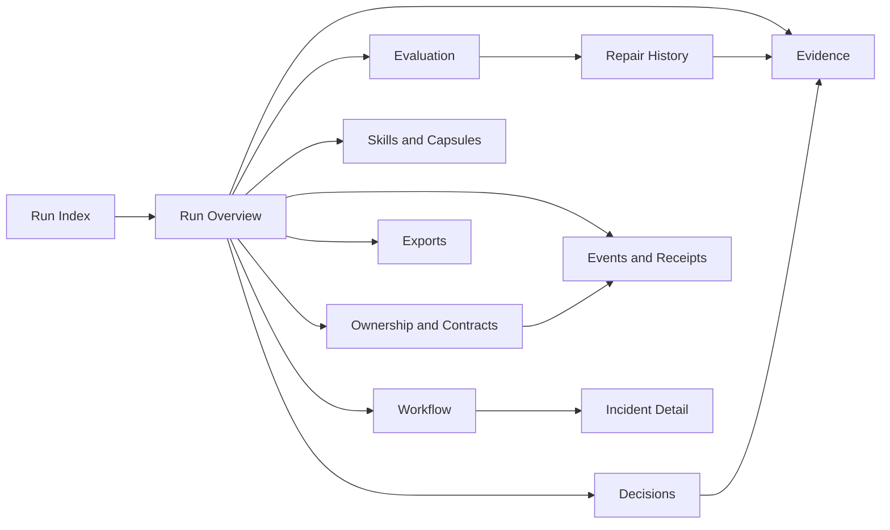

# Harness Control Tower UX Contract

Status: `APPROVED`

Implementation gate: `FAIL`

## 1. Authority And Adoption

This contract defines the implementation-boundary user experience for the Pi-linked Harness Control Tower. It is downstream of the authoritative PRD and ratified Architecture and upstream of Epics, Stories, and production UI implementation.

Authority order:

1. Product Constitution, locked decisions D001-D033, hard gates, and anti-goals.
2. Builder Next PRD, especially F12, F13, F18, and cross-cutting NFRs.
3. Ratified Architecture, ADR-003, ADR-011, ADR-012, ADR-016, TS-12, and TS-14.
4. This UX contract.
5. Future stories, designs, components, and implementation details.

This contract may constrain presentation and interaction but may not invent constitutional state, weaken authority, or become a second source of truth. Human product and UX authority approved this artifact on 2026-07-14; the governed record is `docs/ux/CONTROL_TOWER_UX_APPROVAL_RECEIPT.yaml`.

### Requirement And Decision Traceability

- Owned FRs: FR-117, FR-118, FR-119, FR-120, FR-121, FR-122, FR-123, FR-124, FR-125, FR-126.
- Owned NFRs: NFR-PERF-001, NFR-TRACE-002, NFR-OBS-001, NFR-OBS-002, NFR-OBS-003, NFR-OBS-004, NFR-UX-001, NFR-UX-002.
- Supporting workflow FRs: FR-201, FR-202, FR-203, FR-208, FR-209.
- Supporting NFRs: NFR-SEC-003, NFR-TRACE-001, NFR-TRACE-003, NFR-TRACE-004, NFR-WORKFLOW-010.
- Locked decisions: D002, D007, D010, D011, D013, D014, D015, D017, D018, D020, D021, D024, D025, D026, D027, D029, D033.
- Ratified ADRs: ADR-003, ADR-011, ADR-012, ADR-016.
- Technical specifications: TS-12 and TS-14, with read-only dependencies on TS-01 through TS-11, TS-13, and TS-15.

### Contract Clauses

- **UXC-001 - Authoritative state:** Every material value displayed by the Control Tower comes from a versioned projection of Harness IR, the Run Ledger, registries, artifacts, or receipts.
- **UXC-002 - Command-only mutation:** The UI changes product state only by submitting typed commands to authoritative domain handlers.
- **UXC-003 - Evidence-backed status:** Every displayed status exposes its authoritative state code, evidence or receipt, event position, and observation time.
- **UXC-004 - Honest uncertainty:** Unknown, stale, partial, redacted, unconfigured, and unavailable states are explicit and never rendered as success.
- **UXC-005 - Progressive disclosure:** Decisions, blockers, evidence, ownership, and next actions precede lower-level implementation detail.
- **UXC-006 - Accessible operation:** All Release 1 workflows are keyboard-complete, screen-reader operable, and understandable without color.
- **UXC-007 - Least privilege:** Visible data and available commands are constrained by run, evidence class, benchmark role, and human authority.
- **UXC-008 - Responsive continuity:** Every operator workflow remains available at supported viewport sizes, using list or table alternatives where graphs cannot fit.
- **UXC-009 - No optimistic authority:** A submitted command never appears successful until an authoritative result event and receipt are projected.
- **UXC-010 - Addressable context:** Run, view, filters, selected entity, graph focus, and comparison identities are URL-addressable when disclosure policy permits.

## 2. Scope, Users, And Outcomes

Primary users are P-01 Harness Architect, P-02 Format Category Steward, P-03 JIT Skill Maintainer, P-05 Reviewer and Ratifier, and P-06 Builder Maintainer. P-04 Implementation Lead has read and export access to authorized Development Capsules but does not receive broader Builder authority by default.

The contract supports UJ-01, UJ-02, UJ-04, UJ-08 through UJ-14. Its primary outcome is the F12 outcome: an operator can determine what is happening, why, what evidence supports it, who owns the next action, what changed, what was invalidated, and what remains before authorization.

Release 1 covers the Builder control plane for one Format 02 reference vertical slice. It provides structural views for other target profiles without claiming their production behavior is implemented or certified.

## 3. Experience Principles

1. **Blockers before activity.** The first viewport prioritizes authorization state, failed hard gates, pending decisions, stale data, and responsible owners over aggregate activity.
2. **Evidence before confidence.** Confidence is never shown without knowledge status, supporting specimens or receipts, and contradiction visibility.
3. **One state, many views.** Tables, graphs, inspectors, exports, and command results are different views of the same projected identities.
4. **Authority is visible.** Human, deterministic, agentic, evaluator, and hybrid ownership are labeled wherever a decision or transition can occur.
5. **No decorative dashboards.** Operational surfaces use dense, scan-friendly tables, bands, graphs, and inspectors. Cards are reserved for repeated bounded entities and are never nested.
6. **Stable spatial memory.** Navigation, filters, status bands, graph controls, and inspectors keep stable dimensions across loading and state changes.
7. **Inspect, then act.** Privileged commands follow evidence inspection and preflight impact review; speed does not bypass authority.
8. **Failures stay actionable.** Every failure exposes type, owner, affected scope, retained state, allowed recovery route, and supporting event.

## 4. Information Architecture

### Global And Run-Scoped Routes

| Route | Surface | Scope | Primary question |
|---|---|---|---|
| `/runs` | Run Index | global | Which runs require attention and why? |
| `/runs/{run_id}/overview` | Run Overview | run | What is the current governed state and authorization trajectory? |
| `/runs/{run_id}/workflow` | Workflow | run | Which nodes are queued, running, blocked, retried, or awaiting a human? |
| `/runs/{run_id}/graphs/{kind}` | Graph Explorer | run | What depends on what, and where is execution or invalidation blocked? |
| `/runs/{run_id}/evidence` | Evidence Workspace | run | What was observed, inferred, contradicted, or missing? |
| `/runs/{run_id}/decisions` | Genesis Decisions | run | Which decisions are ready, provisional, ratified, reopened, or blocked? |
| `/runs/{run_id}/skills` | Skills And Capsules | run | Which evaluated capabilities and exact identities are in use? |
| `/runs/{run_id}/architecture` | Ownership And Contracts | run | Who owns each capability, module, contract, and failure route? |
| `/runs/{run_id}/evaluation` | Evaluation | run | Which dimensions and hard gates passed or failed, with what evidence? |
| `/runs/{run_id}/repairs` | Repair History | run | What failed, what was invalidated, and what changed after repair? |
| `/runs/{run_id}/events` | Event History | run | What authoritative events and receipts produced this state? |
| `/runs/{run_id}/exports` | Exports | run | Which governed machine-readable artifacts can this actor export? |
| `/incidents` | Incident Queue | global | Which operational incidents require containment or review? |
| `/incidents/{incident_id}` | Incident Detail | incident | What failed, what is frozen, and which constrained response is active? |

The primary navigation has no more than two levels. A selected run remains explicit in the route and shell. Cross-surface links preserve run identity and open the exact referenced entity, event, receipt, artifact, or failed case.

### Navigation Model

## 5. Application Shell And Layout

- **UXC-201 - Stable shell:** The shell contains a 52 px top bar, a 240 px wide navigation column on wide screens, a fluid main workspace, and an optional 360 px inspector. Loading, empty, and error states do not resize these regions.
- **UXC-202 - Operational tables:** Run, decision, skill, contract, event, receipt, queue, and evaluation collections default to sortable tables with persistent headers, explicit row counts, and column controls.
- **UXC-203 - Graph workspace:** Graph views provide pan, zoom, fit, search, filters, legend, minimap where useful, selected-node inspector, and an equivalent dependency-ordered table.
- **UXC-204 - Evidence viewer:** Evidence uses a specimen rail, an uncropped primary viewer, layer controls, geometry overlays, knowledge-status labels, confidence, provenance, and a structured inspector.
- **UXC-205 - Preserved context:** Search, filters, sort, graph focus, comparison candidates, and selected entities survive navigation and refresh through URL state or user preferences.
- **UXC-206 - Inspectors and dialogs:** Entity details use a side inspector on wide screens and a full-screen sheet on compact screens. Confirmation dialogs are reserved for commands with state impact.
- **UXC-207 - Keyboard model:** Skip links, landmarks, deterministic tab order, visible focus, table and graph roving focus, `Escape` dismissal, and focus restoration are mandatory.
- **UXC-208 - Status notices:** Projection lag, disconnection, redaction, authorization change, and command results use persistent inline or page-level notices with timestamps; transient toast messages are supplementary only.
- **UXC-209 - Compact layout:** Below 768 px the navigation becomes a drawer, inspectors become full-screen sheets, tables gain list alternatives or controlled horizontal scrolling, and graphs default to their accessible table representation.

Wide desktop uses the full shell at 1280 px and above. From 768 px through 1279 px, navigation collapses to a stable 56 px icon rail and the inspector overlays the workspace. Compact behavior applies below 768 px. Font sizes do not scale with viewport width. Text wraps without clipping or overlapping adjacent controls.

## 6. Truth, Freshness, And Status Semantics

Every material status presentation includes:

`{ authoritative_code, readable_label, entity_id, source_kind, source_ref, receipt_ref?, event_position, observed_at, projection_cursor, knowledge_status?, invalidated_by? }`

The UI displays authoritative lifecycle and workflow enum values rather than inventing a parallel status enum. Presentation treatment groups values only for iconography and ordering; it never changes their meaning.

- Passed or authorized state requires a receipt link.
- Blocked state requires blocker class, owner, missing prerequisite, and permitted next action.
- Running state requires actor kind, start time, budget status, and latest event time.
- Awaiting-human state requires authority class and decision scope, without exposing restricted content.
- Failed state requires failure type, containment status, owner, and repair or escalation route.
- Invalidated or superseded state remains visible in history and cannot masquerade as current.
- Uncertified and prototype-only state is visually and textually distinct from production eligibility.

## 7. Surface Contracts

### UXC-101 - Run Index

The default ordering is: authorization revoked, failed hard gate, incident active, human decision pending, stale projection, blocked, running, then recently updated. Columns include run, target, category/format, lifecycle, current phase/node, blockers, pending humans, authorization, cost/budget, projection age, and owner. Filters cover target, profile, state, blocker type, owner, time, and environment.

### UXC-102 - Run Overview

The first viewport contains a full-width status band, authorization trajectory, active blockers, pending decisions, current workflow position, and actual versus budgeted cost. Below it are lifecycle progress, recent authoritative changes, evidence readiness, evaluation dimensions, repair impact, and next actions. Every summary links to its detailed surface and receipt.

### UXC-103 - Phase, Context, And Dependency Graphs

Operators can switch among Phase, Context, Contract, Reference, Loading, Repair, and Workflow graphs without losing the selected entity. Nodes show state, actor, dependencies, inputs, outputs, completion criteria, active capsule, context manifest, failure owner, timestamps, and invalidation. Blocked nodes list missing prerequisites. Parallel and invalidated paths use icon, line pattern, and text in addition to color.

### UXC-104 - Evidence Workspace

The workspace exposes source coverage, immutable source-lock identity, specimen inventory, contact sheets or frame navigation, visible component overlays, BBOX maps, relationship edges, composition variables, confidence, knowledge status, gaps, and contradictions. Selecting an observed component traces to supporting specimens and function hypotheses. Corrections launch a governed command and never edit the source specimen.

### UXC-105 - Genesis Decisions

The default view is the dependency-ready decision queue. Each decision shows evidence, recommendation, alternatives, human answer, final decision, authority, dependencies, downstream effects, waiver state, and reopen history. Provisional, ratified, superseded, and invalidated values remain distinguishable. One primary constitutional decision is active at a time unless the dependency graph proves independence.

### UXC-106 - Skills, Recipes, And Capsules

The surface separates canonical skills, harness adaptations, composition recipes, and phase-local JIT capsules. It shows maturity, behavioral evidence, controls, exact hashes, loaded references, inclusion/exclusion reasons, budgets, provider/model policy, and eligibility blockers. Comparison never treats a different version from the evaluated identity as production-eligible.

### UXC-107 - Ownership, Modules, And Contracts

Operators can trace requirement to capability, primary actor, module, producer, consumer, contract version, authority, test seam, compatibility state, invalidation edge, and failure owner. Orphan contracts, ownership conflicts, undeclared general-agent ownership, and compatibility breaks are prioritized above complete rows.

### UXC-108 - Evaluation And Hard Gates

The surface leads with hard-gate failures and independent score dimensions, never one compensating aggregate. It shows corpus identity, access class, repetition distribution, minimum/mean/variance, failed cases, evaluator identity, threshold version, and evidence links. Protected labels and expected answers are never exposed to generator-authorized roles.

### UXC-109 - Repair History

Repair history is append-only and presents failure classification, root-cause owner, selected repair route, frozen unaffected scope, invalidated descendants, attempts, before/after evidence, targeted regressions, escalations, and receipt. A reviewer can navigate from a failed score or event to the responsible layer and back.

### UXC-110 - Workflow And Incidents

Workflow displays selected profile and version, deterministic route reason, queue eligibility, nodes, actor kinds, contracts, attempts, retries, timeouts, circuit states, checkpoints, sandboxes, budgets, human gates, validators, and critical path. Incident views show severity, containment, frozen versions, affected identities, recent changes, constrained response workflow, rollback eligibility, and required promotion evidence.

### UXC-111 - Cost, Latency, And Context

Cost and performance can be grouped by run, phase, workflow node, target, skill, model/provider, evaluation, and accepted Development Capsule. Views show expected and actual tokens, monetary cost, deterministic compute, queue time, execution latency, retries, cache behavior, context inclusion/exclusion, and budget policy outcomes. Quality and hard gates remain adjacent and cannot be replaced by cost ranking.

### UXC-112 - Events, Receipts, And Exports

Event history supports typed filters, correlation IDs, entity links, actor, event position, timestamp, supersession, and receipt inspection. Export packages state query scope, event range, projection version, redactions, artifact hashes, generated time, and requesting authority. Machine-readable export never requires UI scraping.

### UXC-113 - Authorization Trajectory

Every run exposes structural-validity, implementation-readiness, and downstream-effectiveness gates separately. Current outcome, failed gates, waivers, evidence identities, prototype-only scope, authorization receipt, revocation, and expiry are visible. The UI never derives authorization from document count or an average score.

## 8. Governed Action Contract

- **UXC-301 - Server-described actions:** Available commands come from versioned `ActionDescriptor` data containing command type, authority, preconditions, expected version, confirmation class, and unavailable reason.
- **UXC-302 - Preflight:** Before state impact, the UI queries current authority, expected version, affected entities, invalidation impact, required evidence, and whether the command is reversible.
- **UXC-303 - Confirmation:** Ratify, waive, freeze, authorize, revoke, reject, cancel, rollback, and sensitive export require confirmation with exact scope, consequence, authority, and reason. Typed confirmation is reserved for irreversible or high-impact commands.
- **UXC-304 - Submission:** Commands include idempotency key, expected version, actor identity, reason, evidence refs, and client correlation ID. Controls disable duplicate submission without pretending the command succeeded.
- **UXC-305 - Resolution:** Accepted submission shows a pending command receipt. Success appears only after the authoritative domain result is projected. Rejection shows typed reason and unchanged authoritative state.
- **UXC-306 - Conflict:** A stale-version response shows the prior value, current value, intervening receipt, affected command, and deliberate retry path. Automatic overwrite is prohibited.
- **UXC-307 - Governed export:** Exports use the same preflight, authority, redaction, receipt, hash, and completion semantics as other governed commands.

Agents may recommend actions but may not activate privileged controls, impersonate human confirmation, or infer authority from a visible button.

## 9. Loading, Empty, Degraded, And Failure States

- **UXC-401 - Loading:** Preserve final layout dimensions, identify the region loading, and expose cancellation only where the underlying query supports it. Do not display stale values as loading placeholders.
- **UXC-402 - Empty:** Distinguish no records, not configured, not applicable, not yet produced, filtered to zero, and insufficient authority.
- **UXC-403 - Stale:** Show projection age, last verified event position, affected regions, and refresh/rebuild status. Hide or disable commands whose preflight cannot prove current state.
- **UXC-404 - Disconnected:** Keep the last verified state visibly marked read-only, show disconnection time, queue no privileged commands locally, and resume from the last cursor after reconnect.
- **UXC-405 - Partial projection:** Identify missing projector or source, preserve unaffected verified regions, and never calculate a synthetic overall pass.
- **UXC-406 - Redacted or unauthorized:** State that information is unavailable without revealing protected content. Distinguish policy redaction from system failure where disclosure permits.
- **UXC-407 - Query or command failure:** Show typed failure, correlation ID, retained authoritative state, retry eligibility, and escalation route. Raw stack traces and secrets are prohibited.
- **UXC-408 - Invalidation:** Mark affected views and artifacts immediately after the invalidating event, retain prior values as historical, and link to invalidation cause and repair graph.

## 10. Accessibility Contract

Release 1 targets WCAG 2.2 AA and keyboard-complete operation.

1. Semantic landmarks, headings, labels, names, descriptions, table headers, and status live regions are mandatory.
2. Focus order follows visual order; dialogs trap focus and restore it to the invoking control.
3. Status uses icon, text, and optional color; graphs add line pattern, shape, label, and tabular alternatives.
4. Evidence overlays can be toggled individually, inspected from a structured list, and understood at 200% zoom.
5. Animation is functional, respects reduced-motion preferences, and never carries unique status meaning.
6. Dense tables support keyboard row navigation without replacing standard browser or assistive-technology behavior.
7. Charts expose titles, summaries, data tables, units, thresholds, and failed points.
8. Error messages identify the field or command, reason, retained state, and correction path.
9. Touch targets are at least 24 by 24 CSS px with adequate spacing; primary compact actions target 44 by 44 CSS px.
10. Automated checks are necessary but do not replace keyboard, screen-reader, zoom, contrast, and cognitive walkthroughs.

## 11. Security, Privacy, And Disclosure

The UI never projects secrets, provider credentials, raw chain-of-thought, protected benchmark labels, unrelated sources, or unrestricted local paths. Evidence previews follow source classification and redaction policy. Download URLs are short-lived and authority scoped. Clipboard, browser history, telemetry, screenshots, and exports are treated as disclosure paths.

Sensitive action existence may be hidden when disclosure itself is restricted. Otherwise an unavailable action may remain disabled with a policy-safe reason so operators understand the blocker. Session expiry, role changes, authorization revocation, and environment changes invalidate cached action descriptors immediately.

## 12. Performance And Scale Budgets

- **UXC-501 - Query budget:** Common status and detail views render useful verified content within 2 seconds at reference-corpus scale. Architecture targets p95 API query under 500 ms and event-to-view lag under 2 seconds, subject to empirical calibration.
- **UXC-502 - Interaction budget:** Local filter, sort, selection, tab, and inspector interactions target a visible response within 100 ms and completion within 500 ms when no server round trip is required.
- **UXC-503 - Large collections:** Tables, event streams, specimens, and graph nodes use bounded pagination, windowing, or server-side queries without losing stable identity, keyboard position, or export completeness.
- **UXC-504 - UX telemetry:** Emit web vitals, route/query latency, projection age, command acknowledgement/result latency, render errors, accessibility regressions, disconnections, and export duration correlated to run and command IDs without logging protected content.

Performance degradation never hides data age, drops required evidence, truncates context silently, or bypasses quality gates.

## 13. API And Projection Dependencies

The UI consumes versioned query contracts for runs, graphs, evidence, decisions, skills, architecture, evaluations, repairs, workflows, incidents, events, actions, and exports. It consumes cursor-aware streams for authoritative event and projection updates. It does not query PostgreSQL, CAS, Temporal, provider APIs, or worker internals directly.

Every query response includes schema version, projection version, cursor, generated time, redaction summary, and links for material identities. Every command response includes correlation ID, acknowledgement state, command receipt or typed rejection, and expected next event. Unknown schema versions fail closed with a version-mismatch surface.

## 14. Acceptance Test Catalog

| Test | Contract acceptance |
|---|---|
| AT-UX-001 | Every overview status exposes an event or receipt, projection cursor, and observation time. |
| AT-UX-002 | Unknown and stale overview values cannot render as passed or authorized. |
| AT-UX-003 | Run ordering prioritizes revoked, failed-gate, incident, human-waiting, stale, and blocked states. |
| AT-UX-004 | Every graph node exposes dependencies, actor, contracts, criteria, state, owner, and timestamps. |
| AT-UX-005 | Graph meaning remains available through keyboard navigation and an equivalent table without color. |
| AT-UX-006 | Evidence overlays trace to immutable specimens and knowledge status. |
| AT-UX-007 | Parse correction submits a command and leaves source evidence unchanged. |
| AT-UX-008 | Protected or redacted evidence is not leaked through previews, URLs, telemetry, or exports. |
| AT-UX-009 | Decision states distinguish provisional, ratified, superseded, reopened, and invalidated values. |
| AT-UX-010 | A stale decision command produces a conflict view and no automatic overwrite. |
| AT-UX-011 | Agent recommendation cannot activate a human-only decision control. |
| AT-UX-012 | Skill, recipe, adaptation, and capsule views preserve exact evaluated hashes and eligibility. |
| AT-UX-013 | Requirement-to-owner-to-module-to-contract traversal identifies orphans and conflicts. |
| AT-UX-014 | Evaluation leads with failed hard gates and separate dimensions rather than an overriding aggregate. |
| AT-UX-015 | Protected benchmark labels remain unavailable to generator-authorized roles. |
| AT-UX-016 | Repair history preserves before/after state, invalidations, attempts, and targeted regressions. |
| AT-UX-017 | Cost and latency aggregate by run, phase, node, skill, provider, and capsule without replacing quality. |
| AT-UX-018 | Unauthorized command preflight fails without state mutation or privileged detail leakage. |
| AT-UX-019 | High-impact commands require scope, impact, authority, evidence, and reason confirmation. |
| AT-UX-020 | Duplicate submission with one idempotency key produces at most one authoritative result. |
| AT-UX-021 | Accepted command acknowledgement does not render as domain success before result projection. |
| AT-UX-022 | Command rejection shows typed reason and unchanged authoritative state. |
| AT-UX-023 | Rebuilding projections from events reproduces materially equivalent UI state. |
| AT-UX-024 | Disconnected and partial-projection modes cannot issue or imply privileged success. |
| AT-UX-025 | Reference-scale common views meet the 2-second product target or emit a failed performance receipt. |
| AT-UX-026 | Exported state is machine-readable, redacted, hashed, receipted, and complete for its declared scope. |
| AT-UX-027 | Workflow queue, node transitions, retries, checkpoints, gates, sandboxes, budgets, and incidents are reconstructable from events. |
| AT-UX-028 | All primary workflows complete with keyboard only and retain visible focus. |
| AT-UX-029 | Screen-reader, 200% zoom, contrast, reduced-motion, and non-color status checks pass. |
| AT-UX-030 | Every primary surface starts with decisions, blockers, evidence, ownership, and next actions before lower-level detail. |

## 15. Story-Slicing Constraints

Epics and Stories must treat this contract as an input alongside the PRD and Architecture. Stories must deliver vertical operator outcomes and may not split database, API, projection, and UI into independent horizontal epics. A UI story is not complete without the query/command contract, authoritative fixture, degraded states, accessibility checks, security disposition, observability, and acceptance tests needed for its outcome.

The first demonstrable path should allow a reviewer to open a Format 02 run, identify a blocker, inspect its evidence and responsible workflow node, issue one authorized action, observe its receipt and invalidations, and export the resulting state. Foundation work is limited to what that path requires.

## 16. Explicit Non-Goals

- No production frontend or backend implementation in this artifact.
- No free-form Harness IR editor or direct database administration.
- No final generated-harness runtime UI.
- No Visual Asset Editor production behavior.
- No Delegation Protocol implementation.
- No ComfyUI, model execution, LoRA training, or GPU scheduling surface.
- No protected benchmark answer viewer for generator-authorized roles.
- No generic analytics, project-management, or universal agent-orchestration product.
- No V2.1 UI migration because no authoritative V2.1 implementation exists in this repository.

## 17. External And Empirical Dependencies

The following open blockers do not prevent approval of this interaction contract, but they prevent complete implementation readiness or realistic fixture certification:

| Blocker | UX dependency |
|---|---|
| BD-004 | Approved Format 02 evidence and redaction fixtures for the Evidence Workspace. |
| BD-007 | Empirical provider comparison results and confidence behavior for visual parse views. |
| BD-008 | Protected benchmark governance and calibrated thresholds for Evaluation and Authorization. |
| BD-010 | Seed-skill manifests or approved empty-registry policy for Skills and Capsules. |
| BD-014 | Read-only external interface snapshots for structural target-package views. |

Until evidence arrives, the UX must exercise typed synthetic fixtures and explicitly render unconfigured, uncertified, or prototype-only state. Synthetic fixtures cannot satisfy product evidence or benchmark gates.

## 18. Approval Gate

On 2026-07-14, the human product and UX authority accepted:

1. information architecture and route ownership;
2. evidence, freshness, and authority semantics;
3. governed command and no-optimistic-authority behavior;
4. accessibility and responsive obligations;
5. degraded-state, security, and disclosure behavior;
6. acceptance tests and story-slicing constraints.

This approval satisfies the Architecture-and-UX prerequisite represented by the hash-locked `handoff/EPICS_AND_STORIES_HANDOFF.md`. The authoritative handoff shard remains byte-for-byte unchanged; current downstream status is tracked under `docs/`. Production implementation remains blocked until Epics/Stories, story-mapped feature specs, benchmark design, traceability, and implementation-readiness gates pass.
