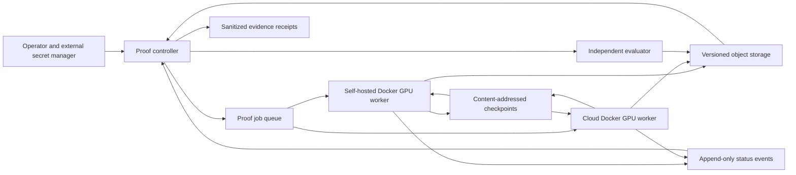

# Minimal Proof Runtime Topology

Status: `input_package_ready`  
Classification: `non_production_readiness_proof`

This topology is the smallest external runtime needed to execute the approved readiness proofs. It is not the production compute platform, Control Tower, asset-memory system, or a broad asset-family service.

## Minimal components

| Component | Proof responsibility | Excluded responsibility |
|---|---|---|
| Proof controller | Validate pinned input, submit/cancel jobs, retrieve status/results, assemble receipts | Production orchestration or a general Control Tower |
| Queue | At-least-once delivery, visibility lease, retry count, dead-lettering | Cross-program scheduling or capacity optimization |
| Local/cloud workers | Run one pinned ComfyUI workflow under one immutable runtime | General asset-family support or runtime promotion |
| Object storage | Content-addressed inputs/outputs, versioned checkpoints and retained evidence | Full asset memory or production distribution |
| Event path | Append-only lifecycle/status observations | Enterprise event platform |
| Independent evaluator | Consume accepted candidate and pinned semantic context, emit structured categorical evidence | Producer role, threshold authority, or final certification by itself |
| Secret manager | Resolve scoped credentials outside the repository | Repository-based secret storage |

## Required proof flow

1. The operator approves identities, external endpoints, cost and cancellation boundaries.
2. The controller validates the Visual Production Plan and immutable runtime/resource hashes.
3. Submission writes a content-addressed request and enqueues only its immutable reference plus idempotency key.
4. A worker claims a fenced lease, emits ordered states, reads immutable inputs and writes versioned checkpoints.
5. The worker commits the candidate and deterministic compute receipt before reporting success.
6. The controller retrieves by hash, invokes the independent evaluator with separate credentials, and writes sanitized evidence.
7. Cancellation, worker interruption and fallback use the same controller ports and preserve receipts.

## Proof invariants

- At-least-once queue delivery must yield exactly-once effect through idempotency and fencing.
- A worker may never overwrite authoritative inputs, accepted assets, receipts, or checkpoints.
- Retry caused by infrastructure does not consume a semantic quality-repair round.
- Local and cloud runs share the semantic plan, workflow and resource hashes.
- Secrets never appear in repository files or committed logs.
- Runtime promotion and production authorization are outside this topology.

