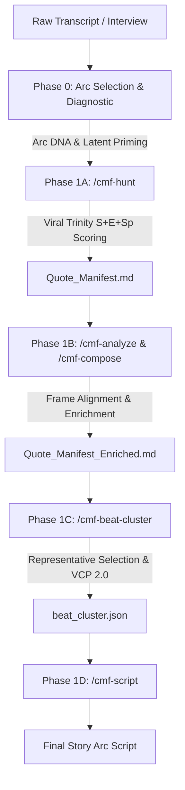

# CMF Studio: Transcript Scoring & Narrative Clustering Architecture

## 1. Executive Summary

The **Conscious Movie Factory (CMF) Studio** transcript scoring and narrative clustering engine is an end-to-end framework designed to transform unscripted, raw client and coach interview transcripts into high-impact, emotionally resonant video scripts and visual storytelling premises.

Instead of generating generic AI scripts or manually slicing audio, the engine implements a multi-stage **qualitative, psychological, and algorithmic scoring pipeline**:
1. **Classifies** the raw content into one of **13 narrative Story Arcs**.
2. **Mines and filters** transcript segments under strict verbatim constraints ("*If it is not in the timecode, it does not exist*").
3. **Evaluates quotes** across multi-dimensional rubrics (Viral Trinity S+E+Sp, Proof Specificity Ladder, Vulnerability Hierarchy).
4. **Clusters quotes into narrative beats** (SC01 Hook to SC05 Close).
5. **Selects representative quotes** via a weighted 4-criteria matrix.
6. **Derives Visual Cinematic Premises (VCP 2.0)** to guide downstream visual and audio generation engines (GMG, CAC, Storyboard, Sonic).

---

## 2. End-to-End Pipeline Phases

### Phase 0: Story Arc Selection & Latent Priming
* **Core File:** `cmf/skills/cmf/hunters/arc-selection-guide/SKILL.md`
* **Purpose:** Determines the narrative archetype that best aligns with the emotional journey of the transcript.

#### The 13 Story Arcs
| Arc Type | Primary Content Type | Emotional Trajectory |
| :--- | :--- | :--- |
| **The Witness** | Client Testimonial / Transformation | Introduction -> Pain -> Discovery -> Proof -> Endorsement |
| **The Breakthrough** | Overcoming Fear / Anxiety / Block | Anxiety -> Struggle -> Epiphany -> Empowerment |
| **Core Transformation** | Coach Philosophy / Deep Shift | Intrigue -> Vulnerability -> Realization -> Empowerment |
| **Quiet Reflection** | Self-Worth / Reframing / Identity | Nostalgia -> Confusion -> Acceptance -> Peace |
| **The Confrontation** | Contrarian / Myth Takedown | Frustration -> Debate -> Clarity -> Confidence |
| **The Comedic Reframe** | Satire / Paradox / Relief | Normalcy -> Absurdity -> Ironic Laugh -> Relief |
| **The Divine Spark** | Spiritual / Deep Healing | Emptiness -> Surrender -> Grace -> Purpose |
| **The Call to Adventure** | New Beginnings / Action | Restlessness -> Contemplation -> Spark -> First Step |
| **The Rally** | Comeback / Resilience | Setback -> Frustration -> Focus -> Action |
| **The Ticking Clock** | Urgency / Critical Decisions | Stagnation -> Urgency -> Decision -> Momentum |
| **The Sacred Return** | Hero's Journey / Integration | Departure -> Trials -> Return -> Gift |
| **The Shared Struggle** | Community / Belonging | Isolation -> Recognition -> Unity -> Power |
| **The Warning** | Cautionary Tale / Pitfalls | Normalcy -> Early Signs -> Crisis -> Hard Lesson |

#### Latent Priming Mechanism (`spr_text`)
Before quote hunting begins, a 48–60 word **Sparse Priming Representation (SPR)** is injected into the context window to prime the model to seek quotes corresponding to:
* `state_alpha` (initial stuck state / loop)
* `abyss` (breaking point)
* `spark` (turning point / coaching intervention)
* `state_omega` (measurable transformed outcome)

---

### Phase 1A: Quote Mining & Viral Trinity Scoring (`/cmf-hunt`)
* **Commands & Skills:** `cmf/commands/cmf-hunt.md`, `cmf/skills/cmf/hunters/{arc}-hunter/SKILL.md`
* **Rubrics:** `cmf/intelligence/frameworks/viral_scoring/{arc}_scoring.md`
* **Output:** `{project_id}_Quote_Manifest.md` (24–32 scored verbatim quotes)

#### The Viral Trinity Scoring Rubric (S + E + Sp)
Each candidate quote is scored on a 1–10 scale across three core viral dimensions:

1. **Surprise (S, 1–10):**
   * *9–10:* Mechanism Revelation (counter-intuitive, e.g., "*The liver holds grief, not just toxins*").
   * *7–8:* Unexpected Connection (links disparate ideas).
   * *5–6:* Moderate Surprise (non-obvious but believable).
   * *1–4:* Predictable / Clichéd.
   * **Setup Validation Protocol:** For quotes scoring >= 8, the system validates whether the transcript establishes the conventional belief first. If setup is missing, score is penalized by 2–3 points.

2. **Emotion (E, 1–10):**
   * Evaluated against the **Vulnerability Hierarchy**:
     * **10/10 (Visceral):** Body-based physical sensation and metaphor.
     * **8–9/10 (Shameful):** Social/relational impact, hidden shame.
     * **6–7/10 (Sad):** Specific emotional exhaustion.
     * **4–5/10 (Intellectual):** Frustration/confusion.
     * **0–3/10 (Generic/Detached):** Clinical language or overused buzzwords.

3. **Specificity (Sp, 1–10):**
   * Evaluated against the **Proof Specificity Ladder**:
     * **10/10 (Triple Specificity):** Exact Number + Timeline + Context/Comparison (*"My migraines went from 15/month to 2/month in 8 weeks"*).
     * **8–9/10 (Double Specificity):** Metric + Timeline (*"Lost 8 kilos in 3 weeks"*).
     * **6–7/10 (Single Metric):** Isolated percentage or score (*"Energy at 7/10"*).
     * **4–5/10 (Named Details):** Specific symptom changes (*"Bloating stopped"*).
     * **0–3/10 (Sensory/Abstract):** Subjective claims (*"I feel lighter"*).

#### Cluster-Specific Weighted Scoring & Thresholds
Different narrative beats require different dimension weights to pass quality gates:

| Beat Cluster | Surprise Weight | Emotion Weight | Specificity Weight | Min Pass Score | Key Mandatory Rule |
| :--- | :---: | :---: | :---: | :---: | :--- |
| **W1: HOOK** | 30% | 30% | 40% | >= 18/30 | Must mention coach/core concept |
| **W2: PROBLEM** | 20% | 50% | 30% | >= 20/30 | Emotion >= 7/10 on Vulnerability Hierarchy |
| **W3: MECHANISM**| 50% | 20% | 30% | >= 22/30 | Setup Validation check if S >= 8 |
| **W4: PROOF** | 20% | 30% | 50% | >= 24/30 | Specificity >= 6/10 on Proof Ladder |
| **W5: CLOSE** | 10% | 40% | 50% | >= 18/30 | Call-to-action / clear resolution |

---

### Phase 1B: Frame Alignment & Quote Enrichment (`/cmf-analyze` & `/cmf-compose`)
* **Commands:** `cmf/commands/cmf-analyze.md`, `cmf/commands/cmf-compose.md`
* **Framework:** `cmf/intelligence/frameworks/frame_alignment_scoring.md`
* **Output:** `{project_id}_Quote_Manifest_Enriched.md`

Calculates how strongly quotes align with the **Brand Avatar** and coaching premise, applying a multiplier (1.0x - 1.3x):
Final Weighted Score = Raw Trinity Score * Frame Alignment Multiplier

---

### Phase 1C: Narrative Beat Clustering & VCP Extraction (`/cmf-beat-cluster`)
* **Commands & Skills:** `cmf/commands/cmf-beat-cluster.md`, `cmf/skills/cmf/narrative/beat-cluster-extractor/SKILL.md`
* **Output:** `{project_id}_beat_cluster.json`

#### 1. Representative Quote Selection Matrix
Quotes within each beat cluster (`SC01` to `SC05`) compete for the representative quote spot:

Selection Score = (Directness * 0.40) + (Economy * 0.25) + (Physicality * 0.20) + (Emotional Clarity * 0.15)

* **Directness (40%):** Does the quote express the core concept immediately without fluff?
* **Economy (25%):** Information density (conveys maximum meaning in fewest words).
* **Physicality (20%):** Presence of concrete, visualizable sensory tokens.
* **Emotional Clarity (15%):** Unambiguous emotional signal.

The top-scoring quote becomes `representative`; remaining valid quotes become `supporting` with defined narrative functions (*Context*, *Intensification*, *Expansion*, *Contrast*).

#### 2. Visual Cinematic Premise (VCP 2.0)
Rather than prescribing rigid camera directions (`extreme macro`, `lighting preset`), the engine generates a **60–80 word pure-narrative mini-story**:
* **Structure:** `BEFORE` (state before) -> `TURNING POINT` (what changed) -> `AFTER` (implication).
* **Language:** Enforces verbatim phrases directly from the protagonist's quotes.
* **Separation of Concerns:** Leaves visual execution (shot type, lighting, motion) to downstream specialist composers (GMG, Storyboard, CAC).

---

### Phase 1D: Script Composition (`/cmf-script`)
* **Command:** `cmf/commands/cmf-script.md`
* **Output:** `{project_id}_script.json` / `{project_id}_script.md`

Stitches the representative and supporting quotes from `{project_id}_beat_cluster.json` into a complete narrative arc script, maintaining emotional tempo, seamless pacing, and narrative tension.

---

## 3. Algorithmic Perception Scorers (CBCS Backend)

Located in `CBCS/backend/agents/perception/`, these Python modules perform deterministic and heuristic psychological evaluation without requiring LLM calls:

1. **`authenticity_scorer.py`**:
   * Measures **Kozinets L-Depth** (L1 Performative, L2 Communal, L3 Authentic).
   * Evaluates self-reference pronoun density (I/me/my), negative emotion word frequency, and formal vs. informal marker ratios (LIWC-22 proxy).
2. **`coping_trajectory_scorer.py`**:
   * Evaluates behavioral shift from maladaptive coping loops to adaptive self-efficacy.
3. **`hermeneutical_gap_scorer.py`**:
   * Scores the magnitude of cognitive discrepancy before vs. after insight moments.
4. **`reconsolidation_marker_scorer.py`**:
   * Identifies linguistic markers indicating memory reconsolidation (mismatch between long-held negative prediction and actual experience).
5. **`regulatory_focus_scorer.py`**:
   * Classifies quotes into *Promotion Focus* (growth, aspiration) vs. *Prevention Focus* (safety, risk mitigation).

---

## 4. Complete File Inventory

### Pipeline Commands (`cmf/commands/`)
* `cmf-hunt.md`: Step-by-step quote mining protocol with verbatim quality gates.
* `cmf-analyze.md`: Transcript diagnostics and frame alignment evaluation.
* `cmf-compose.md`: Premise analysis and scene-level quote composition.
* `cmf-beat-cluster.md`: Narrative beat extraction and VCP mini-story generation.
* `cmf-script.md`: Story arc script assembly.
* `cmf-diagnose.md`: Strategy brief auditing and pre-flight validation.

### Arc Hunters & Selection Guides (`cmf/skills/cmf/hunters/`)
* `arc-selection-guide/SKILL.md`: Decision flowchart and selection criteria for 13 arcs.
* `witness-hunter/SKILL.md`: Mining rules for testimonial stories.
* `breakthrough-hunter/SKILL.md`: Mining rules for overcoming anxiety/blocks.
* `shared-struggle-hunter/SKILL.md`: Mining rules for community and belonging stories.
* `confrontation-hunter/SKILL.md`: Mining rules for contrarian/takedown narratives.
* `core-transformation-hunter/SKILL.md`: Mining rules for coach philosophy stories.
* `warning-hunter/SKILL.md`: Mining rules for cautionary tales.
* `rally-hunter/SKILL.md`: Mining rules for resilience and comeback arcs.
* `divine-spark-hunter/SKILL.md`: Mining rules for spiritual and surrender stories.
* `call-to-adventure-hunter/SKILL.md`: Mining rules for leaps into action.
* `ticking-clock-hunter/SKILL.md`: Mining rules for urgency and high-stakes decisions.
* `comedic-reframe-hunter/SKILL.md`: Mining rules for humor and paradox reframing.
* `sacred-return-hunter/SKILL.md`: Mining rules for hero's journey integration.
* `quiet-reflection-hunter/SKILL.md`: Mining rules for self-worth and peace narratives.

### Narrative Skills (`cmf/skills/cmf/narrative/`)
* `beat-cluster-extractor/SKILL.md`: Matrix algorithm for quote clustering and VCP generation.

### Scoring Rubrics & Frameworks (`cmf/intelligence/frameworks/`)
* `intelligence_frameworks_viral_trinity_scoring.md`: 60-point / 40-point core Viral Trinity framework.
* `frame_alignment_scoring.md`: Avatar alignment multipliers.
* `viral_scoring/{arc}_scoring.md` (13 files): Arc-specific scoring criteria, proof ladders, setup validation, and vulnerability hierarchies.

### Console UI Pages (`cmf/Conscious labo/director_console/pages/`)
* `10_🔎_Premise_Hunter.py`: Streamlit UI for batch premise extraction and AI CLI execution.
* `2_📝_Scripts.py`: Streamlit UI for reviewing generated scripts and advancing pipeline stages.

### Backend Perception Scorers (`CBCS/backend/agents/perception/`)
* `authenticity_scorer.py`: LIWC-22 and L-Depth disclosure depth scorer.
* `coping_trajectory_scorer.py`: Psychological coping pattern evaluator.
* `hermeneutical_gap_scorer.py`: Insight gap metric.
* `identity_scorers.py`: Self-concept transition scorer.
* `moral_emotion_scorer.py`: Moral elevation, guilt, and pride marker scorer.
* `reconsolidation_marker_scorer.py`: Traumatic memory reconsolidation detector.
* `regulatory_focus_scorer.py`: Promotion vs. prevention orientation classifier.
