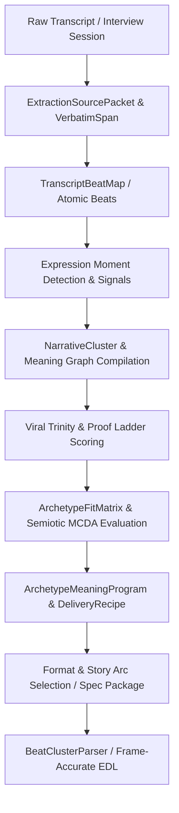

# CMF Studio: Transcript Scoring, Narrative Clustering, and Story Arc Selection Engine

## 1. Executive Overview

### What It Is
The **CMF Studio Transcript Scoring & Narrative Clustering Engine** is an intelligent, multi-stage processing system that bridges raw, unscripted spoken human expression (from interviews, workshops, and coaching dialogues) into deterministically structured, psychologically calibrated, and cinematically scored narrative beats and story arcs.

### What It Does
Instead of relying on naive LLM text generation or basic transcript trimming, the engine enforces strict source truth (*"If it is not in the timecode, it does not exist"*) through a multi-tier pipeline:
1. **Source Ingestion & Verbatim Alignment:** Ingests Whisper audio/video transcripts and slices them into precise verbatim spans and atomic transcript beats.
2. **Expression Moment Candidate Detection:** Automatically extracts human expression signals (hesitations, deep sighs, vocal shifts, laughter, confessions, memory object interactions).
3. **Narrative Clustering & Meaning Graphs:** Groups atomic beats into coherent thematic and emotional narrative clusters around verbatim anchors.
4. **Multi-Dimensional Psychological & Viral Scoring:** Evaluates candidate moments and clusters using the **Viral Trinity** ($Surprise + Emotion + Specificity$), **Proof Specificity Ladders**, **Vulnerability Hierarchies**, and **Semiotic MCDA** (Multi-Criteria Decision Analysis).
5. **Archetype & Format Routing:** Matches scored narrative clusters against 13 Narrative Story Arcs (e.g., *The Witness*, *The Breakthrough*, *The Confrontation*) and production formats (e.g., *Format 01 Cinematic Story*, *Format 02 Paper-Cut Explainer*, *Carousel Sequences*, *SuperVisuals*).
6. **Frame-Accurate EDL & Sonic Composition:** Calculates millisecond/frame-accurate edit decision lists (EDLs), transition curves, and audio ducking envelopes ready for automated rendering (Remotion / Motion Canvas / Video Generation).

---

## 2. Architectural Pipeline & Data Flow



---

## 3. Core Structural Components

### 3.1 Data Contracts (`python_core/contracts/narrative_story_doctor.py`)
Defines the Pydantic v2 domain schemas that guarantee data validity and traceability across the system:
* **`ExtractionSourcePacket` & `VerbatimSpan`**: Preserves timecode boundaries (`start_ms`, `end_ms`), speaker attribution, and source references.
* **`TranscriptBeat`**: Atomic conversational unit tagged with semantic function, emotional function, and viewer-state function (`PERCEPTUAL_ENTRY`, `ACTIVE_PREDICTION`, `TRUTHFUL_PAYOFF`, etc.).
* **`ExpressionMomentCandidate`**: Identifies expressive non-verbal or high-charge verbal cues (`PAUSE`, `VOICE_CRACK`, `OBJECT_TOUCH`, `EMPHASIS`).
* **`NarrativeCluster` & `ClusterMeaningGraph`**: Connects related spans around a central anchor quote, tracking visual/object signals.
* **`ArchetypeFitMatrix` & `ArchetypeFitScore`**: Computes affinity scores ($0.0 - 1.0$) with rationales for narrative archetypes.
* **`ArchetypeMeaningProgram`**: Binds the selected winning archetype with required structural modules, risk flags, and format affinities.
* **`FormatFitMatrix` & `FormatFitScore`**: Evaluates deliverable format feasibility (Cinematic Story, Explainer, Reaction, Carousel, SuperVisual).

### 3.2 Service Implementation (`python_core/services/narrative_story_doctor_service.py`)
The functional engine executing the transition rules:
* `compile_transcript_beat_map()`: Splits transcripts into sentences/beats, assigning viewer-state roles.
* `extract_expression_moments()`: Scans linguistic markers for emotional inflection points and physical object references.
* `compile_clusters()`: Synthesizes beats into structured narrative clusters.
* `score_archetype_fit()`: Evaluates clusters against story arc rubrics.
* `compile_archetype_program()`: Determines the primary archetype and generates the required delivery recipe.
* `score_format_fit()`: Determines production format viability based on evidence density.

### 3.3 Frame Assembly & EDL Parsing (`python_core/assembler/beat_cluster_parser.py`)
Converts the high-level narrative cluster JSON into a frame-accurate rendering EDL:
* **Technical Decision 1:** The beat cluster *is* the EDL.
* **Technical Decision 2:** Frame timing calculation: frames = ceil(duration_sec * fps).
* **Technical Decision 3:** Deterministic transition resolution based on `arc_stage` and `beat_type` using `dep_vid_003_transition_preset_library.yaml`.

---

## 4. Scoring Mechanisms & Rubrics

### 4.1 The Viral Trinity Framework ($S + E + Sp$)
Each candidate quote/beat is evaluated on a 1-10 scale across three dimensions:

1. **Surprise ($S$, $1-10$):**
   * **9–10 (Mechanism Revelation):** Unveils a counter-intuitive truth (e.g., *"The liver holds grief, not just toxins"*).
   * **7–8 (Unexpected Connection):** Bridges two disparate mental models.
   * **5–6 (Moderate Surprise):** Non-obvious but believable insight.
   * **1–4 (Predictable/Cliché):** Conventional common sense.
   * *Setup Validation Rule:* If $S >= 8$, the engine validates whether a conventional belief was established beforehand. If missing, a 2-3 point penalty applies.

2. **Emotion ($E$, $1-10$ — Vulnerability Hierarchy):**
   * **10/10 (Visceral):** Somatic sensations and embodied metaphors (*"Every morning felt like drowning"*).
   * **8–9/10 (Shameful):** Social withdrawal, hidden inadequacy, or relational rupture.
   * **6–7/10 (Sad/Exhausted):** Explicit emotional exhaustion.
   * **4–5/10 (Intellectual):** Cognitive frustration (*"I was annoyed it didn't work"*).
   * **0–3/10 (Generic/Detached):** Abstract or clinical phrasing.

3. **Specificity ($Sp$, $1-10$ — Proof Specificity Ladder):**
   * **10/10 (Triple Specificity):** Metric + Timeline + Context/Comparison (*"Went from 15 migraines/month to 2 in 8 weeks with Adele"*).
   * **8–9/10 (Double Specificity):** Metric + Timeline (*"Lost 8 kg in 3 weeks"*).
   * **6–7/10 (Single Metric):** Isolated metric (*"Energy at 7/10"*).
   * **4–5/10 (Named Symptoms):** Concrete tangible symptom changes (*"Brain fog cleared"*).
   * **0–3/10 (Abstract):** Subjective, non-verifiable claims (*"I feel much better"*).

### 4.2 Cluster-Specific Weighting (Example: *The Witness* Arc)

| Beat Cluster | Surprise ($S$) | Emotion ($E$) | Specificity ($Sp$) | Min Pass Score | Key Mandatory Constraint |
| :--- | :---: | :---: | :---: | :---: | :--- |
| **W1: HOOK** | 30% | 30% | 40% | >= 18/30 | Must explicitly name the coach/core idea |
| **W2: PROBLEM** | 20% | 50% | 30% | >= 20/30 | Emotion >= 7/10 on Vulnerability Hierarchy |
| **W3: MECHANISM** | 50% | 20% | 30% | >= 22/30 | Setup Validation check if $S >= 8$ |
| **W4: PROOF** | 20% | 30% | 50% | >= 24/30 | Specificity >= 6/10 on Proof Ladder (Numbers mandatory) |
| **W5: CLOSE** | 10% | 40% | 50% | >= 18/30 | Clear endorsement / forward action |

### 4.3 Semiotic MCDA Scoring
Evaluates candidate narrative and visual representations across 20 semiotic criteria, including:
* *Zero-Second Hook Power*
* *Mirror Activation Power (Audience Self-Recognition)*
* *Target Activation Power (Desired Future State)*
* *Viewer Role Clarity*
* *Prediction Gap & Payoff Potential*
* *Anti-Cliché Score & Wrong-Reading Resistance*

---

## 5. The 13 Narrative Story Arcs

1. **The Witness:** Client testimonial & transformation (*Hook -> Pain -> Discovery -> Proof -> Endorsement*).
2. **The Breakthrough:** Overcoming anxiety and systemic blocks (*Anxiety -> Struggle -> Epiphany -> Empowerment*).
3. **Core Transformation:** Master coach philosophy & identity shift (*Intrigue -> Vulnerability -> Realization -> Empowerment*).
4. **Quiet Reflection:** Self-worth, inner peace, and identity reframing (*Nostalgia -> Confusion -> Acceptance -> Peace*).
5. **The Confrontation:** Contrarian myth takedown (*Frustration -> Debate -> Clarity -> Confidence*).
6. **The Comedic Reframe:** Satire, paradox, and tension release (*Normalcy -> Absurdity -> Ironic Laugh -> Relief*).
7. **The Divine Spark:** Spiritual surrender and purpose (*Emptiness -> Surrender -> Grace -> Purpose*).
8. **The Call to Adventure:** Catalyst for decisive action (*Restlessness -> Contemplation -> Spark -> First Step*).
9. **The Rally:** Resilience and comeback momentum (*Setback -> Frustration -> Focus -> Action*).
10. **The Ticking Clock:** High-stakes urgency and deadline pressure (*Stagnation -> Urgency -> Decision -> Momentum*).
11. **The Sacred Return:** Hero's journey integration and wisdom gift (*Departure -> Trials -> Return -> Gift*).
12. **The Shared Struggle:** Community belonging and collective solidarity (*Isolation -> Recognition -> Unity -> Power*).
13. **The Warning:** Cautionary tale on hidden failure modes (*Normalcy -> Early Signs -> Crisis -> Hard Lesson*).

---

## 6. Bundle Directory & File Layout

```text
CMF_Studio_Scoring_and_Narrative_Clusters_Bundle.zip
├── python_core/
│   ├── contracts/
│   │   └── narrative_story_doctor.py
│   ├── services/
│   │   └── narrative_story_doctor_service.py
│   ├── assembler/
│   │   └── beat_cluster_parser.py
│   └── tests/
│       ├── test_narrative_story_doctor_v1.py
│       └── test_beat_cluster_parser.py
├── schemas/
│   ├── assembler/
│   │   ├── dep_vid_001_beat_cluster.schema.json
│   │   ├── dep_vid_003_transition_preset_library.yaml
│   │   ├── dep_vid_004_whisper_transcript.schema.json
│   │   ├── dep_vid_012_quality_score_result.schema.json
│   │   ├── dep_vid_014_beat_fingerprint_map.schema.json
│   │   └── dep_vid_022_arc_template_registry.schema.json
│   └── intelligence/
│       └── beat_cluster_schema.json
├── scoring_frameworks/
│   ├── viral_scoring/
│   │   ├── witness_scoring.md
│   │   ├── breakthrough_scoring.md
│   │   ├── call_to_adventure_scoring.md
│   │   ├── comedic_reframe_scoring.md
│   │   ├── confrontation_scoring.md
│   │   ├── core_transformation_scoring.md
│   │   ├── divine_spark_scoring.md
│   │   ├── quiet_reflection_scoring.md
│   │   ├── rally_scoring.md
│   │   ├── sacred_return_scoring.md
│   │   ├── shared_struggle_scoring.md
│   │   ├── ticking_clock_scoring.md
│   │   ├── warning_scoring.md
│   │   └── FUTURE_ARC_RUBRICS_PLAN.md
│   ├── viral_trinity_scoring.md
│   ├── frame_alignment_scoring.md
│   ├── quality_score_logging.md
│   ├── 21_SEMIOTIC_MCDA_SCORING.md
│   └── intelligence_frameworks_sonic_story_arcs.md
├── intelligence_guides/
│   ├── The Sonic Story Arc Library V6.md
│   ├── Sonic Arc & Scene Synergy Guide.md
│   ├── The Blueprint Architect_ Master Story Analyst & Production Architect.md
│   └── The CMF Visual Engine_ Master Technical Architecture & Kinetic Protocols.md
├── architecture_and_specs/
│   ├── 05_PRD_CMF_STUDIO_INTERVIEW_FIRST.md
│   ├── TS-CMF-030-source-ingestion-transcript-alignment-and-provenance-audit.md
│   └── TS-CMF-033-archetype-and-asset-derivative-routing-audit.md
└── hunter_skills_and_commands/
    ├── cmf/commands/
    └── cmf/skills/cmf/hunters/
```
