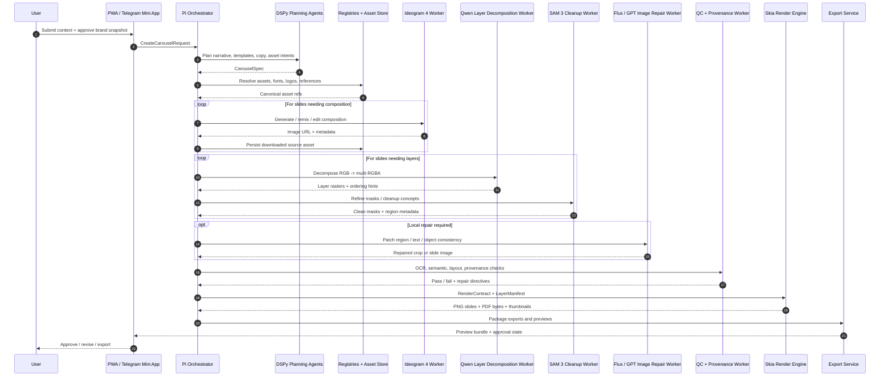
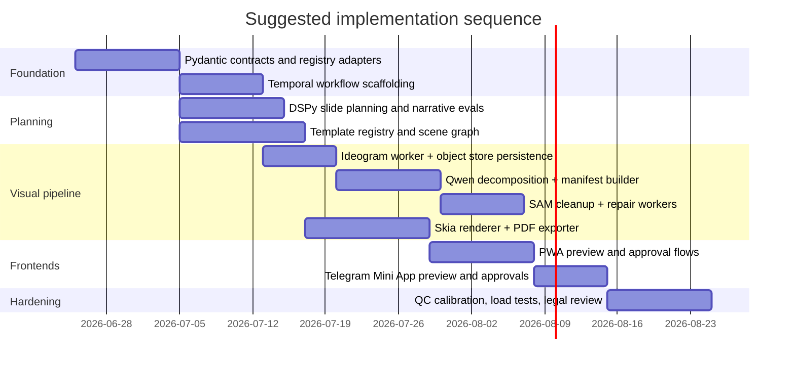

# Carousel Builder Engine for Social Media

## Executive summary

The cleanest architecture for this product is a **Python-first orchestration and contract layer** with **TypeScript frontends**, where a Pi/DSPy control plane turns brand context into a deterministic slide plan, calls image and layer workers, and hands a normalized scene graph to a **Skia render engine** for final PNG/PDF output. In this design, **Ideogram 4** is the primary composition model because its API already supports synchronous and webhook-based generation, structured prompts, background control, editing, and character-reference workflows at production scale. **Qwen-Image-Layered** is the primary decomposition model because it directly decomposes an RGB image into multiple semantically disentangled **RGBA**
layers, supports a variable number of layers, and is explicitly positioned for high-fidelity edits such as resize, reposition, recolor, and export to editable formats like PPTX, ZIP, and PSD. **Skia** is the primary render engine because it gives a deterministic 2D drawing model around `SkCanvas`, supports paragraph/text shaping through CanvasKit, and has a native PDF backend through `SkDocument` / SkPDF. citeturn9view0turn10view0turn24view1turn34view2turn26view0turn21search2turn7search3

The recommended production posture is therefore: **Ideogram for composition**, **Qwen-Image-Layered for editable layer extraction**, **SAM 3 for concept-aware masks and cleanup**, **FLUX/GPT Image for targeted repair**, **Skia for final rendering**, and **Remotion / Motion Canvas only as fallback** when the product needs animated variants, motion previews, or video exports. This division matters because the tools are not substitutable: Ideogram is strongest at whole-image composition and typography workflows, Qwen is strongest at edit-ready layered decomposition, SAM 3 is strongest at promptable segmentation and tracking, and Skia is strongest at deterministic final rendering. Remotion’s server-side renderer is stable, but its browser renderer is explicitly marked experimental; Motion Canvas is good for code-authored animated explainer sequences, not as the default still-carousel compositor. citeturn8view0turn9view0turn12view0turn12view1turn23search7turn5view0turn27view0turn27view1turn27view2

Two governance findings materially affect the build. First, **ImageCritic is not a generic aesthetic scorer** in its own paper or repository; it is a **reference-guided post-editing correction model** designed for inconsistency repair in generated images and can be integrated into an agent workflow for discrepancy localization and iterative local editing. Second, the current public repository is licensed for **non-commercial use only**, which means a commercial product cannot rely on it as a hard dependency unless separate permission is secured. In practice, this means ImageCritic should be placed behind a feature flag as an R&D or optional repair/QC worker while the production QC layer remains a combination of OCR checks, semantic checks, layout checks, mask checks, and model-specific repair heuristics. citeturn25view0turn19view0turn17view1

Where platform targets are concerned, the prompt did not specify a fixed publishing set. The safest default is to optimize first for **Instagram organic carousels** and **LinkedIn PDF document posts** because both have clearly documented carousel-like user experiences: Instagram supports up to **20 photos or videos** in one feed carousel, while LinkedIn document uploads support PDF/DOC/PPT-style posts up to **100 MB and 300 pages**. Those limits argue for an internal engine that is **platform-agnostic at planning time** and **platform-constrained at export time**. citeturn16search0turn16search1turn16search7

## Goals and constraints

The product goal is not “AI image generation” in the abstract. It is a **carousel compiler**: a system that accepts highly structured brand and campaign context, synthesizes a slide-by-slide argument, produces visually coherent compositions, decomposes selected images into editable layers, renders final slides deterministically, and exposes a human review loop that is identical across the PWA and Telegram Mini App. The engine should therefore optimize for **repeatability, provenance, editability, brand compliance, and export predictability**, not only for raw generative quality. Skia, Pydantic, and Temporal are particularly useful here because each helps keep the system deterministic at a different layer: rendering, contracts, and orchestration respectively. citeturn7search3turn14search2turn28view2turn28view3

Several constraints are explicit or implied by the requested stack. The backend runtime is **Python/Pydantic/DSPy/Pi**, which naturally favors typed contracts, signature-driven prompting, and durable workflow execution. DSPy’s model of structured signatures rather than ad hoc prompts is well suited to slide planning, headline generation, critique passes, and repair directives. Temporal’s model of workflows, activities, workers, event history, and replay is well suited to long-running multimodel jobs with retries, human approval pauses, and resumability after failure. citeturn28view0turn28view1turn28view2turn28view3

The frontends are TypeScript, but they should not define truth. They should consume schemas generated from Python contracts. Pydantic v2 can emit JSON Schema Draft 2020-12 / OpenAPI 3.1-compatible schemas through `model_json_schema()`, while tools such as OpenAPI TypeScript and quicktype can generate TypeScript types from those schemas. That gives a single source of truth for command objects, manifests, and API payloads, which is important if the Telegram Mini App and PWA must stay visually and behaviorally aligned with the same backend agent. citeturn14search2turn14search4turn29search0turn29search1turn29search17

The Telegram Mini App constraint is not merely UI embedding. Telegram’s official Mini App guidance requires responsive, mobile-first layouts, smooth animation ideally at 60fps, interface alignment with Telegram components, safe-area awareness, and accessible labels for inputs and images. Security-wise, Telegram explicitly warns that `initDataUnsafe` should not be trusted and that raw `initData` must be validated on the server. For keyboard-launched Mini Apps, `sendData()` is available and closes the Mini App; for richer inline/menu-button interactions, the bot should use `answerWebAppQuery`. This strongly suggests that the Mini App should be treated as a **preview / approve / revise surface**, not a heavyweight authoring surface. citeturn32view0turn33search0

Two operational constraints come from vendor APIs. Ideogram image links are temporary and must be downloaded and persisted immediately; its async generate endpoint posts results to a webhook and signs deliveries with Ed25519. OpenAI’s image APIs distinguish between simple image generation/editing via the Image API and multi-step conversational image workflows via the Responses API. These details should be baked into the architecture instead of hidden in adapters, because they determine object-store lifecycle, provenance, webhook handling, and retry design. citeturn31view0turn10view0turn5view0

The following defaults are recommended until more product specifics are supplied:

| Parameter | Recommended default | Rationale |
|---|---:|---|
| Internal default slide count | 8 | Strong enough for narrative pacing, below fatigue threshold |
| Hard authoring cap | 12 | Keeps review and QC manageable even though Instagram allows more |
| Instagram export cap | 20 | Matches current official platform capacity |
| Default source composition size | 2048×2048 | Matches Ideogram 4 2K generation path |
| Default final slide export | 1350×1350 for square, 1080×1350 for portrait | Social-friendly output sizes |
| Default Qwen layer count | 4 visible layers, allow 3–8 | Matches Qwen examples and keeps manifests manageable |
| Default Qwen resolution bucket | 640 | Qwen repo explicitly recommends 640 for current version |
| Default preview animation length | 350–600 ms | Fast enough for emphasis without over-animating |
| Default color profile | sRGB | Safest cross-platform web/PDF baseline |
| Default export formats | PNG, JPEG, PDF | Covers social upload and LinkedIn document workflows |

The choice to keep the *authoring cap* below the *platform cap* is deliberate: Instagram can publish up to 20 slides, but most editorial systems become harder to QA and less persuasive when every carousel expands to platform maximum. citeturn16search0turn9view0turn34view2

## Canonical inputs and contracts

The engine should accept one canonical envelope and derive every downstream artifact from it. That envelope should include a **brand snapshot**, a **campaign/expression brief**, an **approved asset package**, a **platform target description**, and a **DNA layer** describing voice and visual style. The critical principle is that the planning agent should never receive a loose prompt blob if typed context can be passed instead.

### Canonical content objects

`BrandContextVersion` should be the immutable snapshot of approved doctrine: brand pillars, claims the brand can make, banned claims, product taxonomy, audience segments, typography tokens, color tokens, named motifs, icon policies, safety rules, and registry references. It is the contract between your existing registries and the carousel engine.

`ExpressionSession` should represent the current campaign moment: a thesis, a target persona, a funnel stage, a desired emotional stance, source passages, required proof points, disallowed tones, CTA mode, and optional distribution objectives.

`AssetPackageSpec` should define every approved external input: logos, product cutouts, portraits, icons, screenshots, reference photos, background plates, font files, brand frames, legal marks, and mask-ready subject photos. Every asset should have rights metadata, hash, owner, approval state, and product line affinity.

`TargetPlatformSpec` should define output requirements: organic Instagram, LinkedIn PDF, Telegram preview, web embed, or custom. If multiple targets are requested, the planner should produce one internal `CarouselSpec` and multiple platform export jobs.

`VoiceVisualDNA` should carry stylistic constraints. For carousels, **visual DNA is active** and **voice DNA is usually planning-only**. Visual DNA should contain typography ratios, illustration/photo bias, density rules, negative-space preferences, annotation style, semantic anchor motifs, and “what never happens on a slide.” Voice DNA should contain lexical taste, sentence rhythm, hook style, proof style, CTA style, and taboo phrasings. The rendering system itself will usually consume only visual DNA, but the planning and caption agents should consume both.

### Pydantic-oriented model sketch

```python
from pydantic import BaseModel, Field
from typing import Literal, Optional, List, Dict

class BrandContextVersion(BaseModel):
    id: str
    registry_version: str
    brand_name: str
    pillars: List[str]
    forbidden_claims: List[str] = []
    typography_tokens: Dict[str, str]
    color_tokens: Dict[str, str]
    visual_motifs: List[str] = []

class ExpressionSession(BaseModel):
    id: str
    thesis: str
    audience_segment: str
    funnel_stage: Literal["awareness", "consideration", "conversion", "retention"]
    desired_emotion: str
    proof_points: List[str] = []
    source_passages: List[str] = []
    banned_tones: List[str] = []

class AssetRef(BaseModel):
    asset_id: str
    media_type: Literal["image", "svg", "font", "pdf", "icon", "screenshot"]
    uri: str
    sha256: str
    approval_status: Literal["approved", "pending", "rejected"]
    rights_scope: str

class AssetPackageSpec(BaseModel):
    id: str
    assets: List[AssetRef]
    primary_subject_ids: List[str] = []
    locked_text_assets: List[str] = []

class TargetPlatformSpec(BaseModel):
    platform: Literal["instagram_feed", "linkedin_document", "telegram_preview", "web_embed", "custom"]
    aspect_ratio: str
    max_slides: int
    export_formats: List[Literal["png", "jpeg", "pdf", "pptx"]]
    safe_margin_px: int = 48

class VoiceVisualDNA(BaseModel):
    visual_style: Dict[str, str]
    annotation_style: Dict[str, str]
    typography_preferences: Dict[str, str]
    voice_style: Optional[Dict[str, str]] = None

class CreateCarouselRequest(BaseModel):
    request_id: str
    brand_context: BrandContextVersion
    expression_session: ExpressionSession
    asset_package: AssetPackageSpec
    targets: List[TargetPlatformSpec]
    dna: VoiceVisualDNA
```

Pydantic can export this to JSON Schema / OpenAPI 3.1, which should then be the source for frontend types. citeturn14search2turn14search4turn29search0

### JSON Schema excerpt

```json
{
  "$schema": "https://json-schema.org/draft/2020-12/schema",
  "title": "CreateCarouselRequest",
  "type": "object",
  "required": [
    "request_id",
    "brand_context",
    "expression_session",
    "asset_package",
    "targets",
    "dna"
  ],
  "properties": {
    "request_id": { "type": "string" },
    "brand_context": { "$ref": "#/$defs/BrandContextVersion" },
    "expression_session": { "$ref": "#/$defs/ExpressionSession" },
    "asset_package": { "$ref": "#/$defs/AssetPackageSpec" },
    "targets": {
      "type": "array",
      "items": { "$ref": "#/$defs/TargetPlatformSpec" },
      "minItems": 1
    },
    "dna": { "$ref": "#/$defs/VoiceVisualDNA" }
  }
}
```

### Sample `CarouselSpec` JSON

```json
{
  "carousel_id": "car_01JZ2N6G7V0R7HTTADK8P6A9QH",
  "brand_context_version_id": "bcv_2026_06_24_v19",
  "expression_session_id": "exp_evergreen_framework_041",
  "theme": "Myth-busting framework carousel",
  "narrative_arc": [
    "hook",
    "reframe",
    "proof",
    "framework_step_1",
    "framework_step_2",
    "framework_step_3",
    "example",
    "cta"
  ],
  "slides": [
    {
      "slide_index": 1,
      "template_id": "HOOK_FULLBLEED_STATEMENT",
      "headline": "The thing most teams optimize first is usually the wrong thing.",
      "body": null,
      "visual_intent": "bold typographic slide with one semiotic anchor",
      "needs_composition_image": false,
      "needs_layered_subject": false,
      "provenance_flags": ["D"]
    },
    {
      "slide_index": 2,
      "template_id": "REFRAME_HERO_WITH_ANNOTATION",
      "headline": "What matters is not volume. It is recognizable structure.",
      "body": "Use one system that a viewer can decode in one swipe.",
      "visual_intent": "hero subject on quiet background with rough underline and callout",
      "needs_composition_image": true,
      "needs_layered_subject": true,
      "provenance_flags": ["D", "L"]
    }
  ],
  "default_target": {
    "platform": "instagram_feed",
    "aspect_ratio": "1:1",
    "max_slides": 12,
    "export_formats": ["png", "pdf"]
  }
}
```

These objects should be immutable after the planning phase; all later steps should add manifests and provenance, not mutate the request payload in place.

## Pipeline architecture

The engine should be implemented as a **durable workflow of small typed workers**, not as one “generate carousel” call. The workflow is easier to reason about if it is split into a **planning plane**, an **asset plane**, a **composition/decomposition plane**, a **repair/QC plane**, and a **render/export plane**. That separation maps well to Temporal workflows and activities and to DSPy signatures with distinct evaluation metrics. citeturn28view0turn28view1turn28view2

A useful end-to-end sequence is the following. The Pi orchestrator first validates the request and hydrates missing registry references. A planning agent then produces a `CarouselSpec` with slide intents, templates, copy, and asset requests. Asset retrieval and normalization pull approved files into an object store and convert them to canonical internal formats. For slides that need bespoke scenes, the engine calls **Ideogram 4** with `text_prompt` or `json_prompt`, stores the returned image immediately because Ideogram URLs expire, and records the response seed, resolution, safety flag, and prompt in provenance. Selected slides are then passed to **Qwen-Image-Layered**, which produces multiple RGBA layers plus a preliminary layer ordering. When masks are weak or concepts are entangled, a **SAM 3** worker refines masks or isolates all instances of a concept from text or exemplar prompts. A manifest builder turns those outputs into a `LayerManifest` and an internal scene graph. A **rough-notation** generator adds hand-drawn emphasis overlays. A repair coordinator optionally invokes **FLUX** or **GPT Image** for local edits or text fidelity fixes. Finally, **Skia** renders the definitive slide images and exported PDF; **Remotion** or **Motion Canvas** are invoked only if animated previews or video derivatives are required. citeturn9view0turn10view0turn31view0turn34view2turn12view0turn12view1turn13view0turn23search7turn5view0turn21search2turn27view0turn27view2

The following sequence diagram reflects that architecture.



### Component responsibilities

The table below synthesizes the exact operational role each named tool should play in this pipeline, using official documentation and primary project sources wherever available. citeturn9view0turn34view2turn12view0turn25view0turn23search7turn5view0turn7search3turn27view0

| Tool / model | Exact role in pipeline | Primary input format | Primary output format | Pros | Cons | Priority |
|---|---|---|---|---|---|---|
| Ideogram 4 | Primary **composition provider** for generated hero scenes, background plates, text-forward visuals, and image edits / variants | `multipart/form-data` with `text_prompt` or `json_prompt`; optional reference files; async webhook mode available | JSON with generated image URLs, prompt, resolution, seed, safety flags | Structured prompt support, async webhook support, strong typography, background control, production-scale API | Ephemeral URLs must be downloaded immediately; still raster-first | **P0** |
| GPT Image 2 | High-precision **fallback repair** and conversational edit path for hard semantic changes or typography-heavy corrections | Image API / Responses API inputs with prompt + image(s) | Edited or generated image outputs | Strong edit workflow inside conversation systems; easy fallback in existing OpenAI stack | Token-based cost model; not the default layer workflow | **P1** |
| Qwen-Image-Layered | Primary **layer decomposition worker** turning one composition into editable RGBA stack | Input image + layer count + inference params | Multiple RGBA layer images; editable exports like PPTX/ZIP/PSD in repo tooling | Variable layers, recursive decomposition, edit-ready RGBA, inherently consistent layer edits | Diffusion inference cost; needs cleanup on difficult boundaries | **P0** |
| SAM 3 | **Cleanup / mask / concept segmentation** worker for isolating instances and refining decomposition boundaries | Image or video + text, exemplar, or visual prompts | Masks, tracked identities, refined regions | Open-vocabulary text prompts, exemplar prompts, image/video support | License review required; not a compositor | **P0** |
| ImageCritic | **Reference-guided inconsistency detector/corrector** for local detail repair and regression analysis | Generated image + reference image + localized region workflow | Corrected local results / critic workflow outputs | Strong for detail consistency, text/logo repair, paper describes agent integration | Public repo is non-commercial; not a general scoring model | **P2 / gated** |
| FLUX.2 / FLUX Kontext | Primary **repair editor** for local or multi-reference image edits after planning/decomposition | Prompt + image(s), multi-reference editing | Edited image up to 4MP | Fast production editing, multi-reference support, commercial API options | Still raster edit rather than structural scene graph edit | **P0** |
| Skia | Primary **render engine** for deterministic final slides, thumbnails, and PDF export | Internal scene graph / render manifest | PNG / JPEG / PDF bytes | Deterministic 2D rendering, SkCanvas model, paragraph shaping, PDF backend | Requires your own internal scene abstraction; browser CanvasKit text needs loaded fonts | **P0** |
| Remotion | **Fallback motion/export engine** for animated previews, video derivatives, or motion-rich variants | React composition config + props | Video/audio, browser/web renderer outputs | Mature server renderer, React ecosystem | Browser renderer is experimental; not ideal as primary still renderer | **P2** |

### Worker-by-worker detail

**Ideogram composition provider.** This worker should expose three verbs internally: `generate_composition`, `remix_composition`, and `edit_composition`. The main path should use Ideogram 4 async generation with a webhook so the Temporal workflow can sleep rather than poll aggressively. The worker must verify the webhook signature, persist the result immediately because generated URLs expire, and convert the response metadata into provenance fields such as `source_model`, `source_prompt`, `seed`, `generation_id`, `resolution`, and `copyright_detection_opt_in`. citeturn10view0turn31view0turn9view0

**Qwen layer decomposition worker.** Its responsibility is not authoring the whole slide but converting a composition into an edit surface. The repo’s quick start shows a 4-layer example at a recommended resolution bucket of **640** with **50 inference steps**, but the model also supports variable-layer decomposition and recursive refinement. In this pipeline, the worker should output: ordered RGBA rasters, alpha coverage stats, bbox suggestions, optional collision warnings, and an initial `LayerManifest`. For a commercial team, PPTX/PSD/ZIP export from the repo should be treated as developer tooling and not as the primary public export path unless exact fidelity has been verified against Skia output. citeturn34view2turn24view1

**SAM 3 cleanup worker.** SAM 3 should be used when the layer decomposition is semantically correct but operationally messy: fused objects, semi-transparent edges, holes in alpha, missing duplicated instances, or slides where the art direction depends on “all instances of X.” Because SAM 3 supports text prompts, exemplar prompts, and follow-up correction clicks, it is a good cleanup companion to Qwen rather than a substitute for it. The specific outputs needed here are masks, confidence, instance IDs, and optionally tracked masks if the same artifact is later reused in motion previews. citeturn12view0turn12view1

**Rough-notation generator.** Rough Notation natively annotates DOM elements by adding sibling SVG and supports underline, box, circle, highlight, strike-through, crossed-off, and bracket styles, with controllable animation duration, stroke width, padding, multiline behavior, and ordered `annotationGroup()` playback. In production, it should serve two purposes: a browser-side preview overlay for the PWA / Telegram surface, and a server-side vector-stroke descriptor that can be replayed in Skia so preview and export remain faithful. In other words, do not make the exported result depend on runtime DOM quirks; make the exported result depend on a normalized annotation manifest derived from Rough Notation settings. citeturn13view0turn13view1turn13view2turn13view3

**FLUX / GPT Image repair.** Repair is a distinct worker because it should only run on exception paths. FLUX.2 image editing already supports prompt-driven editing with multiple references and up to 4MP outputs, which makes it well suited to local slide repairs after the main plan is known. GPT Image should remain the general fallback when the repair request is semantically complex, when the same backend agent needs to reason over prior conversation context, or when the edit chain is already inside an OpenAI Responses flow. The product should never send the entire carousel back through a repair model if only a local patch is broken; patch at crop level whenever possible. citeturn23search7turn23search9turn5view0

**ImageCritic auto-QC.** In the requested brief, ImageCritic was framed as an automated visual QC layer. The research source supports a narrower but still useful interpretation: ImageCritic is best used as a **reference-guided correction and discrepancy-localization worker**. For commercial production today, the pragmatic pattern is: use OCR/layout/semantic checks as the gating system, and use ImageCritic behind a flag to suggest or apply local repairs when a slide contains a reference object and a suspected inconsistency. Because of the repo’s non-commercial license, do not make it a mandatory production dependency without permissions. citeturn25view0turn19view0turn17view1

**Layer manifest and rig manifest builders.** These are internal components, but they are central. The `LayerManifest` should normalize all image-layer outputs into stable IDs, z-order, bounds, mask paths, origin transforms, editability flags, and provenance. The `RigManifest` is optional for still carousels but valuable if you want parallax, hover previews, slide-delight animations, or Remotion exports. A good rule is that `LayerManifest` is always required and `RigManifest` is generated only when `motion_preview=true` or `export_video=true`.

**Remotion / Motion Canvas fallback.** Remotion’s `renderMedia()` is a good server-side fallback when a rendered video or animated slide preview must be produced programmatically from a React composition, while `renderMediaOnWeb()` should be treated as experimental. Motion Canvas, by contrast, is helpful when the output itself is a procedural explainer animation authored as code, especially with timing and generator-based scenes. Neither should be the default still slide engine if Skia already owns final raster/PDF fidelity. citeturn27view0turn27view1turn27view2

### Integration artifacts

#### Sample `RenderContract` JSON

```json
{
  "render_id": "rnd_01JZ2N8R4F7HCD1JWB6V2B9RVC",
  "carousel_id": "car_01JZ2N6G7V0R7HTTADK8P6A9QH",
  "target": {
    "platform": "instagram_feed",
    "aspect_ratio": "1:1",
    "canvas_width": 1350,
    "canvas_height": 1350,
    "export_formats": ["png", "pdf"],
    "safe_margin_px": 64
  },
  "slides": [
    {
      "slide_index": 2,
      "scene_type": "layered_composition",
      "background": {
        "kind": "solid",
        "color": "#F5F2EA"
      },
      "layers": [
        {
          "layer_id": "lyr_bg_2",
          "asset_id": "ast_ideogram_plate_883",
          "kind": "image",
          "source_uri": "s3://carousel-assets/.../slide2/base.png",
          "x": 0,
          "y": 0,
          "width": 1350,
          "height": 1350,
          "opacity": 1.0,
          "blend_mode": "normal",
          "z_index": 0
        },
        {
          "layer_id": "lyr_subject_2",
          "asset_id": "ast_qwen_layer_883_2",
          "kind": "image",
          "source_uri": "s3://carousel-assets/.../slide2/layer2.png",
          "x": 416,
          "y": 242,
          "width": 518,
          "height": 690,
          "opacity": 1.0,
          "blend_mode": "normal",
          "z_index": 10
        },
        {
          "layer_id": "lyr_callout_2",
          "kind": "rough_annotation",
          "annotation_type": "underline",
          "target_box": [164, 982, 1048, 1050],
          "stroke_width": 3,
          "color": "#1F1A17",
          "animation_ms": 420,
          "z_index": 100
        }
      ],
      "text_blocks": [
        {
          "id": "txt_headline",
          "role": "headline",
          "text": "What matters is not volume. It is recognizable structure.",
          "font_token": "display-xl",
          "color": "#1F1A17",
          "box": [112, 96, 1126, 276],
          "align": "left"
        }
      ],
      "provenance": {
        "flags": ["D", "L", "E"],
        "source_model_chain": ["ideogram-4-default", "qwen-image-layered", "flux-2-pro-edit"],
        "approved_assets": ["ast_qwen_layer_883_2"],
        "hash": "sha256:8d7b..."
      }
    }
  ]
}
```

#### Sample `LayerManifest` JSON

```json
{
  "manifest_id": "lman_01JZ2NARJJ4J9F5SYVKQ6AC0RA",
  "slide_index": 2,
  "source_asset_id": "ast_ideogram_comp_883",
  "decomposition_model": "Qwen/Qwen-Image-Layered",
  "resolution_bucket": 640,
  "layer_count": 4,
  "layers": [
    {
      "layer_id": "lyr_2_0",
      "name": "background",
      "ordinal": 0,
      "rgba_uri": "s3://carousel-assets/.../slide2/layer0.png",
      "alpha_coverage": 1.0,
      "bbox_xywh": [0, 0, 1350, 1350],
      "editable": false,
      "cleanup_status": "none"
    },
    {
      "layer_id": "lyr_2_1",
      "name": "subject",
      "ordinal": 1,
      "rgba_uri": "s3://carousel-assets/.../slide2/layer1.png",
      "alpha_coverage": 0.31,
      "bbox_xywh": [416, 242, 518, 690],
      "editable": true,
      "cleanup_status": "sam3_refined",
      "mask_uri": "s3://carousel-assets/.../slide2/layer1.mask.png"
    }
  ],
  "reconstructable": true,
  "provenance": {
    "input_sha256": "sha256:1fe7...",
    "ideogram_generation_id": "gen_x8D9...",
    "human_edits": []
  }
}
```

These artifacts should be immutable and versioned. Skia should never render directly from raw model outputs without a manifest normalization pass.

## Orchestration and UX

The orchestration layer should be structured around **Pi as the top-level coordinator** and **DSPy signatures/modules as the specialized reasoning layer**. Pi’s job is lifecycle control, permissions, and worker dispatch. DSPy’s job is typed cognition: turning context into slide arguments, slide arguments into composition intents, QC failures into repair directives, and user revisions into updated commands. DSPy’s signature system is a natural fit because instructions live on the signature together with the field schema, while the choice of strategy stays in the module (`Predict`, `ChainOfThought`, `ReAct`). That makes each part of the pipeline measurable and optimizable rather than prompt-entangled. citeturn28view0turn28view1

A good agent topology is:

- **IntentResolver**: validates the user’s request and resolves missing assumptions into explicit defaults.
- **ContextHydrator**: loads the correct `BrandContextVersion`, `AssetPackageSpec`, and policy registry entries.
- **SlidePlanner**: generates the `CarouselSpec`.
- **CompositionDirector**: decides which slides need Ideogram, which can be pure Skia typography, and which require layering.
- **LayerDirector**: decides layer count, recursive decomposition need, and cleanup need.
- **RepairCoordinator**: interprets QC failures and selects FLUX, GPT Image, or manual escalation.
- **QCManager**: aggregates OCR, semantic, layout, and reference-consistency checks into a final verdict.
- **ApprovalManager**: manages pauses, resumptions, diff views, and final signoff.

### Temporal workflow structure

A recommended Temporal hierarchy is:

- `CreateCarouselWorkflow`
  - `PlanCarouselActivity`
  - `MaterializeAssetsActivity`
  - `GenerateSlideVisualWorkflow` for each slide
    - `IdeogramGenerateActivity`
    - `QwenDecomposeActivity`
    - `SamCleanupActivity`
    - `RepairActivity`
    - `BuildLayerManifestActivity`
  - `RunQcActivity`
  - `AwaitHumanApprovalSignal`
  - `RenderCarouselActivity`
  - `PackageExportsActivity`

This structure matches Temporal’s durable execution model, where workflow commands are converted into events persisted in workflow history and replayed deterministically after failures. Human approval gates are naturally implemented as workflow pauses waiting for signals. citeturn28view2turn28view3

### Command lifecycle

Every user-initiated job should be represented as a typed `AgentCommand`. The lifecycle should be explicit:

`accepted → hydrated → planned → materializing_assets → generating → qc_failed|qc_passed → awaiting_approval → approved|rejected → rendering → exported`

If the user requests revision after preview, the system should produce a **new command** that references the previous one as its parent rather than mutating the already-reviewed job. That keeps provenance clear and enables A/B comparisons.

#### Sample `AgentCommand` JSON

```json
{
  "command_id": "cmd_01JZ2NBQCYDFB7STW2W1P7VA5W",
  "command_type": "create_carousel",
  "issued_by": {
    "user_id": "usr_telegram_2938472",
    "channel": "telegram_mini_app"
  },
  "payload_ref": "db://carousel/requests/req_01JZ2N5Y...",
  "status": "awaiting_approval",
  "current_step": "qc_passed",
  "parent_command_id": null,
  "revision_of": null,
  "human_gates": [
    {
      "gate_id": "gate_plan",
      "state": "approved",
      "approved_at": "2026-06-24T14:22:13Z"
    },
    {
      "gate_id": "gate_preview",
      "state": "pending"
    }
  ],
  "audit": {
    "created_at": "2026-06-24T14:17:10Z",
    "updated_at": "2026-06-24T14:24:51Z",
    "workflow_id": "temporal/create-carousel/01JZ2..."
  }
}
```

### PWA and Telegram Mini App requirements

The **PWA** should be the richer surface: full preview, diffs, thumbnails, per-slide comments, manifest inspection, copy revisions, and export controls. The **Telegram Mini App** should be intentionally narrower: swipe preview, slide thumbnails, approve / request revision, short chat-backed instructions, and maybe one “focus this slide” mode. Both should render from the same canonical scene graph or from server-rendered preview assets generated from the same `RenderContract`; otherwise preview fidelity will drift.

Preview fidelity should be defined formally: the thumbnail, large preview, and exported PNG/PDF must all be generated from the same render manifest with at most non-perceptual differences in antialiasing. If the browser uses CanvasKit for live preview, the font pipeline and paragraph layout must match the server profile; if not, use prerendered raster previews from the Skia service as the source of truth. Skia’s CanvasKit text system requires fonts to be explicitly loaded and uses paragraph shaping rather than the browser’s default canvas text semantics, which is another reason that font packaging and preview initialization must be part of the contract. citeturn26view0turn26view2

Telegram-specific UX should follow Telegram’s official guidance: responsive mobile-first layouts, safe-area respect, smooth animation, accessible labels, theme-aware colors, and performance degradation on lower-end Android devices where necessary. Server-side validation of `initData` is mandatory, and the app should never trust `initDataUnsafe` for authorization, asset access, or approval state changes. Use `sendData()` only for compact keyboard-button flows; for the main preview-and-approve experience, use inline/menu-button launching with bot-side handling through `answerWebAppQuery` or normal backend calls authenticated by validated init data. citeturn32view0turn33search0

Recommended frontend features are:

| Surface | Must-have interactions |
|---|---|
| PWA | Grid of carousels, slide thumbnails, full-res preview, side-by-side revision diff, per-slide approve/revise, export PNG/PDF/PPTX, provenance inspector |
| Telegram Mini App | Single carousel preview, swipe slides, key thumbnails, approve/revise buttons, comment box, “regenerate this slide” action, lightweight metadata |
| Both | Exact status badges, last render time, QC warnings, platform target chip, accessible keyboard/touch navigation |

### Export strategy

Exports should be treated as products, not as afterthoughts.

- **PNG**: primary upload asset for image carousels.
- **JPEG**: optional smaller footprint export when alpha is not needed.
- **PDF**: primary LinkedIn / internal review / archival export; Skia’s PDF backend is the cleanest route.
- **PPTX**: optional editable working export when Qwen produced a layerized slide and fidelity is acceptable.
- **Video / GIF preview**: optional, generated by Remotion or Motion Canvas fallback workflows. citeturn21search2turn27view0turn27view2

## Evaluation and governance

The QC system should be multi-layered and should not confuse **a good-looking image** with **a valid slide**. A carousel slide can look visually strong and still fail brand policy, semantic fidelity, font rules, OCR accuracy, or crop safety. The production gate should therefore combine **semantic checks**, **layout checks**, **asset-rights checks**, **OCR checks**, **mask/edge checks**, and **render integrity checks**. ImageCritic may contribute to the correction stage, but it should not be the only judge. citeturn25view0turn19view0

### Visual design rules

A good carousel engine should render from a constrained set of slide grammars rather than inventing layout from scratch each time. Recommended default template families are:

| Template family | Intended use | Visual rule |
|---|---|---|
| Hook | Open with tension or contrarian statement | One idea, one anchor, aggressive hierarchy |
| Reframe | Shift mental model | Quiet background, strong headline, one diagram or subject |
| Proof | Trust-building | Use one chart, one screenshot, or one concrete detail |
| Framework | Multi-step instruction | Repeating grid logic, predictable step markers |
| Example | Show application | One hero artifact plus minimal annotation |
| CTA | Finish with action | Lowest density, single CTA, high contrast |

Typography should be systematized around a small token set passed through `BrandContextVersion`, with a hard rule that every slide has exactly one dominant typographic role. For accessibility, normal text should meet **WCAG 2.2 contrast minimum of 4.5:1**, while large text can use **3:1**; motion triggered by interactions should support reduced motion or be non-essential. These are directly relevant because carousels are often viewed on small mobile screens and because animated highlight effects can become distracting. citeturn18search4turn18search8turn18search1turn18search3

“Micro-semiotic anchors” should be codified as a registry-driven design primitive rather than freeform taste. In practice, the engine should treat them as named motifs: underline sweep, bracket callout, spotlight dot, paper tab, edge stamp, hand-drawn circle, or color-field interruption. The rough-notation subsystem is the natural place to express several of these as programmatic overlays; the important rule is that no more than **one anchor family** should dominate a slide. This is a design recommendation rather than a vendor constraint.

### Automated QC and thresholds

The following rules are recommended as the production gate. Values are internal operational defaults and should be calibrated against your own approved set.

| QC dimension | How to measure | Default pass threshold | Failure path |
|---|---|---:|---|
| Semantic alignment | LLM/DSPy compare slide claims to source context | ≥ 0.85 | Replan copy or require human edit |
| Headline fit | Rendered box-fit and no overflow | 100% fit | Auto-reduce or rewrap |
| OCR exactness for locked text | OCR vs expected string | ≥ 0.98 exact match | Local repair |
| Reference consistency | ImageCritic or comparator around referenced subjects | ≥ 0.82 | Repair or manual review |
| Alpha cleanliness | Mask holes, edge spill, fused regions | ≤ 1 visible defect per subject | SAM 3 cleanup |
| Contrast compliance | WCAG contrast on rendered text | pass/fail | Auto-adjust color token |
| Safe-area compliance | No critical element outside margins | pass/fail | Re-layout |
| Provenance completeness | All non-system assets and edits attributed | 100% | Block export |
| Render determinism | Golden render hash / perceptual diff | ≤ 0.01 drift across rerender | Investigate font or library drift |

A useful provenance flag system is:

- `S` — direct source artifact
- `D` — derived copy or graphics
- `G` — AI-generated composition
- `L` — layerized / decomposed asset
- `E` — repaired or edited artifact
- `H` — human-modified artifact
- `R` — reference-anchored asset
- `A` — approved at current revision

Every slide and every exported bundle should carry these flags in metadata.

### Security, consent, and cloning policy notes

Because the request referenced voice and visual DNA, the policy layer should draw a clean line between **style guidance** and **identity cloning**. For this carousel builder, `visual_dna` is a design system and is always allowed only if backed by approved registries; `voice_dna` should be metadata-only unless a separate consented audio/export workflow exists. No human likeness, product mark, or reference object should be used unless the `AssetPackageSpec` records rights scope and approval status.

Operationally, several controls are non-negotiable. Telegram `initData` must be validated server-side before any approval or asset access is accepted. `initDataUnsafe` must not be trusted. Ideogram webhook signatures must be verified. Ideogram image URLs must be persisted immediately because they expire. ImageCritic’s public code cannot be treated as commercially cleared. SAM 3’s repository uses its own SAM license and should be reviewed by counsel before production rollout. citeturn33search0turn10view0turn31view0turn17view1turn17view2

## Performance and delivery plan

A performant engine will not generate everything the same way. The median carousel should be produced by a **hybrid computation profile**: most slides are typography-forward and render directly in Skia, a smaller subset use Ideogram compositions, and only a smaller subset still require Qwen decomposition and repair. This selective path is the single largest cost and latency control available.

### Caching and storage

The cache key should include at least: `brand_context_version_id`, `expression_session_id`, a normalized prompt hash, `target_platform_spec`, and the hashes of all referenced assets. Cache layers separately:

- **Plan cache**: `CarouselSpec`
- **Composition cache**: Ideogram outputs
- **Decomposition cache**: Qwen layers + `LayerManifest`
- **Repair cache**: local patched crops
- **Render cache**: final slides, thumbnails, PDFs

Ideogram results must be downloaded and re-hosted immediately because the vendor URLs expire. Final assets should be stored in immutable object storage keyed by manifest hash. Provenance, QC results, approvals, and workflow state belong in the relational store. citeturn31view0

A median storage footprint for an **8-slide carousel** can be estimated as follows:

| Artifact class | Median quantity | Median stored size |
|---|---:|---:|
| `CarouselSpec` + logs + manifests | 1 set | 0.5–1.5 MB |
| Ideogram source comps | 3–5 images | 12–25 MB |
| Qwen RGBA layers | 2–3 layered slides × 4–6 layers | 12–30 MB |
| Repair crops | 0–4 patches | 1–8 MB |
| Final PNG slides | 8 images | 4–10 MB |
| PDF export + thumbnails | 1 set | 3–10 MB |
| **Median total** |  | **32–70 MB** |

Those are engineering estimates, not vendor-published values; the size range depends mainly on how many slides are layerized and whether alpha-heavy intermediate layers are persisted.

### Median compute and external cost estimate

The compute profile below assumes the recommended default path: **8 slides**, **4 Ideogram compositions**, **3 Qwen-layered slides**, **up to 2 repair calls**, and **Skia final render for all slides**.

| Stage | Median workload | Cacheability | Median external / infra cost |
|---|---|---|---:|
| Planning via DSPy | 3–8 LM calls | High | Small model cost; usually sub-$0.05 equivalent |
| Ideogram composition | 4 images at 4.0 Default | High | about **$0.24** at $0.06/image |
| Qwen decomposition | 3 slides, ~4 layers, 640 bucket, 50 steps | Medium | self-hosted GPU time; budget roughly **2–5 GPU-minutes total** as an engineering estimate |
| SAM 3 cleanup | 1–3 mask/refine jobs | Medium | self-hosted GPU/CPU; generally low incremental cost |
| FLUX repair | 0–2 edit calls | Medium | **$0.00–$0.09** if FLUX.2 pro edits are used from ~$0.045 each |
| GPT Image fallback | rare | Medium | token-based; exclude from median because cost depends on image/text tokens |
| Skia final render | 8 slides + PDF | Low | pennies of CPU cost; usually seconds, not minutes |
| **Median total, excluding GPT fallback and fixed infra** |  |  | **~$0.33 plus self-hosted GPU time** |

Ideogram’s official API pricing page currently surfaces **4.0 Turbo at $0.03/image, 4.0 Default at $0.06/image, and 4.0 Quality at $0.10/image** in the official pricing listing visible to search, while FLUX.2 image editing starts from the mid-cent to low-dime range depending on model tier and resolution. OpenAI’s image pricing is token-based for `gpt-image-2`, so it is better treated as exception-path cost rather than baseline median. Qwen’s repo demonstrates a recommended 640-resolution decomposition setting with 50 inference steps and 4 layers; the GPU-minute estimate above is therefore an engineering inference from model behavior, not a published benchmark. citeturn35search0turn23search0turn23search7turn5view1turn34view2

### Migration path into the existing Python harness

This product can integrate cleanly with your existing registries if the migration order is:

1. define Pydantic source models in Python  
2. export JSON Schema / OpenAPI 3.1 from those models  
3. generate TypeScript frontend types from the exported schema  
4. build all workers to speak those contracts  
5. only then stabilize UI forms and preview editors

That path preserves Python as the orchestration source of truth while still giving the TypeScript UIs exact types for payloads and responses. Pydantic provides the schema emission; OpenAPI TypeScript can generate static frontend types from OpenAPI 3.0/3.1; quicktype is useful when you want direct JSON Schema-to-TypeScript interfaces or additional codegen targets. citeturn14search2turn14search4turn29search0turn29search1

### Tests and release gates

The implementation should not ship on visual taste alone. The minimum release gate set should include:

| Gate | What must pass |
|---|---|
| Contract gate | Pydantic model validation, JSON Schema snapshots, TS type generation |
| Workflow gate | Temporal replay tests, retry/resume tests, signal-based approval tests |
| Render gate | Golden image tests for template slides, pixel/perceptual diff thresholds |
| Font gate | Server and preview text layout parity |
| QC gate | OCR, contrast, safe-area, provenance completeness |
| Performance gate | Median job latency under target budget, cache hit-rate targets |
| Security gate | Telegram init validation, webhook signature verification, signed asset URL policy |
| Licensing gate | Approved legal review for each model / dependency in the production path |

### Recommended implementation roadmap



### Major risks and mitigations

| Risk | Why it matters | Mitigation |
|---|---|---|
| Layer decomposition quality varies by scene | Poor layers break editability | Layerize only selected slides; add SAM 3 cleanup; allow manual override |
| Preview/export mismatch | Undermines trust | Skia source of truth; use shared `RenderContract`; add golden render tests |
| Model licensing drift | Can block commercial use | Keep model registry with license status; gate ImageCritic and SAM 3 rollout |
| Cost blow-up from over-generation | Easy to waste spend | Generate only the slides that need bespoke scenes; cache aggressively |
| Workflow brittleness | Long multimodel jobs fail in practice | Temporal workflows, retry policies, resumable human gates |
| Typography errors in generated images | Common social failure mode | Prefer Skia-native text whenever possible; use generated text inside images only when semantically necessary |
| Telegram auth misuse | High-severity security bug | Validate raw `initData`; ignore `initDataUnsafe` for trust decisions |
| Asset rights contamination | Legal/reputation risk | Require approved `AssetPackageSpec`; block unapproved external inputs |

The net recommendation is straightforward: build the carousel engine as a **typed compiler and render system**, not as a thin wrapper around image generation. Let **DSPy** plan, let **Ideogram** compose, let **Qwen** decompose, let **SAM 3** clean, let **FLUX/GPT** repair only on exception paths, and let **Skia** own the final truth of what the user sees and exports. That yields the highest chance of keeping your brand registries, Python harness, PWA review surface, and Telegram approval flow aligned under one durable production architecture.