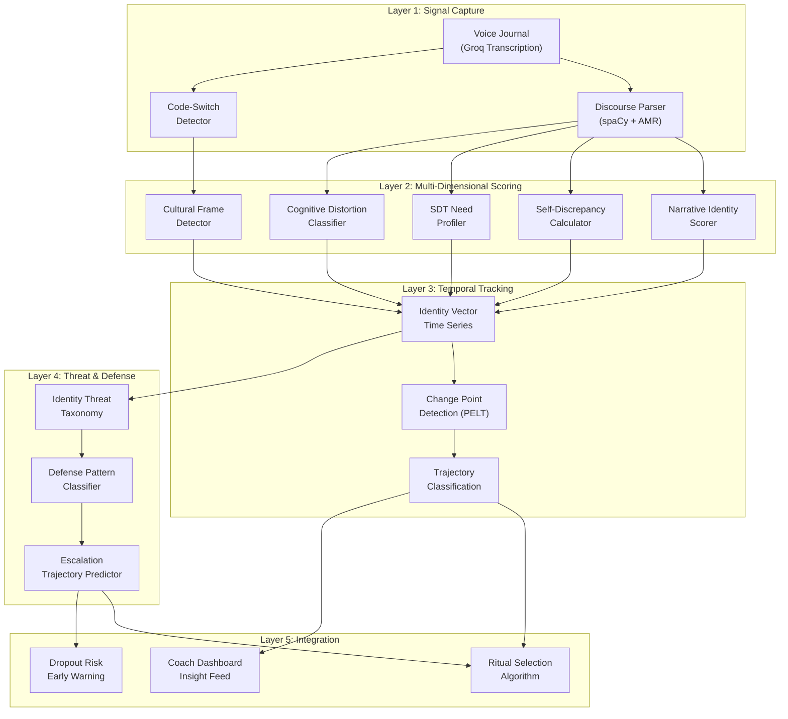

# Identity Engine Architecture — Systems Thinking Analysis

> **Project**: CBCS (Conscious Behavioural Change System) — Identity Engine  
> **Scope**: Synthesize 10 research papers with current architecture audit to propose the optimal Identity Engine  
> **Method**: Systems thinking — mapping reinforcing loops, balancing loops, leverage points, and failure modes

---

## 1. Current System Audit: 7 Systemic Failures

The existing CBCS identity system has fundamental structural weaknesses that compound each other. This is not a list of bugs — it's a map of **reinforcing failure loops** where each weakness amplifies the others.

### Failure 1: The Placeholder Core

[assessment.py](file:///d:/Work/The%20Conscious%20Coaching%20Factory/CBCS/backend/core/assessment.py) — [determine_identity_pillar()](file:///d:/Work/The%20Conscious%20Coaching%20Factory/CBCS/backend/core/assessment.py#26-33) returns a hardcoded `"The Builder"` for every user. This means every downstream system that consumes identity data is operating on fabricated input.

**Systemic Impact**: Identity pillar drives **25% of the ritual selection algorithm**. A hardcoded identity means 25% of every coaching intervention is random noise. Over 30 days, this compounds — the system never learns what works because it never had accurate input to begin with.

### Failure 2: Static Label vs. Dynamic Process

[identity_pillars.yaml](file:///d:/Work/The%20Conscious%20Coaching%20Factory/CBCS/backend/intelligence_library/identity_pillars.yaml) defines 4 archetypes (Fluid Integrator, Grounded Processor, Rhythmic Releaser, Intuitive Explorer) as **fixed categories**. But every research paper we studied converges on the same conclusion: identity is a **narrative arc**, not a label.

- **McAdams' Life Story Model**: Identity = internalized, evolving story with Agency and Communion themes
- **Markus & Nurius' Possible Selves**: Identity = tension field between Current Self, Hoped-For Selves, and Feared Selves
- **Higgins' Self-Discrepancy Theory**: Identity = gap between Actual, Ideal, and Ought selves that produces specific emotional signatures
- **Breakwell's Identity Process Theory**: Identity operates through 4 dynamic principles (Continuity, Distinctiveness, Self-Esteem, Self-Efficacy)

A static pillar assignment violates the foundational insight of identity psychology: **identity is a process, not a state**.

### Failure 3: Keyword Dependency

[Aria's extraction logic](file:///d:/Work/The%20Conscious%20Coaching%20Factory/CBCS/backend/agents/perception/aria.py) detects identity through "I am" statement extraction. The Cross-Cultural Identity research (Paper 8) demonstrates this is **culturally biased**:

| Culture Type | Identity Expression Style | "I am" Detection Rate |
|:---|:---|:---|
| Direct / Individualist | "I am a fighter" — explicit | **High** |
| Relational / Collectivist | "My family expects me to..." — role-based | **Near zero** |
| Hybrid / Diasporic | Context-dependent code-switching | **Unreliable** |

Korean speakers use intransitive constructions ("The box moved") rather than agentive ones ("I pushed the box"). Japanese narratives express identity through "acceptance" rather than "agency." French-Arabic bilingual coaching clients signal identity through code-switching that Aria treats as noise.

**Systemic Impact**: False negatives for collectivist users → system assigns default identity → wrong rituals → poor engagement → user drops out → system never accumulates data to correct.

### Failure 4: No Temporal Dimension

[graph_db.py](file:///d:/Work/The%20Conscious%20Coaching%20Factory/CBCS/backend/core/graph_db.py) stores `User → HAS_IDENTITY → Identity` without timestamps. This means:
- No way to measure **when** identity shifted
- No way to detect **trajectory direction** (improving vs. regressing)
- No way to identify **change points** (the specific journal entry where a shift occurred)

The PELT (Pruned Exact Linear Time) algorithm from Writing in Symbiosis (Paper 10) detects structural break points with millisecond precision. Without temporal relationship properties, the most powerful change-detection methods are architecturally impossible.

### Failure 5: Isolated Extraction Dimensions

Aria extracts Enemies, Dreams, Fears, and Identity as **separate, unrelated entities**. But the research reveals these are **structurally coupled**:

```
Self-Discrepancy Theory (Higgins):
  Actual-Ideal Gap → dejection emotions → avoidance coping
  Actual-Ought Gap → agitation emotions → externalization coping
  Feared Self proximity → anxiety → withdrawal

These ARE the same data that Aria extracts:
  Dreams = Ideal Self (what they CRAVE)
  Fears = Feared Self (what they FEAR)
  Enemies = the obstacle in their Actual-Ideal gap
  Identity = their Actual Self perception
  Resistance = their coping architecture responding to the gap
```

By storing these as isolated nodes rather than computing their **relational geometry** (gap size, gap direction, gap trajectory), the system discards the most therapeutically valuable signal.

### Failure 6: No Cognitive Distortion Detection

The Cognitive Distortion NLP survey (Paper 7) identifies 10 core distortion types that are **directly detectable from journal text** and are **clinically validated indicators** of identity-related thinking patterns:

| Distortion | Example in Journal | Identity Signal |
|:---|:---|:---|
| All-or-Nothing | "If I can't do it perfectly, I'm a failure" | Rigid self-schema |
| Labelling | "I'm just a lazy person" | Fixed identity narrative |
| Should Statements | "I should be further along by now" | Ought-self pressure |
| Catastrophising | "This one mistake means everything is ruined" | Feared-self activation |
| Emotional Reasoning | "I feel stupid, so I must BE stupid" | Emotion-identity fusion |

These distortions are **not currently detected**. Fine-tuned transformers (MentalBERT, RoBERTa) achieve human-level detection. LLM prompting via the DoT (Diagnosis of Thought) framework can classify distortions with structured reasoning. Including conversational context improves detection F1 from 0.68 to 0.73.

### Failure 7: No Evaluation Framework

The Responsible AI Evaluation paper (Paper 9) found that **50% of AI mental health tools** rely only on generic NLP metrics and **52% have no human evaluation**. The current CBCS has:
- No validity assessment (does it measure what it claims to measure?)
- No reliability testing (does it produce consistent results?)
- No implementation audit (does it work in real-world workflow?)
- No maintenance protocol (does it remain effective over time?)

---

## 2. The Leverage Points: Where Small Changes Produce Large Effects

Systems thinking identifies leverage points where intervention has disproportionate impact. Ranked by Donella Meadows' hierarchy:

### Leverage Point 1: Change the Paradigm — Identity as Trajectory, Not Label

**Current paradigm**: Assign user to one of 4/5 archetypes. Track label.  
**New paradigm**: Compute a **multi-dimensional position vector** that evolves across time.

This is the highest-leverage change because every downstream system inherits better input. The identity vector should encode:

1. **Narrative Identity Coordinates** — Agency (0-1), Communion (0-1), Redemption-Contamination arc position (-1 to +1)
2. **Self-Discrepancy Gaps** — Actual-Ideal distance, Actual-Ought distance, Feared-Self proximity
3. **SDT Need Profile** — Autonomy satisfaction (0-100), Competence satisfaction (0-100), Relatedness satisfaction (0-100)
4. **Threat-Defense State** — Active threat type (continuity/distinctiveness/esteem/efficacy), defense mechanism engaged

This 12-dimensional vector replaces the single string "The Builder."

### Leverage Point 2: Change the Information Flow — Temporal Graph Structure

Add `timestamp` and `confidence` properties to every Neo4j relationship. This enables:
- **Rolling window computation**: 3-5 day windows for LIWC trend analysis (per Paper 6)
- **Change point detection**: PELT algorithm on the identity vector time series
- **Trajectory classification**: Is the user on a redemption arc, contamination arc, or plateau?

### Leverage Point 3: Change the Rules — Culturally Adaptive Detection

Replace keyword-based identity detection with **structural analysis**:
- **AMR (Abstract Meaning Representation)** semantic graphs to detect agent-backgrounding in collectivist speech
- **Code-switching detection** module for multilingual users (French-English, Arabic-French)
- **Narrative frame analysis** using culture-adapted coding (Turner study: US=redemption, Japan=acceptance, Denmark=normality, Israel=collective responsibility)

---

## 3. Proposed Architecture: The 5-Layer Identity Engine



### Layer 1: Signal Capture (Replacing Keyword Detection)

**Components**:

| Component | Input | Output | Academic Basis |
|:---|:---|:---|:---|
| Discourse Parser | Transcript text | Syntactic dependency trees, AMR semantic graphs | Cross-Cultural Identity (Paper 8): AMR detects agent-backgrounding, relational framing |
| LIWC-22 Analyzer | Transcript text | 100+ linguistic dimension scores per entry | Identity Shift Measurement (Paper 6): Clout, Authenticity, Analytical Thinking, Emotional Tone |
| Code-Switch Detector | Transcript text | Language segments with social function labels | Cross-Cultural Identity (Paper 8): code-switching as hybrid identity signal |
| Discourse Marker Extractor | Transcript text | Hedge counts, connectors, particles | Cross-Cultural Identity (Paper 8): discourse particles survive transcription, index identity |

**Minimum Data Requirements** (from Paper 6):
- ≥50 words per journal entry for reliable LIWC analysis
- ≥100 words for semantic embedding stability
- 3-5 day rolling windows for trend detection
- 21-30 total entries for identity shift detection confidence

### Layer 2: Multi-Dimensional Scoring

#### 2A: Narrative Identity Scorer

Maps each journal entry to McAdams' validated narrative dimensions:

| Dimension | Detection Method | LIWC Markers | Sentence-Level Markers |
|:---|:---|:---|:---|
| **Agency** | BERTAgent classifier + "I decided/chose/built" keywords | High Clout, high Drives | Active transitive constructions |
| **Communion** | Relatedness language classifier | High Social, Affiliative tone | Relational nouns, "we" pronouns |
| **Redemption** | Sequence detector: negative → positive valence shift | Emotional Tone trajectory | "but then", "which led me to" |
| **Contamination** | Sequence detector: positive → negative valence shift | Declining Emotional Tone | "but it fell apart", "then everything changed" |
| **Meaning-Making** | Exploratory processing language | High Cognitive Processing | "I realize now", "Looking back" |

**Cultural Adaptation Required**: Agency detection must include collectivist variants:
- Western agency: "I overcame this"
- Japanese agency-as-acceptance: "I learned to accept this"
- Danish agency-as-normality: "This is just part of life"
- Israeli collective agency: "We fight; we survive"

#### 2B: Self-Discrepancy Calculator

Computes 3 gap distances from the data Aria already extracts:

```
Actual-Ideal Gap = semantic_distance(
    identity_statements,     # "I am..." entities (Actual Self)
    dream_statements         # "I want to be..." entities (Ideal Self)
)

Actual-Ought Gap = semantic_distance(
    identity_statements,     # "I am..." entities (Actual Self)  
    obligation_statements    # "I should...", "I need to..." (Ought Self)
)

Feared-Self Proximity = semantic_similarity(
    identity_statements,     # "I am..." entities (Actual Self)
    fear_statements          # "I'm afraid I'll become..." (Feared Self)
)
```

**Key Insight from Paper 5**: The *balance* between hoped-for and feared selves produces the strongest motivation. Users who express BOTH "I could become financially free" AND "I could end up broke" for the same domain show highest engagement. This balance score is a new computed dimension.

**Emotional Signature Validation** (from Higgins):
- High Actual-Ideal gap → dejection emotions (sadness, disappointment) → avoidance coping
- High Actual-Ought gap → agitation emotions (anxiety, guilt) → externalization coping
- High Feared-Self proximity → existential anxiety → withdrawal coping

#### 2C: SDT Need Profiler

Replaces the 4-archetype system with a 3-axis need satisfaction profile:

| Need | Satisfaction Markers | Frustration Markers | LIWC Dimensions |
|:---|:---|:---|:---|
| **Autonomy** | "I chose to", "I decided", "It was my call" | "I had to", "They made me", "No choice" | High Agency, Self-referencing |
| **Competence** | "I figured it out", "I can handle this" | "I'm lost", "I can't do this", "Too hard" | High Achievement, Low Anxiety |
| **Relatedness** | "We connected", "They understand", "I belong" | "Nobody gets it", "I'm alone in this" | High Social, Affiliative language |

Each axis produces a score (0-100) representing **satisfaction minus frustration**. The profile shape (e.g., High Autonomy/Low Relatedness vs. Low Autonomy/High Relatedness) predicts **which intervention type the user responds to**:

| Need Profile | Predicted Response Pattern |
|:---|:---|
| High Autonomy need, Low Competence | Responds to skill-building rituals, not directive coaching |
| Low Autonomy, High Relatedness need | Responds to community/accountability, not solo exercises |
| Low Competence, Low Relatedness | Highest dropout risk — needs scaffolded re-entry |

#### 2D: Cognitive Distortion Classifier

Adds a detection layer for the 10 core CD types (from Paper 7):

**Recommended Approach**: LLM prompting via **DoT (Diagnosis of Thought)** framework rather than fine-tuned classifier. Rationale:
- Voice journal entries are **long-form, context-rich text** — this is where LLM prompting excels over short-text classifiers
- Multi-label classification (a single entry can contain multiple distortion types)
- Reasoning generation is built-in — the system can explain WHY a statement was classified as distorted
- No training data needed from our specific domain

**Integration**: Each detected distortion maps to an identity signal:

| CD Type | Identity Dimension Affected | Intervention Signal |
|:---|:---|:---|
| Labelling ("I'm lazy") | Rigid Actual Self schema | Identity flexibility intervention |
| Should Statements | Ought-Self pressure | Autonomy support |
| Catastrophising | Feared-Self activation | Feared-Self deactivation protocol |
| All-or-Nothing | Binary self-concept | Spectrum reframing |
| Emotional Reasoning | Emotion-identity fusion | Cognitive defusion |

#### 2E: Cultural Frame Detector

Classifies each entry into one of 3 expression styles:

1. **Direct/Individualist**: High 1st-person singular, agentive constructions, trait adjectives
2. **Relational/Collectivist**: Kinship terms, role nouns, passive/intransitive constructions, "we" pronouns
3. **Hybrid/Diasporic**: Code-switching, mixed metaphors, register shifts

**This classification gates the interpretation of all other scores.** A low Agency score for a Japanese-style narrator doesn't mean low agency — it means agency is expressed through "acceptance" rather than "conquest." The cultural frame prevents false negatives.

### Layer 3: Temporal Tracking

#### 3A: Identity Vector Time Series

Each journal entry produces a 12-dimensional identity vector. Stored in Neo4j with timestamp:

```
(User)-[:IDENTITY_VECTOR {
    timestamp: datetime,
    confidence: float,
    agency: float,
    communion: float,
    redemption_arc: float,
    actual_ideal_gap: float,
    actual_ought_gap: float,
    feared_self_proximity: float,
    autonomy: float,
    competence: float,
    relatedness: float,
    threat_level: float,
    cultural_frame: string
}]->(IdentitySnapshot)
```

#### 3B: Change Point Detection (PELT)

The PELT algorithm (validated in Paper 10 for detecting structural breaks in linguistic time series) runs on each dimension of the identity vector independently. It identifies **the exact journal entry** where a statistically significant shift occurred.

**What This Enables**:
- "On Day 14, the user's Agency score underwent a structural break from 0.35 to 0.72"
- "The Feared-Self proximity decreased sharply after entry #19"
- "Change point in Competence satisfaction coincides with change point in Redemption arc"

This is decisive for the coach dashboard — instead of "User is progressing," the coach sees "User's identity shifted on Day 14 after they described confronting their fear of failure."

#### 3C: Trajectory Classification

Using the Dual-Track Evolution framework from Paper 10, classify each user's overall trajectory:

| Trajectory Type | Description | Detection Method |
|:---|:---|:---|
| **Redemption Arc** | Negative → Positive valence trajectory with increasing agency | Rising Agency + Rising Redemption scores |
| **Contamination Arc** | Positive → Negative trajectory, often preceding dropout | Rising Contamination + Declining Competence |
| **Plateau** | Stable scores with no significant change points | No PELT breaks in any dimension |
| **Oscillation** | Rapid switching between redemption and contamination | Multiple PELT breaks in short window |
| **Breakthrough** | Sudden multi-dimensional shift (≥3 dimensions shift simultaneously) | Co-occurring PELT breaks |

### Layer 4: Threat Detection & Defense Mapping

#### 4A: Identity Threat Taxonomy (Breakwell's IPT)

| Threat Type | What's Threatened | Linguistic Markers (LIWC) | Journal Language Examples |
|:---|:---|:---|:---|
| **Continuity** | "I'm not the same person anymore" | High Negations, past-tense increase | "I used to be someone who...", "I don't recognize myself" |
| **Distinctiveness** | "I'm becoming like everyone else" | Topic shifts, uniqueness language | "Everyone does this", "What makes me different?" |
| **Self-Esteem** | "I'm not good enough for this" | Pronoun shifting (I→they), social comparison | "Others are better at this", "I don't deserve..." |
| **Self-Efficacy** | "I can't do what this requires" | High Cognitive Processing words, hedging | "I think maybe...", "I'm not sure I can..." |

#### 4B: Defense → Intervention Matching

| Defense Pattern | Triggered By | Matched Intervention | Rationale |
|:---|:---|:---|:---|
| Deflection | Continuity threat | **Narrative Remooring** — rebuild continuity through story | Reconnect past self to future self through narrative bridge |
| Intellectualization | Efficacy threat | **Somatic Grounding** — body-based rather than cognitive | Bypass the cognitive defense by engaging body |
| Externalization | Esteem threat | **Self-Affirmation** — values-based self-worth reinforcement | Restore esteem from internal values, not external comparison |
| Withdrawal | Distinctiveness threat | **Radical Individualization** — honor uniqueness | Reaffirm that the change process is uniquely theirs |

#### 4C: Escalation Trajectory Predictor

Research (Paper 4) identifies a 3-phase escalation pattern:

| Phase | Weeks | Signal | Intervention Window |
|:---|:---|:---|:---|
| **Phase 1: Surface Defense** | 1-2 | Deflection, intellectualization, humor | **Optimal** — defenses are flexible |
| **Phase 2: Deep Resistance** | 3-4 | Increasing withdrawal, silence, shorter entries | **Critical** — must intervene before Phase 3 |
| **Phase 3: Decision Junction** | 5-6 | Either breakthrough (redemption arc) or dropout (contamination arc) | **Too late for prevention** — outcome largely determined |

**Early Warning System**: If Phase 2 signatures appear before Day 14, the system triggers an escalated intervention protocol. This is the **highest-value prediction** the Identity Engine can make.

### Layer 5: Integration

#### 5A: Ritual Selection Algorithm Enhancement

Current: 25% weight from identity pillar (hardcoded "The Builder")

Proposed: Replace single pillar with **multi-factor intervention matching**:

```
ritual_score = (
    0.25 * sdt_need_match(user.need_profile, ritual.need_target) +
    0.20 * threat_intervention_match(user.active_threat, ritual.threat_response) +
    0.20 * trajectory_appropriateness(user.trajectory_type, ritual.arc_fit) +
    0.20 * discrepancy_alignment(user.gap_type, ritual.gap_strategy) +
    0.15 * cultural_frame_compatibility(user.cultural_frame, ritual.cultural_style)
)
```

#### 5B: Coach Dashboard Insights

The Identity Engine feeds the coach dashboard with:

1. **Identity Shift Timeline**: Visual time series of all 12 identity dimensions with highlighted change points
2. **Active Threat Alert**: Current threat type and defense mechanism with recommended intervention
3. **Dropout Risk Score**: Based on escalation phase and trajectory classification
4. **Cultural Context Note**: How to interpret this user's expression style (direct vs. relational vs. hybrid)
5. **Cognitive Distortion Report**: Most frequent distortion patterns with suggested reframes

---

## 4. Minimum Data Requirements

Based on synthesized findings from Papers 1, 5, 6, and 10:

| Metric | Minimum | Optimal | Source |
|:---|:---|:---|:---|
| Words per journal entry | 50 | 100-200 | LIWC minimum for reliable analysis |
| Entries for initial profile | 3-5 | 7 | SDT need profiling stability |
| Entries for identity shift detection | 14 | 21-30 | Narrative identity research consensus |
| Rolling window for trend detection | 3 days | 5 days | BERTopic topic modeling stability |
| Total program length for full trajectory | 21 days | 30 days | McAdams intervention study evidence |

**Cold Start Protocol** (Days 1-5):
- Use SDT Need Profiler with wider confidence intervals
- Default cultural frame to "Direct/Individualist" unless code-switching detected
- Compute Self-Discrepancy gaps from the first entry that contains both identity and dream/fear statements
- **Do NOT assign trajectory type** until Day 7 minimum

---

## 5. Evaluation Framework (Paper 9 Compliance)

The Identity Engine must be evaluated across 4 pillars at 3 maturity levels:

### Early Maturity (Months 1-3)

| Pillar | What to Measure | Method |
|:---|:---|:---|
| **Validity** | Do identity dimensions converge with established instruments? | Correlate SDT scores with validated BPNS questionnaire on test cohort |
| **Reliability** | Are scores consistent across similar entries? | Test-retest on same-day dual entries; split-half analysis |

### Intermediate Maturity (Months 3-6)

| Pillar | What to Measure | Method |
|:---|:---|:---|
| **Validity** | Does the trajectory predictor actually predict dropout? | Retrospective analysis on completed cohorts |
| **Reliability** | Do scores generalize across coaches and demographics? | Cross-cohort comparison |
| **Implementation** | Do coaches find the dashboard useful? | Structured usability study |

### Advanced Maturity (Months 6-12)

| Pillar | What to Measure | Method |
|:---|:---|:---|
| **Validity** | Do identity-matched interventions produce better outcomes? | A/B test: identity-matched rituals vs. random assignment |
| **Maintenance** | Does the system drift over time as language patterns evolve? | Quarterly performance audit on new cohorts |
| **Safety** | Are there false positives on threat detection that cause harm? | Expert clinician review of threat alerts |

---

## 6. Pi Harness Integration Specification

### Agents

| Agent | Role | Layer |
|:---|:---|:---|
| **Aria** (enhanced) | Signal capture + multi-dimensional scoring | Layers 1-2 |
| **Chronos** (new) | Temporal tracking, change point detection, trajectory classification | Layer 3 |
| **Sentinel** (new) | Threat detection, defense classification, escalation prediction | Layer 4 |

### Sub-Agents

| Sub-Agent | Parent Agent | Function |
|:---|:---|:---|
| Narrative Coder | Aria | Scores Agency, Communion, Redemption/Contamination arcs |
| Discrepancy Calculator | Aria | Computes Actual-Ideal, Actual-Ought, Feared-Self gaps |
| Need Profiler | Aria | Scores Autonomy, Competence, Relatedness |
| Distortion Classifier | Aria | Detects 10 cognitive distortion types via DoT prompting |
| Cultural Adapter | Aria | Classifies expression style, adjusts scoring thresholds |
| Trend Analyzer | Chronos | Runs PELT on identity vector time series |
| Arc Classifier | Chronos | Assigns trajectory type (Redemption/Contamination/Plateau/etc.) |
| Threat Detector | Sentinel | Identifies active identity threat type |
| Escalation Monitor | Sentinel | Tracks phase progression, triggers early warnings |

### Skills

| Skill | Description |
|:---|:---|
| `narrative_identity_coding` | McAdams coding manual adapted for computational extraction |
| `self_discrepancy_calculation` | Semantic distance computation between self-concept domains |
| `sdt_need_scoring` | Linguistic marker → need satisfaction/frustration scoring |
| `cognitive_distortion_detection` | DoT-based multi-label distortion classification |
| `cultural_frame_detection` | AMR-based structural analysis + code-switch detection |
| `change_point_detection` | PELT/BOCPD algorithms on time series data |
| `threat_classification` | IPT-based threat taxonomy with LIWC marker matching |

### Tools

| Tool | Function |
|:---|:---|
| `liwc_analyzer` | LIWC-22 analysis on transcript segments |
| `sentence_bert_embedder` | Sentence-level semantic embeddings for discrepancy calculation |
| `bert_topic_modeler` | Dynamic topic modeling for self-description tracking |
| `amr_parser` | Abstract Meaning Representation graph generation |
| `pelt_detector` | Change point detection on numerical time series |
| `neo4j_temporal_writer` | Write timestamped identity vectors to graph database |

### Libraries

| Library | Purpose |
|:---|:---|
| `identity_threat_taxonomy` | Validated threat types with linguistic markers |
| `defense_intervention_matrix` | Mapping from defense patterns to intervention types |
| `cultural_coding_manuals` | Adapted narrative coding for US, Japanese, Danish, Israeli, French-African patterns |
| `cognitive_distortion_definitions` | Burns' 10-type taxonomy with computational detection rules |
| `sdt_linguistic_markers` | Autonomy/Competence/Relatedness marker dictionaries |

### Executive Prompts

| Prompt | Agent | Purpose |
|:---|:---|:---|
| [aria_SKILL.md](file:///d:/Work/The%20Conscious%20Coaching%20Factory/CBCS/backend/intelligence_library/protocols/aria_SKILL.md) (enhanced) | Aria | Updated to include 5 new sub-agent extraction dimensions |
| `chronos_SKILL.md` (new) | Chronos | Temporal analysis protocol with PELT parameters |
| `sentinel_SKILL.md` (new) | Sentinel | Threat detection protocol with escalation thresholds |

---

## 7. Reinforcing Loops in the New Architecture

### Virtuous Loop 1: Data → Accuracy → Better Interventions → More Engagement → More Data

```
More journal entries → More accurate identity vector →
Better-matched rituals → Higher engagement →
More journal entries (loop reinforces)
```

### Virtuous Loop 2: Cultural Adaptation → Fewer False Negatives → Better Profiles → Better Retention

```
Cultural frame detection → Correct interpretation of indirect identity →
Accurate SDT profile → Appropriate interventions →
User feels understood → Continues journaling (loop reinforces)
```

### Balancing Loop (Safety): Threat Detection → Intervention Escalation → Re-Stabilization

```
Identity threat detected → Defense pattern classified →
Matched intervention deployed → Threat de-escalates →
Monitoring intensity decreases (loop balances)
```

### Failure Loop to Monitor: Over-Detection → Alert Fatigue → Ignored Warnings

```
Sensitivity too high → Too many false threat alerts →
Coach ignores alerts → Real threats missed →
User drops out (loop degrades)
```

**Mitigation**: Set initial threat detection thresholds conservatively. Only alert when ≥2 independent signals converge (LIWC markers + discourse structure + temporal trajectory).

---

## 8. Implementation Priority Order

Based on leverage point analysis and dependency mapping:

| Priority | Component | Justification | Dependency |
|:---|:---|:---|:---|
| **P0** | Neo4j temporal schema upgrade | Everything downstream requires timestamped relationships | None |
| **P0** | SDT Need Profiler | Replaces the broken archetype system with validated psychometrics | Neo4j temporal schema |
| **P1** | Narrative Identity Scorer | Provides the trajectory data that enables change point detection | Neo4j temporal schema |
| **P1** | Self-Discrepancy Calculator | Computes the gap geometry from already-extracted Dreams, Fears, Identity | Aria's existing extraction |
| **P2** | Chronos agent (PELT + Trajectory) | Needs ≥7 entries before it produces meaningful output | Layers 1-2 operational |
| **P2** | Cognitive Distortion Classifier | Adds a new extraction dimension to Aria | None (independent) |
| **P3** | Cultural Frame Detector | Optimization — needed for global deployment but not for English-speaking alpha | AMR parser setup |
| **P3** | Sentinel agent (Threat Detection) | Needs ≥14 entries before escalation prediction is reliable | Chronos operational |
| **P4** | Coach Dashboard | Visualization layer — depends on all data layers being operational | All layers |
| **P4** | Evaluation framework setup | Testing infrastructure for validation | All layers |

---

## 9. Key Risks and Mitigations

| Risk | Probability | Impact | Mitigation |
|:---|:---|:---|:---|
| **LIWC-22 licensing cost** | High | Medium | Use open-source alternatives (SEANCE, Empath) for initial build; validate against LIWC later |
| **LLM hallucination in distortion detection** | Medium | High | Use structured DoT prompting with multi-agent debate (ERD framework); require reasoning chain |
| **Cultural false negatives for non-English users** | High initially | High | Deploy Cultural Frame Detector early for French-English users; expand to other languages iteratively |
| **Over-fitting identity model to early cohorts** | Medium | High | Maintain held-out test cohorts; quarterly re-validation |
| **Coach alert fatigue from threat detection** | Medium | Medium | Conservative initial thresholds; require ≥2 convergent signals; coach-configurable sensitivity |
| **User reaction to "being analyzed"** | Low | Very High | All analysis is coach-facing only; users never see raw identity scores; framing as "your progress story" |
