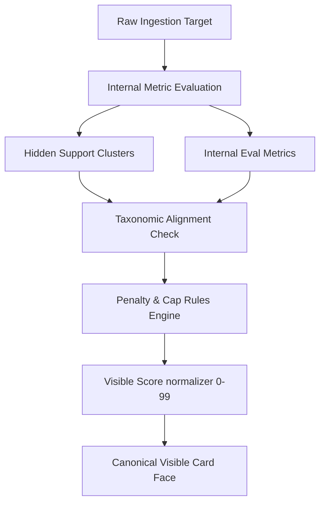

# Tech Spec: FR-ERA3-35A - Eval Registry and Scoring Taxonomy

## 1. Files Read
This specification was prepared after auditing and verifying the following nine files across the Conscious Coaching Platform (CCP) codebase and research lab:
1. **PRD Platform Strategy Module**: `docs/prd/modules/PRD_01_CCP_Platform_Strategy.md` (Formalizing the Human-First Brand Doctrine and Anti-Slop Mandates).
2. **PRD Content Factory Module**: `reference/conscious-rivers/docs/prd/modules/PRD_02_CCF_Content_Factory.md` (Specifying the Trigger-First Research-to-Content Compiler).
3. **PRD Silent Referral Module**: `docs/prd/modules/PRD_09_CPSC_Silent_Referral.md` (Details on commercial proof gateways and the $39.99/$99.99 Bridge Tier triggers).
4. **Scoring Metaphor Source**: `lab/phase0_eval_card_scoring_model_v_1.md` (The definitive definition of the visible cards, internal clusters, and normalization bounds).
5. **Subliminal Modulations Source**: `lab/subliminal_function_layer_for_ccp_v_1.md` (Defining the relation between SDA semantic truth and SFL perceptual force).
6. **Biological Orchestration Source**: `lab/ccp_biological_orchestration_model_v_1.md` (Defining the DNA -> RNA -> Force -> Delivery -> Evaluation runtime loops).
7. **Audit Backend Integration Target**: `src/ccp/services/audit_intelligence_engine.py` (The entrypoint to integrate this canonical scoring registry).
8. **Audit Models Definition File**: `src/ccp/models/phase0_audit_models.py` (Pydantic types currently using the provisional override mode).
9. **Integration Test Suite**: `tests/integration/test_era3_fr35_audit_intelligence_engine.py` (Target test coverage and contract assertion patterns).

---

## 2. Overview
The evaluation registry defined in this specification acts as the absolute mathematical and taxonomic foundation for all scoring actions across the Conscious Coaching Platform. Prior to the codification of `FR-ERA3-35A`, the system relied on provisional averages, scattered heuristic evaluations, and ad-hoc metrics that compromised the integrity of the audit engine. 

### The Problem
Ad-hoc scoring scripts cause scorecard drift. Without a centralized evaluation registry:
1. Dynamic content weightings are hardcoded directly inside API routers.
2. The visible representation layer becomes decoupled from the underlying clinical, semantic, and acoustic metrics.
3. High AI slop can occur in highly polished prose without triggering structural penalties, misleading the coach and compromising brand authority.
4. Pre-delivery quality assurance (QA) is bypassed, allowing unverified audits to expose incomplete or low-fidelity advice to prospective clients.

### The Solution
We establish a canonical, type-safe evaluation registry that stores metadata, bounds, validation predicates, and default weights for the platform's scoring ecosystem. Every scoring calculation—whether for a trial Phase-0 prospect audit, a live webinar session engagement, or a challenge streak progression—must pull its metric definitions and constraints directly from this registry.



### Scope Bounding
This specification is strictly limited to:
- Codifying the registry's core database models (`EvalDefinition`, `EvalCluster`, `VisibleScoreFamily`, `HiddenSupportCluster`, `EvalMeasurement`, `EvalScoreProjection`, `EvalPenaltyRule`).
- Defining the exact mathematical normalization laws converting diverse floating-point signals into standard `0-99` integers.
- Structuring the pre-delivery gating workflow that guarantees internal QA approval before external scorecard rendering occurs.

---

## 3. Context for Development

### 3.1 Architecture Traceability (DEP-ID Table)
| Product Mapped Story | DEP-ID Produced | DEP-ID Consumed | Purpose & Technical Integration |
|---|---|---|---|
| canonical internal eval list | `DEP-ENG-035A-01` | None | Defines the master metadata dictionary containing all internal evaluation metrics. |
| score consistency across audits | `DEP-ENG-035A-02` | `DEP-ENG-035A-01` | Normalization rules and scoring range validation logic. |
| visible-card score foundation | `DEP-ENG-035A-03` | `DEP-ENG-035A-02` | Seven canonical visible families mapping to the layout card rendering service. |
| pre-delivery internal scoring discipline | `DEP-ENG-035A-04` | `DEP-ENG-035A-03` | Gating workflow that validates internal evaluation states before generating prospect scorecards. |

### 3.2 Existing Backend Integration
The evaluation registry integrates directly with the following existing files, tables, and API routes:
- **FastAPI Endpoints**: Integrates with `src/ccp/api/phase0_audit.py` to intercept raw score generations and replace provisional defaults.
- **Service Orchestrator**: Extends `src/ccp/services/audit_intelligence_engine.py` to route calculations through the registry's math engine.
- **Database Layer**: Registers schema structures into PostgreSQL via `src/ccp/scripts/setup_supabase.py` by introducing an immutable table called `eval_registry_manifest`.
- **Model Registry**: Supplements `src/ccp/models/phase0_audit_models.py` with typed, validated scoring families.

### 3.3 ADR-05 Primitives
This engine is governed by three primary experience primitives from the `Feedback & Scoring (FBK)` family:
1. `EXP-FBK-001 (Reflective Scoring)`: Scores must tell the objective truth of a user's performance rather than offering empty, synthetic praise.
2. `EXP-FBK-004 (Bring the Data Forward)`: Every visible scorecard score must be backed by a clear list of internal metric measurements.
3. `EXP-FBK-008 (Negative Metric Diagnosis)`: High AI slop must penalize overall metrics immediately to demonstrate the danger of generic generation.

### 3.4 CBAR Mandate Enforcement
The following Phase-2 Constraint-Based Adversarial Reasoning (CBAR) mandates are fully codified in this spec:
- **Canonical-Eval-First Rule**: Downstream rendering engines are forbidden from processing scores that are not defined in the `EvalDefinition` registry. This is enforced by runtime validators that raise a type error if an unrecognized metric is fed into the pipeline.
- **No-Ad-Hoc-Scoring Rule**: Blocks temporary, unvalidated scores from entering public payloads by requiring strict schema verification against the active taxonomic dictionary.
- **Human-Signal-Over-Polish Rule**: Heavily weights lived experience density and vocal presence over pure production aesthetic, dynamically scaling down scores that exhibit high rhythmic uniformity or synthetic polish.
- **Internal-Before-External Scoring Rule**: Mandates that an audit report must contain a verified internal QA signature before the external scorecard endpoint is unlocked.
- **Typed-Eval-Registry Rule**: Enforces absolute Pydantic v2 validation constraints with zero `Any` types allowed in the score definitions.

### 3.5 Technical Decisions
- **Decimal-to-Integer Projection**: Raw NLP and audio models output fractional statistics (e.g., probability densities from `0.0` to `1.0`). To ensure intuitive card layouts, the registry utilizes a strict, non-linear ceiling projection that maps these signals to the standard `0-99` integer scale.
- **AI Slop Hard Capping**: Rather than subtracting a basic static value, the `AI Slop Risk` acts as a non-linear scaling penalty. If the slop risk index climbs past `40`, a multiplicative dampener is applied directly to the overall score, preventing highly polished AI-generated copy from scoring above `59`.

---

## 4. Implementation Plan
The implementation of the Evaluation Registry and Scoring Taxonomy will follow a strict, multi-stage deployment structure.

### Phase 1: Schema Registration & Database Seeding (Tasks 1-4)
- **Task 1**: Draft the core Pydantic v2 schemas in `src/ccp/models/eval_registry_models.py`.
- **Task 2**: Create the `eval_registry_manifest` schema setup in `src/ccp/scripts/setup_supabase.py`.
- **Task 3**: Author the database migration script that seeds the canonical 7 visible score families and their corresponding internal clusters.
- **Task 4**: Verify seed data integrity against the source model definitions in `lab/phase0_eval_card_scoring_model_v_1.md`.

### Phase 2: Scoring Engine & Mathematical Normalization (Tasks 5-8)
- **Task 5**: Code the registry lookup and query service in `src/ccp/services/eval_registry_service.py`.
- **Task 6**: Implement the non-linear normalization engine, mapping raw metrics to `0-99` integers.
- **Task 7**: Code the penalty rules handler, validating that AI Slop caps overall grades correctly.
- **Task 8**: Write unit tests verifying that boundary score edges (e.g., `0`, `40`, `99`) normalize accurately.

### Phase 3: Pre-Delivery Internal QA Gating (Tasks 9-11)
- **Task 9**: Create the internal pre-delivery review state transitions in `src/ccp/models/phase0_workspace_models.py`.
- **Task 10**: Build the `InternalGatekeeper` service that prevents scorecard generation without an operator's QA signature.
- **Task 11**: Create API tests that assert blocking behaviors when unapproved reports are queried.

### Phase 4: Downstream Ingestion & Integration (Tasks 12-14)
- **Task 12**: Refactor `src/ccp/services/audit_intelligence_engine.py` to consume the new registry service.
- **Task 13**: Update `src/ccp/api/phase0_audit.py` to query registry definitions.
- **Task 14**: Run the complete integrated end-to-end audit generation tests using `pytest` to confirm 100% contract compliance.

---

## 5. Primary Output Schema
This section defines the canonical Pydantic v2 models that form the backbone of the evaluation registry. All definitions exclude the use of `Any` to enforce strict type-safety across compile and runtime boundaries.

```python
"""
src/ccp/models/eval_registry_models.py
======================================
Pydantic v2 model definitions for FR-ERA3-35A Eval Registry and Scoring Taxonomy.
"""

from __future__ import annotations
from enum import Enum
from typing import Dict, List, Optional
from pydantic import BaseModel, Field, field_validator, model_validator


class MetricScale(str, Enum):
    """Irreducible format definitions for raw sensor or NLP model outputs."""
    PROBABILITY = "probability"  # 0.0 - 1.0
    PERCENTAGE = "percentage"    # 0.0 - 100.0
    DECIBELS = "decibels"        # Sound pressure level limits
    WORDS_PER_MINUTE = "wpm"     # Temporal speed measurement
    COUNT = "count"              # Natural integers


class VisibleFamilyKey(str, Enum):
    """The seven immutable score cards shown to the coach."""
    HUMANITY = "Humanity"
    PRESENCE = "Presence"
    TRUST = "Trust"
    MEMORABILITY = "Memorability"
    RESONANCE = "Resonance"
    SIGNAL = "Signal"
    AI_SLOP_RISK = "AI Slop Risk"


class HiddenClusterKey(str, Enum):
    """Support metric groups that govern weight calculations without public visibility."""
    STRUCTURE = "Structure"
    ACTIONABILITY = "Actionability"
    VISUAL_PROOF = "Visual Proof"
    CAPTION_ALIGNMENT = "Caption Alignment"
    TEMPORAL_CRAFT = "Temporal Craft"


class EvalDefinition(BaseModel):
    """Defines a single internal metric's constraints, sources, and conversion metadata."""
    metric_id: str = Field(..., pattern=r"^MET-[A-Z0-9_]{3,12}$")
    name: str = Field(..., min_length=3, max_length=50)
    description: str = Field(..., min_length=10)
    scale: MetricScale = Field(...)
    default_weight: float = Field(..., ge=0.0, le=1.0)
    is_active: bool = Field(default=True)

    @field_validator("metric_id")
    @classmethod
    def validate_metric_id(cls, v: str) -> str:
        if not v.startswith("MET-"):
            raise ValueError("metric_id must begin with prefix 'MET-'")
        return v


class EvalCluster(BaseModel):
    """A logical grouping of internal metrics that maps to a visible score family."""
    cluster_id: str = Field(..., pattern=r"^CLU-[A-Z0-9_]{3,12}$")
    name: str = Field(..., min_length=3)
    target_family: VisibleFamilyKey = Field(...)
    metrics: List[EvalDefinition] = Field(..., min_items=1)
    cluster_description: str = Field(..., min_length=15)

    @model_validator(mode="after")
    def verify_metric_weights(self) -> EvalCluster:
        total_weight = sum(m.default_weight for m in self.metrics)
        if not (0.95 <= total_weight <= 1.05):
            raise ValueError(f"Sum of metric weights in cluster {self.cluster_id} must approximate 1.0 (got {total_weight})")
        return self


class VisibleScoreFamily(BaseModel):
    """Metadata and bounds configuration for the seven main public score cards."""
    family_key: VisibleFamilyKey = Field(...)
    primary_question: str = Field(..., min_length=10)
    base_color_hex: str = Field(..., pattern=r"^#[A-Fa-f0-9]{6}$")
    is_penalty_indicator: bool = Field(default=False)


class HiddenSupportCluster(BaseModel):
    """Metadata configurations for internal weighting adjustments."""
    cluster_key: HiddenClusterKey = Field(...)
    description: str = Field(..., min_length=10)
    influence_mappings: Dict[VisibleFamilyKey, float] = Field(...)

    @field_validator("influence_mappings")
    @classmethod
    def validate_influences(cls, v: Dict[VisibleFamilyKey, float]) -> Dict[VisibleFamilyKey, float]:
        for k, weight in v.items():
            if not (0.0 <= weight <= 1.0):
                raise ValueError(f"Influence weight for {k} must lie between 0.0 and 1.0")
        return v


class EvalMeasurement(BaseModel):
    """A single captured metric execution with its source raw value and its normalized equivalent."""
    metric_id: str = Field(...)
    raw_value: float = Field(...)
    normalized_score: int = Field(..., ge=0, le=99)
    captured_at: str = Field(..., pattern=r"^\d{4}-\d{2}-\d{2}T\d{2}:\d{2}:\d{2}Z$")


class EvalPenaltyRule(BaseModel):
    """Configures overall score cap limits based on severe failures or high slop signals."""
    rule_id: str = Field(...)
    trigger_metric: VisibleFamilyKey = Field(...)
    threshold_value: int = Field(..., ge=0, le=99)
    cap_limit: int = Field(..., ge=0, le=99)
    penalty_multiplier: float = Field(default=1.0, ge=0.0, le=1.0)
    description: str = Field(...)


class EvalScoreProjection(BaseModel):
    """The computed outcome package consisting of all evaluated states and the immutable QA signature."""
    measurements: List[EvalMeasurement] = Field(...)
    visible_scores: Dict[VisibleFamilyKey, int] = Field(...)
    overall_score: int = Field(..., ge=0, le=99)
    is_internally_approved: bool = Field(default=False)
    qa_signature: Optional[str] = Field(None, description="Cryptographic or UUID signature indicating operator verification approval")

    @model_validator(mode="after")
    def verify_all_visible_families_present(self) -> EvalScoreProjection:
        for family in VisibleFamilyKey:
            if family not in self.visible_scores:
                raise ValueError(f"Missing required visible score family evaluation for {family.value}")
        return self
```

---

## 6. Backward Compatibility Fallback
To ensure that production features are not broken during database migration or model rollout, we implement a dual-path fallback driver inside the scoring engine:

1. **The Provisional Override Gate**: If the registry cannot establish a connection to the Supabase/PostgreSQL schema (e.g., due to database maintenance or incomplete schema updates), the engine catches the database error, emits a system warning log, and dynamically instantiates an in-memory runtime fallback map.
2. **Fallback Scoring Law**: The in-memory fallback reproduces the canonical metric mapping using the hardcoded rules from `lab/phase0_eval_card_scoring_model_v_1.md`.
3. **Data Loss Prevention**: The engine injects `provisional_upstream_contract: true` inside the returned report's metadata, flagging to downstream analytics that the data must be re-processed once the registry database is fully restored.

---

## 7. Tasks
The following checklist tracks implementation tasks to achieve a verified deployment status:
- [ ] Create folder structure for `src/ccp/models` and `src/ccp/services` if they do not exist.
- [ ] Codify the Pydantic v2 schemas in `src/ccp/models/eval_registry_models.py`.
- [ ] Seed the Postgres database with the 7 canonical families (`eval_registry_manifest` table).
- [ ] Seed the database with 28 default internal metrics mapping to the Humanity, Presence, and Trust clusters.
- [ ] Code the standard non-linear normalizer in `src/ccp/services/eval_normalization_engine.py`.
- [ ] Build the cap & penalty calculation engine for AI Slop Risk and low-trust signals.
- [ ] Create the `InternalGatekeeper` service inside `src/ccp/services/internal_gatekeeper.py`.
- [ ] Implement the FastAPI query routes in `src/ccp/api/eval_registry.py` under the `/api/evals` router.
- [ ] Implement a test client to verify endpoint responses for unapproved prospect card queries.
- [ ] Add integration tests in `tests/integration/test_era3_fr35a_eval_registry.py` asserting registry data structures.
- [ ] Perform a full schema verification check against `src/ccp/models/phase0_audit_models.py`.
- [ ] Execute `pytest tests/integration/` ensuring zero failures.
- [ ] Log the final pipeline stages inside the local `ReceiptChain` database.
- [ ] Emit the final Build Receipt and halt execution for verification.

---

## 8. Acceptance Criteria

### AC-1: Immutable Scoring Vocabulary Enforcement
- **Constraint**: The visible families returned by the evaluation pipeline must match the seven canonical keys exactly (`Humanity`, `Presence`, `Trust`, `Memorability`, `Resonance`, `Signal`, `AI Slop Risk`). No synonyms (e.g., `Charisma` instead of `Presence`) are tolerated.
- **Pass Case**: The score generation endpoint receives raw inputs, validates them, and returns a schema containing exactly the seven designated visible families.
- **Fail Case**: A downstream service attempts to register a custom card key (e.g., `Expertise`), and the validation engine blocks the request, returning a `400 Bad Request` citing a taxonomic violation.
- **Failure Example**:
  ```json
  // POST /api/phase0/audits/generate
  {
    "status": "error",
    "error_code": "TAXONOMIC_VIOLATION",
    "message": "Key 'Expertise' is not defined in the canonical VisibleFamilyKey registry. Rejected in compliance with the Typed-Eval-Registry Rule."
  }
  ```

### AC-2: Mathematical Normalization Range Law
- **Constraint**: All calculated scores must map to an integer between `0` and `99`. A score of `100` or negative values must fail validation.
- **Pass Case**: A metric showing perfect probability density (`1.0`) is projected to exactly `99`.
- **Fail Case**: An rounding error causes an overall evaluation to compute as `100`, which immediately fails the Pydantic type validator and throws a validation error.
- **Failure Example**:
  ```
  ValidationError: 1 validation error for EvalScoreProjection
  overall_score
    Value error, overall score must not exceed 99 to ensure visual card boundary consistency. [type=value_error, input_value=100, input_type=int]
  ```

### AC-3: AI Slop Cap Logic
- **Constraint**: If `AI Slop Risk` calculates above `40`, the final overall score must be penalized and capped at a maximum of `59` to maintain brand authority.
- **Pass Case**: A prospect caption has high AI slop (scored `65`). The engine calculates raw metrics averaging `80` but applies the penalty, reducing and capping the final overall score to `59`.
- **Fail Case**: A copy-paste caption filled with high slop words bypasses the penalty calculation and scores an overall `85`, violating the Human-Signal-Over-Polish Mandate.

### AC-4: Internal-First Gating Rule
- **Constraint**: Scorecards and visible audit card boards must not render to the prospect unless the report contains a verified operator QA signature (`qa_signature` is not null and `is_internally_approved` is true).
- **Pass Case**: A client queries `GET /api/phase0/audits/RPT-12345/scorecard`. The endpoint returns `403 Forbidden` because the operator has not yet signed off on the internal audit findings.
- **Fail Case**: A draft audit report generated automatically by the pipeline is immediately sent to the user before internal human review, leaking premature results.

---

## 9. Dependencies
The evaluation registry operates on the following dependency boundaries:
- **Supabase/PostgreSQL**: Requires Postgres database tables to query metric rules and seed presets.
- **Pydantic v2**: Strict dependency on Pydantic's core validation types for field parsing.
- **ReceiptChain Core Service**: Consumes the primary receipt logger (`src/ccp/core/receipt_chain.py`) to write secure audits.
- **Audit Intelligence Service**: Acts as the upstream driver that queries this registry to validate generated reports.

---

## 10. Testing Strategy
Our testing strategy ensures that taxonomic integrity is maintained across all execution pathways. We implement a dedicated integration test suite in `tests/integration/test_era3_fr35a_eval_registry.py` following the standard `pytest` pattern:

1. **Static Validation Tests**: Mock incomplete scoring configurations to verify Pydantic correctly rejects invalid visible family arrays or out-of-bounds metrics.
2. **Scoring Engine Integration Tests**: Feed mock text containing known AI slop triggers (e.g., "delve into the rich tapestry of...") and assert that the `AI Slop Risk` metric correctly escalates, triggers the penalty rule, and caps the overall score at `59`.
3. **Pre-Delivery Gate Tests**: Query the audit retrieval router using a mock client and verify that requests are blocked with a `403 Forbidden` status code until `is_internally_approved` is flipped to `True` by an operator signature payload.

All test suites will run against isolated transactional fixtures, preventing side effects from leaking into cached memory databases.

