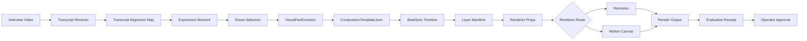

# CMF Composition Runtime Behind the Scenes

Generated diagram:

- `CMF_COMPOSITION_RUNTIME_BEHIND_THE_SCENES_DIAGRAM.png`

This note explains what the V2 visual composition boards are, how they should become executable templates, and what is still missing before they can render exact transcript-timed clips.

## Direct Answer

The V2 boards are approved visual directions, not executable renderer templates yet.

They are intended to become JSON-first composition templates.

Runtime target:

| Route | Primary runtime | Notes |
|---|---|---|
| `SV-CSC` Cinematic Story Commentary | Remotion | Best for deterministic vertical video, captions, b-roll plates, timeline control, audio mix, and final export. |
| `SV-EDU` Educational / PaperCut Explainer | Motion Canvas or Remotion | Motion Canvas is best for vector/canvas-style paper animation. Remotion can still assemble the final clip and mix captions/audio. |
| `SV-FRB` Challenger / Frame Breaker | Remotion | Best for proof cards, receipts, split frames, captions, cutouts, overlays, and timed argument reveals. |
| `SV-RRC` Reaction / Recognition Clip | Remotion reaction renderer | Best for upper reaction UI, lower human proof, background-removed guest/interviewer layers, captions, and beat sync. |

## Exact Timing Status

The system is specified to support transcript-timed composition, but the V2 templates are not yet implemented as exact timeline templates.

Already specified:

- source ingestion and transcript timestamp alignment;
- ExpressionMoment timestamp ranges;
- SceneSpec and RenderContract compilation;
- LayerManifest, AnimationPlan, TimelineManifest, CaptionManifest, and AudioMixManifest;
- deterministic Remotion and Motion Canvas rendering;
- reaction clip renderer with beat sync;
- primitive-gated VisualFeelContract and CompositionPreflightReceipt.

Still needed:

- `TS-CMF-080`: V2 board to composition-template implementation spec;
- 24 `CompositionTemplateJson` files derived from the V2 boards;
- transcript-to-layer timing rules for each template;
- renderer prop generation for each template;
- fixture tests proving each template aligns to actual transcript timecodes.

## Runtime Flow



## Timing Model

The transcript is not just text. It must become time-addressable production evidence.

```text
TranscriptSegment
-> ExpressionMoment
-> SceneSpec
-> CompositionTemplateJson
-> BeatSyncTimeline
-> RendererProps
-> RenderOutput
```

Example:

```json
{
  "expression_moment_id": "em_...",
  "transcript_range": {
    "start_ms": 12400,
    "end_ms": 19800,
    "speaker": "guest",
    "text": "There is a point where being loyal can destroy you."
  },
  "composition_template_code": "SV-RRC-VRS-001",
  "beat_sync_timeline": [
    {
      "at_ms": 12400,
      "layer": "reaction_question",
      "action": "reveal",
      "text": "LOYALTY OR SURVIVAL?"
    },
    {
      "at_ms": 14100,
      "layer": "choice_left",
      "action": "pulse",
      "text": "LOYALTY"
    },
    {
      "at_ms": 15800,
      "layer": "human_cutout_guest",
      "action": "emphasis_push_in"
    },
    {
      "at_ms": 17600,
      "layer": "caption",
      "action": "highlight_word",
      "text": "destroy"
    }
  ]
}
```

## Composition JSON Responsibility

The composition JSON should define:

- route and template code;
- source ExpressionMoment and transcript time range;
- primitive triad obligations;
- visual zones;
- layer IDs;
- safe areas;
- timing hooks;
- text containers;
- human cutout placement;
- caption behavior;
- motion cues;
- renderer target;
- approval and eval blockers.

It should not contain final arbitrary vibes. It must be traceable to source, route, primitive triad, and timeline evidence.

## What Happens for Each Route

### `SV-CSC` Cinematic Story Commentary

The transcript selects an emotional memory segment. The template maps the timestamp range to cinematic caption beats, memory-object reveals, b-roll plates, pauses, and audio emphasis. Remotion renders the final vertical story clip.

### `SV-EDU` Educational / PaperCut Explainer

The transcript selects a concept, myth, analogy, or framework. The template maps each spoken teaching beat to paper strips, note cards, avatar poses, object reveals, arrows, and marker underlines. Motion Canvas may animate the paper scene; Remotion may assemble final video, captions, and audio.

### `SV-FRB` Challenger / Frame Breaker

The transcript selects a claim, contradiction, or false frame. The template maps the spoken challenge to proof cards, receipt reveals, ranking surfaces, myth/evidence cards, title punches, and source cards. Remotion handles timing and final output.

### `SV-RRC` Reaction / Recognition Clip

The transcript selects a reaction-worthy exchange. The template maps the upper UI to the guest/interviewer exchange and maps the lower zone to background-removed human cutouts. Beat sync aligns polls, rankings, quote cards, captions, facial reaction, and pauses.

## Readiness Verdict

Ready:

- visual direction;
- route feel;
- primitive-gated approval rules;
- renderer architecture specs;
- transcript/source timing foundation.

Not ready yet:

- 24 executable composition JSON templates;
- route-specific transcript timing compiler;
- Remotion/Motion Canvas template components for these exact V2 boards;
- tests proving exact timeline alignment from transcript to rendered output.

Next required spec:

- `TS-CMF-080-v2-composition-template-runtime-and-transcript-timing.md`
