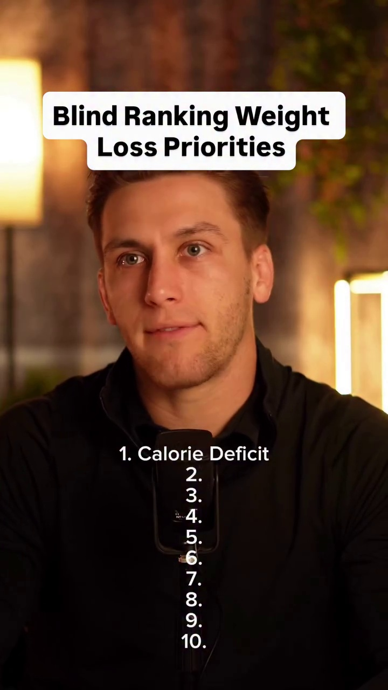

# Transcript and Frame Animations for format04_blind_ranking

## **Transcript and Frame Animations**

* **0:00 - 0:05**
  * **Dialogue:** "calorie deficit number one I mean you have to stay in a calorie deficit consistently to lose weight if you think"
  * **Frame Screenshots:**
    * 
    * 
    * 

* **0:05 - 0:10**
  * **Dialogue:** "what that means is that you just weren't actually in"
  * **Frame Screenshots:**
    * 
    * 

* **0:10 - 0:15**
  * **Dialogue:** "number 9 fats don't make you fat too many calories do if"
  * **Frame Screenshots:**
    * 
    * 
    * 

* **0:15 - 0:20**
  * **Dialogue:** [No dialogue detected / Music only]
  * **Frame Screenshots:**
    * 
    * 

* **0:20 - 0:25**
  * **Dialogue:** "still eat too many calories and not lose weight"
  * **Frame Screenshots:**
    * 
    * 
    * 

* **0:25 - 0:30**
  * **Dialogue:** "carbs don't prevent you from losing weight too many calories do if carbs are der"
  * **Frame Screenshots:**
    * 
    * 

* **0:30 - 0:35**
  * **Dialogue:** "carbs are actually less calorically dense than fats"
  * **Frame Screenshots:**
    * 
    * 
    * 

* **0:35 - 0:40**
  * **Dialogue:** [No dialogue detected / Music only]
  * **Frame Screenshots:**
    * 
    * 

* **0:40 - 0:45**
  * **Dialogue:** "10K steps per day because yes increasing your step count"
  * **Frame Screenshots:**
    * 
    * 
    * 

* **0:45 - 0:50**
  * **Dialogue:** "absolutely help with weight loss but 10,000 steps per day is not a magical number technically you could"
  * **Frame Screenshots:**
    * 
    * 

* **0:50 - 0:55**
  * **Dialogue:** "0 steps a day and still lose weight if you restricted your calorie intake enough but conceptually"
  * **Frame Screenshots:**
    * 
    * 
    * 

* **0:55 - 1:00**
  * **Dialogue:** "play more steps is usually a good idea I mean the lowest I have left is 8 so I'll put it there"
  * **Frame Screenshots:**
    * 
    * 

* **1:00 - 1:05**
  * **Dialogue:** "yes it can increase your step count yes it can increase your caloric"
  * **Frame Screenshots:**
    * 
    * 
    * 

* **1:05 - 1:10**
  * **Dialogue:** "yes it has cardiovascular benefits but it's high impact and the more overweight you are the"
  * **Frame Screenshots:**
    * 
    * 

* **1:10 - 1:15**
  * **Dialogue:** "who's going to be for your joints number two not only will it help you preserve muscle"
  * **Frame Screenshots:**
    * 
    * 
    * 

* **1:15 - 1:20**
  * **Dialogue:** "satiating macronutrient which will help you feel"
  * **Frame Screenshots:**
    * 
    * 

* **1:20 - 1:25**
  * **Dialogue:** "for longer and it has the highest thermic effect of food meaning your body burns more calories breaking down protein"
  * **Frame Screenshots:**
    * 
    * 
    * 

* **1:25 - 1:30**
  * **Dialogue:** [No dialogue detected / Music only]
  * **Frame Screenshots:**
    * 
    * 

* **1:30 - 1:35**
  * **Dialogue:** "call was sustaining a calorie deficit you will lose weight however the reason that it's a bit different from the"
  * **Frame Screenshots:**
    * 
    * 
    * 

* **1:35 - 1:40**
  * **Dialogue:** "argument that I made for cutting out carbs or cutting out fats is because alcohol consumption does absolutely"
  * **Frame Screenshots:**
    * 
    * 

* **1:40 - 1:45**
  * **Dialogue:** "do you have a negative impact on things like sleep hunger fat storage and muscle growth all of which can make weight"
  * **Frame Screenshots:**
    * 
    * 
    * 

* **1:45 - 1:50**
  * **Dialogue:** [No dialogue detected / Music only]
  * **Frame Screenshots:**
    * 
    * 

* **1:50 - 1:55**
  * **Dialogue:** "all of the literature points to a direct correlation between muscle loss and weight regain so set differently"
  * **Frame Screenshots:**
    * 
    * 
    * 

* **1:55 - 2:00**
  * **Dialogue:** "more muscle you lose while losing weight the more likely you are to gain the weight back"
  * **Frame Screenshots:**
    * 
    * 

* **2:00 - 2:05**
  * **Dialogue:** "do you have any intention of losing the weight in keeping it off long-term resistance training is an absolute"
  * **Frame Screenshots:**
    * 
    * 
    * 

* **2:05 - 2:10**
  * **Dialogue:** "skipping meals 7 I can definitely help you reduce your caloric intake but unless"
  * **Frame Screenshots:**
    * 
    * 

* **2:10 - 2:15**
  * **Dialogue:** "done with some well Thought Out planning ahead of time it's often unsustainable and can lead to binge"
  * **Frame Screenshots:**
    * 
    * 
    * 

* **2:15 - 2:20**
  * **Dialogue:** "sticking to the plan realistically this is probably just as important as number"
  * **Frame Screenshots:**
    * 
    * 

* **2:20 - 2:25**
  * **Dialogue:** "find which is just getting in a calorie deficit in the first place you can know exactly what to do and have"
  * **Frame Screenshots:**
    * 
    * 
    * 

* **2:25 - 2:30**
  * **Dialogue:** [No dialogue detected / Music only]
  * **Frame Screenshots:**
    * 
    * 

* **2:30 - 2:35**
  * **Dialogue:** "stress or injuries and they have no idea how to adapt in real"
  * **Frame Screenshots:**
    * 
    * 
    * 

* **2:35 - 2:40**
  * **Dialogue:** "starting back at square one so I've actually been building something"
  * **Frame Screenshots:**
    * 
    * 

* **2:40 - 2:45**
  * **Dialogue:** "this problem and it's coming out late July it's my personal AI clone that's trained on hundreds of hours"
  * **Frame Screenshots:**
    * 
    * 
    * 

* **2:45 - 2:50**
  * **Dialogue:** "personalised weight loss plan and updating that"
  * **Frame Screenshots:**
    * 
    * 

* **2:50 - 2:55**
  * **Dialogue:** "are you as much as needed until you actually get the weight off if you want early access to"
  * **Frame Screenshots:**
    * 
    * 
    * 

* **2:55 - 2:58**
  * **Dialogue:** [No dialogue detected / Music only]
  * **Frame Screenshots:**
    * 
    * 

