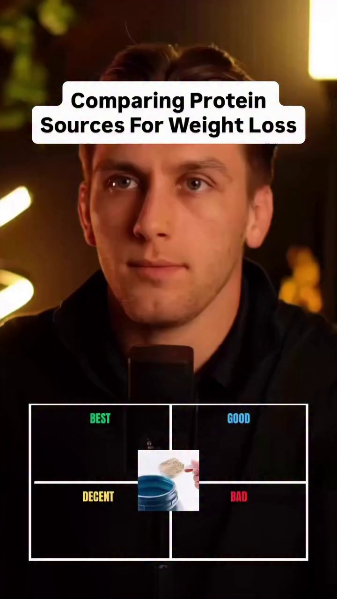
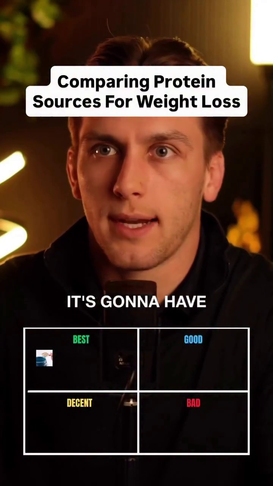
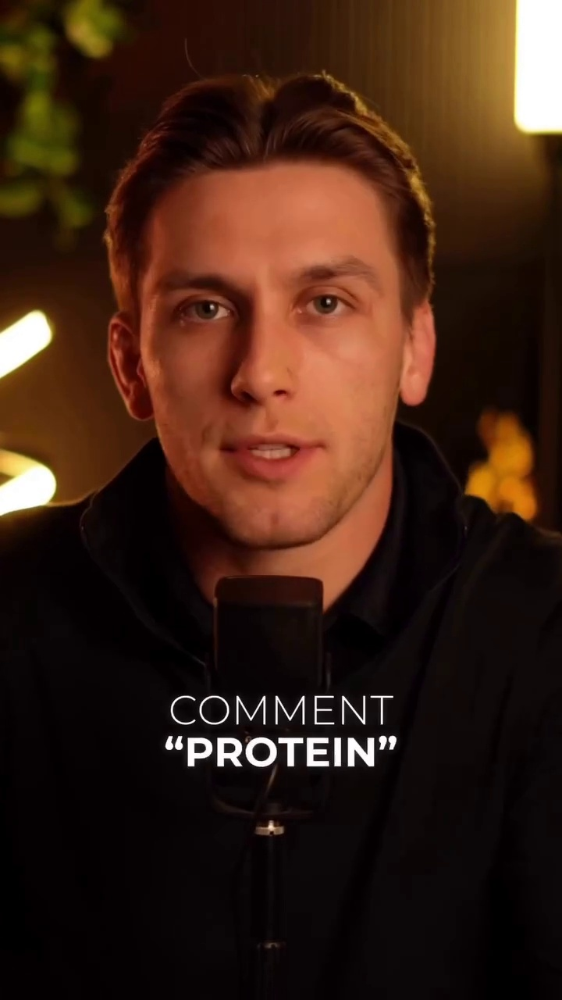

# Transcript and Frame Animations for format04_calorie_evaluation

## **Transcript and Frame Animations**

* **0:00 - 0:05**
  * **Dialogue:** "calorie ratios you'll"
  * **Frame Screenshots:**
    * 
    * 
    * 

* **0:05 - 0:10**
  * **Dialogue:** "and it's derived from Whole Foods peanut butter"
  * **Frame Screenshots:**
    * 
    * 

* **0:10 - 0:15**
  * **Dialogue:** "fart too many calories in is mostly a fat source not a protein source"
  * **Frame Screenshots:**
    * 
    * 
    * 

* **0:15 - 0:20**
  * **Dialogue:** "it's very nutritious but the yolks do come with quite a few calories bad"
  * **Frame Screenshots:**
    * 
    * 

* **0:20 - 0:25**
  * **Dialogue:** "again they have protein in them and they're very nutritious but that protein comes with far too many calories for"
  * **Frame Screenshots:**
    * 
    * 
    * 

* **0:25 - 0:30**
  * **Dialogue:** "play a decent or even good source of protein for weight loss"
  * **Frame Screenshots:**
    * 
    * 

* **0:30 - 0:35**
  * **Dialogue:** [No dialogue detected / Music only]
  * **Frame Screenshots:**
    * 
    * 
    * 

* **0:35 - 0:40**
  * **Dialogue:** [No dialogue detected / Music only]
  * **Frame Screenshots:**
    * 
    * 

* **0:40 - 0:45**
  * **Dialogue:** "very high protein to calorie ratio tonne of volume extremely satiating great option for weight loss"
  * **Frame Screenshots:**
    * 
    * 
    * 

* **0:45 - 0:50**
  * **Dialogue:** "good option I mean it has a solid protein to calorie ratio in tons of"
  * **Frame Screenshots:**
    * 
    * 

* **0:50 - 0:55**
  * **Dialogue:** "more calories than maybe like a white fish alternative"
  * **Frame Screenshots:**
    * 
    * 
    * 

* **0:55 - 1:00**
  * **Dialogue:** "sources of protein it's not"
  * **Frame Screenshots:**
    * 
    * 

* **1:00 - 1:05**
  * **Dialogue:** [No dialogue detected / Music only]
  * **Frame Screenshots:**
    * 
    * 
    * 

* **1:05 - 1:10**
  * **Dialogue:** "it could be one of the worst I mean some of the nuts they put in it have protein but again"
  * **Frame Screenshots:**
    * 
    * 

* **1:10 - 1:15**
  * **Dialogue:** "alarm at the cost of way too many calories in"
  * **Frame Screenshots:**
    * 
    * 
    * 

* **1:15 - 1:20**
  * **Dialogue:** "protein gold while staying under your gallery"
  * **Frame Screenshots:**
    * 
    * 

* **1:20 - 1:25**
  * **Dialogue:** "it's a decent option it's not good it's not bad it's more of a source of"
  * **Frame Screenshots:**
    * 
    * 
    * 

* **1:25 - 1:30**
  * **Dialogue:** "food volume than it is specifically a source of protein very good if not one"
  * **Frame Screenshots:**
    * 
    * 

* **1:30 - 1:35**
  * **Dialogue:** [No dialogue detected / Music only]
  * **Frame Screenshots:**
    * 
    * 
    * 

* **1:35 - 1:40**
  * **Dialogue:** [No dialogue detected / Music only]
  * **Frame Screenshots:**
    * 
    * 

* **1:40 - 1:45**
  * **Dialogue:** [No dialogue detected / Music only]
  * **Frame Screenshots:**
    * 
    * 
    * 

* **1:45 - 1:50**
  * **Dialogue:** "13 in it but depending on whether or not it came from whole milk reduce fat or skim milk"
  * **Frame Screenshots:**
    * 
    * 

* **1:50 - 1:55**
  * **Dialogue:** "in most cases common protein and I will send you"
  * **Frame Screenshots:**
    * 
    * 
    * 

* **1:55 - 1:57**
  * **Dialogue:** "free high protein low calorie cheese"
  * **Frame Screenshots:**
    * 

