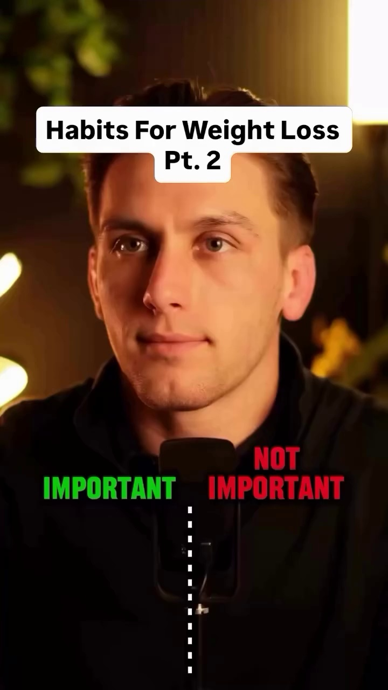
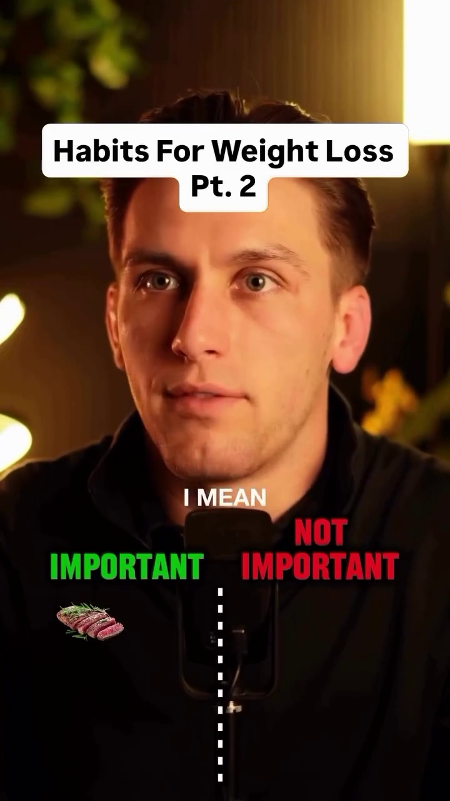
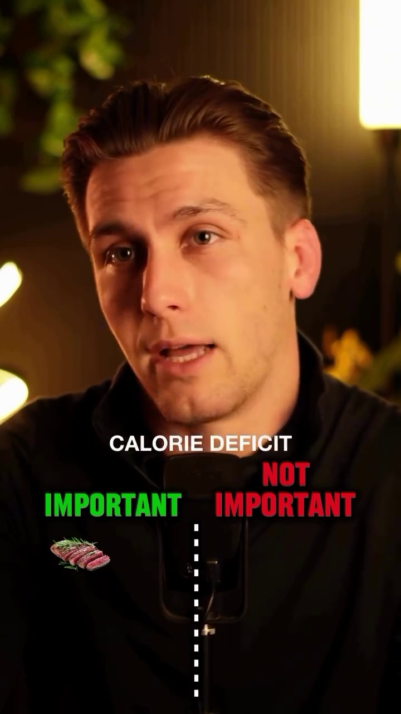
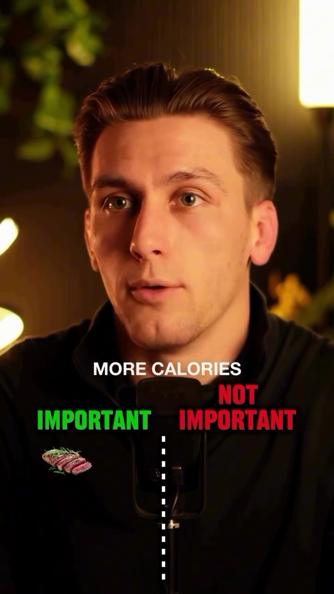
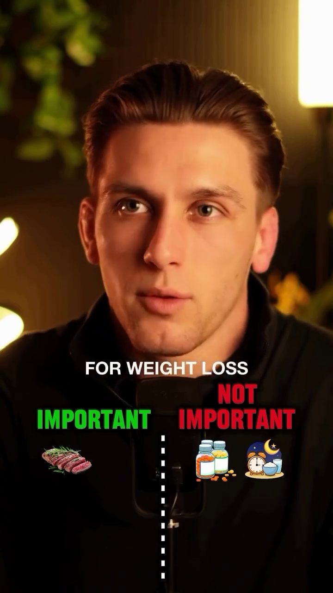
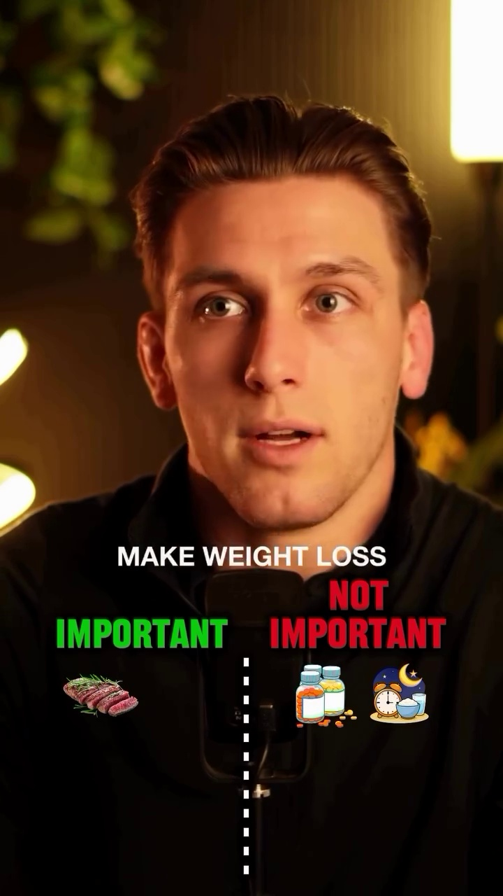
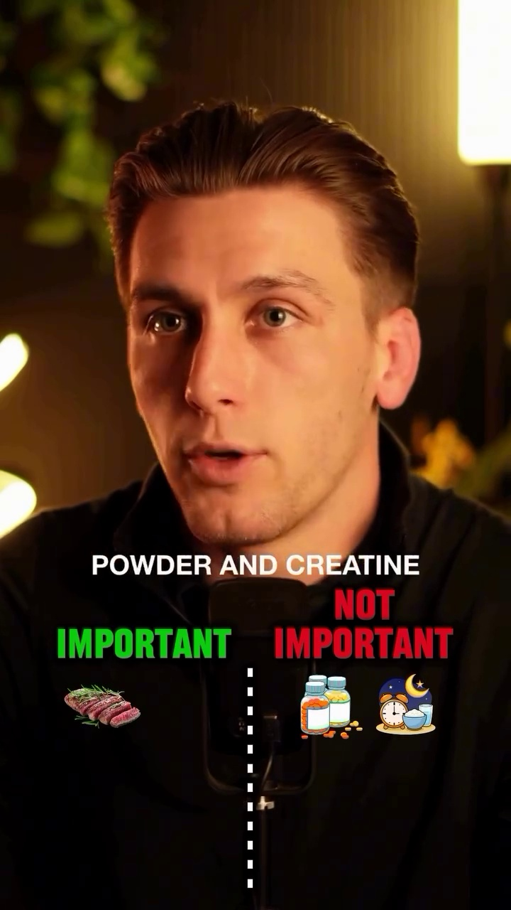
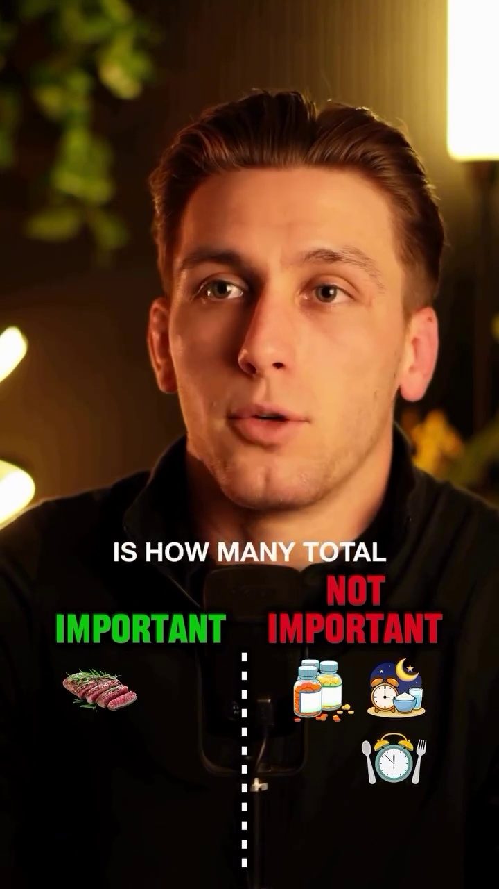
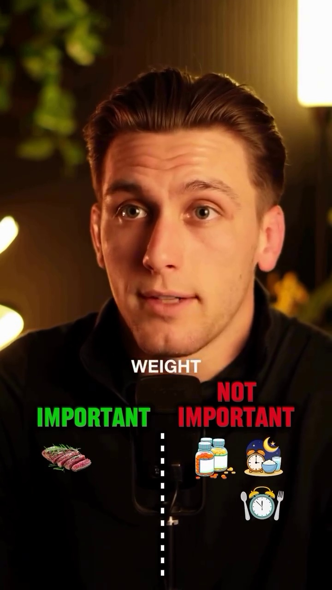
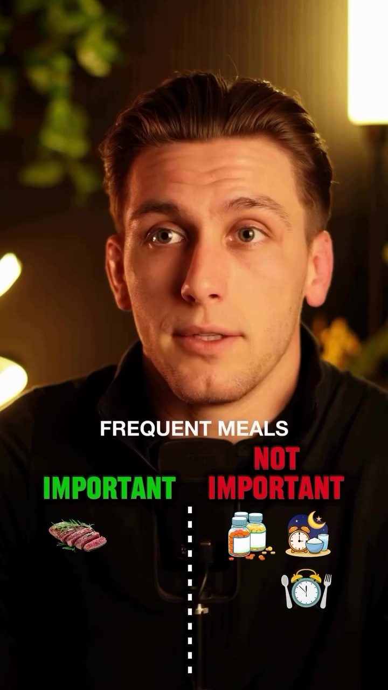

# Transcript and Frame Animations for format04_important_not_important

## **Transcript and Frame Animations**

* **0:00 - 0:05**
  * **Dialogue:** "add protein diet helps preserve muscle mass secondly it helps you feel"
  * **Frame Screenshots:**
    * 
    * 
    * 

* **0:05 - 0:10**
  * **Dialogue:** "weather for longer so that way you don't feel like you're starving yourself in a calorie deficit and it also has the high"
  * **Frame Screenshots:**
    * 
    * 

* **0:10 - 0:15**
  * **Dialogue:** "make a fat food meaning of burns more calories being digested than carbs are fats do not eat"
  * **Frame Screenshots:**
    * 
    * 
    * 

* **0:15 - 0:20**
  * **Dialogue:** "I mean unless eating late at night is specifically causing you to consum"
  * **Frame Screenshots:**
    * 
    * 

* **0:20 - 0:25**
  * **Dialogue:** "calories into Access I'm going to say this is not important when it comes to weight loss your body generally"
  * **Frame Screenshots:**
    * 
    * 
    * 

* **0:25 - 0:30**
  * **Dialogue:** "it just carries whether or not you"
  * **Frame Screenshots:**
    * 
    * 

* **0:30 - 0:35**
  * **Dialogue:** "doomed too many calories in total throughout the entire day"
  * **Frame Screenshots:**
    * 
    * 
    * 

* **0:35 - 0:40**
  * **Dialogue:** "usually not important for weight loss and most of the supplements out there that are branded as fat burn"
  * **Frame Screenshots:**
    * 
    * 

* **0:40 - 0:45**
  * **Dialogue:** "weight loss supplements specifically tend to have minimal efficacy really the only supplements that"
  * **Frame Screenshots:**
    * 
    * 
    * 

* **0:45 - 0:50**
  * **Dialogue:** "potentially make weight loss more achievable for you are the ones that help you maintain a calorie deficit and preserve"
  * **Frame Screenshots:**
    * 
    * 

* **0:50 - 0:55**
  * **Dialogue:** "so maybe a protein powder and creatine would be good options but there's still not required for you to"
  * **Frame Screenshots:**
    * 
    * 
    * 

* **0:55 - 1:00**
  * **Dialogue:** [No dialogue detected / Music only]
  * **Frame Screenshots:**
    * 
    * 

* **1:00 - 1:05**
  * **Dialogue:** "end of the day what matters is how many total calories that I have today if that number is more than you"
  * **Frame Screenshots:**
    * 
    * 
    * 

* **1:05 - 1:10**
  * **Dialogue:** [No dialogue detected / Music only]
  * **Frame Screenshots:**
    * 
    * 

* **1:10 - 1:15**
  * **Dialogue:** "with their typical hunger Cues and lifestyle but"
  * **Frame Screenshots:**
    * 
    * 
    * 

* **1:15 - 1:20**
  * **Dialogue:** [No dialogue detected / Music only]
  * **Frame Screenshots:**
    * 
    * 

* **1:20 - 1:25**
  * **Dialogue:** "not only simplest but easiest and most sustainable"
  * **Frame Screenshots:**
    * 
    * 
    * 

* **1:25 - 1:30**
  * **Dialogue:** "raise to increase your daily calorie output in a low impact manner it's extremely accessible just"
  * **Frame Screenshots:**
    * 
    * 

* **1:30 - 1:35**
  * **Dialogue:** [No dialogue detected / Music only]
  * **Frame Screenshots:**
    * 
    * 
    * 

* **1:35 - 1:40**
  * **Dialogue:** "500 extra calories burn which alone could be the entire calorie deficit that you need"
  * **Frame Screenshots:**
    * 
    * 

* **1:40 - 1:45**
  * **Dialogue:** [No dialogue detected / Music only]
  * **Frame Screenshots:**
    * 
    * 
    * 

* **1:45 - 1:50**
  * **Dialogue:** "still comes back to Total calories consumed in a day waiting to a deficit and whether or not you"
  * **Frame Screenshots:**
    * 
    * 

* **1:50 - 1:55**
  * **Dialogue:** "breakfast is generally a matter of personal preference and what works best for you"
  * **Frame Screenshots:**
    * 
    * 
    * 

* **1:55 - 2:00**
  * **Dialogue:** "use your schedule in your life but to be fair the Weight Control Registry has shown that people"
  * **Frame Screenshots:**
    * 
    * 

* **2:00 - 2:05**
  * **Dialogue:** "keep the weight off long-term do you have a tendency to eat breakfast regular so there is"
  * **Frame Screenshots:**
    * 
    * 
    * 

* **2:05 - 2:10**
  * **Dialogue:** "volume up to be made for important on that one"
  * **Frame Screenshots:**
    * 
    * 

* **2:10 - 2:15**
  * **Dialogue:** "all the data shows us that the more muscle mass you lose during a weight loss transformation not only are you"
  * **Frame Screenshots:**
    * 
    * 
    * 

* **2:15 - 2:20**
  * **Dialogue:** "likely to gain the weight back but the more total weight you are likely to gain back and resistance training is"
  * **Frame Screenshots:**
    * 
    * 

* **2:20 - 2:25**
  * **Dialogue:** "best exercise modality to not only preserve that muscle mass but even in some cases"
  * **Frame Screenshots:**
    * 
    * 
    * 

* **2:25 - 2:30**
  * **Dialogue:** [No dialogue detected / Music only]
  * **Frame Screenshots:**
    * 
    * 

* **2:30 - 2:34**
  * **Dialogue:** "when's training for Dummies the complete beginner's guide to building muscle strength and longevity"
  * **Frame Screenshots:**
    * 
    * 
    * 

