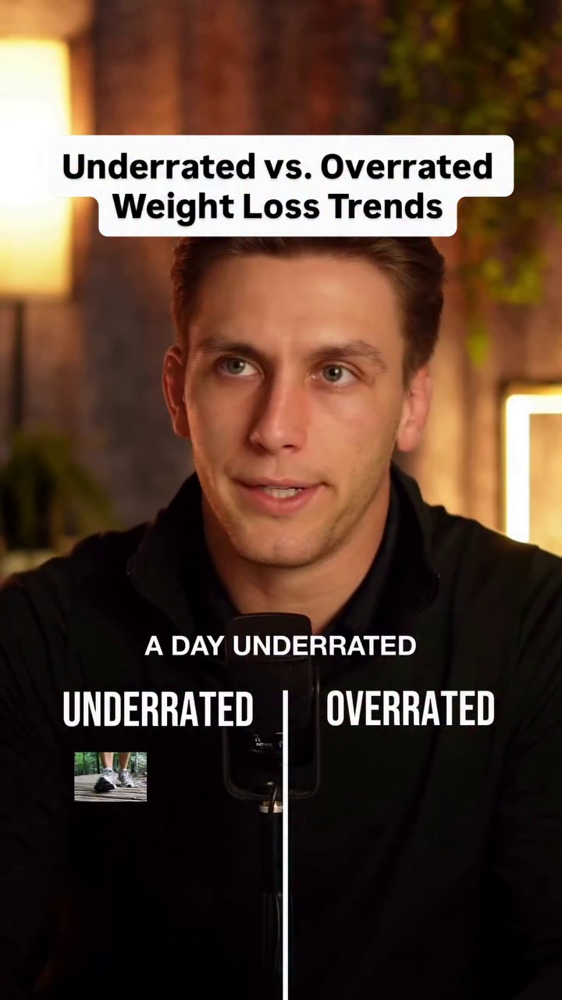
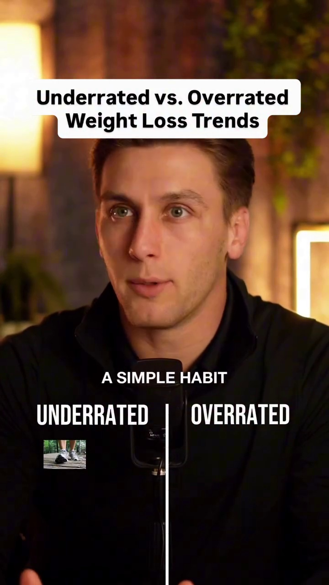

# Transcript and Frame Animations for format04_underrated_overrated

## **Transcript and Frame Animations**

* **0:00 - 0:05**
  * **Dialogue:** "10000 steps a day is such a simple habit to"
  * **Frame Screenshots:**
    * 
    * 
    * 

* **0:05 - 0:10**
  * **Dialogue:** "consuming for you try"
  * **Frame Screenshots:**
    * 
    * 

* **0:10 - 0:15**
  * **Dialogue:** "what's 6 to 8000 per day in adding a weighted vest"
  * **Frame Screenshots:**
    * 
    * 
    * 

* **0:15 - 0:20**
  * **Dialogue:** "operated because people overemphasize it in my opinion but I definitely don't hate it because it"
  * **Frame Screenshots:**
    * 
    * 

* **0:20 - 0:25**
  * **Dialogue:** "health benefits and can be a great tool for weight loss you just have to understand that it's not"
  * **Frame Screenshots:**
    * 
    * 
    * 

* **0:25 - 0:30**
  * **Dialogue:** "if you still consume too many calories within your eating window you will not lose weight"
  * **Frame Screenshots:**
    * 
    * 

* **0:30 - 0:35**
  * **Dialogue:** "overrated as well I love the high protein aspect of course but a true Carn"
  * **Frame Screenshots:**
    * 
    * 
    * 

* **0:35 - 0:40**
  * **Dialogue:** "I almost entirely removed fibre intake and lacks high volume foods which can make"
  * **Frame Screenshots:**
    * 
    * 

* **0:40 - 0:45**
  * **Dialogue:** "suggestion and Association a problem for long-term success while it may produce some short-term results"
  * **Frame Screenshots:**
    * 
    * 
    * 

* **0:45 - 0:50**
  * **Dialogue:** [No dialogue detected / Music only]
  * **Frame Screenshots:**
    * 
    * 

* **0:50 - 0:55**
  * **Dialogue:** "is the more muscle mass you lose while losing weight the more likely you are to gain the weight"
  * **Frame Screenshots:**
    * 
    * 
    * 

* **0:55 - 1:00**
  * **Dialogue:** "resistance training is the most surefire way to prevent muscle loss and in some cases even"
  * **Frame Screenshots:**
    * 
    * 

* **1:00 - 1:05**
  * **Dialogue:** "muscle while losing weight not to mention the plethora of other health and longevity benefits that come with it"
  * **Frame Screenshots:**
    * 
    * 
    * 

* **1:05 - 1:10**
  * **Dialogue:** "even if there is some evidence to suggest that they"
  * **Frame Screenshots:**
    * 
    * 

* **1:10 - 1:15**
  * **Dialogue:** "oils which the literature on that actually tends to favour"
  * **Frame Screenshots:**
    * 
    * 
    * 

* **1:15 - 1:20**
  * **Dialogue:** "what's the other facts when you equate calorie intake there is no significant difference in weight loss success"
  * **Frame Screenshots:**
    * 
    * 

* **1:20 - 1:25**
  * **Dialogue:** "efficacy for reducing"
  * **Frame Screenshots:**
    * 
    * 
    * 

* **1:25 - 1:30**
  * **Dialogue:** "which is the weight that you're actually trying to lose when dropping your weight so when you do a detox"
  * **Frame Screenshots:**
    * 
    * 

* **1:30 - 1:35**
  * **Dialogue:** "you're a cleansing drop a significant amount of weight on the scale is usually coming from a drop in water"
  * **Frame Screenshots:**
    * 
    * 
    * 

* **1:35 - 1:40**
  * **Dialogue:** [No dialogue detected / Music only]
  * **Frame Screenshots:**
    * 
    * 

* **1:40 - 1:45**
  * **Dialogue:** "I don't think they're overrated and I don't think they're underrated but I do think they're over"
  * **Frame Screenshots:**
    * 
    * 
    * 

* **1:45 - 1:50**
  * **Dialogue:** "arrived and not being properly paired with a high protein diet and resistance training obviously they"
  * **Frame Screenshots:**
    * 
    * 

* **1:50 - 1:55**
  * **Dialogue:** "Maiden will continue to make a huge dent in the obesity epidemic but you're seeing"
  * **Frame Screenshots:**
    * 
    * 
    * 

* **1:55 - 2:00**
  * **Dialogue:** "experienced significant muscle loss which is going to lead to a higher likelihood of weight"
  * **Frame Screenshots:**
    * 
    * 

* **2:00 - 2:05**
  * **Dialogue:** "and other long-term health concerns garp wants have a use case but I think most people don't actually need them"
  * **Frame Screenshots:**
    * 
    * 
    * 

* **2:05 - 2:10**
  * **Dialogue:** "set the first need a well Thought Out we lost strategy that considers the long-term and then if"
  * **Frame Screenshots:**
    * 
    * 

* **2:10 - 2:15**
  * **Dialogue:** "I want to pair that plan with a glp-1 then sure go for it"
  * **Frame Screenshots:**
    * 
    * 
    * 

* **2:15 - 2:20**
  * **Dialogue:** "I think AI is going to help a ton of people lose weight if used properly"
  * **Frame Screenshots:**
    * 
    * 

* **2:20 - 2:25**
  * **Dialogue:** "rapid fire decision-making of swapping an exercise during a"
  * **Frame Screenshots:**
    * 
    * 
    * 

* **2:25 - 2:30**
  * **Dialogue:** "are picking an order at a restaurant that aligns with their calorie protein goals or just"
  * **Frame Screenshots:**
    * 
    * 

* **2:30 - 2:35**
  * **Dialogue:** "sync the curveballs that life has a tendency to throw busy successful people like"
  * **Frame Screenshots:**
    * 
    * 
    * 

* **2:35 - 2:40**
  * **Dialogue:** "unpredictable schedules the key is choosing an AI model that is not just train"
  * **Frame Screenshots:**
    * 
    * 

* **2:40 - 2:45**
  * **Dialogue:** "general information but is trained on a specific proven framework that customises it's"
  * **Frame Screenshots:**
    * 
    * 
    * 

* **2:45 - 2:50**
  * **Dialogue:** "based on your specific situation if you want my personal AI clone to build you a custom"
  * **Frame Screenshots:**
    * 
    * 

* **2:50 - 2:53**
  * **Dialogue:** "strategy for free comment the word AI and I'll send you the link"
  * **Frame Screenshots:**
    * 
    * 

