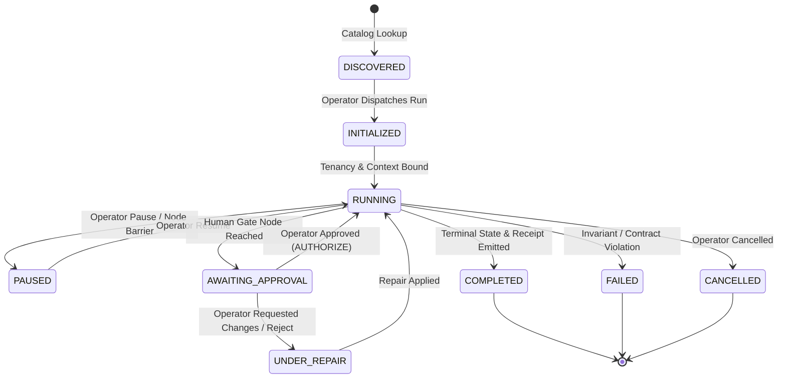

# Phase 1 — Programs + Artifacts + Chat Operator Contract

**Mandate ID:** `M08`  
**Status:** `RATIFIED_INVENTORY_AND_CONTRACTS_BASELINE`  
**Governing Authority:** `docs/CANONICAL_SKILL_AUTHORING_CONSTITUTION.md`, `docs/PRD/CURRENT.md` (v0.3.0), `00_CONTROL/05_PROGRAM_PACKAGE_AND_AGENT_CONVENTION.md`, `00_CONTROL/06_STATE_AND_HOOKS_MODEL.md`  
**Repository Revision:** `6d6e901d68907b0a4096c22d94e2895d956d7c9b`  
**Execution Date:** `2026-08-31`  

---

## 1. Executive Summary & Purpose

This contract establishes the formal specification governing how **Programs**, **Artifacts**, and **Chat / Supervision Interfaces** interact with the authoritative Conscious Activations Engine (CAE) state layer.

It enforces three non-negotiable architectural invariants:
1. **State Mutation Exclusivity**: The UI, Studio, and Chat interfaces are read projections and command dispatchers. Canonical state resides in CAE-authoritative storage and ledgers; state mutations occur exclusively through typed backend operations.
2. **Anti-Stale UI Guarantee**: Every operator mutation is guarded by optimistic concurrency controls (`state_version`, `expected_state_sha256`). A stale UI projection cannot mutate state or falsely claim completion.
3. **Lossless Artifact Lineage**: Every artifact rendered in the UI or exported down the pipeline maintains an unbroken cryptographic trace back to authenticated source evidence and signed receipt records.

---

## 2. Program Lifecycle State Machine & Event Semantics

### 2.1 Canonical State Machine



### 2.2 Lifecycle State Definitions

| State Name | State Semantics | Allowed Operator Actions | Required Invariants & Preconditions | Emitted Receipts |
|---|---|---|---|---|
| `DISCOVERED` | Program manifest and harness template registered in catalog; no execution instance created. | `RUN`, `INSPECT_TEMPLATE` | Manifest validates against schema; required skills/models available. | None |
| `INITIALIZED` | State aggregate instantiated in database; workspace tenancy bound; initial input parameters locked. | `CANCEL` | Valid tenant context; authenticated operator session. | `RECEIPT_PROGRAM_INITIALIZED` |
| `RUNNING` | Active node execution in progress; scheduler executing DAG across Agent Teams and flat Skills. | `PAUSE`, `CANCEL`, `INSPECT_LIVE` | Workspace RLS active; input contracts satisfied; pre-hooks pass. | `RECEIPT_NODE_DISPATCHED` |
| `PAUSED` | Execution paused safely at a node boundary; thread state checkpointed. | `RESUME`, `CANCEL`, `INSPECT_CHECKPOINT` | Previous node state fully committed to database. | `RECEIPT_PROGRAM_PAUSED` |
| `AWAITING_APPROVAL` | Execution reached a `HUMAN_GATE` node; candidate manifest or draft artifact ready for inspection. | `APPROVE`, `REJECT`, `REPAIR`, `INSPECT_CANDIDATES` | Candidate evaluation receipts complete; wrong-reading checks passed. | `RECEIPT_HUMAN_GATE_OPENED` |
| `UNDER_REPAIR` | Composition received revision directives or operator adjustments; waiting for revision compilation. | `APPLY_REVISION`, `CANCEL` | Valid revision payload; target layers identifiable. | `RECEIPT_REVISION_INITIATED` |
| `COMPLETED` | All workflow nodes executed successfully; terminal artifacts sealed and receipts verified. | `INSPECT_OUTPUT`, `EXPORT_AUDIT`, `SHIP` | All post-hooks passed; cryptographic lineage verified. | `RECEIPT_PROGRAM_COMPLETED` |
| `FAILED` | Execution aborted due to contract violation, timeout, or unrecoverable error. | `INSPECT_ERROR`, `RETRY_FROM_CHECKPOINT` | Failure log and diagnostic receipt persisted. | `RECEIPT_PROGRAM_FAILED` |
| `CANCELLED` | Execution explicitly terminated by operator command. | `INSPECT_TRACE` | Running processes terminated; partial state sealed. | `RECEIPT_PROGRAM_CANCELLED` |

---

## 3. Operator Control Action Protocol

The operator interacts with Programs through 8 deterministic action verbs:

### 3.1 `DISCOVER`
- **Purpose**: Query available Program definitions and Harness templates.
- **Backend Route**: `GET /api/campaigns/templates` & `GET /api/harnesses`
- **Authorization**: `OperatorRole >= VIEWER`
- **Payload / Response**: Returns list of `ProgramManifestSummary` objects.

### 3.2 `RUN`
- **Purpose**: Instantiate and start a Program execution for a given Workspace and Guest context.
- **Backend Route**: `POST /api/campaigns` & `POST /api/campaigns/{id}/start`
- **Authorization**: `OperatorRole >= OPERATOR`
- **Input Parameters**: `workspace_id`, `guest_id`, `program_id`, `harness_template_id`, `input_config`.
- **Precondition**: Workspace RLS context established; tenant quota validated.

### 3.3 `INSPECT`
- **Purpose**: Retrieve the full execution state, node graph, candidate manifests, scoring receipts, or artifact lineage.
- **Backend Route**: `GET /api/campaigns/{id}` & `GET /api/interviews/{id}`
- **Authorization**: `OperatorRole >= VIEWER`
- **Response Headers**: `X-CAE-State-Version`, `X-CAE-State-SHA256`, `X-CAE-Updated-At`.

### 3.4 `PAUSE`
- **Purpose**: Safely halt execution at the completion of the current executing node.
- **Backend Route**: `POST /api/campaigns/{id}/pause`
- **Authorization**: `OperatorRole >= OPERATOR`
- **Behavior**: Transitions status to `PAUSED`; emits `RECEIPT_PROGRAM_PAUSED`.

### 3.5 `RESUME`
- **Purpose**: Continue execution of a paused Program from its last validated node checkpoint.
- **Backend Route**: `POST /api/campaigns/{id}/resume`
- **Authorization**: `OperatorRole >= OPERATOR`
- **Precondition**: Verify `checkpoint_sha256` matches database state.

### 3.6 `APPROVE`
- **Purpose**: Authorize a candidate composition, interview brief, or production release at a `HUMAN_GATE`.
- **Backend Route**: `POST /api/campaigns/{id}/approve` & `POST /api/ship/ship`
- **Authorization**: `OperatorRole >= COMMANDER`
- **Behavior**: Emits `OperatorAccessGrant` signed receipt; dispatches downstream nodes.

### 3.7 `REJECT`
- **Purpose**: Reject candidate output with explicit typed routing (`RETURN_TO_HUNTER`, `RETURN_TO_ANALYST`, `RETURN_TO_COMPOSER`, `REQUEST_MORE_SOURCE`).
- **Backend Route**: `POST /api/campaigns/{id}/reject`
- **Authorization**: `OperatorRole >= COMMANDER`
- **Input Parameters**: `rejection_reason`, `disposition_route`, `feedback_notes`.

### 3.8 `REPAIR`
- **Purpose**: Modify an in-flight or completed composition via natural language revision or direct parameter adjustment.
- **Backend Route**: `POST /api/revisions/execute-revision`
- **Authorization**: `OperatorRole >= OPERATOR`
- **Allowed Tools**:
  - `studio.adjust_bbox`: Move spatial bounding boxes within text safe zones.
  - `studio.resize_bbox`: Scale bounding boxes while preserving anchor constraints.
  - `studio.trim_segment`: Adjust segment in/out points preserving word boundaries.
  - `studio.reorder_item`: Reorder narrative beats or carousel slides.
  - `studio.edit_text`: Update typographic copy or headline wording.
  - `studio.set_parameter`: Update harness-level scalar/boolean parameters.
  - `studio.select_candidate`: Override candidate selection with an alternative candidate.
  - `studio.apply_steering_recipe`: Apply structured prompt-steering adjustments.
  - `studio.request_semantic_revision`: Reroute semantic payload to AIR for recompilation.

---

## 4. Anti-Stale UI & Concurrency Control Protocol

To guarantee that stale browser tabs or out-of-date supervisor sessions cannot falsely report completion or corrupt execution state, all mutating API requests must follow the **Compare-And-Swap (CAS) Concurrency Protocol**:

1. **State Version Header Requirement**:
   - Every mutating request (`PUT`, `POST`, `PATCH` on campaign or program state) MUST supply:
     ```http
     If-Match-State-Version: <integer>
     If-Match-State-SHA256: <hex_sha256>
     ```
2. **Backend Concurrency Verification**:
   - The backend compares the client's `If-Match-State-Version` against `cae.state_aggregate.version`.
   - If `client_version != current_version` or `client_sha256 != current_sha256`:
     - The request is immediately rejected with HTTP `409 CONFLICT`.
     - Error payload:
       ```json
       {
         "error_code": "STALE_STATE_MUTATION_REJECTED",
         "message": "The Program state has been modified by another process or operator.",
         "current_state_version": 4,
         "current_state_sha256": "8a3f...",
         "timestamp": "2026-08-31T05:25:00Z"
       }
       ```
3. **UI Reactive Reconciliation**:
   - The UI supervisor layer must refresh state via WebSocket (`/api/pipeline-status`) or `GET /api/campaigns/{id}` before submitting new commands.

---

## 5. Artifact Lineage & Cryptographic Receipt Binding

Every artifact generated by a Program carries immutable cryptographic lineage metadata:

```json
{
  "artifact_id": "art-sem-prog-94827",
  "artifact_type": "SEMANTIC_PROGRAM",
  "program_id": "prog-editorial-1029",
  "workspace_id": "ws-conscious-01",
  "guest_id": "gst-audrey-02",
  "state_transition_id": "trn-88231",
  "source_evidence_spans": [
    {
      "segment_id": "seg-0012",
      "text_sha256": "3e9b...",
      "timecode_start_ms": 14200,
      "timecode_end_ms": 28400
    }
  ],
  "authorizing_receipt_ref": {
    "receipt_id": "rcpt-gate-appr-3392",
    "receipt_type": "HUMAN_GATE_APPROVAL",
    "sha256": "d4f1..."
  },
  "content_sha256": "5c7a...",
  "created_at": "2026-08-31T05:25:00Z"
}
```

- **Invariant**: No artifact is considered valid if its `authorizing_receipt_ref` cannot be resolved in the PostgreSQL `cae.receipt` table or its `source_evidence_spans` fail hash verification.

---

## 6. Chat Command & Natural Language Supervision Grammar

The Chat interface provides operators with a fast, keyboard-driven natural language control surface that maps directly to typed backend operations:

| Chat Command / Prompt Pattern | Target Backend Operation | Studio RPC / Tool Invoked | Authority Lane |
|---|---|---|---|
| `/discover [category]` | `GET /api/campaigns/templates` | `listHarnessCatalog` | `NOT_APPLICABLE_BY_RULE` |
| `/run <program_id> [args]` | `POST /api/campaigns` + `/start` | `startCampaignExecution` | `COMMANDER` |
| `/inspect <program_id>` | `GET /api/campaigns/{id}` | `buildControlTowerProjection` | `ANALYST` |
| `/pause [program_id]` | `POST /api/campaigns/{id}/pause` | `pauseCampaignExecution` | `COMMANDER` |
| `/resume [program_id]` | `POST /api/campaigns/{id}/resume` | `resumeCampaignExecution` | `COMMANDER` |
| `/approve [program_id]` | `POST /api/campaigns/{id}/approve` | `recordOperatorApproval` | `COMMANDER` |
| `/reject [program_id] <route> <reason>` | `POST /api/campaigns/{id}/reject` | `recordOperatorRejection` | `COMMANDER` |
| `/revise "<natural_language_prompt>"` | `POST /api/revisions/execute-revision` | `compileNaturalLanguageRevision` | `COMPOSER` |
| `/adjust <layer> <axis> <delta>` | `POST /api/revisions/execute-revision` | `studio.adjust_bbox` | `COMPOSER` |
| `/trim <segment_id> <in/out> <ms>` | `POST /api/revisions/execute-revision` | `studio.trim_segment` | `COMPOSER` |
| `/ship [program_id]` | `POST /api/ship/ship` | `evaluateShipRequest` | `COMMANDER` |
| `/export-audit [program_id]` | `GET /api/ship/audit-export` | `buildAuditExportManifest` | `ANALYST` |

---

## 7. Acceptance & Verification Standard

This contract is satisfied when:
1. Every operator action verb maps to a verified route in `api/routers/` or Studio RPC method.
2. Optimistic concurrency locks prevent stale mutations.
3. Every artifact schema enforces source evidence and receipt references.
4. Chat commands provide 100% functional parity with GUI supervisor operations.
