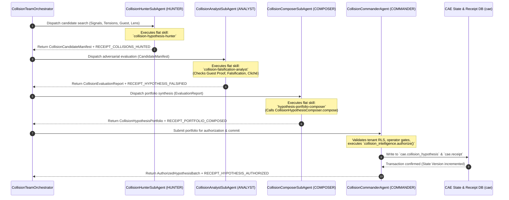

# Phase 1 — Agent Team / Delegation Reference Topology

**Mandate ID:** `CAE-M09`  
**Status:** `RATIFIED_INVENTORY_AND_CONTRACTS_BASELINE`  
**Governing Authority:** `docs/CANONICAL_SKILL_AUTHORING_CONSTITUTION.md`, `docs/PRD/CURRENT.md` (v0.3.0), `00_CONTROL/05_PROGRAM_PACKAGE_AND_AGENT_CONVENTION.md`, `00_CONTROL/17_PHASE1_AGENT_SKILL_OPERATION_OWNERSHIP_GRAPH.md`, `docs/cae/specs/current/SPEC-HYP-001_COLLISION_HYPOTHESIS.md`  
**Repository Revision:** `1b65889723e0eda405543e74a43304703307abca`  
**Execution Date:** `2026-08-31`  

---

## 1. Executive Summary & Purpose

This document specifies the authoritative **Agent Team & Delegation Reference Topology** for the Conscious Activation Engine (CAE), concrete and directly implementable in the Collision Discovery subsystem (`CAE-M03` / `SPEC-HYP-001`).

It establishes the concrete delegation mechanics, sub-agent spawning patterns, skill and tool permission envelopes, input/output contracts, and cryptographic receipt emission boundaries across the four constitutional Authority Lanes:
- `HUNTER` (Wide-aperture signal & analogy discovery)
- `ANALYST` (Adversarial critique, falsification & anti-slop gating)
- `COMPOSER` (Schema synthesis & portfolio compilation)
- `COMMANDER` (Governance, tenant RLS verification, operator gates & state seal)

---

## 2. Four-Lane Authority Separation Architecture

```
┌─────────────────────────────────────────────────────────────────────────────┐
│ 1. HUNTER LANE (Exploration & Signal Discovery)                             │
│    - Role: Wide-aperture multi-source exploration, signal acquisition.     │
│    - Invariant: May NOT evaluate validity, rewrite hypotheses, or authorize.│
└──────────────────────────────────────┬──────────────────────────────────────┘
                                       │ Emits Candidate Manifest
                                       ▼
┌─────────────────────────────────────────────────────────────────────────────┐
│ 2. ANALYST LANE (Adversarial Critique & Falsification)                      │
│    - Role: Falsification testing, anti-cliché gating, evidence grounding.  │
│    - Invariant: May NOT invent new signals, rewrite prose, or mutate state.  │
└──────────────────────────────────────┬──────────────────────────────────────┘
                                       │ Emits Evaluation Report
                                       ▼
┌─────────────────────────────────────────────────────────────────────────────┐
│ 3. COMPOSER LANE (Synthesis & Structuring)                                  │
│    - Role: Synthesizes validated elements into typed schema aggregates.     │
│    - Invariant: May NOT bypass analyst failures or authorize canonical state.│
└──────────────────────────────────────┬──────────────────────────────────────┘
                                       │ Emits Composed Portfolio
                                       ▼
┌─────────────────────────────────────────────────────────────────────────────┐
│ 4. COMMANDER LANE (Governance, State Mutation & Seal)                       │
│    - Role: Tenant verification, human operator gates, state & receipt seal. │
│    - Invariant: Mutation boundary; executes typed SQL/Python operations.     │
└─────────────────────────────────────────────────────────────────────────────┘
```

---

## 3. Collision Discovery Multi-Agent Sequence Topology



---

## 4. Detailed Agent Specifications & Permissions

### 4.1 Lane 1: `CollisionHunterSubAgent` (`HUNTER`)

- **Role & Scope:**  
  Discovers candidate multi-world intersections across:
  - World Signal ($W_1$): Cultural trend / metasearch signal (`RES-001`).
  - Audience Psyche ($W_2$): Acute tension / cognitive resistance (`AUD-001`).
  - Guest Authority ($W_3$): Lived biographical proof / resolved crisis (`GST-001`).
  - Oblique Lens ($W_4$): Cross-domain invariant / mental model (`LENS-xxx`).
- **Assigned Flat Canonical Skills:**  
  - `collision-hypothesis-hunter`
  - `searxng-signal-hunter`
- **Tool Permissions (Read-Only):**  
  - `tools.read_world_signal(signal_id)`
  - `tools.read_audience_profile(audience_id)`
  - `tools.read_guest_profile(guest_id)`
  - `tools.read_oblique_lens_catalog()`
  - *Prohibited:* Database mutation, state approval, or candidate filtering.
- **Input Contract:**  
  `CollisionHunterInput` (`workspace_id`, `guest_id`, `audience_id`, `search_topics`, `candidate_limit`).
- **Output Contract:**  
  `CollisionCandidateManifest` (Array of unverified candidate collisions, proposed relation types, bridge drafts).
- **Receipt Boundary:**  
  `RECEIPT_COLLISIONS_HUNTED` (`receipt_id`, `hunter_agent_id`, `input_hashes`, `candidate_count`, `manifest_sha256`).

---

### 4.2 Lane 2: `CollisionFalsificationAnalystSubAgent` (`ANALYST`)

- **Role & Scope:**  
  Adversarially critiques and stress-tests candidate hypotheses against constitutional gates:
  1. *Guest Lived Proof Gate*: Rejects ungrounded analogies lacking biographical evidence (`UngroundedAnalogyError`).
  2. *Explicit Falsification Condition Gate*: Rejects unfalsifiable claims (`MissingFalsificationError`).
  3. *Anti-Cliché & Trope Quarantine Gate*: Penalizes generic viral tropes (`ClicheTropeError`).
  4. *Vector Truth Fallacy Guard*: Rejects embedding proximity heuristics (`VectorTruthFallacyError`).
  5. *Low-Truth / AI Slop Gate*: Quarantines hypotheses where AI slop exceeds 0.60 (`LowTruthQuarantineError`).
- **Assigned Flat Canonical Skills:**  
  - `collision-falsification-analyst`
  - `source-anti-inflation-analyst`
- **Tool Permissions (Pure Evaluation):**  
  - `tools.verify_guest_citation(guest_id, citation_text)`
  - `tools.verify_evidence_references(urls_and_keys)`
  - `tools.evaluate_cliche_metrics(text)`
  - *Prohibited:* Creative rewriting, prose modification, database writing, operator authorization.
- **Input Contract:**  
  `CollisionCandidateManifest` + `GuestEvidenceArchive`.
- **Output Contract:**  
  `CollisionEvaluationReport` (Categorized `PASSED`, `REJECTED`, `QUARANTINED` items with diagnostic error objects).
- **Receipt Boundary:**  
  `RECEIPT_HYPOTHESIS_FALSIFIED` (`receipt_id`, `analyst_agent_id`, `input_manifest_sha256`, `passed_count`, `rejected_count`, `evaluation_report_sha256`).

---

### 4.3 Lane 3: `CollisionPortfolioComposerSubAgent` (`COMPOSER`)

- **Role & Scope:**  
  Synthesizes verified candidates into concrete, typed `CollisionHypothesis` domain entities and compiles a balanced editorial portfolio across relation types (`ANALOGY`, `INVERSION`, `PARADOX`, `SYSTEMS_LENS`, `COUNTER_POSITION`).
- **Assigned Flat Canonical Skills:**  
  - `hypothesis-portfolio-composer`
- **Tool Permissions (Pure Composition):**  
  - `cae_collision_intelligence.composer.CollisionHypothesisComposer.compose()`
  - `tools.format_portfolio_manifest()`
  - *Prohibited:* Overriding analyst failures, state writing, release approval.
- **Input Contract:**  
  `CollisionEvaluationReport` (Items with `status == PASSED`).
- **Output Contract:**  
  `CollisionHypothesisPortfolio` (`portfolio_id`, `workspace_id`, `guest_id`, `audience_id`, `items: List[CollisionHypothesis]`).
- **Receipt Boundary:**  
  `RECEIPT_PORTFOLIO_COMPOSED` (`receipt_id`, `composer_agent_id`, `evaluation_report_sha256`, `portfolio_sha256`, `hypothesis_count`).

---

### 4.4 Lane 4: `CollisionCommanderAgent` (`COMMANDER`)

- **Role & Scope:**  
  Governance and state mutation boundary. Validates workspace tenancy RLS, verifies cryptographic receipts from Lanes 1–3, coordinates operator Studio review if configured, and executes the deterministic PostgreSQL mutation.
- **Assigned Flat Canonical Skills:**  
  - `collision-gatekeeper`
  - `operator-studio-controller`
- **Tool Permissions (Deterministic Mutation Boundary):**  
  - `workspace_core.verify_tenant_context(workspace_id)`
  - `receipt_verifier.verify_chain([r1_hash, r2_hash, r3_hash])`
  - `collision_intelligence.authorize_hypothesis(hypothesis_id, operator_session)`
  - SQL Transactions: Insert into `cae.collision_hypothesis`, insert into `cae.receipt`.
  - *Prohibited:* Unsupervised mutation when `HUMAN_GATE` policy is active.
- **Input Contract:**  
  `CollisionHypothesisPortfolio` + `OperatorAuthSession`.
- **Output Contract:**  
  `AuthorizedHypothesisBatch` (Database IDs, state version, receipt lineage).
- **Receipt Boundary:**  
  `RECEIPT_HYPOTHESIS_AUTHORIZED` (`receipt_id`, `commander_agent_id`, `operator_id`, `portfolio_sha256`, `transaction_id`, `state_version`).

---

## 5. Sub-Agent Delegation & Execution Contracts

1. **Ephemeral Specialist Contexts**:
   - Sub-agents are spawned on-demand for specific bounded tasks.
   - Sub-agents maintain zero persistent state across workflow runs.
2. **Strict Invariant Inheritance**:
   - Sub-agents inherit workspace tenancy (`workspace_id`) and fail closed on tenant context mismatches.
   - Sub-agents operate with least-privilege toolsets restricted to their authority lane.
3. **Structured Handoff**:
   - Inter-lane communication uses typed Pydantic models with schema validation on entry and exit.
4. **Flat Skill Composition**:
   - Zero skill-to-skill invocation. Skills remain flat transformations invoked exclusively by the orchestrator or agent runner.

---

## 6. Verification & Invariant Proof

- **Authority Separation:** Enforced by `WorkflowRole` enum (`HUNTER`, `ANALYST`, `COMPOSER`, `COMMANDER`).
- **Gate Enforcement:** Verified by `tests/collision_intelligence/test_collision_adversarial_cases.py`.
- **State Lineage:** Every authorized record links back to `RECEIPT_COLLISIONS_HUNTED`, `RECEIPT_HYPOTHESIS_FALSIFIED`, and `RECEIPT_PORTFOLIO_COMPOSED`.
