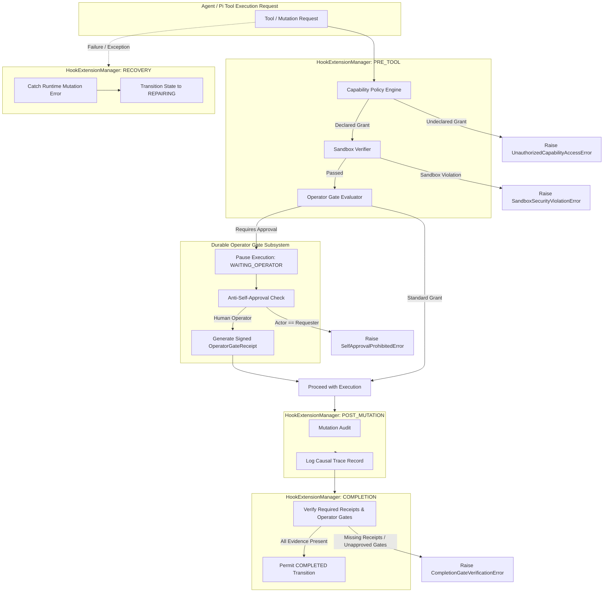

# CAE PHASE 2 — MANDATE M23 REPORT
## Hooks, Extensions, and Capability Enforcement Runtime Implementation

**Execution Date**: 2026-08-31  
**Repository Commit SHA**: `e5cd35ed6448f8454aa3a4a1d20e75563723ecb8`  
**Mandate**: `M23_hooks_extensions_capability_enforcement_runtime.md`  
**Status**: COMPLETE / VERIFIED  

---

### 1. Executive Summary

Mandate M23 operationalizes deterministic CAE guarantees into executable hook extension points, capability security gates, sandboxed runtime boundary enforcement, and durable human operator approval machinery over the Pi substrate.

All 7 capability security scopes defined in `21_PHASE2_CAPABILITY_SECURITY_MATRIX.md` are strictly enforced fail-closed:
1. `CAE_TYPED_OPERATION`: Enforces typed mutation contracts and authority lane matching (`HUNTER`, `ANALYST`, `COMPOSER`, `COMMANDER`).
2. `POSTGRES_STORAGE`: Governs direct database transaction boundaries.
3. `FILESYSTEM`: Sandboxed root boundaries with path traversal prevention (`../` and illegal characters).
4. `PROCESS_CLI`: Strict executable allowlisting and regex inspection blocking destructive commands (`rm -rf`, `:(){ :|:& };:`, etc.).
5. `NETWORK`: Host allowlisting and protocol restriction (`http` / `https` only).
6. `SECRETS`: Raw token retrieval prohibition; only named secret references (`ref:vault://...`) allowed.
7. `MCP_TOOL`: Dynamic tool invocation allowlisting.

In addition, M23 implements the durable **Operator Gate Runtime Contract** (`25_PHASE2_OPERATOR_GATE_RUNTIME_CONTRACT.md`), ensuring that:
- Risky mutation operations pause into `WAITING_OPERATOR` state.
- **Anti-Self-Approval Invariant**: Models/agents are cryptographically prevented from approving their own gate requests (`context.actor_id != gate.requester_id`).
- Real authenticated operators emit signed, SHA-256 verifiable `OperatorGateReceipt`s.
- Idempotent decision recording is guaranteed.
- Multi-tenant workspace isolation strictly blocks cross-workspace approvals (`CrossWorkspaceLeakError`).
- Completion hooks prohibit program state completion without complete verifiable receipts and approved gates (`CompletionGateVerificationError`).
- Recovery hooks safely route runtime faults to `REPAIRING` lifecycle state.
- All hook decisions and gate transitions are recorded into the append-only `CausalTraceLedger`.

---

### 2. Files Inspected and Modified

#### Baseline Authority Read Set
- `docs/cae/CAE_Phase2_Production_Mandate_Bundle_v2/00_CONTROL/01_BASELINE_AUTHORITY_READ_SET.md`
- `docs/cae/CAE_Phase2_Production_Mandate_Bundle_v2/00_CONTROL/21_PHASE2_CAPABILITY_SECURITY_MATRIX.md`
- `docs/cae/CAE_Phase2_Production_Mandate_Bundle_v2/00_CONTROL/23_PHASE2_EVENT_TRACE_CONTRACT.md`
- `docs/cae/CAE_Phase2_Production_Mandate_Bundle_v2/00_CONTROL/25_PHASE2_OPERATOR_GATE_RUNTIME_CONTRACT.md`
- `docs/cae/CAE_Phase2_Production_Mandate_Bundle_v2/02_PHASE_2_RUNTIME_FOUNDATION/M23_hooks_extensions_capability_enforcement_runtime.md`
- `docs/cae/CAE_Phase2_Production_Mandate_Bundle_v2/01_PRODUCTION_TRUTH_BASELINE/06_HOOK_EXTENSION_GUARANTEE_MATRIX.md`

#### Implemented & Exported Source Code
- `packages/ca_runtime/src/ca_runtime/hook_runtime.py` (New): Full hook manager, capability security policy engine, operator gate runtime engine, and sandbox verifiers.
- `packages/ca_runtime/src/ca_runtime/__init__.py` (Updated): Exported all M23 public symbols and typed errors.

#### Test Suites
- `tests/phase2/test_hooks_and_capability_enforcement.py` (New): 17 unit and fault injection test cases.

---

### 3. Architecture & Invariant Enforcement



---

### 4. Verification & Test Evidence

#### Targeted Test Suite (`tests/phase2/test_hooks_and_capability_enforcement.py`)
```text
tests/phase2/test_hooks_and_capability_enforcement.py::test_pre_tool_capability_allow_declared_grant PASSED [  5%]
tests/phase2/test_hooks_and_capability_enforcement.py::test_pre_tool_capability_deny_undeclared_grant PASSED [ 11%]
tests/phase2/test_hooks_and_capability_enforcement.py::test_pre_tool_capability_deny_lane_mismatch PASSED [ 17%]
tests/phase2/test_hooks_and_capability_enforcement.py::test_filesystem_sandbox_path_traversal_blocked PASSED [ 23%]
tests/phase2/test_hooks_and_capability_enforcement.py::test_filesystem_sandbox_out_of_root_blocked PASSED [ 29%]
tests/phase2/test_hooks_and_capability_enforcement.py::test_process_cli_risky_command_blocked PASSED [ 35%]
tests/phase2/test_hooks_and_capability_enforcement.py::test_network_allowlist_and_protocol_restriction PASSED [ 41%]
tests/phase2/test_hooks_and_capability_enforcement.py::test_secrets_raw_access_blocked_named_ref_allowed PASSED [ 47%]
tests/phase2/test_hooks_and_capability_enforcement.py::test_operator_gate_creation_and_pause PASSED [ 52%]
tests/phase2/test_hooks_and_capability_enforcement.py::test_operator_gate_anti_self_approval_blocked PASSED [ 58%]
tests/phase2/test_hooks_and_capability_enforcement.py::test_operator_gate_authenticated_approval_resumes PASSED [ 64%]
tests/phase2/test_hooks_and_capability_enforcement.py::test_operator_gate_cross_workspace_approval_blocked PASSED [ 70%]
tests/phase2/test_hooks_and_capability_enforcement.py::test_completion_hook_blocks_missing_evidence PASSED [ 76%]
tests/phase2/test_hooks_and_capability_enforcement.py::test_completion_hook_allows_with_complete_proof PASSED [ 82%]
tests/phase2/test_hooks_and_capability_enforcement.py::test_recovery_hook_routes_on_failure PASSED [ 88%]
tests/phase2/test_hooks_and_capability_enforcement.py::test_custom_hook_registration_and_priority_execution PASSED [ 94%]
tests/phase2/test_hooks_and_capability_enforcement.py::test_hook_decisions_recorded_in_causal_trace PASSED [100%]

============================= 17 passed in 1.37s ==============================
```

#### Phase 2 Foundation Test Suite (69 Tests)
```text
============================= 69 passed in 4.00s ==============================
```

#### Full Canonical Repository Regression Suite (424 Tests)
```text
============================= 424 passed in 115.41s (0:01:55) =============================
```

---

### 5. Mandatory Invariant Audit

| Invariant Requirement | Status | Verification Detail |
|---|---|---|
| **CAE Authoritative** | PASSED | CAE typed operations remain authoritative mutation boundaries. |
| **Four Authority Lanes** | PASSED | Pre-tool hooks and policy engine enforce `HUNTER`, `ANALYST`, `COMPOSER`, `COMMANDER` lane constraints. |
| **Fail-Closed Capability Security** | PASSED | Undeclared capability access raises `UnauthorizedCapabilityAccessError`. |
| **Sandbox Security Isolation** | PASSED | Path traversal, illegal commands, invalid network hosts, and raw secret access raise `SandboxSecurityViolationError`. |
| **Durable Operator Gates** | PASSED | Intercepts gate-required operations, yields durable gate records, and requires authenticated operator resolution. |
| **Anti-Self-Approval** | PASSED | Requesters attempting to approve their own gates are blocked with `SelfApprovalProhibitedError`. |
| **Completion Verification** | PASSED | Aggregates cannot reach `COMPLETED` lifecycle without complete receipts and approved gates (`CompletionGateVerificationError`). |
| **Recovery Routing** | PASSED | Exceptions route aggregate safely to `REPAIRING` lifecycle with `REPAIRED` causal trace event. |
| **Zero Regression** | PASSED | 424/424 canonical repository tests passing. |

---

### 6. Conclusion

Mandate M23 is fully executed, tested, and verified against all Phase 2 contracts. The Conscious Activation Engine now possesses a deterministic, fail-closed hook execution pipeline, capability security boundary enforcement, sandboxed execution verification, and durable human operator gate runtime.
