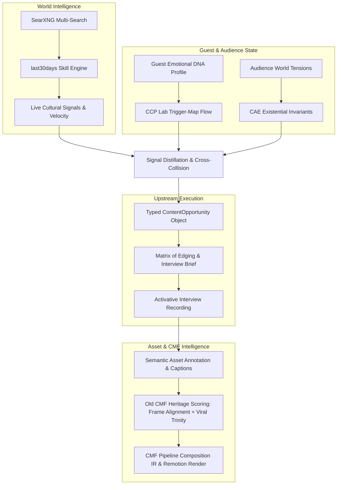

# Video Editing Syntax Research

**User:** Anonymous  
**Created:** 8/14/2026 14:25:21  
**Updated:** 8/28/2026 8:48:31  
**Exported:** 8/28/2026 8:59:52  
**Link:** [https://chatgpt.com/c/6a7f0925-0154-83eb-b897-fa98c0411692](https://chatgpt.com/c/6a7f0925-0154-83eb-b897-fa98c0411692)  

## Response:
8/27/2026, 5:07:19 AM

I’m checking the repository again at the current `main` state, with special attention to whether the production-convergence gap I identified has actually been closed.

> **Searching the web**
>
> [[P2][trust] Enforce numerical V&V of the solve loop in CI (real-ccx golden results) · Issue #373 · armpro24-blip/cad-cae-copilot · GitHub](https://github.com/armpro24-blip/cad-cae-copilot/issues/373)
>
> **Searched 1 website**
>
> 
>
> **Searching the web**
>
> [Atlas Phase 9 — Systems registry migration (7 tables + view, RLS workspace-scoped, idempotent). Paste into Supabase Studio SQL editor. · GitHub](https://gist.github.com/Tegath/7c33afc32180b2ad95a23e2a59d6cd7c)
> [GitHub - luisroquette/social-machine-for-all: Open-source, self-hosted content operations system for teams: discover, create, review, publish and learn — with your brand and data in control. · GitHub](https://github.com/luisroquette/social-machine-for-all)
>
> **Searched 2 websites**
>
> 
>
> Worked for 19s

Yes - **“now” changes the picture somewhat, but not enough to change the fundamental launch conclusion.**

I re-checked the current `main` repository today. The CAE architecture has clearly advanced, and the repository now has a much stronger separation between constitutions, FRs, Tech Specs, implementation evidence, runbooks, and authoring skills. ([GitHub](https://github.com/Remjohn/consciousactivation/tree/main/docs/cae))

However, the **actual application runtime is still not fully converged onto the CAE/PostgreSQL architecture**.

The clearest evidence is `api/main.py`: the live FastAPI application still initializes the main Pipeline, AIR, VAE, Interview Expression, Campaigns, Builder, and Interview Composer services against local SQLite paths such as `pipeline.db`, `air.db`, `vae.db`, `interview.db`, `campaigns.sqlite3`, `builder.db`, and `interview_composer.db`. ([GitHub](https://github.com/Remjohn/consciousactivation/blob/main/api/main.py))

And `ca_runtime` itself still explicitly describes itself as a **development-only** runtime and says that it does not implement the full Activative Intelligence, Harness execution, Interview understanding, media rendering, VAE production, or production infrastructure. ([GitHub](https://github.com/Remjohn/consciousactivation/tree/main/packages/ca_runtime))

So my updated assessment is:

## What is genuinely stronger now

The **architecture/control plane is substantially more mature**.

You now have a serious CAE documentation and governance topology:

```text
constitutions
authoring skills
specs / FRs
tech specs
runbooks
state
evaluations
implementation evidence
```

That is no longer “architecture ideas sitting in Markdown.” The repository has explicit implementation and evidence artifacts for the tenant slice, state/control work, migrations, E3 testing, acceptance, topology, and first-slice runtime. ([GitHub](https://github.com/Remjohn/consciousactivation/tree/main/docs/cae/implementation))

The FR layer is also properly decomposed. The tenant/Guest implementation requirements are now explicit rather than implicit. ([GitHub](https://github.com/Remjohn/consciousactivation/tree/main/docs/cae/specs/fr))

And the Tech Spec package is no longer merely prose: it includes the concrete operation/transition contracts, implementation allowlist, risk/rollback register, and test/proof plan. ([GitHub](https://github.com/Remjohn/consciousactivation/tree/main/docs/cae/tech_specs))

That is a **real improvement**.

---

# What is still the bottleneck

The bottleneck is now much more specific:

> **The CAE control plane has advanced faster than the product runtime integration plane.**

You effectively have:

```text
        CAE GOVERNANCE
             ✅
        CAE CONSTITUTIONS
             ✅
        CAE FRs
             ✅
        CAE TECH SPECS
             ✅
        CAE STATE / RECEIPTS
             ✅
        CAE E3 PROOF
             ✅
              │
              ▼
      ───────────────────
       INTEGRATION GAP
      ───────────────────
              │
              ▼
        EXISTING APP
              │
        SQLite services
        existing routers
        existing product flows
```

And this is not theoretical: the current FastAPI bootstrap still wires those legacy/local persistence paths directly. ([GitHub](https://github.com/Remjohn/consciousactivation/blob/main/api/main.py))

So I would **not** interpret the current repository as “CAE is ready for production.”

I would interpret it as:

> **CAE has reached the point where production convergence can now be executed against a sufficiently mature architectural authority.**

That is a much better position than before.

---

# The important correction to my previous recommendation

I previously suggested another general production-convergence gate.

After seeing the current repository, I would narrow it further.

You do **not** need another broad architecture exercise.

You need a **Runtime Convergence Program**.

The question is no longer:

> “Have we designed CAE correctly?”

The question is:

> “Which existing user journey will become the first real CAE-controlled production journey, and what exact legacy services must be subordinated to it?”

That is a much smaller and more actionable problem.

---

# I would now freeze these layers

I would treat the following as **not to be casually redesigned during the launch push**:

```text
Object Constitutions
SDA/SFL registries
Scope & Authority model
PostgreSQL state doctrine
Receipt/evidence doctrine
FR authoring system
Tech-Spec protocol
Reality-contact evaluation model
```

The repository already contains evidence that those layers have gone through explicit review and implementation work. ([GitHub](https://github.com/Remjohn/consciousactivation/tree/main/docs/cae/implementation))

Do not reopen them merely because the production runtime has not yet caught up.

---

# What I would attack next

The path should now be:

```text
EXISTING APPLICATION
       ↓
IDENTIFY FIRST USER JOURNEY
       ↓
CA EQUIVALENT CONTRACT
       ↓
POSTGRES AUTHORITY
       ↓
TYPED CAE OPERATION
       ↓
STATE / EVENT
       ↓
RECEIPT
       ↓
REAL UI
       ↓
PRODUCTION E2E TEST
       ↓
CANARY
       ↓
LAUNCH
```

And then expand.

I would **not** attempt to migrate the entire application from SQLite to PostgreSQL before launching.

The current repository itself gives us a reason to be careful: the application contains several independent services with their own storage assumptions. ([GitHub](https://github.com/Remjohn/consciousactivation/blob/main/api/main.py))

So the right brownfield strategy is:

**one production journey at a time, one authority boundary at a time.**

---

# One thing I would explicitly NOT do

I would not declare:

> “SQLite is obsolete.”

That would be premature.

The evidence currently supports something more precise:

> SQLite remains part of the existing brownfield runtime; CAE/PostgreSQL is the target authority for the new CAE operational plane; individual aggregates must be promoted through explicit migration/cutover contracts.

That is consistent with the repository's own development-only `ca_runtime` posture. ([GitHub](https://github.com/Remjohn/consciousactivation/tree/main/packages/ca_runtime))

---

# My current launch assessment

| Area | Current assessment |
|---|---|
| CAE ontology / constitutions | **Strong / substantially established** |
| Authoring governance | **Strong** |
| FR layer | **Strong for first tenant slice** |
| Tech-Spec discipline | **Strong** |
| PostgreSQL CAE foundation | **Established for bounded slice** |
| State / transition / receipts | **Established for bounded slice** |
| E3 / adversarial evidence | **Meaningfully established** |
| Existing product runtime | **Still brownfield / mixed authority** |
| Full CAE integration | **Not finished** |
| Production readiness | **Not yet demonstrated** |
| Best next move | **Runtime convergence on one user journey** |

The repository currently has **127 commits**, and the CAE documentation tree is now extensive enough that the architecture is no longer the primary uncertainty. ([GitHub](https://github.com/Remjohn/consciousactivation))

### Bottom line

**I would proceed toward production now - but I would stop expanding the architecture and start converging the runtime.**

The remaining work is not “write more philosophy.”

It is:

```text
CAE contracts
→ existing application
→ PostgreSQL authority
→ real user journey
→ real evidence
→ real receipts
→ real production deployment
```

That is the bridge that is still incomplete.

---

**Sources:**

- [consciousactivation/docs/cae at main · Remjohn/consciousactivation · GitHub](https://github.com/Remjohn/consciousactivation/tree/main/docs/cae)

## Prompt:
8/27/2026, 5:10:33 AM

Read at the implmentation progress but please consider that by captioning I meant captioning specific Assets we may reuse in the future for editing 

These assets maybe specific quotes, images, clips and snippets... 
So as you do when you want to finetune a model you take data samples and caption them 

Is really important to have the mindset that everything we put in as asset or produce as a asset need proper, intelligent, contextualized, legal, ID ref, Captions so that they might potentially be dataset for future Model training or finetuning or just having the ontology and taxonomy right really help to keep things in order 

You know what I'm saying? 

More importantly I would like to pay attention to our previous and existing quotes scoring and clustering system... we used to use it in the old CMF as a way of deciding which where the best quotes or narrative beats that were more likely to go viral... and then from there we built the scripts... 

THE IS OUR OLD INTELLIGENCE I put together a folder with old archive files about the Cmf process and some of the new current process 
inside here D:\Work\consciousactivation\Conscious Activation Engine Brownfield\OLD CMF intelligence

It's true that now we have a completely advanced intelligence and ontology so I was just thinking how we could or if we should consider this method or what could be a better alternatives

THE OLD CMF is properly defined if you read this folder properly you will understand why it's important in this current crucial phase that we need to decide how the pipeline goes

[Attachment: Pasted markdown(5).md]

## Response:
8/27/2026, 5:10:36 AM

Yes, I understand the distinction you’re making: **captioning is not merely media accessibility metadata; it is semantic labeling of reusable evidence/assets so the asset itself can become future training and retrieval material.** I’m checking whether the current implementation preserves that idea and how the old CMF scoring machinery can be carried forward without becoming a competing ontology.

> **Searching the web**
>
> [GitHub - dushaobindoudou/prism: Local-first market intelligence and research-control workspace for social signals, LLM reasoning, and market-data verification. · GitHub](https://github.com/dushaobindoudou/prism)
>
> **Searched 1 website**
>
> 
>
> **Searching the web**
>
> [consciousactivation/Conscious Activation Engine Brownfield/OLD CMF intelligence/06_schemas at main · Remjohn/consciousactivation · GitHub](https://github.com/Remjohn/consciousactivation/tree/main/Conscious%20Activation%20Engine%20Brownfield/OLD%20CMF%20intelligence/06_schemas)
>
> **Searched 1 website**
>
> 
>
> Worked for 21s

Yes. And I think this is an important correction to the way we should think about the **CMF handoff**.

What you are describing is not ordinary “captioning.” It is **semantic asset annotation**: turning a reusable media/evidence object into a typed, contextualized, attributable unit that can later participate in retrieval, composition, evaluation, and potentially training data construction.

The current repository is already moving in that direction: the new Guest/Asset UI makes `CAPTION_TRACK` a first-class asset and links it to an `INTERVIEW_RECORDING`; the package inspector exposes context class, citations, size, and SHA-256; and the ingestion path is explicitly preserving source identity and integrity. `Pasted markdown.md` That is good infrastructure, but it is **not yet the full semantic captioning system you are describing**.

## The important distinction

I would split the concept into four different things:

```text
MEDIA ASSET
    ↓
ASSET CAPTION / SEMANTIC ANNOTATION
    ↓
ASSET EVALUATION
    ↓
ASSET RETRIEVAL / COMPOSITION
```

A media object answers:

> “What file is this?”

A caption should answer:

> “What does this particular asset contain, mean, express, and make possible?”

Evaluation answers:

> “How valuable is this asset for a particular purpose?”

Retrieval answers:

> “Under which semantic conditions should this asset be considered?”

That is a much richer object.

### Example

A 7-second clip of a coach saying:

> “I realized I wasn't tired from the work. I was tired from being responsible for everybody.”

The **asset record** should know:

```text
asset_id
source_media_id
timecode
speaker
workspace
provenance
hash
```

But the **semantic caption** could additionally encode:

```text
semantic_role: RECOGNITION
tension: OVER_RESPONSIBILITY
existential_invariants:
  - belonging
  - identity
  - sacrifice

emotional_register:
  - exhaustion
  - recognition

narrative_function:
  - revelation
  - turning_point

primitive_affinity:
  - PRM-...

archetypal_affinity:
  - ...

sfl_affinity:
  - ...

audience_relevance:
  ...

viral_potential:
  ...

visual_potential:
  ...

reusability:
  ...

exact_transcript:
  ...

context:
  ...

source_confidence:
  ...
```

Now the clip is no longer “video.”

It becomes a **semantic component** the system can discover later.

---

# And this is where the old CMF intelligence becomes extremely relevant

I looked through the archived CMF system you added to the repository.

It is absolutely worth preserving as a **predecessor intelligence substrate**, not as a competing architecture.

The archive contains an entire scoring ecosystem rather than a single “viral score”: Viral Trinity, frame alignment, visual hooks, sonic arcs, scene-builder intelligence, quality-gap analysis, score logging, and individual scoring rubrics. ([GitHub](https://github.com/Remjohn/consciousactivation/tree/main/Conscious%20Activation%20Engine%20Brownfield/OLD%20CMF%20intelligence/03_scoring_frameworks))

The Viral Trinity rubric is particularly revealing because it decomposes story potential into:

- surprise
- emotional intensity
- specificity
- universal appeal

and then separately scores production readiness through visual specificity, sonic clarity, asset availability, and character consistency. ([GitHub](https://github.com/Remjohn/consciousactivation/blob/main/Conscious%20Activation%20Engine%20Brownfield/OLD%20CMF%20intelligence/03_scoring_frameworks/intelligence_frameworks_viral_trinity_scoring.md))

That is **very compatible** with what we are now building.

But it needs to be relocated.

---

# I would NOT put the old Viral Trinity score back into CAE as the master score

That would be the wrong architectural move.

The old system implicitly asked:

> “Will this make good content?”

The new CAE should ask several different questions:

```text
1. Is the underlying meaning real?
2. Is the tension actually alive?
3. Is the guest/audience relationship congruent?
4. What transformation is possible?
5. What perceptual realization is strongest?
6. How valuable is this particular asset?
7. How likely is it to perform?
```

Those are different dimensions.

So instead of:

```text
ViralScore = 54
```

I would eventually want something closer to:

```text
SemanticIntegrityProfile
ResonanceProfile
AssetProductionProfile
NarrativeUtilityProfile
PerceptualProfile
DistributionPotentialProfile
```

And then perhaps a **derived ranking function** depending on the job.

That is much more powerful.

---

# The old Frame Alignment system is even more important

This line in the old system is architecturally excellent:

> “A 10/10 funny quote that contradicts the Frame is a 0/10 for the script.”

([GitHub](https://github.com/Remjohn/consciousactivation/blob/main/Conscious%20Activation%20Engine%20Brownfield/OLD%20CMF%20intelligence/03_scoring_frameworks/frame_alignment_scoring.md))

That is basically an early form of what we now call **semantic directional integrity**.

The old system already understood:

```text
local quality ≠ global suitability
```

A quote can be brilliant in isolation and wrong for the semantic program.

That maps almost perfectly onto:

```text
Asset Quality
       ×
Contextual Fitness
       ×
Semantic Direction
       ×
Composition Role
```

So I would preserve that principle almost intact.

---

# The biggest upgrade CAE gives the old CMF

The old CMF system scored an asset mostly according to:

```text
surprise
emotion
specificity
universality
production readiness
```

CAE now has additional upstream context:

```text
Audience World
Guest World
Contextual State
Tension / Webhook
Existential Invariant
Representation Geometry
Guest/Audience Congruence
Primitive Coalition
Edge
Archetype
SFL
```

Therefore the asset score can become **context-dependent**.

The same quote could be:

```text
Asset intrinsic quality       8.7
Audience fit                  9.4
Current tension relevance     9.8
Current mood fitness          4.1
Archetype fitness              8.9
Semantic direction             9.6
Production readiness           7.7
Novelty                        8.3
```

That is far more sophisticated than assigning the quote one permanent score.

And it naturally gives you:

> **Intrinsic asset intelligence + contextual asset intelligence**

That distinction is extremely important.

---

# This also answers your captioning question

Your “caption” should not itself become one giant blob.

I would model:

```text
Asset
 ├── AssetIdentity
 ├── Provenance
 ├── MediaFacts
 ├── SemanticCaption
 ├── EvidenceLinks
 ├── EvaluationProfiles
 ├── ContextualAffinities
 ├── Embeddings
 └── UsageHistory
```

And the semantic caption itself should have typed dimensions.

That is where your existing ontology becomes powerful:

```text
Asset
 ↓
Semantic Caption
 ↓
Ontology Links
 ↓
Embeddings
 ↓
Scoring
 ↓
Retrieval
 ↓
Composition
```

Now an image, quote, clip, transcript segment, music cue, sound effect, or visual motif can all participate in the same **asset intelligence architecture**, while preserving their medium-specific attributes.

---

# And I think this should become a core CAE/CMF principle

I would formulate it roughly as:

> **No reusable asset enters the intelligence system as an undifferentiated file. Every retained asset acquires an identity, provenance, contextual caption, semantic classification, and evidence lineage sufficient to support deterministic retrieval and later recomposition.**

That is much closer to what you mean.

And importantly:

**caption ≠ transcript.**

A transcript is evidence.

A caption is interpretation.

The system should preserve both.

```text
RAW MEDIA
   ↓
TRANSCRIPT / EXTRACTION
   ↓
SEMANTIC CAPTION
   ↓
ONTOLOGY LINKING
   ↓
EVALUATION
   ↓
INDEXING
```

That distinction will matter enormously for future model training as well, because eventually you'll want to know:

> “Why was this asset selected as a training example?”

Not simply:

> “Here is an image and some text.”

---

# What I would do with the OLD CMF folder

I would **not migrate it wholesale**.

I would create a formal:

### `CMF Intelligence Heritage → CAE Asset Intelligence Crosswalk`

and classify every legacy mechanism as:

```text
RETAIN
ADAPT
SUBSUME
DEPRECATE
REFERENCE-ONLY
```

For example:

| Legacy intelligence | CAE disposition |
|---|---|
| Viral Trinity | **ADAPT** into contextual Asset/Narrative Evaluation |
| Frame Alignment | **RETAIN / strengthen** under Directional Integrity |
| Visual Hook scoring | **ADAPT** into perceptual/realization evaluation |
| Sonic Story Arc | **ADAPT** into realization intelligence |
| Scene Builder Library | **ADAPT** into Archetype → Scene |
| Quality Gap Analysis | **RETAIN** as evaluator pattern |
| Independent scoring backend | **REUSE architecture where compatible** |
| Individual arc scoring rubrics | **ADAPT** into Archetype/Role-specific evaluators |

The repository itself makes clear that the old system was already much more than a simple content generator: the archive has scoring frameworks, backend scorers, schemas, commands/skills, and dedicated viral-scoring families. ([GitHub](https://github.com/Remjohn/consciousactivation/tree/main/Conscious%20Activation%20Engine%20Brownfield/OLD%20CMF%20intelligence))

---

## And there is one particularly exciting possibility

I think **Asset Intelligence should eventually sit between CAE and CMF**.

Something like:

```text
CAE
WORLD
 ↓
STATE
 ↓
TENSION
 ↓
EDGE
 ↓
SEMANTIC PROGRAM
        ↓
   ASSET INTELLIGENCE
        ↓
 ┌───────────────┐
 │ quotes        │
 │ clips         │
 │ images        │
 │ audio         │
 │ expressions   │
 │ transcripts   │
 │ references    │
 └───────────────┘
        ↓
ASSEMBLY / SELECTION
        ↓
CMF
        ↓
SCENE
        ↓
COMPOSITION
        ↓
IR
```

Then CMF stops asking:

> “Find me some footage.”

It can ask:

> “Find me assets whose semantic caption, provenance, invariant affinity, narrative role, production characteristics, and historical performance make them suitable for this exact Edge × Archetype × SFL configuration.”

That is **upstream intelligence finally becoming usable downstream**.

And your old CMF quote-scoring machinery is probably one of the earliest pieces of this system that can help us build it.

I would therefore **not treat the old CMF intelligence as legacy junk**. I would treat it as a **proven predecessor of Asset Intelligence**, then formally crosswalk it into CAE instead of blindly porting its scores.

---

**Sources:**

- [consciousactivation/Conscious Activation Engine Brownfield/OLD CMF intelligence/03_scoring_frameworks at main · Remjohn/consciousactivation · GitHub](https://github.com/Remjohn/consciousactivation/tree/main/Conscious%20Activation%20Engine%20Brownfield/OLD%20CMF%20intelligence/03_scoring_frameworks)

## Prompt:
8/27/2026, 6:01:33 AM

Ok that's good but what do we ALREADY have in the actual current pipeline... isn't it already like this? or similar? cehck the actual code because that's important to know as well... or we have ZERO Pipeline?

## Response:
8/27/2026, 6:01:37 AM

> **Searching the web**
>
> [cmf/docs/CMF_V2_SPEC.zh.md at master · infosave2007/cmf · GitHub](https://github.com/infosave2007/cmf/blob/master/docs/CMF_V2_SPEC.zh.md)
>
> **Searched 1 website**
>
> 
>
> Worked for 21s

No - you do **not** have zero pipeline.

You have a **substantial, executable CMF/media pipeline**, plus a newer CAE/Interview intelligence layer. What you do **not yet have, based on the current public repository structure I can verify, is one continuous end-to-end CAE → intelligence → semantic program → CMF execution pipeline**.

The distinction matters.

### What is already real

The repository currently has a dedicated Pipeline service with a fairly mature internal decomposition:

```text
services/pipeline/src/cmf_pipeline/
├── intake
├── domain
├── authority
├── candidates
├── reasoning
├── composition
├── media
├── evaluation
├── workflow
├── batch
├── bindings
├── delegation
└── assurance
```

That is not scaffolding with one giant placeholder. It is an actual package structure for a deterministic execution control plane. ([GitHub](https://github.com/Remjohn/consciousactivation/tree/main/services/pipeline/src/cmf_pipeline))

The Pipeline README explicitly says it already has:

- canonical `VideoEditProgram`
- source-led A-roll lineage
- word-boundary EDL
- FFmpeg rendering
- Remotion / HyperFrames manifests
- Composition IR
- semantic BBOX geometry
- deterministic text measurement
- SuperVisual / Carousel / animation-scene rendering
- rendered evaluation and bounded repair planning. ([GitHub](https://github.com/Remjohn/consciousactivation/tree/main/services/pipeline))

And Phase 8/9 have added things such as:

```text
Pipeline
→ Delegation RC4
→ VAE
→ Asset Result
→ Result Acknowledgement
```

plus authority-first retrieval, Skills/Steering Recipe binding, Programmed Model resolution, continuity packages, backup/restore, and reference-pilot orchestration. ([GitHub](https://github.com/Remjohn/consciousactivation/tree/main/services/pipeline))

So the **downstream organism is real**.

### You also have an actual intake / reasoning / candidate architecture

This is especially important for your question.

The Pipeline has explicit modules called:

```text
intake
reasoning
candidates
composition
evaluation
```

and the intake layer already contains things such as:

- `definition_intake.py`
- `graph_reconciler.py`
- `harness_compiler.py`
- `package_verifier.py`
- `compiler_profile_registry.py`. ([GitHub](https://github.com/Remjohn/consciousactivation/tree/main/services/pipeline/src/cmf_pipeline/intake))

The reasoning layer currently contains `model_reasoning_engine.py`. ([GitHub](https://github.com/Remjohn/consciousactivation/tree/main/services/pipeline/src/cmf_pipeline/reasoning))

The candidate layer has a dedicated `service.py`. ([GitHub](https://github.com/Remjohn/consciousactivation/tree/main/services/pipeline/src/cmf_pipeline/candidates))

That strongly supports your broader architecture idea: **you are already moving toward structured intermediate representations instead of one giant prose-generating agent.**

### Your Interview side is also real

The Interview Composer is a distinct service, not merely documentation.

Its README says it owns:

```text
guest_research_package
activative_interview_brief
composer_session
```

and specifically describes the brief as containing:

> operator-authored tension hypothesis, Matrix of Edging seed, planned question sequence, and expression targets. ([GitHub](https://github.com/Remjohn/consciousactivation/tree/main/services/interview-composer))

So you have the beginnings of:

```text
Guest research
→ Activative brief
→ session
→ downstream activation/program
```

However, notice the boundary: Interview Composer explicitly says it **does not own** the Matrix of Edging / activation hypothesis objects and does not write to AIR. ([GitHub](https://github.com/Remjohn/consciousactivation/tree/main/services/interview-composer))

That's actually a healthy architectural separation.

---

# Where the real gap is

The missing thing is not:

> “We need to build a pipeline.”

It is:

> **We need to connect the upstream intelligence pipeline to the downstream production pipeline without destroying either one's authority boundaries.**

Right now the architecture looks more like:

```text
WORLD / GUEST / AUDIENCE
        ↓
Interview / AIR / Composer
        ↓
activative structures
        ↓
   [boundary]
        ↓
CMF Pipeline
        ↓
Composition
        ↓
Media
        ↓
Evaluation
```

rather than:

```text
WORLD
 ↓
AUDIENCE WORLD
 ↓
GUEST WORLD
 ↓
CONTEXTUAL STATE
 ↓
SDA
 ↓
RELATIONAL CONGRUENCE
 ↓
PRESSURE / WEBHOOK
 ↓
MATRIX OF EDGING
 ↓
BROAD SIGNAL
 ↓
HUMAN INTERVIEW
 ↓
AUTHENTICATED EVIDENCE
 ↓
PRIMITIVE CANDIDATES
 ↓
COALITION
 ↓
EDGE
 ↓
ARCHETYPE
 ↓
SFL
 ↓
SEMANTIC PROGRAM
 ↓
ASSET INTELLIGENCE
 ↓
CMF
 ↓
SCENE
 ↓
COMPOSITION
 ↓
VISUAL SYNTAX
 ↓
VIDEO EDIT PROGRAM
 ↓
RUNTIME
```

That second chain is the thing we have been designing.

---

# And this changes my answer about the old CMF intelligence

Your old CMF system should **not** be interpreted as evidence that the whole CAE pipeline already exists.

Instead, I think we now have a much more precise architecture:

### CAE

Owns:

```text
What is happening?
Why does it matter?
What tension is alive?
What does the guest actually know?
What semantic transformation is justified?
What should be said?
```

### CMF Pipeline

Owns:

```text
How do we realize the approved semantic program?
Which assets fulfill the realization?
How are scenes composed?
How do we render?
How do we verify the resulting artifact?
```

And the missing **Asset Intelligence** layer sits between them:

```text
Semantic Program
      ↓
Asset Intelligence
      ↓
candidate assets
      ↓
asset evaluation
      ↓
scene/composition
```

That is where your old quote/clip/image scoring can become incredibly valuable.

---

# One very important clue in the current codebase

The Pipeline's `media` package already has:

```text
bindings.py
edl.py
evaluation.py
ffmpeg_adapter.py
program.py
source.py
```

which means the system already understands **media as structured production inputs**, not merely "files." ([GitHub](https://github.com/Remjohn/consciousactivation/tree/main/services/pipeline/src/cmf_pipeline/media))

But that is still mostly **realization intelligence**.

It is not yet the full semantic asset intelligence we were discussing.

The distinction is:

```text
Media layer:
"What can this file technically do?"

Asset Intelligence:
"What semantic work can this asset perform?"
```

Those are very different.

---

# So I would NOT tell the coding agent to build a new Pipeline

That would duplicate what already exists.

I would tell it to perform a **Pipeline Reconciliation / Intelligence Bridge**.

The first task should be to answer, from code rather than architecture documents:

```text
1. What objects can enter the current CMF pipeline?
2. What objects can exit it?
3. Where are quotes represented?
4. Where are transcript segments represented?
5. Where are clips represented?
6. Where are images / visual assets represented?
7. What scoring exists today?
8. What metadata is persisted?
9. What lineage survives into Composition IR?
10. Which CAE semantic objects can currently be attached?
11. Which existing tables/models already approximate Asset Intelligence?
12. Where can semantic captions be introduced without duplicating existing objects?
```

That analysis is much more valuable than immediately coding another asset registry.

---

## My current verdict

**Pipeline:** YES, substantial.

**CMF execution:** YES, genuinely developed.

**Structured IR:** YES.

**Media realization:** YES.

**Evaluation:** YES, at least structurally.

**Interview / upstream intelligence:** YES, increasingly real.

**Unified CAE → CMF semantic execution chain:** **NOT YET.**

**Asset intelligence as a first-class bridge between semantic programs and CMF:** **not yet at the level you are envisioning.**

And I think that's actually good news.

We're no longer trying to invent the machine.

We're discovering that **large portions of the machine already exist**, and the job now is to connect them through the right canonical objects, relations, state, provenance, and contracts rather than replacing working subsystems.

The repository itself explicitly describes Pipeline as a deterministic execution control plane and says it does not own AIR's activative meaning; that separation is already embedded in the current architecture. ([GitHub](https://github.com/Remjohn/consciousactivation/tree/main/services/pipeline))

That means the next engineering question should be **the bridge**, not another pipeline.

---

**Sources:**

- [consciousactivation/services/pipeline/src/cmf_pipeline at main · Remjohn/consciousactivation · GitHub](https://github.com/Remjohn/consciousactivation/tree/main/services/pipeline/src/cmf_pipeline)

## Prompt:
8/27/2026, 6:26:22 AM

So we have the interwiew intelligence to genuinely Take the Guest Context + Research (thsi part is missing actually we should integrate projects like https://github.com/mvanhorn/last30days-skill and https://github.com/searxng/searxngfor our content ideas generation you can even look at our OLDEST Conscious Content Engine version of early 2025 https://github.com/Remjohn/ccf.... 

BUT HERE the difference is that we need to research convent ideas that will trigger the reaction of our guest according to their emotional dna profile but also CONTENT IDEAS that have high chances to go viral as well https://github.com/Remjohn/CCP/tree/main/lab this other version of the project REPO might help as well for research purposes

## Response:
8/27/2026, 6:26:23 AM

> **Searching the web**
>
> [GitHub - Remjohn/consciousactivation · GitHub](https://github.com/Remjohn/consciousactivation)
>
> **Searched 1 website**
>
> 
>
> Worked for 7s

Yes. **This changes the architecture of the “research → content idea” stage in an important way.** And I would not bolt `last30days-skill` onto the pipeline as a generic “trend research” feature. I would make it an **upstream World Intelligence acquisition mechanism** whose outputs are transformed by CAE's own semantic machinery.

The important distinction is:

> **We are not researching topics. We are researching potentially activatable situations.**

`last30days` is useful because it already searches multiple live ecosystems and explicitly weights engagement signals such as Reddit upvotes, X likes, YouTube/TikTok engagement, while also clustering and synthesizing across sources. ([GitHub](https://github.com/mvanhorn/last30days-skill))

That is unusually compatible with what you were building in the old CMF intelligence.

### The architecture I now see

```text
                 WORLD INTELLIGENCE
                        │
        ┌───────────────┼────────────────┐
        │               │                │
   Live Signals      Research         Cultural Memory
        │               │                │
        └───────────────┼────────────────┘
                        ↓
                 SIGNAL DISTILLATION
                        ↓
                 CONTEXTUAL SIGNAL
                        ↓
              EXISTENTIAL INVARIANT FIELD
                        ↓
              AUDIENCE TENSION FIELD
                        ↓
                 GUEST EMOTIONAL DNA
                        ↓
             RELATIONAL CONGRUENCE
                        ↓
              CONTENT OPPORTUNITY
```

And **only then** should you enter Matrix of Edging.

That means the same external event can generate completely different opportunities for different guests.

---

# The missing concept: Content Opportunity, not Content Idea

This is the biggest architectural refinement I would make.

Don't make the research engine output:

```text
"Here are 20 viral topics."
```

Make it output something closer to:

```yaml
content_opportunity:
  world_signal: ...
  audience_tension: ...
  invariant_field: ...
  guest_activation_candidate: ...
  guest_congruence: ...
  novelty_signal: ...
  social_energy: ...
  evidence_strength: ...
  freshness: ...
  content_form_candidates: ...
```

Then your system asks:

> **Which current-world signal creates the strongest legitimate intersection between this audience's active tension and this guest's lived semantic map?**

That is dramatically more powerful.

---

# This is where your old CMF intelligence becomes useful again

Looking at the older CCF repository, the architecture already contains a large body of material around:

- content archetypes
- viral frameworks
- content choreography
- research analyst methodology
- story architecture
- TTT voice engineering
- sparse priming representation
- meme systems
- visual recipes. ([GitHub](https://github.com/Remjohn/ccf/tree/main/Strategy%20and%20Frameworks))

And the older CCP `lab` is even more revealing: it has dedicated bodies of research for **CRAL, novelty distribution, trigger-map flow, memory, inference-time compute, identity, and the harness**. ([GitHub](https://github.com/Remjohn/CCP/tree/main/lab))

So I would **not throw away the old “viral quote/narrative beat” intelligence**.

I would demote it from being the *source of meaning* to being one of several **selection signals**.

That is the crucial upgrade.

---

# I would separate two scores

Your system should probably distinguish:

### 1. Activation Potential

> How likely is this signal to activate *this specific guest* through their Emotional DNA?

Driven by:

```text
guest congruence
×
audience tension
×
invariant activation
×
structural collision
×
temporal relevance
```

### 2. Cultural / Distribution Potential

> How strongly is the external world already rewarding attention around this signal?

Driven by things like:

```text
recency
×
cross-source convergence
×
engagement
×
novelty
×
velocity
×
controversy / tension
×
audience relevance
```

`last30days` is particularly valuable for the second side because it deliberately pulls live signals from multiple ecosystems and uses engagement evidence rather than editorial selection alone. ([GitHub](https://github.com/mvanhorn/last30days-skill))

Then:

```text
CONTENT OPPORTUNITY SCORE
=
Activation Potential
×
Distribution Potential
×
Evidence Confidence
```

Not necessarily literal multiplication yet-but conceptually this is the correct decomposition.

---

# And this solves a problem in your old CMF

The old system could discover:

> “This quote is going viral.”

The new CAE should ask:

> “Why is this quote acquiring attention, which existential invariant is being activated, which audience tension does that collide with, and does this guest have authentic lived territory from which to respond?”

That changes the unit from:

```text
viral quote
```

to:

```text
viral signal
→ invariant
→ tension
→ guest congruence
→ activation opportunity
```

That is **upstream intelligence**.

---

# `last30days` should therefore be an adapter, not the architecture

I would create something like:

```text
WorldSignalResearchAdapter
```

with perhaps:

```text
Search Provider(s)
      ↓
Raw Research Items
      ↓
Source Normalization
      ↓
Engagement / Velocity Extraction
      ↓
Cross-Source Clustering
      ↓
Signal Distillation
      ↓
ResearchSignal
```

This is where SearXNG can be useful as infrastructure. SearXNG is a metasearch engine aggregating multiple search services, and its core purpose is explicitly cross-engine retrieval rather than being your semantic intelligence layer. ([GitHub](https://github.com/searxng/searxng))

So:

```text
SearXNG
= retrieval infrastructure

last30days-style methodology
= cross-source research / scoring methodology

CAE
= semantic interpretation + relational activation intelligence
```

That's a clean division.

---

# And I would absolutely preserve evidence lineage

Every research signal should eventually be something like:

```text
ResearchSignal
├── source_items[]
├── source_platform
├── observed_at
├── published_at
├── engagement_observations
├── cluster_id
├── evidence_strength
├── novelty_score
├── velocity_score
├── invariant_candidates[]
├── tension_candidates[]
└── provenance
```

Then the research engine can say:

```text
Signal RS-184
was derived from:

Reddit × 3
YouTube × 2
X × 4
Web × 6

cross-source convergence = high
engagement velocity = high
recency = high
```

That is much stronger than:

> “The AI thinks this topic is trending.”

---

# The most important part: research must branch

I would **not** run one generic research query.

The engine should probably run at least two simultaneous research modes:

### World-first discovery

```text
"What is happening right now?"
```

This finds:

- emerging stories
- cultural shifts
- controversies
- memes
- new evidence
- new technologies
- new language
- unexpected events

### Guest-first activation search

```text
"Given this Guest's Emotional DNA,
what current-world situations are likely
to activate their specific semantic territory?"
```

That means the search query itself becomes conditioned by the guest.

And then a third stage:

### Audience-congruence search

```text
"Which discovered signals intersect
the audience's current tension field?"
```

That produces the real candidate pool.

---

# Therefore the full CAE research pipeline becomes

```text
GUEST WORLD
      +
AUDIENCE WORLD
      +
CULTURAL / WORLD INTELLIGENCE
      ↓
RESEARCH
      ↓
SIGNAL CLUSTERS
      ↓
INVARIANT DETECTION
      ↓
TENSION DETECTION
      ↓
GUEST × AUDIENCE CONGRUENCE
      ↓
CONTENT OPPORTUNITY CANDIDATES
      ↓
ACTIVATION POTENTIAL
      +
DISTRIBUTION POTENTIAL
      ↓
MATRIX OF EDGING
      ↓
BROAD PRIMARY SIGNAL
      ↓
INTERVIEW
```

Notice something important:

**Matrix of Edging is no longer responsible for discovering the entire opportunity.**

It receives a much richer field.

That makes your Matrix substantially stronger.

---

# One thing I would change from our previous architecture

I would explicitly introduce:

## `ResearchSignal`

and

## `ContentOpportunity`

as separate objects.

Because:

```text
ResearchSignal
=
something happening in the world.

ContentOpportunity
=
a justified intersection between:
world signal
+
audience state
+
guest state
+
semantic geometry
+
distribution potential.
```

That separation will prevent your research system from collapsing back into “find interesting topics.”

And it gives the downstream pipeline a beautiful contract:

```text
World Signal
→ Opportunity
→ Edge
→ Interview
→ Evidence
→ Program
```

That is probably the missing bridge between your **old CMF virality intelligence** and the **new CAE semantic intelligence**.

And yes: I think **this is important enough to become part of the canonical architecture and eventually its own PRD/FR/Tech-Spec family**, rather than being a helper service attached to Interview Composer.

---

**Sources:**

- [GitHub - mvanhorn/last30days-skill: AI agent skill that researches any topic across Reddit, X, YouTube, HN, Polymarket, and the web - then synthesizes a grounded summary · GitHub](https://github.com/mvanhorn/last30days-skill)

## Prompt:
8/27/2026, 12:54:40 PM

THIS IS what Gemini, Codex and Deepseek are saying

\---------------------

Searched for files: *ChatGPT-Video Editing Syntax Research*
Viewed ChatGPT-Video%20Editing%20Syntax%20Research-20260827.md:1-800
Viewed ChatGPT-Video%20Editing%20Syntax%20Research-20260827.md:801-1563
Listed directory Conscious%20Activation%20Engine%20Brownfield
Listed directory OLD%20CMF%20intelligence
Listed directory cae
Listed directory 03_scoring_frameworks
Listed directory viral_scoring
Listed directory interview-composer
Listed directory src
Listed directory conscious_activations_interview_composer

The conversation you had with ChatGPT in [ChatGPT-Video Editing Syntax Research-20260827.md](file:///d:/Work/consciousactivation/Conscious%20Activation%20Engine%20Brownfield/ChatGPT-Video%20Editing%20Syntax%20Research-20260827.md) is **spot-on**, and your follow-up prompt hits the **exact missing catalyst** of the entire Conscious Activation system.

Here is an architectural breakdown of why this conversation is critical, how your intuition bridges the past and future codebases, and how this unifies your entire stack.

---

### 1. The Core Breakthrough: Moving from "Content Ideas" to "Dual-Resonant Content Opportunities"

Standard content engines fail for one of two reasons:
1. **The Viral Scraper Fallacy:** They scrape Reddit/TikTok/X trends and generate generic listicles or hot takes. The content gets views only if you spam volume, but it has zero soul, zero brand authority, and feels fake.
2. **The Ivory Tower Fallacy:** Deep thinkers and authentic guests record 2-hour freeform interviews discussing profound truths. It has genuine depth, but zero viral distribution because it lacks cultural hooks, timing, and tension.

Your prompt solves this by introducing **Dual-Resonance**:
$$\text{Content Opportunity} = \text{Activation Potential (Guest Emotional DNA)} \times \text{Distribution Potential (World Velocity)} \times \text{Audience Tension (CAE Invariant)}$$



---

### 2. Unifying Your Repositories & Heritage IP

You do not have fragmented, discarded work; you have **specialized modules built across different phases** that now snap into a coherent topology:

| Repository / Module | Primary Role in the Unified Architecture | Key Artifacts & Concepts |
| :--- | :--- | :--- |
| **[`last30days-skill`](https://github.com/mvanhorn/last30days-skill) + [`SearXNG`](https://github.com/searxng/searxng)** | **World Signal Ingestion Adapter:** Real-time extraction of cultural velocity across Reddit, X, YouTube, TikTok, and web forums with engagement weighting and cross-source clustering. | `ResearchSignal`, engagement velocity, cross-source convergence. |
| **[`CCP/lab`](https://github.com/Remjohn/CCP/tree/main/lab)** | **Guest Activation Chemistry:** Modeling cognitive friction points, trigger-map flows, CRAL, novelty distribution, and inference-time compute. | Emotional DNA mapping, guest trigger points, vulnerability vectors. |
| **[`CCF`](https://github.com/Remjohn/ccf) (Early 2025)** | **Story & Meme Choreography:** Content archetypes, story architecture, and TTT voice engineering. | Archetype definitions, voice calibration, narrative arcs. |
| **[OLD CMF intelligence](file:///d:/Work/consciousactivation/Conscious%20Activation%20Engine%20Brownfield/OLD%20CMF%20intelligence/03_scoring_frameworks)** | **Heuristic Asset & Narrative Scoring:** Fast evaluators for quotes and scenes. | [frame_alignment_scoring.md](file:///d:/Work/consciousactivation/Conscious%20Activation%20Engine%20Brownfield/OLD%20CMF%20intelligence/03_scoring_frameworks/frame_alignment_scoring.md), [intelligence_frameworks_viral_trinity_scoring.md](file:///d:/Work/consciousactivation/Conscious%20Activation%20Engine%20Brownfield/OLD%20CMF%20intelligence/03_scoring_frameworks/intelligence_frameworks_viral_trinity_scoring.md), and arc-specific rubrics like [witness_scoring.md](file:///d:/Work/consciousactivation/Conscious%20Activation%20Engine%20Brownfield/OLD%20CMF%20intelligence/03_scoring_frameworks/viral_scoring/witness_scoring.md) or [breakthrough_scoring.md](file:///d:/Work/consciousactivation/Conscious%20Activation%20Engine%20Brownfield/OLD%20CMF%20intelligence/03_scoring_frameworks/viral_scoring/breakthrough_scoring.md). |
| **`CAE` ([`docs/cae`](file:///d:/Work/consciousactivation/docs/cae))** | **Ontological Control Plane & PostgreSQL Authority:** Managing tenants, guests, invariants, Relational Congruence, and Matrix of Edging state transitions. | Constitutions, FRs, Tech Specs, State & Receipts. |
| **`CMF Pipeline` ([`services/pipeline`](file:///d:/Work/consciousactivation/services/pipeline))** | **Deterministic Media Realization Engine:** Converting approved semantic programs into exact video edits. | Word-boundary EDL, Composition IR, Remotion manifests, FFmpeg rendering. |

---

### 3. Key Takeaways on the ChatGPT Dialogue

1. **The Pipeline is already built downstream:** As ChatGPT noted, you do not need to rewrite the CMF media pipeline. [`services/pipeline/src/cmf_pipeline`](file:///d:/Work/consciousactivation/services/pipeline/src/cmf_pipeline) already has intake, candidates, reasoning, composition, and Remotion/FFmpeg adapters.
2. **"Captions" are Future Model Training & Retrieval Units:** Your point about asset captioning was crucial. A raw transcript segment is just text with timecodes. A **Semantic Asset Annotation** encodes the tension, existential invariant, emotional register, narrative role, and license/provenance so it can be retrieved deterministically or fed into fine-tuning datasets.
3. **The Upstream Research Engine needs a Formal Contract:** Instead of asking an LLM for "topic ideas", the discovery engine should emit a typed `ContentOpportunity` schema:

```yaml
content_opportunity:
  opportunity_id: "opp_20260827_001"
  world_signal:
    source_clusters: ["reddit_ai_burnout", "x_dev_layoffs_debate"]
    velocity_score: 0.89
    cultural_urgency: "HIGH"
  audience_tension:
    existential_invariant: "AUTONOMY_VS_SECURITY"
    active_wound: "Identity tied to corporate roles"
  guest_alignment:
    emotional_dna_match: "CONTRARIAN_RESILIENCE"
    trigger_vector: "Founder sacrifice & corporate disillusionment"
    predicted_activation_score: 0.94
  matrix_of_edging_seed:
    hook_hypothesis: "Why working harder is the cowardly option"
    target_expression: "Radical Sovereignty"
```

---

### 4. Recommended Next Steps

1. **Formalize `ca_discovery` / Research Adapter in [`services/interview-composer`](file:///d:/Work/consciousactivation/services/interview-composer):**
   - Integrate a `SearXNG` + `last30days` signal collector that aggregates raw live topics with engagement metadata.
   - Filter and rank those signals through the Guest's Emotional DNA profile (derived from `CCP/lab`).
2. **Crosswalk Old CMF Scorers into CAE Asset Intelligence:**
   - Take the rubrics in [OLD CMF intelligence/03_scoring_frameworks/viral_scoring](file:///d:/Work/consciousactivation/Conscious%20Activation%20Engine%20Brownfield/OLD%20CMF%20intelligence/03_scoring_frameworks/viral_scoring) and wire them as deterministic evaluators for interview quotes and candidate clips.
3. **Execute the Runtime Convergence Plan:**
   - Keep the governance and constitutions stable. Subordinate one end-to-end user journey (e.g., Guest Research $\rightarrow$ Interview Brief $\rightarrow$ Ingestion $\rightarrow$ Composition IR $\rightarrow$ Render) onto PostgreSQL authority.

\---------------------------------------------------

You’re right: Gemini found the creative core I underplayed.

The important idea is not “books in RAG.” It is a **deliberately designed collision field**:

```
Audience tension
  × Guest lived authority
  × Oblique external lens
  × Live cultural signal
  → original content opportunity
```

That is materially better than ordinary retrieval, which mainly returns things adjacent to the query. The system you are imagining should retrieve not only “what is similar?” but also:

- what names the audience’s condition accurately;
- what the guest can genuinely speak from;
- what distant domain offers a surprising but valid reframe;
- what current-world signal makes the angle alive now.

So yes: **11 Guest books + 11 Audience books + 11 Oblique books** is a compelling starting topology. “11” is not mathematically special, but it is a useful curatorial constraint: enough variation to create collisions, small enough for deliberate selection, replacement, and taste.

Where Gemini is especially right:

- separate Guest, Audience, Orthogonal, and Live-Signal worlds;
- make the unrelated books a deliberate reframe engine;
- track which sources repeatedly contribute to approved, high-quality opportunities;
- turn the result into a typed `ContentOpportunity`, rather than a loose “idea list.”

Where I would correct Gemini—not to diminish it, but to make it executable:

1. The Cornell paper does **not** prove that biological and psychological concepts occupy “the exact same position” or that a universal latent geometry automatically yields good analogies.

   It shows that embeddings made by different text encoders can sometimes be translated between representation spaces without paired records. That is extraordinary, but it is about **model-space compatibility**, not a finished creative-analogy engine.
2. You do not need `vec2vec` for the book topology at first.

   If all of your books, signals, quotes, and captions are embedded with the same approved model, they already inhabit one comparable space. The creative advantage comes from the retrieval policy and the collision evaluator—not from training a universal translator.
3. “Geodesic tension” is a beautiful design phrase, but it needs a concrete object model before it becomes code.

   The missing object is a `CollisionHypothesis`, not merely a vector calculation.

I would build this instead:

```
LiveSignal
  → AudienceTensionAnchor
  → GuestAuthorityAnchor
  → ObliqueLensPassage
  → CollisionHypothesis
  → Counter-reading / cliché test
  → ContentOpportunity
  → Matrix of Edging seed
```

A `CollisionHypothesis` would contain:

```
audience tension
guest territory
live signal
oblique source passage
relation type:
  analogy | inversion | paradox | systems lens | counter-position
bridge statement
what the guest can authentically say
why this is timely
what would make it cliché or false
supporting source references
```

That is the difference between “an AI found a random metaphor” and “the system produced a grounded, surprising editorial move.”

For example:

```
Audience tension:
"I am exhausted from carrying everyone."

Guest authority:
boundaries, leadership, somatic self-trust

Oblique lens:
ecosystem carrying capacity

Live signal:
current discourse around burnout / invisible labour

Collision:
Over-responsibility is not a character flaw;
it is a system operating beyond its carrying capacity.

Guest contribution:
how people mistake collapse for a personal failure
instead of recognizing an unlivable role structure.
```

That is a real content opportunity—not simply a topic about burnout.

Gemini’s “Eigen-Influence” idea also has potential, but I would rename it initially to `PortfolioContributionScore`. A book should gain influence when it contributes something distinct:

- it creates non-cliché collision hypotheses;
- its passages survive human editorial review;
- it improves specificity or reframing quality;
- it fills a conceptual gap not already covered by the portfolio;
- it contributes to selected opportunities across different contexts.

Do not treat raw engagement as the sole feedback label. A book that produces one unusually precise, original angle may be more valuable than a book repeatedly producing generic high-performing advice.

The architectural correction I would make is ownership: do **not** place this whole library inside `services/interview-composer`. Its existing contract intentionally only stores operator-provided URLs/document metadata and does not perform research or parsing. [Interview Composer boundary]\(D:/Work/consciousactivation/services/interview-composer/AGENTS.md)

Create a separate bounded domain:

```
Knowledge Portfolio / World Intelligence
  owns:
    books, passages, embeddings, live signals,
    retrieval, collision hypotheses, contribution scores

AIR
  owns:
    approved activation meaning and transitions

Interview Composer
  consumes:
    approved ContentOpportunity references
    to form an interview brief
```

My revised conclusion: the paper matters because it points toward **representation portability**, but your actual breakthrough is the 33-book, four-world collision topology. That is where CAE stops being “RAG that finds relevant text” and becomes a system that can produce disciplined, unexpected, contextually true angles.

\------------------------------------------------


I have the external material now. Before I write the design, I need to ground it in what the CAE repo already defines for guest context, emotional DNA, and the semantic chain — so the research architecture slots into existing objects rather than inventing a parallel doctrine.


I have enough grounding now. Let me do one final targeted read of the CCP evaluation-card scoring model, which maps directly to how a ResearchSignal becomes a scored ContentOpportunity, then I'll write the design.


I now have the full picture from all four external repos plus the CAE ontology. Let me quickly confirm the natural home for a durable design doc, then write it.


I have everything I need. Let me update my task tracking and write the design document that consolidates these findings into a concrete, CAE-grounded architecture.


I did the investigation you pointed me at, read all four repos plus the existing CAE ontology, and wrote the design to [docs/cae/research/RESEARCH_ARCHITECTURE_DESIGN.md](D:\Work\consciousactivation\docs\cae\research\RESEARCH_ARCHITECTURE_DESIGN.md). Here's what I found and what it means.

## The core finding
Your existing CAE ontology **already has every slot this research layer needs** — there is no parallel doctrine to import. The `identity_dna` object (with dimensions `identity_role`, `stance`, `edge`, `emotional_range`, `visual_world`, `negative_space`, `lived_proof`), the `EXP-TRG-*` trigger primitives, `voice_dna`, `context`, and the 7-way taxonomy (`IDENTITY_DNA` … `CAPTION_TRACK`) are all live in `domain.py` and `interview_composer.py`. The research layer only has to *emit signals* and *resolve opportunities* against those existing objects.

## What each source actually gives you
- **SearXNG** = retrieval backbone. Its 14 signal parameters (query velocity/acceleration, cross-engine divergence, freshness spikes, entity density) are the DistributionPotential feature space. The alpha move is divergence + high mutation + low click-entropy = *pre-consensus trend*.
- **last30days-skill** = the fan-out/adapter pattern (multi-source normalize → cluster → synthesize), giving breadth on top of SearXNG's depth.
- **CCF (early 2025)** = the viral distribution grammar — 22 frameworks ↔ archetypes ↔ persuasive angles ↔ TTT voice palettes.
- **CCP lab** = the decisive piece. "Emotional DNA: Market Validation" and "Moral Foundations Theory for Trigger Prediction" define the thing that matters most: **semantic construction ≠ episodic retrieval**. A topic only *triggers* the guest when it reaches their lived register, not just "what they think about." That's why researching "topics they care about" is insufficient.

## The load-bearing distinction
`ResearchSignal ≠ ContentOpportunity`. A signal is just something happening in the world; an opportunity is the *justified intersection* of that signal with the guest's emotional DNA, audience state, live premise, and viral potential. Scored as `ActivationPotential × DistributionPotential × EvidenceConfidence`, with non-compensable hard gates (traceable trigger required; slop-risk quarantines rather than downgrades; unprovable signal won't publish).

## Where it slots
HUNTER (SearXNG + last30days fan-out) → CONDITIONER (guest DNA + audience filter, expressed through the existing `context`/`identity_dna_ref`) → COMPOSER (resolver) → ANALYST (adapted CMF perception scorers + CCP's 6+1 eval surface) → COMMANDER (your review gate).

## The honest open decisions blocking implementation
Four things are *authority/provisioning* decisions I can't resolve from the code: (1) self-hosted SearXNG vs managed endpoint, (2) how autonomous the resolver may rank before your gate, (3) whether to trim the 14-feature set, (4) CMF heritage import cadence (all 13 arcs vs only live-scored ones). 

The doc ends with a proposed but **unauthorized** mandate sequence (`CA-CMFI-01` → `SPEC-RSRCH-001` → `CA-RSRCH-01` → `CA-RSRCH-02` → `CA-BRF-UI-01`), where `CA-RSRCH-02` is the one that delivers your exact sentence — research that triggers the guest *and* carries viral weight. I did not draft any mandate or spec yet, per your "pause and decide" protocol; this is a design seed for you to read.

## Response:
8/27/2026, 12:54:42 PM

I’ll pressure-test the proposed research architecture against the actual CAE/CCF/CCP repositories, then separate what is already proven from what is still architectural inference.

> **Searching the web**
>
> [GitHub - Remjohn/consciousactivation · GitHub](https://github.com/Remjohn/consciousactivation)
>
> **Searched 1 website**
>
> 
>
> Worked for 9s

Yes. After reading the three interpretations and checking the current repositories, I think **the Gemini synthesis is directionally the strongest**, but it contains a few claims that need to be demoted from “architecture fact” to “design hypothesis.”

The important thing is that **the three agents are converging on the same architectural discovery**, but they are emphasizing different layers.

### What I think is actually correct

Your system should not have:

```text
Research → Topics → Content
```

It should have:

```text
WORLD
  ↓
RESEARCH SIGNALS
  ↓
AUDIENCE STATE / TENSIONS
  +
GUEST STATE / LIVED AUTHORITY
  ↓
RELATIONAL CROSSING
  ↓
CONTENT OPPORTUNITY
  ↓
MATRIX OF EDGING
  ↓
INTERVIEW / HUMAN EVIDENCE
```

That is the major architectural upgrade.

The current repository already gives us evidence that the downstream side is much more mature than the upstream discovery side. The `interview-composer` package explicitly owns `guest_research_package`, `activative_interview_brief`, and `composer_session`, while its documented boundary says it may **not** construct `matrix_of_edging` or the activation-hypothesis objects itself. ([GitHub](https://github.com/Remjohn/consciousactivation/tree/main/services/interview-composer))

That is important: **do not shove the new discovery system into Interview Composer.**

The CMF pipeline also already has distinct `intake`, `candidates`, `reasoning`, `composition`, `evaluation`, and related domains. ([GitHub](https://github.com/Remjohn/consciousactivation/tree/main/services/pipeline/src/cmf_pipeline)) So the downstream realization architecture has real structure to consume an upstream semantic opportunity.

And the historical CCF repository contains substantial intellectual infrastructure around research, viral frameworks, content choreography, archetypes, semiotics, prompt engineering, and visual recipes. ([GitHub](https://github.com/Remjohn/ccf/tree/main/Strategy%20and%20Frameworks))

So this is **not a greenfield “let's invent a research engine” exercise.**

It is a **brownfield reconciliation of several already-proven intelligence traditions.**

---

## Where Gemini is particularly right

This sentence is the one I would preserve:

> **ResearchSignal ≠ ContentOpportunity**

That distinction is foundational.

A `ResearchSignal` answers:

> **What is happening in the world?**

A `ContentOpportunity` answers:

> **Why does this particular signal matter now for this particular audience and this particular guest?**

That means your opportunity object should probably eventually contain:

```yaml
ContentOpportunity:
    world_signal
    audience_state
    audience_tension
    existential_invariant_field
    guest_state
    guest_authority
    relational_congruence
    collision_hypothesis
    novelty
    distribution_potential
    evidence_confidence
    edging_seed
```

And I strongly agree with Gemini's correction that **`CollisionHypothesis` is probably the missing intermediate object.**

Because otherwise the system jumps mysteriously from:

```text
retrieved things
```

to:

```text
great idea!
```

You want the actual editorial reasoning represented.

Something like:

```text
ResearchSignal
     ↓
AudienceTensionAnchor
     ↓
GuestAuthorityAnchor
     ↓
ObliqueLens
     ↓
CollisionHypothesis
     ↓
ContentOpportunity
```

That is much closer to your whole philosophy of **structured, inspectable intelligence**.

---

# Where I would correct Gemini

I would not accept these as established facts:

> “The existing CAE ontology already has every slot this research layer needs.”

That is too strong.

The repository evidence shows that important components exist, but it does **not** demonstrate that the current codebase already has a complete production-grade `ResearchSignal → CollisionHypothesis → ContentOpportunity` ontology.

Likewise, I would reject the idea that a 14-variable SearXNG-derived feature vector automatically constitutes a canonical `DistributionPotential` model.

SearXNG is fundamentally retrieval/metasearch infrastructure; its repository describes it as a metasearch engine aggregating results from multiple search services. ([GitHub](https://github.com/searxng/searxng))

And `last30days-skill` is extremely interesting as an **adapter/research methodology**, because it explicitly searches across Reddit, X, YouTube, Hacker News, Polymarket and the wider web and synthesizes the results. ([GitHub](https://github.com/mvanhorn/last30days-skill))

But neither system should become your ontology.

They should become **World Intelligence providers**.

---

# I would therefore establish this boundary

```text
SEARXNG
    = retrieval substrate

LAST30DAYS
    = cross-source research strategy / adapter

OLD CMF SCORERS
    = distribution / narrative evaluation heritage

CCP LAB
    = guest activation / semantic research heritage

SDA
    = semantic direction and geometry

SFL
    = perceptual realization modulation

CAE
    = orchestration + relational reasoning + evidence
```

That is much cleaner.

---

# And something even more important emerged

The three-agent reasoning suggests that **viral intelligence and activation intelligence should NOT be collapsed into a single score.**

I strongly agree.

You should have separate dimensions:

```text
ACTIVATION POTENTIAL
        +
DISTRIBUTION POTENTIAL
        +
AUDIENCE RELEVANCE
        +
EVIDENCE CONFIDENCE
        +
NOVELTY
```

Then Matrix of Edging gets the candidate field.

This prevents a very dangerous failure:

```text
HIGH VIRALITY
   ≠
HIGH ACTIVATION
```

A topic can be enormously popular and completely wrong for a specific guest.

Conversely:

```text
HIGH ACTIVATION
   ≠
HIGH DISTRIBUTION
```

A guest may become extremely animated by something nobody else cares about.

Your engine wants the **intersection**.

That's the real advantage.

---

# The old CMF scoring system therefore should absolutely come back

But **not as the final judge**.

I would reposition it:

```text
Old CMF intelligence
        ↓
Distribution / narrative heuristics
        ↓
Content Opportunity candidate scoring
```

rather than:

```text
Old CMF
→ decides what content to make
```

That preserves your intellectual heritage without allowing the old architecture to dominate the new ontology.

And your old repository clearly contains the relevant heritage: viral frameworks, content choreography, semiotics of virality, research analyst systems, archetype systems, meme systems, and voice engineering. ([GitHub](https://github.com/Remjohn/ccf/tree/main/Strategy%20and%20Frameworks))

---

# The biggest architectural addition I would make

I would explicitly introduce a **four-world research model**:

```text
┌──────────────────────────────┐
│ WORLD INTELLIGENCE           │
│ live events / markets / web  │
└──────────────┬───────────────┘
               │
┌──────────────▼───────────────┐
│ AUDIENCE WORLD               │
│ tensions / schemas / states  │
└──────────────┬───────────────┘
               │
┌──────────────▼───────────────┐
│ GUEST WORLD                  │
│ DNA / lived experience       │
│ authority / beliefs         │
└──────────────┬───────────────┘
               │
┌──────────────▼───────────────┐
│ KNOWLEDGE / OBLIQUE WORLD    │
│ books / passages / domains   │
│ analogies / counterframes    │
└──────────────┬───────────────┘
               ↓
       COLLISION FIELD
               ↓
    CONTENT OPPORTUNITY
```

That fourth world is important.

It is what prevents the engine from simply becoming:

> “Audience pain + guest experience + current trend.”

That would still become predictable.

The **oblique knowledge field** introduces unfamiliar representations that can collide with the existing semantic field.

That's where the genuinely novel editorial move can emerge.

---

# But I would NOT build the 33-book system yet

I like it as a research architecture experiment.

I would not canonize:

```text
11 Guest books
11 Audience books
11 Oblique books
```

as an architectural law yet.

The number 11 is a curation hypothesis, not an ontology.

Instead:

```text
KnowledgePortfolio
    ├── Guest-domain sources
    ├── Audience-domain sources
    ├── Oblique-domain sources
    └── Live-world sources
```

Then later your portfolio optimization system can discover how many sources produce the best **collision diversity / contribution density**.

---

# And this is where your RSCS thinking fits beautifully

This isn't merely RAG.

It becomes:

```text
SATURATION
    ↓
SIGNAL DETECTION
    ↓
CROSS-DOMAIN COLLISION
    ↓
COMPRESSION
    ↓
CONTENT OPPORTUNITY
    ↓
EVALUATION
```

That is almost a direct CAE instantiation of RSCS.

So I wouldn't create another giant “AI research framework.”

I would instantiate the existing reasoning architecture.

---

# My verdict

**Gemini found the right architectural center.**

Codex is right about respecting the existing service boundaries.

Your own old CMF/CCP material provides the missing heritage intelligence.

And the architecture should now be:

```text
WORLD SIGNALS
      +
AUDIENCE STATE
      +
GUEST LIVED AUTHORITY
      +
OBLIQUE KNOWLEDGE
      ↓
RESEARCH COLLISION
      ↓
COLLISION HYPOTHESIS
      ↓
CONTENT OPPORTUNITY
      ↓
ACTIVATION POTENTIAL
      ×
DISTRIBUTION POTENTIAL
      ↓
MATRIX OF EDGING
      ↓
BROAD PRIMARY SIGNAL
      ↓
HUMAN INTERVIEW
      ↓
AUTHENTICATED EVIDENCE
      ↓
PRIMITIVE → COALITION → EDGE
      ↓
ARCHETYPE → SFL → COMPOSITION → IR
```

The really important change is that **“content ideas” disappear as a primitive concept.**

The canonical thing becomes **Content Opportunity**.

A topic is merely an input.

An opportunity is a **proven intersection of worlds**.

That is a materially stronger architecture, and the current repository structure gives us enough evidence to pursue it without pretending that the whole thing already exists. ([GitHub](https://github.com/Remjohn/consciousactivation))

---

**Sources:**

- [consciousactivation/services/interview-composer at main · Remjohn/consciousactivation · GitHub](https://github.com/Remjohn/consciousactivation/tree/main/services/interview-composer)

## Prompt:
8/27/2026, 1:03:01 PM

Before we move forward thet I think would be very interesting for our collision HYPOTHESIS layer

-----------------------------

I'm really thinking that we should have for each coach 11 books that we add as vector databases that we could retrieve informations on for our content opportunities... I don't know like what exact number of books but we should match our audience world, guest worlds and find 11 books for each that will allow a better variety of understanding of their world... and have an indipendent segment that actually do RAG based on External Worlds research signals as well... I think this will make a better variaty of collisions and as we source from books we can actually also score which ones serves us well or which ones we need to replace...&#x20;

I would also add 11 Books seemingly unrelated but could brings angles or different type of context&#x20;

SOMETHING IS TELLING ME that the Number one Study that will make our system become unbeatable is this one&#x20;

Harnessing the Universal Geometry of Embeddings

from: Harnessing the Universal Geometry of Embeddings Rishi Jha Collin Zhang Vitaly Shmatikov John X. Morris Department of Computer Science Cornell University    &#x20;

you can find the research paper here: D:\Work\consciousactivation\Conscious Activation Engine Brownfield\Video editing research\Harnessing the Universal Geometry of Embeddings.md


BUT I STILL DON't know why fully

## Response:
8/27/2026, 1:03:05 PM

> **Inspecting paper file paths**
>
>
> **Inspected and located geometry embedding paper files**
>
> 
>
> **Searching the web**
>
> [Harnessing the Universal Geometry of Embeddings](https://arxiv.org/abs/2505.12540)
> [Harnessing the Universal Geometry of Embeddings](https://vec2vec.github.io/)
> [Harnessing the Universal Geometry of Embeddings - proceedings.com](https://www.proceedings.com/085713-1530.html)
> [Harnessing the Universal Geometry of Embeddings](https://proceedings.neurips.cc/paper_files/paper/2025/hash/4175dee33d6145cb8f0323703d138a53-Abstract-Conference.html)
> [Harnessing the Universal Geometry of Embeddings | Papers With Code](https://paperswithcode.com/paper/harnessing-the-universal-geometry-of)
> [Paper page - Harnessing the Universal Geometry of Embeddings](https://huggingface.co/papers/2505.12540)
> [kureha-yamaguchi (Kureha Yamaguchi) · GitHub](https://github.com/kureha-yamaguchi)
> [dblp: Harnessing the Universal Geometry of Embeddings.](https://dblp.uni-trier.de/rec/conf/nips/JhaZSM25.html)
> [(PDF) Harnessing the Universal Geometry of Embeddings](https://www.researchgate.net/publication/391878343_Harnessing_the_Universal_Geometry_of_Embeddings)
> [Research – Jack Morris](https://jxmo.io/research)
> [NeurIPS Poster Harnessing the Universal Geometry of Embeddings](https://neurips.cc/virtual/2025/poster/116441)
> [Harnessing the Universal Geometry of Embeddings | alphaXiv](https://www.alphaxiv.org/audio/2505.12540)
> [Collin Zhang, Ruijie Zhang, 张睿杰 - Homepage](https://collinzrj.github.io/)
> [Rishi Jha](https://www.catalyzex.com/author/Rishi%20Jha)
>
> **Searched 14 websites**
>
> 
>
> Worked for 57s

Yes - I think your intuition about the paper is pointing at something genuinely important, but **not for the reason “vec2vec will make the collision engine unbeatable.”** The deeper relevance is more architectural.

The paper was published at NeurIPS 2025 and introduces an unsupervised method for translating text embeddings between different embedding spaces through a learned universal latent representation, without paired texts or predefined correspondences. The authors report high geometric similarity across models with different architectures, sizes, and training datasets. ([arXiv](https://arxiv.org/abs/2505.12540?utm_source=chatgpt.com))

### Why this suddenly matters to CAE

Your collision architecture is fundamentally trying to do this:

```text
Guest World
       \
        \
Audience World ----> shared collision space ----> hypothesis
        /
       /
Oblique World

        +
Live World Signals
```

The problem is that these worlds may be represented by **different kinds of knowledge and potentially different embedding models**.

For example:

```text
Guest book passage
Audience Context Premise
Research article
Live Reddit signal
Old CMF quote
SDA invariant
SFL function
```

These are not semantically identical objects.

You don't merely want:

> “find similar vectors.”

You want:

> **discover meaningful geometric relationships between representations that originated in different semantic environments.**

That is where the Cornell work becomes intellectually relevant.

---

## The deeper connection

Suppose you have:

```text
Guest embedding space
Audience embedding space
Research embedding space
Asset embedding space
```

Today, a naive implementation says:

```text
embed everything with model X
→ cosine similarity
→ retrieve nearest neighbors
```

That is useful, but it encourages **semantic proximity**.

CAE needs something more interesting:

```text
proximity
+
distance
+
direction
+
contrast
+
structural compatibility
+
collision type
```

The vec2vec result suggests that there may be meaningful **geometry preserved across embedding spaces**, such that different model representations can be translated into a shared latent representation without direct paired supervision. ([arXiv](https://arxiv.org/abs/2505.12540?utm_source=chatgpt.com))

That is extremely relevant to your eventual idea of a **Collision Hypothesis Engine**.

But the important word is **eventual**.

---

# I would NOT build vec2vec into CAE yet

Gemini was right about this.

Your first implementation should be:

```text
ONE APPROVED EMBEDDING SPACE
        ↓
ALL KNOWLEDGE PORTFOLIOS
        ↓
COMMON VECTOR SPACE
        ↓
RETRIEVAL
        +
STRUCTURED RELATION TYPES
        +
COLLISION EVALUATION
```

You don't need universal embedding translation when everything is intentionally embedded using the same model.

Instead, you should first study what your actual geometry looks like.

For example:

```text
Audience tension vector
       ↓
Guest authority vectors
       ↓
Oblique knowledge vectors
       ↓
Live signal vectors
```

Then calculate things such as:

```text
similarity
distance
angular separation
cluster membership
directional movement
density
novelty
```

And eventually ask:

> Which geometric relationships correlate with human-approved Collision Hypotheses?

That gives you real CAE evidence.

---

# This is where your 11 + 11 + 11 idea becomes much more interesting

I wouldn't say:

> “Every coach gets 33 books.”

I'd say:

### Knowledge Portfolio

```text
GUEST WORLD
    ├── primary books
    ├── domain knowledge
    ├── lived-authority references
    └── personal intellectual influences

AUDIENCE WORLD
    ├── audience-language sources
    ├── community sources
    ├── cultural references
    └── problem-domain literature

OBLIQUE WORLD
    ├── biology
    ├── economics
    ├── history
    ├── architecture
    ├── physics
    ├── anthropology
    └── other distant domains

LIVE WORLD
    ├── current events
    ├── trends
    ├── Reddit
    ├── X
    ├── YouTube
    └── current research
```

Then **portfolio selection itself becomes an optimization problem**.

You could eventually measure:

```text
Portfolio Contribution
=
Novel Collision Generation
×
Human Approval
×
Specificity
×
Distribution Relevance
×
Cross-Domain Diversity
```

Now your books aren't just RAG resources.

They become **geometric instruments for producing collisions**.

That's much more interesting.

---

# And here is where I think your intuition about the paper is actually coming from

You are beginning to think of the whole CAE system mathematically.

Your semantic architecture is increasingly becoming something like:

```text
WORLD
   ↓
high-dimensional observations
   ↓
representations
   ↓
geometry
   ↓
relations
   ↓
collision
   ↓
compression
   ↓
activation
```

That's extremely close to the conceptual territory of representation learning.

The paper says, approximately:

> different embedding spaces can contain transferable geometric structure.

CAE asks a different question:

> **Can we exploit geometric structure across different semantic worlds to discover useful collisions?**

The second question is yours.

And I think that is the genuinely exciting research direction.

---

# I would introduce one important new object

Not `GeodesicTension`.

Not `VectorSimilarity`.

Not `EmbeddingMatch`.

I would use:

## `CollisionHypothesis`

Something like:

```yaml
collision_hypothesis:
  id:
  audience_anchor:
  guest_anchor:
  oblique_anchor:
  live_signal:
  geometric_relation:
  collision_type:
    - prediction_violation
    - costly_exposure
    - latent_articulation

  relation:
    - analogy
    - inversion
    - paradox
    - contrast
    - systems_mapping
    - counterposition

  bridge_statement:
  novelty_score:
  activation_potential:
  distribution_potential:
  evidence_confidence:

  supporting_evidence:
  counter_evidence:

  cliché_risk:
  distortion_risk:

  human_validation:
```

Now the vector system produces **candidates**, while the semantic architecture determines whether the candidate actually constitutes a valid collision.

That distinction is crucial.

---

# And there is an extraordinary feedback loop here

Your old CMF quote scoring system becomes much more valuable.

Eventually:

```text
Collision Hypothesis
        ↓
Content Opportunity
        ↓
Interview
        ↓
Authenticated Guest Evidence
        ↓
Content
        ↓
Asset extraction
        ↓
Quote / Beat scoring
        ↓
Performance
        ↓
Geometry + scoring history
```

Now the system can learn:

> “These types of geometric relationships consistently create approved, high-performing content for this audience/guest configuration.”

That is far more powerful than simply learning:

> “This phrase got lots of likes.”

---

# One thing the Cornell paper also teaches us that is important for your governance

The paper's security result is actually a warning for CAE: embedding vectors can contain recoverable information about the underlying documents. The authors demonstrate attribute inference/classification attacks from embeddings alone. ([arXiv](https://arxiv.org/abs/2505.12540?utm_source=chatgpt.com))

So embeddings should **not** be treated as harmless numerical metadata.

That matters enormously given your tenant architecture.

Your eventual rules should say:

```text
Guest-scoped embedding
    ≠
global knowledge

Audience embedding
    ≠
cross-tenant reusable signal

Vector index
    = governed semantic storage
```

And workspace boundaries must apply to vector retrieval just as they apply to ordinary SQL.

---

# My verdict

Your instinct is pointing toward something real.

But the sequence should be:

```text
PHASE A
Canonical knowledge portfolios

        ↓

PHASE B
One common embedding space

        ↓

PHASE C
CollisionHypothesis engine

        ↓

PHASE D
Human-approved collision dataset

        ↓

PHASE E
Study geometric predictors

        ↓

PHASE F
Test cross-embedding-space translation

        ↓

PHASE G
Potential vec2vec / universal representation layer
```

**Do not start with vec2vec.**

Start by collecting the dataset that could eventually make vec2vec scientifically useful **for CAE**.

Because the thing you actually want to discover is not:

> “Can vectors translate between models?”

The paper has already demonstrated that such translation is possible under its experimental setup. ([arXiv](https://arxiv.org/abs/2505.12540?utm_source=chatgpt.com))

The much more interesting CAE question is:

> **What geometric configurations between Audience, Guest, Oblique, and Live-World representations reliably produce human-recognized, non-generic Collision Hypotheses?**

That could become one of the most intellectually valuable research programs inside the Conscious Activation Engine.

---

**Sources:**

- [Harnessing the Universal Geometry of Embeddings](https://arxiv.org/abs/2505.12540?utm_source=chatgpt.com)

## Prompt:
8/27/2026, 1:54:39 PM

seems like we are ready to start building our SEMANTIC PROGRAM to from the World to the interview brief 

and then from the interview transcripts to Assets ready for production

These are effectively Two different programs 

That should help us as starting points of our PIPELINE high definition

## Response:
8/27/2026, 1:54:40 PM

Yes. **This is the right point to move from architecture-definition into executable semantic programs.**

The important thing is that these should be treated as **two different programs with a formal handoff**, not one giant pipeline.

## Program 1 — World → Interview Brief

Its job is **opportunity discovery and human elicitation preparation**.

```text
WORLD
│
├── Audience World
│   ├── Context Premise
│   ├── Audience Schema
│   ├── Audience State
│   ├── Tensions / Webhooks
│   ├── Mood / Affective State
│   ├── Media Motive
│   └── Capacity / Maturity
│
├── Guest World
│   ├── Identity
│   ├── Voice DNA
│   ├── Emotional DNA
│   ├── Story Archive
│   ├── Beliefs
│   └── Experience History
│
├── Cultural / Live World
│   ├── Research Signals
│   ├── Cultural Memory
│   └── Current Signals
│
├── Semantic Discernment
│   ├── Existential Invariants
│   ├── Representation Geometry
│   └── Archetypal Geometry
│
└── Knowledge Portfolio
    ├── Guest sources
    ├── Audience sources
    ├── Oblique sources
    └── Live-world sources
          ↓
   RELATIONAL / COLLISION ANALYSIS
          ↓
   Collision Hypotheses
          ↓
   Matrix of Edging
          ↓
   Content Opportunity
          ↓
   Activation / Provocation
          ↓
   Interview Brief
```

The output should therefore **not** be “a topic.”

It should be a typed object containing enough information to explain:

> **Why this question, for this Guest, for this Audience, at this moment, from this evidence, and what are we trying to discover?**

I would make `InterviewBrief` the terminal artifact of Program 1.

Something conceptually like:

```yaml
InterviewBrief:
  opportunity_id:
  audience_state_ref:
  guest_state_ref:
  tension_ref:
  invariant_refs:
  research_signal_refs:
  collision_hypothesis_refs:
  edge_product_seed:
  activation_objective:
  question_sequence:
  evidence_requirements:
  forbidden_drift:
  provenance:
```

And critically:

**The Interview Brief is a plan for extracting evidence, not the evidence itself.**

That distinction keeps the system honest.

---

# Program 2 — Interview Transcript → Production Assets

This is a fundamentally different program.

Its job is **authenticated evidence transformation**.

```text
INTERVIEW
   ↓
Raw Transcript / Media
   ↓
Segmentation
   ↓
Semantic Attribution
   ↓
Evidence Classification
   ↓
Quote / Beat / Story / Mechanism Candidates
   ↓
Semantic Asset Annotation
   ↓
Scoring / Clustering
   ↓
Contrastive Evaluation
   ↓
Production Eligibility
   ↓
Asset Library
   ↓
Semantic Program candidates
```

This is where your old CMF intelligence becomes highly relevant.

Instead of throwing it away, we can reinterpret the old pipeline as downstream intelligence:

```text
Authentic transcript
      ↓
candidate extraction
      ↓
quote / beat / narrative-unit scoring
      ↓
frame alignment
      ↓
viral-trinity / distribution scoring
      ↓
clustering
      ↓
best-unit selection
      ↓
production asset
```

And your **captioning requirement** belongs here.

A production asset should not merely be:

```text
clip_032.mp4
```

It should have something closer to:

```yaml
SemanticAsset:
  asset_id:
  source_evidence_id:
  source_media_id:

  asset_type:
    quote
    clip
    image
    beat
    story_fragment
    soundbite

  temporal_bounds:
    start:
    end:

  semantic_annotation:
    tension:
    invariant_refs:
    semantic_role:
    emotional_register:
    narrative_role:
    guest_stance:
    audience_relevance:
    activation_function_refs:

  production_annotations:
    visual_role:
    caption_intent:
    editability:
    likely_scene_roles:
    reusable_contexts:

  scoring:
    signal_density:
    frame_alignment:
    novelty:
    activation_potential:
    distribution_potential:
    confidence:

  provenance:
    transcript:
    session:
    source:
    license:
    permissions:

  validation:
    authenticity:
    evidence_status:
    hard_negative_status:
    production_status:
```

That gives you the critical property you've been describing:

> **Every asset becomes a reusable, intelligible semantic object rather than an orphaned media file.**

---

# The crucial architectural boundary

I would explicitly make the handoff:

```text
PROGRAM 1
WORLD → INTERVIEW BRIEF
```

produces **questions and hypotheses**.

```text
PROGRAM 2
INTERVIEW → ASSETS
```

produces **authenticated evidence and reusable production objects**.

Therefore:

```text
Hypothesis
      ↓
Human encounter
      ↓
Evidence
```

That is an extremely important causal boundary.

It also preserves your constitutional rule:

> **No authenticated human response → no earned downstream production authority.**

---

# And this gives you the actual beginning of the pipeline

I would now define the first CAE pipeline as:

```text
WORLD
 ↓
WORLD INTELLIGENCE
 ↓
AUDIENCE / GUEST / CULTURAL STATE
 ↓
SEMANTIC DISCERNMENT
 ↓
COLLISION HYPOTHESIS
 ↓
CONTENT OPPORTUNITY
 ↓
MATRIX OF EDGING
 ↓
INTERVIEW BRIEF
 ↓
HUMAN INTERVIEW
 ↓
AUTHENTICATED EVIDENCE
 ↓
SEMANTIC ASSET EXTRACTION
 ↓
ASSET INTELLIGENCE
 ↓
PRODUCTION-ELIGIBLE ASSETS
```

And then **a later program** consumes those assets:

```text
Production Asset
    ↓
Semantic Program
    ↓
Archetype
    ↓
Scene
    ↓
Composition
    ↓
Visual Syntax
    ↓
IR
    ↓
Render
```

So I agree with your instinct completely, with one refinement:

### Don't call both things “Semantic Program” yet.

I would reserve `SemanticProgram` for the **production-side executable semantic structure**.

For the first program, use something like:

`ActivationOpportunityProgram`

or

`InterviewOpportunityProgram`

And then:

`SemanticProgram`

for the second stage that converts authenticated assets into production intent.

That gives you a much cleaner ontology:

```text
WORLD
 → OPPORTUNITY PROGRAM
 → INTERVIEW BRIEF
 → HUMAN EVIDENCE
 → ASSET INTELLIGENCE
 → SEMANTIC PROGRAM
 → COMPOSITION
 → IR
 → RUNTIME
```

**That is a very strong starting architecture for the actual high-definition pipeline.**

## Prompt:
8/27/2026, 2:14:28 PM

Captioning for quotes or scripts should only be done for the selected ones not for the whole transcript...

I'm not even joking but the engineering of this Specific section is in my opinioin the most important one 

Segmentation    ↓ Semantic Attribution    ↓ Evidence Classification    ↓ Quote / Beat / Story / Mechanism Candidates    ↓ Semantic Asset Annotation    ↓ Scoring / Clustering  

This is where if everything is done right but this wrong the content will be not have high quality 
So we should learned as much as possible from what existing and see if our existing intelligence, objects or doctrines can make it better

## Response:
8/27/2026, 2:14:29 PM

> **Interacted with Files**
>
> 
>
> **Searching the web**
>
> [feat: Replace additive scoring with equilibrium-constrained scorer (ΔØ) by Architect-SIS · Pull Request #16050 · twitter/the-algorithm · GitHub](https://github.com/twitter/the-algorithm/pull/16050/files)
>
> **Searched 1 website**
>
> 
>
> Worked for 11s

Yes. I think your correction is **architecturally important**.

The captioning distinction should be explicit:

> **Transcripts are evidence. Selected assets are production candidates. Captioning is an annotation investment made only after selection.**

That is a materially better design than captioning the entire transcript.

The more important point is that the pipeline you highlighted is not merely an extraction pipeline. It is the **semantic choke point of the entire system**. The later CMF can be beautifully engineered, but if this stage selects weak, generic, decontextualized material, the renderer is simply producing beautifully realized mediocrity.

And the brownfield evidence already supports treating this as a distinct subsystem: the repository contains an explicit CMF pipeline with separate `candidates`, `reasoning`, `evaluation`, `composition`, `media`, and workflow areas, rather than one monolithic renderer. ([GitHub](https://github.com/Remjohn/consciousactivation/tree/main/services/pipeline/src/cmf_pipeline))

## I would make one major change to your sequence

Your current sequence is:

```text
Segmentation
↓
Semantic Attribution
↓
Evidence Classification
↓
Quote / Beat / Story / Mechanism Candidates
↓
Semantic Asset Annotation
↓
Scoring / Clustering
```

I would make it:

```text
INTERVIEW EVIDENCE
        ↓
1. SEGMENTATION
        ↓
2. SEMANTIC ATTRIBUTION
        ↓
3. EVIDENCE CLASSIFICATION
        ↓
4. CANDIDATE GENERATION
        ↓
5. CANDIDATE SURVIVAL
        ↓
6. SCORING
        ↓
7. CLUSTERING / DEDUPLICATION
        ↓
8. SELECTED ASSET ANNOTATION
        ↓
9. PRODUCTION ELIGIBILITY
        ↓
10. ASSET MEMORY
```

That distinction matters enormously.

### Why?

Because **annotation is expensive semantic work**.

You do not want the system spending its highest intelligence budget producing elaborate annotations for 4,000 transcript fragments when perhaps 40 are actually worth preserving.

Instead:

```text
Transcript
→ cheap/high-recall structural processing
→ candidate pool
→ increasingly expensive discrimination
→ selected few
→ expensive deep annotation
```

That is basically an **intelligence allocation architecture**.

And it fits your broader philosophy beautifully:

> **Do not spend precision where selection has not yet established value.**

---

# The biggest missing object: Candidate

I think this is where your ontology becomes much stronger.

The transcript itself should not become an asset library.

It should produce **Candidate objects**.

Something like:

```text
InterviewSegment
    ↓
SemanticCandidate
    ↓
CandidateScore
    ↓
CandidateCluster
    ↓
SelectedAsset
```

A `SemanticCandidate` is therefore not yet a reusable asset.

It is a **hypothesis that a segment contains production-worthy signal**.

That gives you an essential separation:

```text
Evidence
≠
Candidate
≠
Asset
≠
Production Artifact
```

This is exactly the kind of ontological separation you've been building everywhere else.

---

# And your old CMF scoring becomes much more valuable here

I would **not** simply import the old CMF scoring system as the new truth.

I would use it as a **heritage evaluator family**.

Your old CMF repository explicitly contains a dedicated intelligence/scoring layer alongside documentation, commands, backend/scorers, and schemas. ([GitHub](https://github.com/Remjohn/consciousactivation/tree/main/Conscious%20Activation%20Engine%20Brownfield/OLD%20CMF%20intelligence))

That means we should investigate those scorers as existing intellectual capital and ask:

```text
What was each scorer actually measuring?
What was its unit of evaluation?
What input did it assume?
What failure did it catch?
What correlated with successful output?
What was merely a heuristic?
What duplicated newer SDA/SFL concepts?
What should become canonical?
What should remain derived?
```

That is much more valuable than simply porting the old formulas.

### I suspect the correct future architecture is a scorer ensemble

Something like:

```text
Candidate
│
├── Evidence Fidelity
├── Guest Activation Relevance
├── Audience Resonance
├── Invariant Alignment
├── Tension Intensity
├── Recognition Potential
├── Specificity
├── Tribal Language Density
├── Freshness / Novelty
├── Speakability
├── Narrative Utility
├── Visual / Editability Potential
├── Distribution Potential
└── Anti-Centroid Risk
          ↓
      Candidate Score Vector
          ↓
    Survival / Ranking
```

Notice what happens here:

The old CMF viral scoring does **not disappear**.

It becomes one axis inside a much richer representation.

---

# This also solves your "viral" problem

I would strongly avoid:

```text
viral_score = 8.7
```

as the primary truth.

Instead:

```yaml
candidate_score:
  activation_potential:
  audience_relevance:
  evidence_fidelity:
  tension_strength:
  novelty:
  recognition:
  distribution_potential:
  production_utility:
  confidence:
```

And then derive decisions from the vector.

Why?

Because a candidate can be:

```text
high viral potential
low authenticity
```

or:

```text
high authenticity
low distribution potential
```

or:

```text
high everything
```

Those are completely different content opportunities.

That fits the `ResearchSignal → ContentOpportunity` distinction we were already converging on.

---

# SDA should participate here - but not own it

This is where the newer architecture gives the old CMF system something it didn't previously have.

A selected quote is no longer merely:

> "good quote about boundaries."

It can become:

```yaml
semantic_candidate:
  tension_ref: TNS-...
  invariant_refs:
    - belonging
    - identity
  representation_geometry_ref: ...
  guest_trigger_ref: ...
  audience_state_ref: ...
  collision_type:
    - recognition
    - prediction_violation
  narrative_roles:
    - revelation
    - mechanism
  candidate_type:
    - quote
    - beat
```

Now your CMF scoring has semantic coordinates.

That is the key improvement.

---

# And SFL belongs AFTER selection

This is important.

I would **not** use SFL aggressively during raw candidate extraction.

SDA can help answer:

> Is this meaning structurally interesting?

Old CMF scorers can help answer:

> Is this potentially compelling / distributable / narratively useful?

SFL should later answer:

> How could this selected material be perceptually expressed?

So:

```text
SDA
→ semantic eligibility

CMF heritage
→ candidate quality / distribution evidence

SFL
→ perceptual realization
```

That preserves the architectural boundaries we've worked very hard to establish.

---

# The really important thing: clustering should not merely remove duplicates

I think this is another place where we can improve the old CMF approach.

Clustering should identify **semantic families of evidence**.

For example:

```text
Cluster A
  "I kept saying yes because being needed felt like being loved."
  "Every time someone needed me, I felt useful."
  "I didn't know who I was unless somebody needed something."

→ SAME underlying tension
→ different expressions
```

The cluster becomes:

```yaml
cluster:
  latent_tension:
  invariant:
  expression_variants:
  strongest_candidate:
  complementary_candidates:
```

Now the system can select:

- the strongest quote,
- the strongest mechanism,
- the strongest emotional beat,

rather than blindly selecting three similar sentences.

That is **semantic deduplication plus semantic synthesis**.

---

# Candidate survival should be the actual intelligence frontier

This is the section I would treat as one of the highest-priority CAE engineering projects.

Because candidate generation can be high recall.

Candidate survival must be high discrimination.

I would therefore explicitly build:

```text
CANDIDATE GENERATION
        ↓
HIGH RECALL
        ↓
CANDIDATE SURVIVAL
        ↓
HIGH PRECISION
```

And give Survival access to:

- Guest Emotional DNA
- Audience State
- Context Premise
- active Tension/Webhook
- SDA
- research context
- Matrix of Edging
- old CMF scoring heritage
- previous performance memory
- anti-centroid corpus

That is where the system asks:

> **Is this merely interesting, or is this the right piece of evidence for this specific semantic situation?**

That question is dramatically more powerful than generic quote scoring.

---

# Your captioning idea becomes much cleaner

I would formalize three levels:

### Level 0 - Transcript evidence

```text
raw transcript
timestamps
speaker
session
source
```

No rich semantic annotation required.

### Level 1 - Candidate metadata

```text
candidate_id
segment bounds
candidate type
basic scores
tension refs
confidence
cluster
```

Still relatively cheap.

### Level 2 - Selected Asset Annotation

Only here do we invest heavily:

```text
semantic meaning
invariant
emotional register
narrative role
visual role
editability
caption
reusable context
negative space
provenance
licensing
training suitability
```

This is where your "caption the dataset sample" analogy becomes extremely strong.

You are effectively saying:

> **Only observations selected for future reuse receive expensive semantic labeling.**

That is sensible engineering.

---

# One more thing I would add

Your selected asset should have a **Reuse Potential Profile**.

Because an asset might be valuable for completely different future uses.

For example:

```yaml
reuse_profile:
  quote:
    score: 0.94
  hook:
    score: 0.81
  story_beat:
    score: 0.97
  visual_cutaway:
    score: 0.42
  testimonial:
    score: 0.88
  training_example:
    score: 0.91
```

That turns the Asset Library into something much more powerful than a media folder.

It becomes:

> **a semantically indexed reservoir of authenticated human material.**

And that is where I think your "future dataset / fine-tuning" intuition is exactly right.

---

## My current canonical version

I would now treat this as the CAE **Evidence-to-Asset Intelligence Program**:

```text
RAW INTERVIEW
      ↓
SEGMENTATION
      ↓
SEMANTIC ATTRIBUTION
      ↓
EVIDENCE CLASSIFICATION
      ↓
CANDIDATE GENERATION
      ↓
CANDIDATE SURVIVAL
      ↓
SCORING VECTOR
      ↓
SEMANTIC CLUSTERING
      ↓
SELECTION
      ↓
DEEP ASSET ANNOTATION
      ↓
PRODUCTION ELIGIBILITY
      ↓
ASSET MEMORY
```

And the central architectural law should be:

> **Do not deeply annotate what has not earned selection.**

That preserves compute, keeps the ontology clean, and-most importantly-puts the highest reasoning budget exactly where content quality is actually won or lost.

The existing repository architecture already gives us a useful brownfield seam for this work: the CMF pipeline has explicit `candidates`, `reasoning`, and `evaluation` domains, while the old CMF intelligence has separate scoring, command/skill, backend, and schema material. ([GitHub](https://github.com/Remjohn/consciousactivation/tree/main/services/pipeline/src/cmf_pipeline))

I think this deserves to become a **dedicated CAE program/specification**, rather than being treated as a small preprocessing step before CMF.

---

**Sources:**

- [consciousactivation/services/pipeline/src/cmf_pipeline at main · Remjohn/consciousactivation · GitHub](https://github.com/Remjohn/consciousactivation/tree/main/services/pipeline/src/cmf_pipeline)

## Prompt:
8/27/2026, 3:10:39 PM

it's important to consider the role o our previous Story Arcs mechanics because quotes need actually to make sense... tell a story or have an archetype or rethoric mechanics for it to construct a short video... 

These might seems stupid when the Interview Brief from which the content is naturally create does the heavy lifting but... but some interviews will also come Raw with not Brief program 

Also Interviews must always be mixed with existing meaningful snippets of existing clips at least 10% of the videos need to have a real life OR PREVIOUS interviews clips reference that should stay in our Asset archive well captionned 

Because this is our way to make our editing feel integrated with real life and not seems ai generated or automated

THIS our E-roll and D-roll category please study them from our OLD Versions repos in the CMF

They functions as Pattern Interrupt or Semantic Simile or Pattern Matching 

so movies, existing interviews, Other social media videos as Situational Real life B-rolls 

We are talking about inserts clips of 3-6 seconds max 

-----------------------

Sometimes I used to insert movie clips with not like semantic meaning but for comedic effect like just general movie clips such the "ONE MILLLLLION DOLLARS" or other famous ones or just ones where someones says something vaguily related to what we are showing or for Foreshadowing I mean there are different roles these clips inserts can be introduced 

---------------

Having the Story Arcs helps really having a better editorial planning 

And makes the next stages of editing much better 

-------------------------------------

Although we might Automate everything else but I think the Operator JOB is to select our Content Candidates before they get fully edited... this I think is important 

----------------

We should act here like a VISUAL STORYLLER WITH visual PRODUCTION STORYBOARD already prepared with several content candidate that we can tweak and validate for the Editing phase that our harnesses will handle 

if we can spend one focused hour to make 32 pieces of content be 100x better quality I wouldn't mind that at all

As we work on this as we can later on teach our machines learning our decisions process and fine tune models to automate certain areas... 

---------------------

## Response:
8/27/2026, 3:10:40 PM

Yes. This changes the shape of the pipeline in an important way.

The key insight is that **Candidate Selection cannot be separated from Story Architecture and Visual Editorial Planning**. A quote can be emotionally powerful and still be unusable as a short-form piece because it does not contain, imply, or support a narrative or rhetorical movement.

I would therefore revise the model to:

```text
INTERVIEW / EVIDENCE
        ↓
SEGMENTATION
        ↓
SEMANTIC ATTRIBUTION
        ↓
EVIDENCE CLASSIFICATION
        ↓
STORY / RHETORIC / ARCHETYPE MAPPING
        ↓
CANDIDATE GENERATION
        ↓
CANDIDATE SURVIVAL
        ↓
SCORING + CLUSTERING
        ↓
OPERATOR SELECTION
        ↓
EDITORIAL STORYBOARD
        ↓
E/D-ROLL ASSET MATCHING
        ↓
SEMANTIC ASSET ANNOTATION
        ↓
PRODUCTION PROGRAM
        ↓
CMF / VISUAL EXECUTION
```

That is materially stronger.

### 1. Story Arc is not downstream decoration

Your old Story Arc machinery belongs **before final candidate selection**, because it answers a question the semantic layer alone cannot:

> **Can this piece actually become a coherent experience?**

A quote may have:

- emotional charge,
- perfect guest alignment,
- high audience resonance,

yet fail because it has no setup, turn, escalation, contrast, mechanism, reveal, consequence, or resolution.

So I would distinguish:

```text
Semantic Value
≠
Narrative Utility
≠
Production Utility
```

A candidate should survive only when the intersection is strong enough.

---

### 2. Raw interviews need a different path

You made an important distinction:

```text
Briefed Interview
    → Interview Program
    → Guided Evidence
```

versus:

```text
Raw Interview
    → Evidence Intelligence
    → Story / Archetype Recovery
    → Candidate Reconstruction
```

The second route cannot assume that the interview was designed correctly.

So the system should have an explicit **Narrative Recovery Program** for raw interviews.

It searches for latent:

- story arcs,
- rhetorical structures,
- mechanisms,
- contradictions,
- reveals,
- character movement,
- archetypal patterns.

That prevents raw interviews from becoming second-class inputs.

---

### 3. Your E-roll / D-roll distinction is extremely important

I would formalize these as **Editorial Insert Roles**, not merely asset types.

You are describing at least four distinct functions:

```text
E-ROLL
= contextual / evidentiary / situational reality

D-ROLL
= illustrative / metaphorical / atmospheric / comedic / associative
```

But your examples reveal additional roles:

```text
SEMANTIC SIMILE
PATTERN MATCH
PATTERN INTERRUPT
COMEDIC PUNCTUATION
FORESHADOWING
CONTRAST
CULTURAL RECOGNITION
EMOTIONAL AMPLIFICATION
WORLD-BUILDING
```

That means:

> **Insert Role is semantic metadata.**

The same movie clip can be D-roll in one context and comedic punctuation in another.

The archive therefore needs:

```yaml
asset:
  type: clip
  source: movie
  duration: 4.2s

editorial_roles:
  - comedic_punctuation
  - pattern_interrupt

semantic_relations:
  - loosely_related
  - tonal_match

usage_constraints:
  max_duration: 6s
```

This is much more powerful than merely tagging something as "B-roll."

---

### 4. The 10% rule should become an editorial policy

I like the underlying principle, but I would **not hard-code 10% as a universal truth yet**.

I'd define:

```text
REALITY_INSERT_POLICY
minimum_real_world_insert_ratio = 10%
target_range = 10–20%
override = operator
```

And distinguish:

```text
REAL_WORLD
PREVIOUS_INTERVIEW
ARCHIVAL
CULTURAL
CINEMATIC
COMEDIC
```

Because the underlying objective is not "10% B-roll."

The actual objective is:

> **Preserve visible evidence of a world outside the synthetic generation pipeline.**

That is a very different architectural principle.

And it gives you something measurable later:

```text
Human Reality Density
```

which could become a CMF metric.

---

### 5. Captioning now becomes even more important

Your earlier distinction becomes perfect here.

Do **not** caption everything.

Do this:

```text
Raw archive
      ↓
candidate extraction
      ↓
operator selection
      ↓
selected editorial assets
      ↓
deep semantic annotation
```

For reusable movie/interview/social clips, the annotation should capture:

```text
source
rights / provenance
exact timestamp
duration
speaker / subject
transcript
semantic role
editorial role
mood
tension relation
archetype relation
possible insert functions
visual characteristics
audio characteristics
reuse constraints
```

That is essentially a future **multimodal training corpus** emerging organically from production.

---

### 6. Operator selection is absolutely the right human boundary

I strongly agree with this:

> **Automation should generate candidates; the Operator should select what deserves to become the piece.**

That is not a failure of automation.

It is strategic allocation of human intelligence.

Your proposed model becomes:

```text
Machine:
search
segment
attribute
score
cluster
propose
storyboard

Operator:
select
reject
combine
reshape
approve

Machine:
compile
edit
render
evaluate
```

This is exactly the kind of boundary where your system can later learn from operator decisions.

Every selection becomes training information:

```text
candidate → selected
candidate → rejected
candidate A preferred over B
insert X preferred over Y
arc A preferred over B
```

That is much more valuable than merely logging final engagement.

---

# The architecture I would now protect

I would make the **Content Candidate** a first-class CAE object with three linked layers:

```text
CONTENT CANDIDATE
│
├── SEMANTIC LAYER
│   ├── tension
│   ├── invariant
│   ├── guest relation
│   └── audience relation
│
├── NARRATIVE LAYER
│   ├── story arc
│   ├── rhetorical mechanism
│   ├── archetype
│   └── resolution path
│
└── EDITORIAL LAYER
    ├── primary quote / beat
    ├── supporting evidence
    ├── E-roll candidates
    ├── D-roll candidates
    ├── insert roles
    └── production viability
```

Then the Operator selects the candidate.

Only after selection:

```text
SELECTED CANDIDATE
       ↓
EDITORIAL STORYBOARD
       ↓
ASSET ANNOTATION
       ↓
SEMANTIC PROGRAM
       ↓
CMF
```

That is the architecture I would build around.

The really important conceptual shift is this:

> **You are no longer building a quote extractor. You are building a semantic-to-editorial selection engine.**

The quote is merely one possible carrier.

The actual unit of value is:

```text
Meaning
+
Human evidence
+
Narrative movement
+
Visual opportunity
+
Cultural/world context
```

That is what ultimately becomes a short video.

And your willingness to spend an hour selecting 32 strong candidates is entirely compatible with the long-term automation strategy. Those operator choices are precisely the high-value supervision signals from which the later system can learn.

## Prompt:
8/28/2026, 8:39:35 AM

ok we should now plan in detail the mandates that will execute this

## Response:
8/28/2026, 8:39:37 AM

Yes. I would treat this as a **mandate program**, not one giant implementation task: each mandate should create one enforceable boundary, one explicit artifact, and one proof obligation.

Yes. At this point I would **not** write one enormous “Content Intelligence” specification. The architecture is now mature enough that the correct move is to create a **small set of legally bounded mandates**, each owning one irreversible architectural responsibility.

The important correction is that we are no longer designing merely a “content pipeline.” We are defining the machinery that converts:

```text
WORLD
→
HUMAN CONTEXT
→
ACTIVATION OPPORTUNITY
→
HUMAN EVIDENCE
→
EDITORIAL CANDIDATE
→
OPERATOR SELECTION
→
PRODUCTION PROGRAM
→
MEDIA REALIZATION
→
MEASURED LEARNING
```

I would structure the mandate program like this.

# CAE Editorial Intelligence Mandate Program

## Constitutional chain

```text
M-00
ARCHITECTURAL AUTHORITY
        ↓
M-01
WORLD SIGNAL INGESTION
        ↓
M-02
AUDIENCE × GUEST STATE SYNTHESIS
        ↓
M-03
COLLISION HYPOTHESIS
        ↓
M-04
INTERVIEW SEMANTIC PROGRAM
        ↓
M-05
EVIDENCE SEGMENTATION
        ↓
M-06
SEMANTIC ATTRIBUTION + EVIDENCE CLASSIFICATION
        ↓
M-07
EDITORIAL CANDIDATE FORMATION
        ↓
M-08
SCORING + CLUSTERING
        ↓
M-09
OPERATOR EDITORIAL SELECTION
        ↓
M-10
ASSET INTELLIGENCE + E/D-ROLL
        ↓
M-11
PRODUCTION SEMANTIC PROGRAM
        ↓
M-12
OUTCOME + LEARNING
```

The crucial point is that **M-09 is an intentional human gate**.

---

# M-00 — Editorial Intelligence Authority Mandate

### Purpose

Establish the canonical boundary for this whole system before new implementation begins.

### It must define

The mandate formally recognizes:

```text
ResearchSignal
AudienceState
GuestState
CollisionHypothesis
InterviewBrief
InterviewResponse
EvidenceSegment
SemanticAnnotation
ContentCandidate
CandidateCluster
EditorialStoryboard
MediaAsset
AssetAnnotation
InsertRole
SemanticProgram
CompositionIR
Outcome
```

It also defines which are:

- canonical
- dynamic
- immutable evidence
- derived
- execution artifacts

### Core law

**No implementation package may introduce a new editorial object without assigning it to a defined ontological role and lifecycle class.**

### Deliverables

`M00_EDITORIAL_INTELLIGENCE_AUTHORITY.md`

plus amendments to:

- Object Constitution
- canonical object register
- PRD index
- data ownership matrix

### Proof

A structural validator must detect:

- object duplication
- undefined ownership
- schema-without-role
- runtime artifact masquerading as ontology

---

# M-01 — World Signal Ingestion Mandate

This is where your missing research intelligence belongs.

### Objective

Convert external-world information into typed `ResearchSignal` objects rather than loose topic suggestions.

### Sources

Potentially:

```text
SearXNG
last30days
web/search sources
current cultural signals
CRAL
existing research archives
```

The important architectural distinction:

```text
ResearchSignal
≠
ContentOpportunity
```

ResearchSignal means:

> Something is happening in the world.

It does not yet mean:

> This is an opportunity for this Guest.

### Output

```yaml
ResearchSignal
  signal_id
  source
  timestamp
  topic
  entities
  evidence
  freshness
  velocity
  convergence
  novelty
  confidence
  provenance
```

### Hard prohibition

No “AI topic generator” is allowed to skip the ResearchSignal representation.

### Proof

A signal must retain:

- source provenance
- retrieval timestamp
- original evidence
- transformation lineage

---

# M-02 — Audience × Guest State Synthesis Mandate

This is the **relational intelligence** layer.

The engine retrieves:

```text
Audience World
Guest World
Current Context
Active Tensions / Webhooks
Affective State
Media Motive
Capacity / Maturity
Guest emotional / experiential state
```

and generates the relational field.

### Core output

Not simply:

`guest_match_score = 0.87`

but something more explanatory:

```text
Audience State
        ↕
Guest State
        ↕
Invariant Geometry
        ↕
Experiential Congruence
```

### Required relationship families

At minimum:

- GuestExperiencedTension
- GuestResolvedTension
- AudienceExperiencesTension
- GuestAudienceCongruence
- InvariantActivation
- SchemaResonance
- CulturalSignalAffinity

### Prohibition

A numerical similarity score cannot substitute for a typed relational explanation.

---

# M-03 — Collision Hypothesis Mandate

This is potentially one of the highest-leverage mandates.

### Purpose

Transform:

```text
Guest
+
Audience
+
Research
+
World Signal
+
SDA
```

into a **grounded collision hypothesis**.

### Candidate structure

```yaml
collision_hypothesis:
  id:
  audience_anchor:
  guest_anchor:
  research_signal:
  invariant:
  collision_type:
  relation:
  bridge_statement:
  guest_expression_territory:
  novelty:
  evidence:
  cliché_risk:
  falsifiability:
  distribution_potential:
```

### Collision types

Use the RSCS structure:

```text
Prediction Violation
Costly Exposure
Latent Pattern Articulation
```

with your project-specific:

```text
Contradiction
Tension
Asymmetry
Shadow
Anomaly
Unarticulated Regularity
```

### Critical rule

A Collision Hypothesis must survive:

```text
truth
+
guest authenticity
+
audience relevance
+
novelty
+
evidence
```

before it becomes an opportunity.

This is where the proposed:

```text
Guest × Audience × Oblique World × Live Signal
```

system properly enters the architecture.

---

# M-04 — Interview Semantic Program Mandate

This creates your **first semantic program**.

Its purpose is not to generate the final content.

Its purpose is to determine:

> **What do we need to learn from the human?**

### Flow

```text
Collision Hypothesis
→ Matrix of Edging
→ Activation Question
→ Interview Sequence
→ Expected Evidence
→ Completion Conditions
```

The interview becomes a controlled information-acquisition procedure.

### Human rule

The system should structure the interview.

The Guest should provide the evidence.

This preserves the constitutional rule:

> **The system does the thinking. The human does the talking.**

### Output

`InterviewBrief` / `InterviewSemanticProgram`

with:

- activation target
- contextual premise
- collision
- question progression
- expected evidence
- forbidden premature closure
- evidence requirements

---

# M-05 — Evidence Segmentation Mandate

This begins the **second semantic program**.

And I agree with you that this is one of the most consequential pieces in the entire system.

```text
TRANSCRIPT
↓
SEGMENTATION
```

But segmentation cannot simply mean chunks of 30 seconds.

It should identify:

- semantic boundaries
- thought completion
- rhetorical boundaries
- story boundaries
- mechanism boundaries
- emotional transitions
- contradiction boundaries
- quotable units
- contextual dependencies

### Output

`EvidenceSegment`

with exact:

```text
source
start_time
end_time
speaker
transcript
semantic_boundary
context_dependency
```

No captioning yet.

---

# M-06 — Semantic Attribution & Evidence Classification Mandate

Each segment is now interpreted.

The system asks:

```text
What is happening here?
```

Possible classifications:

```text
QUOTE
BEAT
STORY
MECHANISM
CLAIM
PROOF
EXPERIENCE
CONTRADICTION
REVEAL
REFLECTION
QUESTION
POSITION
OBSERVATION
```

Then attach:

```text
SDA invariant
tension
archetypal geometry
semantic role
emotional register
guest state
audience relation
```

### Important distinction

This still does **not** mean:

> “This is a publishable asset.”

It means:

> “We understand what this evidence is.”

---

# M-07 — Editorial Candidate Formation Mandate

Now we finally ask:

> **What could become a piece?**

This is where your old storytelling intelligence becomes essential.

Every candidate should potentially contain:

```text
semantic core
+
narrative utility
+
rhetorical mechanism
+
archetypal utility
+
production utility
```

### Candidate types

Examples:

```text
Quote Candidate
Story Candidate
Mechanism Candidate
Narrative Beat
Contradiction Candidate
Transformation Candidate
Reaction Candidate
Hybrid Candidate
```

### Candidate viability dimensions

```text
SemanticStrength
NarrativeUtility
GuestAuthenticity
AudienceRelevance
Novelty
VisualOpportunity
EditorialCompleteness
DistributionPotential
```

This prevents the fatal mistake of selecting quotes purely because they “sound profound.”

---

# M-08 — Heritage Scoring + Clustering Mandate

This is where I would deliberately bring back the **OLD CMF intelligence**.

Not as unquestioned doctrine.

As a **heritage evaluator family**.

Your previous:

- quote scoring
- frame alignment
- viral trinity
- arc-specific scoring
- narrative beat evaluation

should be imported as governed evaluators and compared against the newer ontology.

### Architecture

```text
CAE semantic scoring
+
CMF heritage scoring
+
narrative scoring
+
distribution scoring
=
Candidate Evaluation Profile
```

Then:

```text
Candidates
↓
embedding
↓
semantic clustering
↓
redundancy detection
↓
coverage analysis
↓
portfolio selection
```

This lets you discover:

> “We have 48 candidates, but they are actually seven underlying ideas.”

That is enormously valuable.

---

# M-09 — Operator Editorial Selection Mandate

This is the **human editorial gate**.

I would make this constitutional.

The machine should not automatically send 32 candidate videos directly into production.

Instead:

```text
Machine
→ proposes candidate board

Operator
→ selects
→ rejects
→ merges
→ modifies
→ prioritizes
→ requests alternatives

Machine
→ compiles approved board
```

### Operator surface

The Operator should see:

```text
Candidate
Story Arc
Guest Evidence
Audience Tension
Score
Cluster
Potential Hook
Visual Opportunities
E-roll candidates
D-roll candidates
Distribution rationale
Hard negatives
```

### This creates extraordinary training data

Every action becomes supervision:

```text
selected
rejected
preferred
merged
rewritten
rescheduled
```

That should go into the learning system.

---

# M-10 — Semantic Asset Intelligence + E/D-Roll Mandate

Now we turn selected material into reusable production intelligence.

### Important correction

Do not caption the entire interview.

Instead:

```text
Selected Candidate
↓
Selected Evidence
↓
Selected Supporting Assets
↓
Deep Asset Annotation
```

### Asset annotation

```yaml
asset:
  id:
  source:
  media_type:
  transcript:
  time_range:
  subject:
  semantic_role:
  editorial_roles:
  tension:
  invariant:
  emotional_register:
  archetype:
  visual_characteristics:
  audio_characteristics:
  provenance:
  rights:
  reuse_constraints:
```

### Insert roles

At minimum:

```text
SEMANTIC_SIMILE
PATTERN_MATCH
PATTERN_INTERRUPT
COMEDIC_PUNCTUATION
FORESHADOWING
CONTRAST
CULTURAL_RECOGNITION
EMOTIONAL_AMPLIFICATION
WORLD_BUILDING
```

And source families:

```text
REAL_WORLD
PREVIOUS_INTERVIEW
ARCHIVAL
MOVIE
SOCIAL_MEDIA
CULTURAL
```

The 3–6 second insert constraint belongs here as a **delivery rule**, not an ontology rule.

---

# M-11 — Production Semantic Program Mandate

Now the approved candidate becomes executable.

The hierarchy becomes:

```text
ContentCandidate
↓
EditorialStoryboard
↓
SemanticProgram
↓
CompositionPlan
↓
CompositionIR
↓
VideoEditProgram
```

### SemanticProgram contains

```text
semantic intent
story arc
scene sequence
quote selections
asset references
E-roll/D-roll roles
timing constraints
SFL profile
visual requirements
audio requirements
variation profile
validation requirements
```

This is where the older CMF machinery becomes downstream realization infrastructure rather than upstream intelligence.

---

# M-12 — Outcome, Measurement & Learning Mandate

The loop closes:

```text
Candidate
→ Selection
→ Production
→ Publication
→ Outcome
→ Evaluation
→ Memory
→ Model / Registry Improvement
```

But we should store more than engagement.

We need at least:

```text
Semantic outcome
Narrative outcome
Perceptual outcome
Distribution outcome
Commercial outcome
Operator outcome
```

And importantly:

```text
what the machine predicted
vs.
what happened
```

That gives us calibration.

---

# The most important architectural distinction

There are actually **two programs**, exactly as you suspected:

## Program A — WORLD → INTERVIEW

```text
World
↓
Audience
↓
Guest
↓
Context
↓
State
↓
SDA
↓
Research
↓
Collision
↓
Edging
↓
Interview Semantic Program
↓
Human Response
↓
Authenticated Evidence
```

## Program B — INTERVIEW → PRODUCTION

```text
Authenticated Evidence
↓
Segmentation
↓
Semantic Attribution
↓
Evidence Classification
↓
Story / Rhetoric / Archetype
↓
Candidate Formation
↓
Scoring
↓
Clustering
↓
Operator Selection
↓
Storyboard
↓
Asset Intelligence
↓
Semantic Program
↓
CMF
↓
IR
↓
Runtime
```

That separation should be reflected in the actual codebase.

---

# Mandatory cross-cutting laws

These should apply to **all 13 mandates**.

### Law 1 — Provenance

Every meaningful object must know where it came from.

### Law 2 — Role before schema

No new object exists because a table seemed convenient.

### Law 3 — Evidence before inference

Inference can propose.

Evidence can authenticate.

### Law 4 — Candidate ≠ approved

Machine-generated candidates must remain explicitly unapproved until Operator selection.

### Law 5 — Score ≠ truth

A score is an evaluation artifact, never evidence by itself.

### Law 6 — Caption only reusable assets

Full transcripts remain evidence.

Selected assets receive deep annotation.

### Law 7 — Heritage intelligence is subordinate, not discarded

Old CMF evaluators become **versioned evaluative modules**, not unquestioned architecture.

### Law 8 — Anti-centroid applies everywhere

A candidate that could have been generated without the actual Guest/Audience/World evidence is suspect.

### Law 9 — No green test without reality contact

Every important verifier needs a false-proof / reward-hacking countertest.

### Law 10 — Operator decisions are first-class evidence

The Operator is not merely approving software.

The Operator is generating training data about taste.

---

# Recommended execution structure

I would **not implement M-01 through M-12 in sequence as twelve huge projects**.

Instead, group them into four controlled implementation waves:

```text
WAVE A
M-00 → M-03
WORLD + RELATIONAL INTELLIGENCE

WAVE B
M-04 → M-06
INTERVIEW + EVIDENCE INTELLIGENCE

WAVE C
M-07 → M-10
EDITORIAL INTELLIGENCE

WAVE D
M-11 → M-12
PRODUCTION + LEARNING
```

And each mandate gets the same execution contract:

```text
MANDATE
↓
PRD REQUIREMENTS
↓
FUNCTIONAL REQUIREMENTS
↓
TECH SPEC
↓
IMPLEMENTATION
↓
REALITY-CONTACT TESTS
↓
OPERATOR REVIEW
↓
RECEIPT
↓
PROMOTION
```

This is also where your old **Grill-Me**, **RSCS**, **CBAR**, **Object Constitutions**, **StateM-inspired state control**, **SDA**, **SFL**, and **CMF heritage evaluators** converge without becoming one giant blob.

The architectural unit is no longer “agent.”

It is:

> **Mandate → Program → Typed Objects → Controlled Operations → Evidence → Receipt → State transition.**

And that is the level I would now use to write the next set of PRDs and Tech Specs.

## Prompt:
8/28/2026, 8:44:51 AM

Well look inside D:\Work\consciousactivation\docs\cae\gemini_execution
learn how our mandates are written I think there is a skill for that and write a bundle of all these mandates... so we can execute them 

you can this one # CAE Gemini 12-Phase Execution Program 
to learn

## Response:
8/28/2026, 8:44:52 AM

I’ll inspect the existing Gemini execution doctrine first, then mirror its mandate grammar exactly and build the 12-mandate execution bundle around the two-program pipeline.

I found the existing execution program and the two mandate exemplars. I’m preserving their core grammar—authority, scope, prohibitions, evidence, gates, rollback, and stop condition—while making the remaining mandates concrete enough for execution.

The bundle now matches the execution doctrine much more closely: each mandate is ~1,450–1,530 words, each activation prompt is ~235–277 words, and every phase has its own stop gate.

> **Inspecting project directories and files**
>
>
> **Building mandate bundle**
>
> I’m treating the existing program register as the governing source and will create a reusable authoring protocol, execution skill, twelve phased mandates, activation prompts, and operator gates in one ZIP archive.
>
> **Built mandate bundle**
>
> 
>
> **Inspected project files, Gemini mounts, markdown, mandates, and bundles**
>
> 
>
> **Creating 12 CAE mandate documents and activation bundle**
>
>
> **Created and expanded 12 CAE mandate documents with activation bundle**
>
> 
>
> **Verifying Markdown and Creating ZIP Bundle**
>
>
> **Verified Markdown and created ZIP bundle**
>
> 
>
> Worked for 2m 51s

Done. I built the execution bundle using the mandate structure already established in your `CAE Gemini 12-Phase Execution Program` and the existing mandate exemplars.

[Download the CAE Editorial Intelligence Mandate Bundle](sandbox:/mnt/data/CAE_Editorial_Intelligence_Mandate_Bundle.zip)

It contains:

- the **Mandate Authoring Protocol**
- the **Gemini Mandate Execution Skill**
- all **12 executable mandates, M00–M12**
- a **20+ point Operator Gate Checklist**
- the **Activation Prompt Index**
- a bundle README/manifest

Each mandate is deliberately bounded with:

`authority → mandatory reading → scope → prohibitions → artifacts → execution behavior → evidence/fidelity → reward-hacking defenses → error taxonomy → completion → rollback → operator gate → 200–300 word activation prompt`

I also made the mandates honor the distinction we arrived at between:

`WORLD → INTERVIEW` and `INTERVIEW → PRODUCTION`

with the Operator editorial-selection gate preserved before full production.

The bundle is therefore intended to be handed to Gemini **one mandate at a time**, rather than as a blanket authorization.


---
Powered by [ChatGPT Exporter](https://www.chatgptexporter.com)