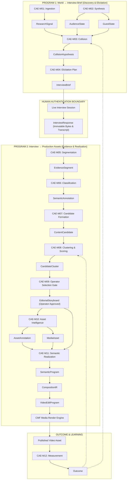

# CAE Editorial Intelligence Dependency Graph

**Document ID:** `CAE-DEP-ED-001`  
**Governing Mandate:** `CAE-M00`  
**Status:** `CANONICAL SPECIFICATION`  
**Version:** `1.0.0`  
**Prepared:** 2026-08-28  

---

## 1. Causal Architecture

The CAE Editorial Intelligence pipeline is organized into two strictly decoupled programs connected by an immutable evidence handoff:

---

## 2. Mandate Write Authority Matrix

| Mandate ID | Mandate Name | Permitted Input Objects (Read) | Authorized Output Objects (Write) | Gating Precondition |
| :--- | :--- | :--- | :--- | :--- |
| **`CAE-M00`** | Editorial Intelligence Authority | Existing Constitutions, Manifests | Governance Matrices, Object Register | Operator Approval |
| **`CAE-M01`** | World Signal Ingestion | External Web / Social Search API | `ResearchSignal` | `CAE-M00` Ratification |
| **`CAE-M02`** | Audience $\times$ Guest State Synthesis | Guest Dossier, Audience Persona | `AudienceState`, `GuestState` | `CAE-M01` Active |
| **`CAE-M03`** | Collision Hypothesis | `ResearchSignal`, `AudienceState`, `GuestState`, Books | `CollisionHypothesis` | Grounding in 4 Worlds |
| **`CAE-M04`** | Interview Semantic Program | `CollisionHypothesis` | `InterviewBrief` | Cliche Risk $< 0.70$ |
| **`CAE-M05`** | Evidence Segmentation | `InterviewResponse` | `EvidenceSegment` | Authenticated Transcript |
| **`CAE-M06`** | Semantic Attribution & Classification | `EvidenceSegment` | `SemanticAnnotation` | Boundary Validation |
| **`CAE-M07`** | Editorial Candidate Formation | `EvidenceSegment`, `SemanticAnnotation`, Story Arcs | `ContentCandidate` | Story Arc Mapping |
| **`CAE-M08`** | Heritage Scoring & Clustering | `ContentCandidate` | `CandidateCluster`, Scored Candidates | Frame Alignment $> 0.65$ |
| **`CAE-M09`** | Operator Editorial Selection | `CandidateCluster`, `ContentCandidate` | `EditorialStoryboard` | **Operator Human Gate Approval** |
| **`CAE-M10`** | Asset Intelligence & E/D-Roll | `EditorialStoryboard`, Raw Segments, B-roll | `AssetAnnotation`, `MediaAsset`, `InsertRole` | Selection Verified |
| **`CAE-M11`** | Production Semantic Program | `EditorialStoryboard`, `AssetAnnotation`, `MediaAsset` | `SemanticProgram`, `CompositionIR`, `VideoEditProgram` | Complete Track Allocation |
| **`CAE-M12`** | Outcome, Measurement & Learning | `VideoEditProgram`, Distribution Metrics | `Outcome` | Verified Platform Metrics |

---

## 3. Strict Prohibitions on Dependency Skipping

1. **No Direct Jump from `ResearchSignal` to `ContentCandidate`:**  
   External trends cannot be converted directly into video scripts without authentic human interview evidence (`InterviewBrief` $\rightarrow$ `InterviewResponse`).
2. **No Automated Bypass of `CAE-M09`:**  
   `SemanticProgram` cannot be constructed from `ContentCandidate` without an intermediate `EditorialStoryboard` bearing verified Operator signature.
3. **No Direct Render from `SemanticProgram`:**  
   A `SemanticProgram` must compile to an explicit `CompositionIR` beforeRemotion/FFmpeg execution syntax (`VideoEditProgram`) is generated.
