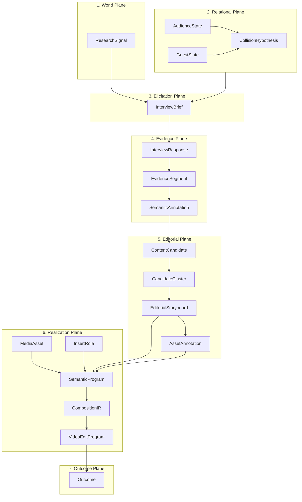

# CAE Editorial Intelligence Plane and Class Matrix

**Document ID:** `CAE-MAT-ED-001`  
**Governing Mandate:** `CAE-M00`  
**Status:** `CANONICAL SPECIFICATION`  
**Version:** `1.0.0`  
**Prepared:** 2026-08-28  

---

## 1. Ontological Planes

Every editorial object in CAE belongs to one primary Ontological Plane. A plane defines the operational context, tenant scope, and validation domain of the object.

| Plane | Description | Primary Objects | Tenancy Scope |
| :--- | :--- | :--- | :--- |
| **1. World Plane** | External environment, market discourse, cultural velocity, search trends. | `ResearchSignal` | Global / Multi-Tenant Ingestion |
| **2. Relational Plane** | Synthesis between Audience psyche, Guest lived authority, and Oblique lenses. | `AudienceState`, `GuestState`, `CollisionHypothesis` | Tenant / Engagement Scoped |
| **3. Elicitation Plane** | Protocols, question sequences, and objectives designed to acquire human evidence. | `InterviewBrief` | Tenant / Session Scoped |
| **4. Evidence Plane** | Immutable captured media, word-level transcripts, and semantic attributions. | `InterviewResponse`, `EvidenceSegment`, `SemanticAnnotation` | Tenant / Workspace Scoped (Strict Isolation) |
| **5. Editorial Plane** | Narrative structuring, candidate clustering, human selection, and asset labeling. | `ContentCandidate`, `CandidateCluster`, `EditorialStoryboard`, `AssetAnnotation` | Tenant / Workspace Scoped |
| **6. Realization Plane** | Canonical roles, semantic programs, track layouts, and executable render syntax. | `MediaAsset`, `InsertRole`, `SemanticProgram`, `CompositionIR`, `VideoEditProgram` | Tenant / Production Scoped |
| **7. Outcome Plane** | Distribution feedback, retention signals, and predictive calibration. | `Outcome` | Tenant / Global Calibration Feedback |

---

## 2. Lifecycle Classes

Objects are further categorized into 5 discrete Lifecycle Classes governing immutability, mutation authority, and persistence:

| Lifecycle Class | Definition | Governance Rule | Objects in Class |
| :--- | :--- | :--- | :--- |
| **A. Canonical Definition** | Globally standardized, immutable reference schemas or taxonomy values. | Versioned in repo/git; changes require formal governance RFC. | `InsertRole` |
| **B. Dynamic State** | Stateful models updated continuously by active ingestion or operator configuration. | Mutated via verified state transitions with audit receipts. | `ResearchSignal`, `AudienceState`, `GuestState` |
| **C. Immutable Evidence** | Real-world observations, raw bytes, or published results that must never change in place. | Write-once, read-many (WORM); content-addressable hashing. | `InterviewResponse`, `EvidenceSegment`, `MediaAsset`, `Outcome` |
| **D. Derived Artifact** | Structured outputs created by model inference, algorithms, or operator choices. | Recomputable from immutable evidence + deterministic parameters. | `CollisionHypothesis`, `InterviewBrief`, `SemanticAnnotation`, `ContentCandidate`, `CandidateCluster`, `EditorialStoryboard`, `AssetAnnotation`, `SemanticProgram` |
| **E. Execution Packet** | Ephemeral or compiled syntax consumed by downstream rendering machines. | Discardable; generated deterministically from parent artifacts. | `CompositionIR`, `VideoEditProgram` |

---

## 3. Comprehensive Plane $\times$ Class Crosswalk

| Object Name | Ontological Plane | Lifecycle Class | Storage Strategy | Immutability Rule |
| :--- | :--- | :--- | :--- | :--- |
| `ResearchSignal` | World Plane | Dynamic State | PostgreSQL / Ephemeral Cache | Mutable TTL / Archive on reference |
| `AudienceState` | Relational Plane | Dynamic State | PostgreSQL Relational | Versioned state snapshots |
| `GuestState` | Relational Plane | Dynamic State | PostgreSQL Relational | Versioned state snapshots |
| `CollisionHypothesis` | Relational Plane | Derived Artifact | PostgreSQL Relational | Immutable once linked to Brief |
| `InterviewBrief` | Elicitation Plane | Derived Artifact | PostgreSQL Relational | Sealed at interview start |
| `InterviewResponse` | Evidence Plane | Immutable Evidence | S3 Object Store + PostgreSQL | Strictly Immutable (SHA-256) |
| `EvidenceSegment` | Evidence Plane | Immutable Evidence | PostgreSQL Relational | Strictly Immutable |
| `SemanticAnnotation` | Evidence Plane | Derived Artifact | PostgreSQL Relational | Versioned re-annotations permitted |
| `ContentCandidate` | Editorial Plane | Derived Artifact | PostgreSQL Relational | Ephemeral until operator selection |
| `CandidateCluster` | Editorial Plane | Derived Artifact | PostgreSQL Relational | Recomputed per selection run |
| `EditorialStoryboard` | Editorial Plane | Derived Artifact | PostgreSQL Relational | Sealed upon Operator Approval |
| `MediaAsset` | Realization Plane | Immutable Evidence | S3 Storage (Isolated Bytes) | Strictly Immutable (Content Hash) |
| `AssetAnnotation` | Editorial Plane | Derived Artifact | PostgreSQL Relational | Mutable only with operator review |
| `InsertRole` | Realization Plane | Canonical Definition | YAML / Git Authority | Canonical Versioning (`v1.0`) |
| `SemanticProgram` | Realization Plane | Derived Artifact | PostgreSQL Relational | Sealed upon render trigger |
| `CompositionIR` | Realization Plane | Execution Packet | PostgreSQL / Artifact Blob | Compiled per render job |
| `VideoEditProgram` | Realization Plane | Execution Packet | Filesystem / Temp Workspace | Disposable after MP4 output |
| `Outcome` | Outcome Plane | Immutable Evidence | PostgreSQL Timeseries | Strictly Immutable |
