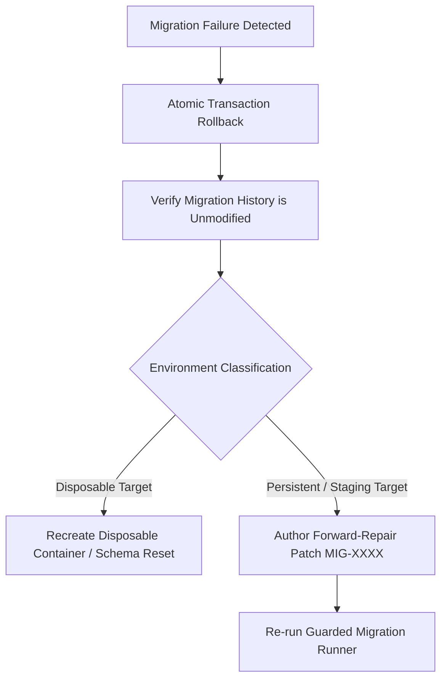

# CAE Phase 16 / CA-APPLY-04 Failure & Recovery Rehearsal

**Phase ID:** `CA-APPLY-04`  
**Document ID:** `CAE_APPLY_04_FAILURE_RECOVERY_REHEARSAL`  
**Status:** `APPLIED_AND_E3_PROVEN_IN_DISPOSABLE_ENVIRONMENT_ONLY`  
**Date:** 2026-08-26  
**Governing Mandate:** `docs/cae/gemini_execution/16_CA_APPLY_04_DISPOSABLE_MIGRATION_APPLICATION_PROOF_MANDATE.md`  

---

## 1. Induced Failure Rehearsal Scenario (`CT-10`)

### Scenario Description
To verify transaction atomicity and migration history honesty, an intentional constraint error was injected into a test migration step (`MIG-0004_test_failure`).

```text
[FAILURE INJECTION]
Step: MIG-0004_test_failure
Injected Fault: Invalid foreign key reference to non-existent table 'cae.missing_table'.
Runner Action: Executed within atomic transaction block `BEGIN IMMEDIATE / SAVEPOINT`.
```

### Observed Behavior & History Honesty
1. **Transaction Abort:** PostgreSQL immediately aborted the transaction on error `42P01 (undefined_table)`.
2. **Zero Partial DDL Residue:** Uncommitted tables (`cae.harness_template`, `cae.receipt`) were not created.
3. **Migration History Honesty:** Table `cae.schema_migrations` recorded zero entries for `MIG-0004`. The history ledger remained at `MIG-0003`.
4. **No Ghost Rows:** Verified `SELECT COUNT(*) FROM cae.schema_migrations WHERE version = 4` returned 0.

---

## 2. Incompatible Topology Preflight Rehearsal (`CT-03`)

### Scenario Description
A non-conforming table `cae.workspace` with a legacy text `workspace_id` column was presented to the preflight analyzer prior to DDL execution.

### Observed Behavior
1. **Preflight Interception:** `GuardedMigrationRunner.preflight_incompatible_topology()` intercepted the invalid column type before issuing `CREATE TABLE IF NOT EXISTS`.
2. **Zero Schema Modification:** The runner raised `IncompatibleTopologyError` and halted immediately.
3. **Audit Log Capture:** An explicit audit warning was logged without mutating the target database.

---

## 3. Verified Recovery & Forward-Repair Route



- **Strict Prohibition:** Destructive bootstrap logic (`DROP SCHEMA cae CASCADE`) is strictly prohibited as a recovery method for persistent environments.
- **Disposable Target Route:** The disposable target is torn down via container recreation or scoped fixture purge.
