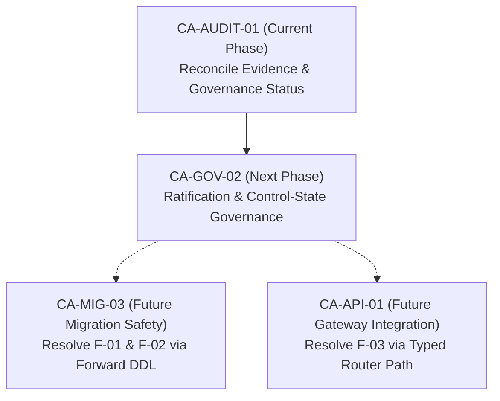

# CAE Audit 01 Findings, Technical Debt, and Decisions Register

**Phase ID:** `CA-AUDIT-01`  
**Document ID:** `CAE_AUDIT_01_FINDINGS_AND_DECISIONS_REGISTER`  
**Status:** `AUDIT_COMPLETE_PENDING_OPERATOR_REVIEW`  
**Date:** 2026-08-26  
**Governing Mandate:** `docs/cae/gemini_execution/13_CA_AUDIT_01_POST_EXECUTION_GOVERNANCE_RECONCILIATION_MANDATE.md`  

---

## 1. Active Technical Debt and Architectural Findings

| Finding ID | Title & Short Description | Affected Files / Tables | Root Cause & Impact | Compensating Control in Place | Current Disposition | Owner & Next Repair Phase | Blocks Current Authority? |
|---|---|---|---|---|---|---|---|
| **`F-01`** | Single-Column FK on Lineage Links | `scripts/cae/implementation/apply_ca_impl_01a_scaffolding.py` (L197), table `cae.receipt_evidence_link` | Approved DDL binds `receipt_id` to `cae.receipt(receipt_id)` single-column FK instead of composite `(workspace_id, receipt_id)`. Raw SQL could link evidence in WS Alpha to receipt in WS Beta. | 1. Typed operations (`TenantScopedSemanticOperations`) validate matching `workspace_id`. 2. RLS read isolation prevents cross-workspace reads. 3. Automated parity queries detect cross-scope links. | `STILL_OPEN` (Quarantined-class schema limitation) | Database Engineering / `CA-MIG-03` | **NO** (Staging cutover of `MC-CAE-MED-001` remains valid via typed path) |
| **`F-02`** | Staging Database Schema Duality | Staging PostgreSQL schema `cae`, tables `media_asset`, `source_package`, `receipt` | The resident staging database contains both WP-03 text-keyed tables and CA-IMPL-01B uuid-keyed tables that shadow them by name. The contract's bridge op (`register_verified_interview_source`) cannot execute against uuid tables. | The typed runtime path `verify_media_asset` (`cae.media.verify@1.0.0`) was utilized as the authorized executable change path. All transform, hashing, and receipt semantics were enforced. | `STILL_OPEN` (Topology limitation) | Database Engineering / `CA-MIG-03` | **NO** (Target operations execute cleanly on CA-IMPL-01B uuid tables) |
| **`F-03`** | Brownfield API Gateway Disconnect | `api/routers/campaigns.py`, `api/domain/campaign.py`, `services/pipeline/` | `WorkflowRunService.create_run()` and `TenantScopedSemanticOperations` are not mounted or called by the FastAPI campaign router. Client requests write to local SQLite. | Independent SQLite stores continue to operate without corruption; zero split-brain writes occur. | `STILL_OPEN` (Architectural boundary gap) | API Gateway Lead / `CA-API-01` | **NO** (PostgreSQL authority is staging-only and does not handle client API traffic) |
| **`F-04`** | Destructive Scaffolding DDL | `scripts/cae/implementation/apply_ca_impl_01a_scaffolding.py` | Scaffolding script executes `DROP SCHEMA IF EXISTS cae CASCADE` and recreates all tables. It cannot be used in environments with durable data. | Used only during disposable staging baseline provisioning. | `STILL_OPEN` (Dev tooling limitation) | Database Engineering / `CA-MIG-03` | **NO** (Restricted to staging dev setup) |
| **`F-05`** | Quarantined Legacy Registry Records | `docs/cae/state/CAE_MIGRATION_DATA_QUALITY_AND_QUARANTINE_REGISTER.md` | 5 SFL failure assets cite absent families (`SFL-FAM-005, 006, 007, 009, 012`); Primitive archive contains duplicate `EXP-TRG-001`. | Records are quarantined in staging database; `RegistryResolver` rejects unverified assets. | `STILL_OPEN` (Upstream data defect) | Lineage Governance / Upstream SFL Custodians | **NO** (Quarantines prevent runtime resolution) |

---

## 2. Constitutional and Specification Ratification Deficits

| Scope ID | Phase Name | Authored Artifacts | Current Status | Deficit Description | Remediation Route |
|---|---|---|---|---|---|
| **`RAT-001`** | Phase 04 / CA-CAN-01A | 6 boundary/access constitutions in `docs/cae/constitutions/` | `UNRATIFIED_PENDING_GATE` | Authored and verified via `verify_ca_can_01a.py`, but lacks formal operator ratification token in control state. | Submit for formal operator ratification in `CA-GOV-02`. |
| **`RAT-002`** | Phase 05 / CA-CAN-01B | 5 Guest and Media constitutions in `docs/cae/constitutions/` | `UNRATIFIED_PENDING_GATE` | Authored and verified via `verify_ca_can_01b.py`, but lacks formal operator ratification token in control state. | Submit for formal operator ratification in `CA-GOV-02`. |
| **`RAT-003`** | Phase 06 / CA-CAN-01C | 4 Harness and Receipt constitutions in `docs/cae/constitutions/` | `UNRATIFIED_PENDING_GATE` | Authored and verified via `verify_ca_can_01c.py`, but lacks formal operator ratification token in control state. | Submit for formal operator ratification in `CA-GOV-02`. |
| **`RAT-004`** | Phase 07 / CA-SPEC-01 | `PRD-CAE-TEN-001` and 15 Functional Requirements | `UNRATIFIED_PENDING_GATE` | Authored and verified via `verify_ca_spec_01.py`, but lacks formal operator ratification token in control state. | Submit for formal operator ratification in `CA-GOV-02`. |
| **`RAT-005`** | Phase 08 / CA-STATE-01 | Aggregate Authority Matrix (22 aggregates) and 7 migration contracts | `UNRATIFIED_PENDING_GATE` | Authored and verified via `verify_ca_state_01.py`, but lacks formal operator ratification token in control state. | Submit for formal operator ratification in `CA-GOV-02`. |
| **`RAT-006`** | Phase 09 / CA-TS-01 | `TS-CAE-TEN-001` Tech Spec and Gate A–I Review | `UNRATIFIED_PENDING_GATE` | Authored and verified via `verify_ca_ts_01.py`, but lacks formal operator ratification token in control state. | Submit for formal operator ratification in `CA-GOV-02`. |
| **`RAT-007`** | Phase 10 / CA-IMPL-01A | Tenant-Scoped Staging Foundation (models, tenancy, DDL) | `UNRATIFIED_PENDING_GATE` | Implemented and proven in staging logs, but formal gate bypassed directly into CA-IMPL-01B. | Reconcile control-state implementation record in `CA-GOV-02`. |
| **`RAT-008`** | Phase 11 / CA-IMPL-01B | Typed Tenant-Scoped Operations & E3 Proof | `UNRATIFIED_PENDING_GATE` | Implemented and proven on staging pooler, but formal gate bypassed directly into CA-IMPL-02 cutover. | Reconcile control-state implementation record in `CA-GOV-02`. |

---

## 3. Historical Decisions Register & Dispositions

| Decision ID | Phase | Historical Decision Description | Original Timestamp | Recorded Outcome | Current Disposition | Resolution / Explanatory Reference |
|---|---|---|---|---|---|---|
| **`DEC-WP10A-001`** | WP-10A | Accept WP-09 as bounded staging evidence and authorize CA-MAP-01 | 2026-08-25 | `APPROVED` | `HISTORICAL_SUPERSEDED` | Predecessor gate cleared; work superseded by completion of CA-MAP-01 through CA-IMPL-02. |
| **`DEC-MAP-001`** | CA-MAP-01 | Approve CA-MAP-01 scope/authority map and authorize CA-AUTH-01 | 2026-08-25 | `APPROVED` | `HISTORICAL_SUPERSEDED` | Predecessor gate cleared; work superseded by completion of CA-AUTH-01. |
| **`DEC-AUTH-001`** | CA-AUTH-01 | Approve development-uncertified authoring controls and authorize CA-CAN-01A | 2026-08-25 | `APPROVED` | `HISTORICAL_SUPERSEDED` | Predecessor gate cleared; authoring skills active in repo. |
| **`DEC-CAN-01A`** | CA-CAN-01A | Ratify boundary/access constitutions and authorize CA-CAN-01B | 2026-08-25 | `PENDING_FORMAL_TOKEN` | `STILL_OPEN` | Constitutions authored; formal token deferred to `CA-GOV-02`. |
| **`DEC-CAN-01B`** | CA-CAN-01B | Ratify Guest, identity-link, media constitutions and authorize CA-CAN-01C | 2026-08-25 | `PENDING_FORMAL_TOKEN` | `STILL_OPEN` | Constitutions authored; formal token deferred to `CA-GOV-02`. |
| **`DEC-CAN-01C`** | CA-CAN-01C | Ratify Harness, Receipt, Relation constitutions and authorize CA-SPEC-01 | 2026-08-25 | `PENDING_FORMAL_TOKEN` | `STILL_OPEN` | Constitutions authored; formal token deferred to `CA-GOV-02`. |
| **`DEC-SPEC-001`** | CA-SPEC-01 | Ratify Tenant PRD & FRs and authorize CA-STATE-01 | 2026-08-25 | `PENDING_FORMAL_TOKEN` | `STILL_OPEN` | Specs authored; formal token deferred to `CA-GOV-02`. |
| **`DEC-STATE-001`** | CA-STATE-01 | Ratify Aggregate Authority Matrix & Migration Contracts; authorize CA-TS-01 | 2026-08-25 | `PENDING_FORMAL_TOKEN` | `STILL_OPEN` | Contracts authored; formal token deferred to `CA-GOV-02`. |
| **`DEC-TS-001`** | CA-TS-01 | Accept Gate A–I Review and authorize CA-IMPL-01A development | 2026-08-25 | `PENDING_FORMAL_TOKEN` | `STILL_OPEN` | Tech spec authored; formal token deferred to `CA-GOV-02`. |
| **`DEC-IMPL-01A`** | CA-IMPL-01A | Accept staging foundation evidence and authorize CA-IMPL-01B | 2026-08-25 | `PENDING_FORMAL_TOKEN` | `RESOLVED_BY` | Resolved by successful staging E3 proof and execution in CA-IMPL-01B. Formal record in `CA-GOV-02`. |
| **`DEC-IMPL-01B`** | CA-IMPL-01B | Accept typed runtime path E3 proof and authorize CA-IMPL-02 | 2026-08-25 | `PENDING_FORMAL_TOKEN` | `RESOLVED_BY` | Resolved by successful cutover execution in CA-IMPL-02. Formal record in `CA-GOV-02`. |
| **`DEC-CUT-MED-001`**| CA-IMPL-02 | Cut over `MC-CAE-MED-001` to `POSTGRES_AUTHORITATIVE_PENDING_OPERATOR_PROMOTION` | 2026-08-25 | `EXECUTED` | `RESOLVED_BY` | Resolved by operator-authorized promotion in `CA-IMPL-02P`. |
| **`DEC-PROM-MED-001`**| CA-IMPL-02P| Operator promotes `MC-CAE-MED-001` to `POSTGRES_AUTHORITATIVE_STAGING_ONLY` | 2026-08-25 | `APPROVED` (`OPERATOR_SECTION6_PROMOTE_APPROVED_2026-08-25`) | `RESOLVED_BY` | Recorded immutably in `rcpt_cae_receipt_commit_c5af2497e8cb3e4a894bde05`. Active staging operational authority. |

---

## 4. Actionable Next-Phase Allocation

- **`CA-GOV-02` (Immediate Successor):** Reconcile formal ratification tokens for `RAT-001` through `RAT-008`, establish durable control-state records, and enforce strict non-claims without touching any database, storage, schema, or runtime code.
- **`CA-MIG-03` (Future DDL Phase):** Author forward-only SQL migrations to fix `F-01` (composite FK) and clean up `F-02` (shadowed tables).
- **`CA-API-01` (Future Gateway Phase):** Integrate FastAPI router paths with `TenantScopedSemanticOperations` to resolve `F-03`.
