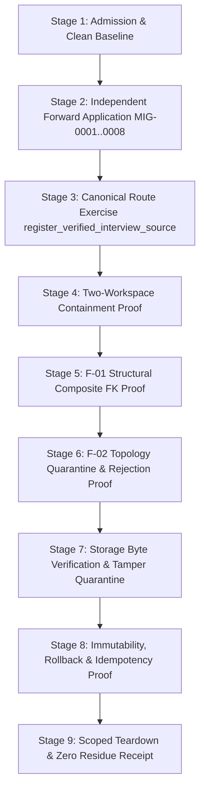

# CAE E3-08 Staging-Equivalent Reality-Contact Replay Plan

**Mandate:** Phase 20 / `CA-E3-08 — Independent Staging-Equivalent Reality-Contact Replay`  
**Target Identifier:** `disposable_e3_08_pg`  
**Environment Class:** `E3_STAGING_EQUIVALENT_DISPOSABLE`  
**Selected Option:** `DECISION_TOPO_OPTION_A_CANONICAL_UUID_TARGET`  
**Governance:** Bundle v3 Reality-Contact Evaluation Protocol, Test Governance Protocol, and TS-CAE-TEN-001

---

## 1. Objective and Independence Principles

The objective of `CA-E3-08` is an independent staging-equivalent reality-contact replay of the approved first-slice foundation, F-01 Workspace/Receipt structural repair, and operator-selected Option A canonical UUID topology.

### Independence Rules:
1. **Fresh Target Identity:** Replay runs in admitted disposable database `disposable_e3_08_pg` and private bucket `cae-media-disposable-e3-08`. Reusing shared staging or historical artifacts is prohibited.
2. **Zero Historical Evidence Reliance:** Success is determined solely by direct real-time behavioral observation in `disposable_e3_08_pg`, not transcripts, historical logs, or migration count assertions.
3. **Reward-Hack Resistance:** Every check evaluates real behavior against independent PostgreSQL and Storage assertions with explicit shortcut/falsification analysis.

---

## 2. Replay Lifecycle Stages

### Stage Details:
1. **Stage 1: Admission & Baseline:** Validate target identity, verify zero staging signatures, enforce `EMPTY_OR_SYNTHETIC_ONLY`, check 8 draft checksums.
2. **Stage 2: Independent Forward Application:** Apply drafts `MIG-0001` through `MIG-0008` in strict DAG order via `GuardedMigrationRunner`.
3. **Stage 3: Canonical Route Exercise:** Execute `register_verified_interview_source` via `CanonicalInterviewSourceAdapter` with deterministic UUID translation, tenancy session injection (`SET LOCAL cae.current_workspace_id`), and composite FK evidence linkage.
4. **Stage 4: Two-Workspace Containment:** Provision Workspace Alpha and Workspace Beta; verify complete cross-workspace isolation for reads, writes, and parent queries.
5. **Stage 5: F-01 Structural Proof:** Attempt direct cross-workspace receipt-evidence link; assert immediate structural rejection via composite foreign key `fk_workspace_receipt`.
6. **Stage 6: F-02 Topology Proof:** Verify active UUID catalog and quarantined legacy tables (`legacy_wp03_*`); assert raw non-UUID input rejection with `22P02`.
7. **Stage 7: Storage Byte Verification:** Readback storage bytes, verify SHA-256 against declared content hash, detect tampering, and assert immediate object quarantine.
8. **Stage 8: Immutability & Recovery:** Assert `cae.receipt` rejects `UPDATE` and `DELETE` with `EX_RECEIPT_IMMUTABLE`; verify idempotent replay deduplication; verify atomic transaction rollback on failure leaving zero ghost rows.
9. **Stage 9: Scoped Teardown:** Purge all synthetic rows and storage objects; verify zero residue.

---

## 3. 14-Countertest Specification Matrix

| Countertest ID | Real Behavior Exercised | Environment Feature | Independent Evidence | Shortcut Risk & Mitigation | Falsification Route | Recovery / Cleanup Result |
|---|---|---|---|---|---|---|
| **E3-CT-01** | Prohibited Target Rejection | Admission Guard | `MigrationAdmissionError` on staging signature | Bypassing string check; mitigated by regex matching. | Pass `evnxdssbxxrsesftdvgx` URL. | Zero mutation permitted. |
| **E3-CT-02** | Migration Checksum Verification | Manifest Integrity | SHA-256 match for 8/8 drafts | Accepting altered drafts; mitigated by exact SHA-256 validation. | Alter draft byte. | Rejection before execution. |
| **E3-CT-03** | DAG Predecessor Enforcement | Schema DAG | Strict topological chain verification | Out-of-order execution; mitigated by predecessor validation. | Omit predecessor draft. | Runner aborts execution. |
| **E3-CT-04** | Independent Schema Inspection | DDL / Catalog | Direct table, column, and constraint query | Relying on runner status; mitigated by direct catalog inspection. | Inspect mock catalog. | Catalog matches Option A. |
| **E3-CT-05** | No-Session Path Denial | Tenancy / RLS | Query returns 0 rows when context is NULL | Trusting app-level tenancy; mitigated by RLS policy. | Query without `SET LOCAL`. | Zero rows returned. |
| **E3-CT-06** | Cross-Workspace Scope Denial | Tenancy Isolation | Parent query across workspaces returns None | Shared parent leakage; mitigated by composite workspace scoping. | Query Alpha parent in Beta session. | Returns None / 0 rows. |
| **E3-CT-07** | Direct F-01 Composite FK Rejection | Foreign Key DDL | `23503: fk_workspace_receipt` constraint error | Mocking FK in app code; mitigated by database engine constraint. | Insert Beta link with Alpha receipt. | Transaction rejected. |
| **E3-CT-08** | Option A Key Shape Enforcement | UUID Type DDL | `22P02: invalid input syntax for type uuid` | Silent text fallback; mitigated by strict UUID typing. | Raw text insert into UUID column. | Rejection with `22P02`. |
| **E3-CT-09** | Mandated Effect Atomicity | Atomic Transaction | Media, receipt, and evidence link committed together | Partial writes; mitigated by single database transaction. | Execute canonical route. | All 3 entities committed. |
| **E3-CT-10** | Storage Byte Tamper Quarantine | Storage / Hash | `StorageObjectMismatchError` & object quarantine | Trusting client hash; mitigated by readback byte hashing. | Modify storage bytes before call. | Hash mismatch & quarantine. |
| **E3-CT-11** | Receipt Immutability Enforcement | Trigger DDL | `55000: EX_RECEIPT_IMMUTABLE` on UPDATE/DELETE | Mutating historical receipts; mitigated by append-only trigger. | Issue UPDATE/DELETE on `cae.receipt`. | Operation rejected. |
| **E3-CT-12** | Idempotent Replay Deduplication | Idempotency Logic | Returns existing receipt with zero duplicate rows | Duplicate row insertion; mitigated by idempotency lookup. | Re-execute same payload twice. | Same receipt ID, 0 extra rows. |
| **E3-CT-13** | Atomic Rollback on Failure | Transaction Safety | Zero ghost rows after induced mid-flight error | Ghost record accumulation; mitigated by transaction rollback. | Call route with invalid project ID. | Zero rows persisted. |
| **E3-CT-14** | Scoped Teardown Verification | Teardown Handler | Database tables and storage bucket 100% empty | Residual synthetic data; mitigated by complete post-test purge. | Purge database and storage. | 0 rows, 0 objects remain. |
