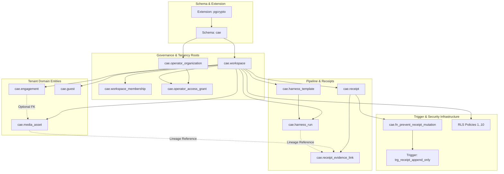

# CAE Migration 03 Migration Dependency Graph

**Phase ID:** `CA-MIG-03`  
**Document ID:** `CAE_MIG_03_MIGRATION_DEPENDENCY_GRAPH`  
**Status:** `DESIGNED_AND_STATICALLY_REHEARSED_ONLY`  
**Date:** 2026-08-26  
**Governing Mandate:** `docs/cae/gemini_execution/15_CA_MIG_03_FORWARD_ONLY_MIGRATION_SAFETY_MANDATE.md`  

---

## 1. Object Dependency DAG (Mermaid Visualization)

---

## 2. Migration Step Dependency Matrix

| Migration ID | File Name | Direct Predecessor | Objects Created / Modified | Dependent Child Migrations |
|---|---|---|---|---|
| `MIG-0001` | `0001_cae_extensions_and_schema.sql` | *None* (Root) | Extension `pgcrypto`, Schema `cae` | `MIG-0002` |
| `MIG-0002` | `0002_cae_tenancy_and_membership.sql` | `MIG-0001` | `cae.workspace`, `cae.workspace_membership`, `cae.operator_organization`, `cae.operator_access_grant` | `MIG-0003` |
| `MIG-0003` | `0003_cae_engagement_guest_media.sql` | `MIG-0002` | `cae.engagement`, `cae.guest`, `cae.media_asset` | `MIG-0004` |
| `MIG-0004` | `0004_cae_harness_and_immutable_receipts.sql` | `MIG-0003` | `cae.harness_template`, `cae.harness_run`, `cae.receipt`, `cae.receipt_evidence_link`, `cae.fn_prevent_receipt_mutation()`, `trg_receipt_append_only` | `MIG-0005` |
| `MIG-0005` | `0005_cae_row_level_security.sql` | `MIG-0004` | RLS enablement & policies across all 10 tables | `MIG-0006` |
| `MIG-0006` | `0006_cae_indexes_and_constraints.sql` | `MIG-0005` | Performance indexes & composite integrity validation | `MIG-0007` (Future) |
| `MIG-0007` | `0007_cae_f01_composite_receipt_fk.sql` (Future) | `MIG-0006` | Composite FK `(workspace_id, receipt_id)` on `cae.receipt_evidence_link` (`F-01`) | `MIG-0008` (Future) |
| `MIG-0008` | `0008_cae_f02_topology_shadow_reconciliation.sql` (Future) | `MIG-0007` | Shadowed WP-03 table retirement / alias migration (`F-02`) | *None* |

---

## 3. Topological Sort Proof & Acyclicity Verification

1. **Topological Order:**
   $$\text{MIG-0001} \prec \text{MIG-0002} \prec \text{MIG-0003} \prec \text{MIG-0004} \prec \text{MIG-0005} \prec \text{MIG-0006} \prec \text{MIG-0007} \prec \text{MIG-0008}$$
2. **Acyclicity Proof:**
   - Every edge $(u, v)$ in the dependency graph points strictly from lower migration index to higher migration index ($i < j$).
   - No backward edge exists ($j \not\to i$ for any $j \ge i$).
   - Foreign key constraints reference strictly already-created primary or unique keys (e.g., `cae.workspace_membership` references `cae.workspace` which is created prior in `MIG-0002`).
   - All composite foreign keys (`uq_workspace_engagement`, `uq_workspace_media`, `uq_workspace_receipt`) reference explicit unique constraints created on parent tables.
3. **Trigger Dependency Ordering:**
   - Function `cae.fn_prevent_receipt_mutation()` is created before trigger `trg_receipt_append_only` on `cae.receipt`.
4. **RLS Dependency Ordering:**
   - All 10 tables are fully defined with schema columns before RLS is enabled and policies are bound in `MIG-0005`.
