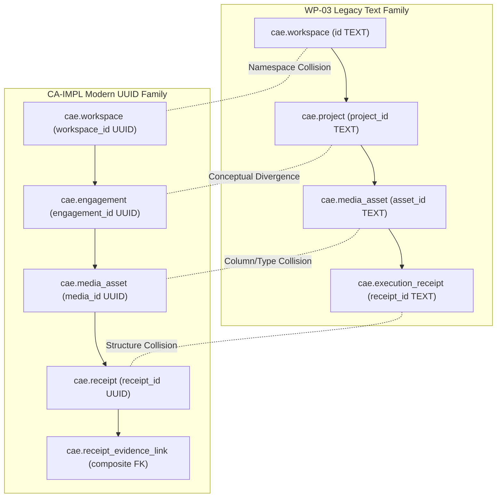

# CAE Phase 18 / CA-TOPO-06: F-02 Collision & Option Analysis

**Phase ID:** `CA-TOPO-06`  
**Finding Reference:** `F-02 (Staging Table-Family Shadowing & Duality)`  
**Scope:** Architectural Collision Breakdown, Option Trade-offs, and Consequences  
**Governing Mandate:** `docs/cae/gemini_execution/18_CA_TOPO_06_TABLE_FAMILY_TOPOLOGY_RECONCILIATION_MANDATE.md`  

---

## 1. Architectural Collision Breakdown

The conflict between `WP03_TEXT_FAMILY` and `CA_IMPL_UUID_FAMILY` spans four architectural dimensions:

1. **Namespace Collision:** Both families claim the table names `cae.workspace` and `cae.media_asset`. In a single PostgreSQL schema, only one table of a given name can exist.
2. **Key & Type Collision:** WP-03 utilizes free-form strings (`cae:media:ie:...`), whereas CA-IMPL strictly enforces 128-bit `UUID` types with composite foreign keys.
3. **Conceptual Hierarchy Divergence:** WP-03 models workspaces containing `projects`, while CA-IMPL models workspaces containing `engagements` and `guest_profiles`.
4. **Security & Immutability Collision:** WP-03 uses unscoped database connections without RLS or triggers; CA-IMPL requires session context (`cae.current_workspace_id`), composite tenant RLS policies, and append-only immutability triggers (`trg_receipt_append_only`).

---

## 2. Comparative Analysis of the 3 Bounded Topology Options

### Option A: Canonical CA-IMPL UUID Target with Bridge Adapter Migration

- **Core Architecture:**
  - Establish `CA_IMPL_UUID_FAMILY` (`0001` through `0007`) as the single canonical schema for CAE.
  - Apply non-destructive migration `MIG-0008` in staging to rename legacy WP-03 tables to `legacy_wp03_*`.
  - Upgrade `interview_source_bridge.py` and `FirstSliceSemanticOperations` into a typed bridge adapter that maps Interview Expression packages into UUID `engagement_id` / `media_id` and invokes `TenantScopedSemanticOperations.verify_media_asset`.
- **Tenancy & RLS Consequences:** Full compliance with `TS-CAE-TEN-001`, RLS session isolation, and F-01 composite FK protection.
- **Migration & Data Work:** Forward migration to rename/drain legacy tables; zero loss of historical data.
- **Runtime & Consumer Impact:** Legacy bridge code modernized to use typed Pydantic models; all consumers route to canonical UUID schema.
- **Recovery & E3 Testing:** High recoverability; disposable proof verified via `GuardedMigrationRunner`.

---

### Option B: Canonical WP-03 Text-Keyed Topology with CA-IMPL Refactor

- **Core Architecture:**
  - Revert canonical architecture to `WP03_TEXT_FAMILY`.
  - Refactor `CA-IMPL-01A`, `CA-IMPL-01B`, and `CA-IMPL-02` to use `TEXT` primary keys across all 7 tables.
  - Reintroduce `cae.project` table and remove native UUID constraints and composite foreign keys.
- **Tenancy & RLS Consequences:** Weakens RLS enforcement, breaks composite tenant candidate keys, and re-exposes lineage integrity risks.
- **Migration & Data Work:** Extensive rewrite of DDL migrations `MIG-0001` through `MIG-0007` and Pydantic models.
- **Runtime & Consumer Impact:** Re-enables legacy `register_verified_interview_source` without adapter code, but invalidates existing `CA-IMPL-02` cutover proofs and test suites.
- **Recovery & E3 Testing:** Extremely high regression risk across all modern tenant packages.

---

### Option C: Namespaced Dual Coexistence with Explicit Schema Partitioning

- **Core Architecture:**
  - Partition the two families into distinct PostgreSQL schemas: `cae_legacy` (holding WP-03 text tables) and `cae_v2` (holding CA-IMPL UUID tables).
  - Legacy operations connect to `search_path = 'cae_legacy'`; modern tenant operations connect to `search_path = 'cae_v2'`.
- **Tenancy & RLS Consequences:** RLS enforced strictly in `cae_v2`, legacy schema remains unscoped.
- **Migration & Data Work:** Schema-level relocation migrations; dual schema maintenance in perpetuity.
- **Runtime & Consumer Impact:** Zero immediate changes to legacy or modern application code, but introduces connection-routing complexity.
- **Recovery & E3 Testing:** Complex cross-schema recovery rehearsals; increased staging connection surface.

---

## 3. Option Evaluation Summary

| Dimension | Option A (Canonical UUID Target) | Option B (Canonical Text Baseline) | Option C (Namespaced Coexistence) |
|---|---|---|---|
| **Architectural Alignment** | **Complete** (`TS-CAE-TEN-001` compliant) | **Non-compliant** (Reverts to prototype) | **Partial** (Dual architecture) |
| **Tenancy & RLS Integrity** | **High** (Composite FKs & RLS) | **Degraded** (Unscoped text keys) | **Medium** (Isolated per schema) |
| **Lineage & Receipt Immutability**| **Proven** (F-01 composite FK active) | **Lost** (Single-column text receipts) | **Fragmented** (Dual receipt sinks) |
| **Operational Overhead** | **Low** (Single canonical schema) | **High** (Extensive code rewrite) | **High** (Dual schema maintenance) |
| **Implementation Feasibility** | **High** (Adapter pattern) | **Low** (Foundation invalidation) | **Medium** (Schema routing) |

---

## 4. Analysis Conclusion

All three options are fully specified and bounded. Under CA-TOPO-06 authority rules, **no option is selected or implemented at this stage**. The decision is formally submitted to the operator in `CAE_TOPO_06_OPERATOR_DECISION_PACKET.md`.
