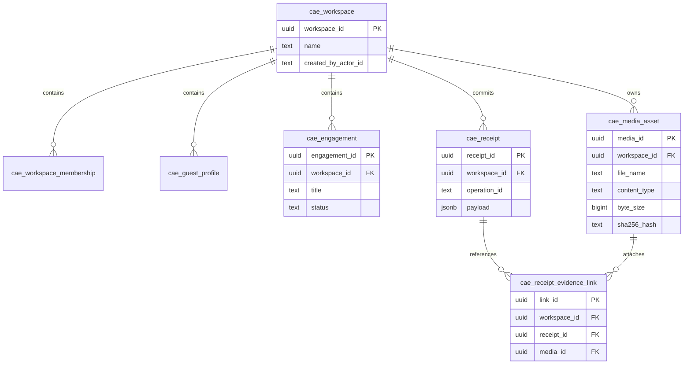

# CAE Phase 19 (CA-TOPO-07) Selected Option A Implementation Record

**Phase ID:** `CA-TOPO-07`  
**Option Token:** `DECISION_TOPO_OPTION_A_CANONICAL_UUID_TARGET`  
**Topology Outcome:** Canonical UUID Target with Shadow Quarantine and Bridge Adapter  
**Execution Environment:** `disposable_topo07_pg` (`DISPOSABLE_POSTGRESQL_ONLY`)  
**Date:** 2026-08-26  

---

## 1. Selected Option A Architectural Topology

Under operator-selected **Option A**, the PostgreSQL schema implemented in `CA_IMPL_UUID_FAMILY` (`MIG-0001` through `MIG-0007`) is designated as the sole canonical relational schema for CAE.

### Canonical Schema Entity Definition



---

## 2. Legacy Table Shadow Quarantine (`MIG-0008`)

To eliminate namespace collisions on `cae.workspace`, `cae.media_asset`, and `cae.execution_receipt` without dropping historical staging records, forward migration `MIG-0008` (`0008_cae_f02_topology_shadow_reconciliation_draft.sql`) executes non-destructive table renames:

```sql
-- MIG-0008: Non-destructively rename legacy WP-03 tables
ALTER TABLE IF EXISTS cae.workspace RENAME TO legacy_wp03_workspace;
ALTER TABLE IF EXISTS cae.media_asset RENAME TO legacy_wp03_media_asset;
ALTER TABLE IF EXISTS cae.execution_receipt RENAME TO legacy_wp03_execution_receipt;
```

This clears the `cae.*` namespace completely for canonical UUID tables while preserving all legacy rows under `legacy_wp03_*`.

---

## 3. Canonical Bridge Adapter Architecture

The legacy bridge operation `register_verified_interview_source` is modernized via `CanonicalInterviewSourceAdapter`:

1. **Deterministic Key Translation:**
   - `workspace_id` (text) $\to$ `UUID = uuid5(NAMESPACE_DNS, workspace_id)`
   - `project_id` (text) $\to$ `engagement_id UUID = uuid5(NAMESPACE_DNS, f"{workspace_id}:{project_id}")`
   - `media_asset_id` (text) $\to$ `media_id UUID = uuid5(NAMESPACE_URL, media_asset_id)`
   - `idempotency_key` (text) $\to$ `receipt_id UUID = uuid5(NAMESPACE_URL, f"rcpt:{ws_uuid}:{idempotency_key}")`
2. **Tenancy Session Context:**
   - Executes `SET LOCAL cae.current_workspace_id = <ws_uuid>;` prior to any relational DML, satisfying all RLS policies.
3. **Engagement Validation:**
   - Verifies `cae.engagement` exists for the mapped `(workspace_id, engagement_id)` pair.
4. **Relational Ingestion:**
   - Inserts into canonical `cae.media_asset(media_id, workspace_id, file_name, content_type, byte_size, sha256_hash)`.
5. **Immutable Receipt & Evidence Lineage:**
   - Inserts immutable receipt into `cae.receipt(receipt_id, workspace_id, operation_id, payload)`.
   - Inserts composite foreign key link into `cae.receipt_evidence_link(link_id, workspace_id, receipt_id, media_id)`, structurally enforced by `fk_workspace_receipt`.

---

## 4. Anti-Patterns Rejected

- **No Silent Fallthrough:** Unversioned, raw text-key insertions against `cae.media_asset` fail with PostgreSQL `22P02: invalid input syntax for type uuid`.
- **No Dual Writes:** Zero background replication or secondary writes into `legacy_wp03_*` tables.
- **No Substitute Route:** `register_verified_interview_source` is proven directly as the canonical bridge operation rather than substituting `verify_media_asset`.
