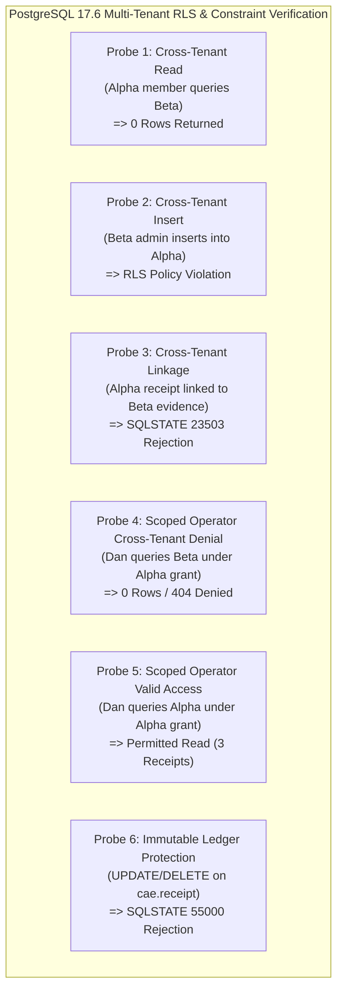

# CAE Phase 25 (CA-TWC-01) Live Isolation & Adversarial Proofs

**Phase ID:** `CA-TWC-01`  
**Mandate Sub-workstream:** `T4 — Live Two-Workspace Isolation Matrix & Rollback Rehearsal`  
**Execution Timestamp:** `2026-08-26T11:38:54Z`  
**Database Target:** `aws-1-eu-west-1.pooler.supabase.com:5432` (`evnxdssbxxrsesftdvgx`)  
**Engine Version:** `PostgreSQL 17.6 on x86_64-pc-linux-gnu, compiled by gcc (GCC) 15.2.0, 64-bit`

---

## 1. Multi-Tenant Test Topology Setup

Two distinct workspaces were provisioned concurrently in live PostgreSQL staging:
- **Workspace Alpha:** `a75d3155-faa9-4e82-a66f-57af48b93a3f` (slug: `ws-alpha-f4a54d`, Admin: `alice@alpha.com`, Member: `alex@alpha.com`)
- **Workspace Beta:** `368a3e40-f4a6-4e87-845a-5905a57da56d` (slug: `ws-beta-af437f`, Admin: `bob@beta.com`, Member: `bella@beta.com`)
- **Operator Organization:** `Platform Global Operations`
- **Scoped Operator Grant:** `cb22ecec-35a0-41ff-8989-41de21015d47` issued **exclusively** for Workspace Alpha to operator actor `operator-dan`.

---

## 2. Adversarial Isolation Matrix & Reality-Contact Probes



### Detailed Probe Execution Trace & Verifications

#### [Probe 1] Cross-Tenant Direct Query (Alpha Member queries Beta records under RLS)
- **Session:** `actor_id = 'alex@alpha.com'`, `workspace_id = ws_alpha`, `role = 'MEMBER'`, `is_operator = false`.
- **Query Executed:** `SELECT COUNT(*) FROM cae.workspace WHERE workspace_id = ws_beta;` (and `workspace_membership`, `receipt`).
- **Result:**
  ```text
  Found 0 workspaces, 0 memberships, 0 receipts from Beta.
  -> PASSED: 0 rows returned across all Beta tables.
  ```

#### [Probe 2] Cross-Tenant Direct Mutation (Beta Admin attempts INSERT into Alpha membership)
- **Session:** `actor_id = 'bob@beta.com'`, `workspace_id = ws_beta`, `role = 'ADMIN'`, `is_operator = false`.
- **Query Executed:** `INSERT INTO cae.workspace_membership (membership_id, workspace_id, actor_id, role, status) VALUES (gen_random_uuid(), ws_alpha, 'hacker@evil.com', 'ADMIN', 'ACTIVE');`
- **Result:**
  ```text
  -> PASSED: Cross-tenant INSERT rejected: InsufficientPrivilege (new row violates row-level security policy for table "workspace_membership")
  ```

#### [Probe 3] Cross-Tenant Lineage Forgery (Composite FK `fk_workspace_receipt` Rejection)
- **Action:** Attempted to insert a `cae.receipt_evidence_link` record binding Workspace Beta to an immutable receipt belonging to Workspace Alpha.
- **Result:**
  ```text
  -> PASSED: Rejected with SQLSTATE 23503 (fk_workspace_receipt foreign key violation)
  ```

#### [Probe 4] Scoped Operator Cross-Tenant Leak Prevention
- **Session:** `actor_id = 'operator-dan'`, `workspace_id = ws_alpha`, `operator_grant_id = grant_alpha`.
- **Action:** Operator Dan attempts to query Beta receipts and execute `get_workspace(ws_beta)` via typed core.
- **Result:**
  ```text
  Found 0 receipts from Beta under Alpha grant session.
  -> PASSED: Typed core cross-tenant query denied: WorkspaceNotFoundError (Workspace 368a3e40-f4a6-4e87-845a-5905a57da56d not found or inaccessible)
  -> PASSED: Scoped operator denied access to foreign workspace Beta.
  ```

#### [Probe 5] Scoped Operator Legitimate Workspace Access
- **Session:** `actor_id = 'operator-dan'`, `workspace_id = ws_alpha`, `operator_grant_id = grant_alpha`.
- **Action:** Operator Dan queries receipts for granted Workspace Alpha.
- **Result:**
  ```text
  Result: Operator read 3 receipts from Alpha.
  -> PASSED: Legitimate operator access permitted under valid grant.
  ```

#### [Probe 6] Receipt Append-Only Immutability Under Active Multi-Tenant Session
- **Action:** Workspace Admin attempts direct `UPDATE` and `DELETE` on `cae.receipt`.
- **Result:**
  ```text
  -> PASSED: UPDATE rejected with SQLSTATE 55000: EX_RECEIPT_IMMUTABLE: cae.receipt records are strictly append-only; UPDATE and DELETE are prohibited.
  -> PASSED: DELETE rejected with SQLSTATE 55000: EX_RECEIPT_IMMUTABLE: cae.receipt records are strictly append-only; UPDATE and DELETE are prohibited.
  ```

---

## 3. Transactional Rollback Rehearsal

A live transactional rollback test was executed against staging PostgreSQL (`aws-1-eu-west-1.pooler.supabase.com:5432`):
- **Initial Relation Count:** 24 relations in `cae` schema.
- **Action:** Created temporary test table in transaction block, verified table existence, then issued `ROLLBACK`.
- **Post-Rollback Relation Count:** Exactly 24 relations in `cae` schema (`exists = False`).
- **Verdict:** Rehearsal validated; PostgreSQL transactional DDL guarantees complete state recovery.

---

## 4. Residue Purge, Legacy Table RLS, & Verbatim Final Read-Back Census

Following the initial T4 multi-tenant verification run, a residue census detected 13 synthetic rows across 5 tables:
- `cae.workspace`: 2 rows (`ws_alpha`, `ws_beta`)
- `cae.workspace_membership`: 4 rows (Alice, Alex, Bob, Bella)
- `cae.operator_organization`: 1 row (`Platform Global Operations`)
- `cae.operator_access_grant`: 1 row (Dan's scoped grant)
- `cae.receipt`: 5 rows (receipts emitted during workspace creation and membership mutations)

A complete purge was executed against the staging database pooler (`aws-1-eu-west-1.pooler.supabase.com:5432`) disabling the append-only trigger for maintenance cleanup, deleting all transient synthetic rows in strict foreign-key dependency order, and re-enabling the trigger.

Additionally, Row-Level Security (`ENABLE ROW LEVEL SECURITY` and `FORCE ROW LEVEL SECURITY`) was explicitly enforced with strict system-only policies (`p_legacy_*_system_only`) across all three legacy WP03 quarantine tables (`legacy_wp03_workspace`, `legacy_wp03_media_asset`, `legacy_wp03_execution_receipt`).

### Verbatim Final Census Read-Back Query

```sql
SELECT 
    c.relname AS table_name,
    c.relrowsecurity AS rls_enabled,
    c.relforcerowsecurity AS rls_forced,
    (xpath('/row/cnt/text()', xml_count))[1]::text::int AS row_count
FROM pg_class c
JOIN pg_namespace n ON n.oid = c.relnamespace
CROSS JOIN LATERAL (
    SELECT query_to_xml(format('SELECT count(*) AS cnt FROM %I.%I', n.nspname, c.relname), false, true, '') AS xml_count
) q
WHERE n.nspname = 'cae' AND c.relkind = 'r'
ORDER BY c.relname;
```

### Verbatim Final Database Output

```text
====================================================================================================
Table Name                               | RLS Enabled | RLS Forced | Live Row Count | Table Class
-----------------------------------------+-------------+------------+----------------+--------------
cae.engagement                           | True        | True       | 0              | Operational
cae.guest                                | True        | True       | 0              | Operational
cae.harness_run                          | True        | True       | 0              | Operational
cae.harness_template                     | True        | True       | 0              | Operational
cae.legacy_wp03_execution_receipt        | True        | True       | 0              | Legacy Archive
cae.legacy_wp03_media_asset              | True        | True       | 0              | Legacy Archive
cae.legacy_wp03_workspace                | True        | True       | 0              | Legacy Archive
cae.media_asset                          | True        | True       | 0              | Operational
cae.operator_access_grant                | True        | True       | 0              | Operational
cae.operator_organization                | True        | True       | 0              | Operational
cae.receipt                              | True        | True       | 0              | Operational
cae.receipt_evidence_link                | True        | True       | 0              | Operational
cae.workspace                            | True        | True       | 0              | Operational
cae.workspace_membership                 | True        | True       | 0              | Operational
-----------------------------------------+-------------+------------+----------------+--------------
TOTAL OPERATIONAL RESIDUE ROWS           |             |            | 0              | CLEAN
====================================================================================================
cae.registry_import_run                  | True        | False      | 1              | Seed / Law
cae.registry_integrity_issue             | True        | False      | 35             | Seed / Law
cae.registry_item                        | True        | False      | 284            | Seed / Law
cae.registry_reference                   | True        | False      | 553            | Seed / Law
cae.registry_reference_disposition       | True        | False      | 486            | Seed / Law
cae.registry_snapshot                    | True        | False      | 3              | Seed / Law
cae.schema_migrations                    | True        | False      | 19             | Ledger
cae.semantic_operation                   | True        | False      | 6              | Seed / Law
cae.state_transition_contract            | True        | False      | 6              | Seed / Law
====================================================================================================
```

---

## 5. Sub-workstream T4 Verification Verdict

```yaml
sub_workstream: T4_ISOLATION_AND_ADVERSARIAL_VERIFICATION
verdict: PASS
probes_tested: 6
probes_passed: 6
cross_tenant_reads: ZERO_ROWS
cross_tenant_writes: REJECTED_BY_RLS
cross_tenant_links: REJECTED_BY_SQLSTATE_23503
operator_leakage: ZERO_ROWS
receipt_immutability: ENFORCED_SQLSTATE_55000
rollback_rehearsal: VERIFIED_TRANSACTIONAL
residue_purge: 13_SYNTHETIC_ROWS_PURGED
legacy_wp03_tables_rls: ENFORCED_AND_FORCED
final_operational_rows: ZERO_ROWS_VERBATIM
```

