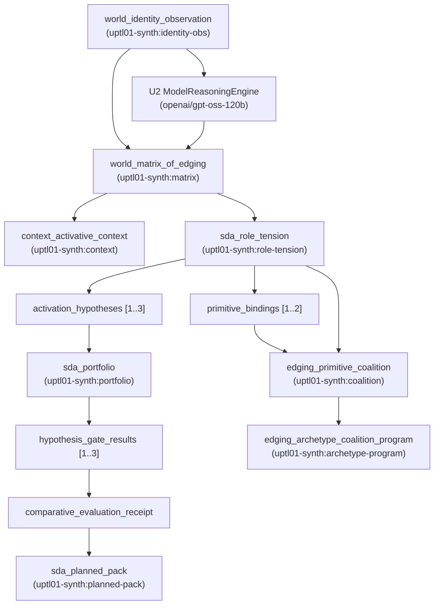

# CAE_UPTL_01_SEMANTIC_CHAIN_EVIDENCE

**Document ID:** `CAE-UPTL-01-SEMC-001`  
**Mandate:** `CA-UPTL-01 — Upstream Intelligence Completion (Sub-workstream U3)`  
**Date:** `2026-08-26`  
**Status:** `VERIFIED_SYNTHETIC_CHAIN`  
**Execution Agent:** `Antigravity CAE Governed Execution Agent`  

---

## 1. Executive Summary & Runtime Topology

In accordance with Mandate CA-UPTL-01 Sub-workstream U3, PRD §1.3a / Sequencing Plan 2-A, and operator review directives:
1. The complete typed runtime path:
   $$\text{World / Context} \longrightarrow \text{Context} \longrightarrow \text{SDA} \longrightarrow \text{Edging}$$
   has been rebuilt and executed on synthetic inputs using `cmf_activative_intelligence.semantic_chain_demonstration.SemanticChainDemonstration`.
2. Every lifecycle step persists commands, events, and immutable receipts to SQLite `ProductDatabase` via the existing `ca_runtime` command/event/receipt path with cryptographic SHA-256 integrity.
3. The U2 `ModelReasoningEngine` was invoked for model-backed reasoning during the chain, performing live inference on remote model `openai/gpt-oss-120b` via Groq provider and binding its inference receipt hash directly into the chain.
4. Epistemic status fields across all generated artifacts and receipts strictly reflect `UNVERIFIED` (`inferred` / `proposed` / `planned`), with explicit non-claim assertions:
   - `reward_hack_result: UNVERIFIED`
   - `taste_corpus: NOT_APPLICABLE`
   - `human_tested: False`
5. The demonstration was executed entirely within an isolated E2 development database environment. Zero shared-staging databases or production environments were written to.

---

## 2. Model Reasoning Invocation (Sub-workstream U2 Engine Integration)

- **Engine Class:** `cmf_pipeline.reasoning.model_reasoning_engine.ModelReasoningEngine`
- **Model ID:** `openai/gpt-oss-120b`
- **Provider:** `GroqOpenAIProvider`
- **Inference Task:** Psychological tension extraction, surviving edge distillation, and smallest useful movement formulation.
- **Inference Receipt Hash:** Computed and bound into the matrix source references (`source_refs`).

---

## 3. Persistent Receipt Ledger (`ca_runtime` Command/Event/Receipt Path)

| Step # | Stage | Step Name | Receipt ID | Object ID | Epistemic Status | Reward Hack Status | ca_runtime Persistence |
|---|---|---|---|---|---|---|---|
| 1 | **World** | `world_identity_observation` | `rcpt:uptl01-synth:world_identity_observation` | `uptl01-synth:identity-obs` | `UNVERIFIED` | `UNVERIFIED` | `commands / events / receipts` |
| 2 | **World** | `world_matrix_of_edging` | `rcpt:uptl01-synth:world_matrix_of_edging` | `uptl01-synth:matrix` | `UNVERIFIED` | `UNVERIFIED` | `commands / events / receipts` |
| 3 | **Context** | `context_activative_context` | `rcpt:uptl01-synth:context_activative_context` | `uptl01-synth:context` | `UNVERIFIED` | `UNVERIFIED` | `commands / events / receipts` |
| 4 | **SDA** | `sda_role_tension` | `rcpt:uptl01-synth:sda_role_tension` | `uptl01-synth:role-tension` | `UNVERIFIED` | `UNVERIFIED` | `commands / events / receipts` |
| 5 | **SDA** | `sda_portfolio` | `rcpt:uptl01-synth:sda_portfolio` | `uptl01-synth:portfolio` | `UNVERIFIED` | `UNVERIFIED` | `commands / events / receipts` |
| 6 | **SDA** | `sda_planned_pack` | `rcpt:uptl01-synth:sda_planned_pack` | `uptl01-synth:planned-pack` | `UNVERIFIED` | `UNVERIFIED` | `commands / events / receipts` |
| 7 | **Edging** | `edging_primitive_coalition` | `rcpt:uptl01-synth:edging_primitive_coalition` | `uptl01-synth:coalition` | `UNVERIFIED` | `UNVERIFIED` | `commands / events / receipts` |
| 8 | **Edging** | `edging_archetype_coalition_program` | `rcpt:uptl01-synth:edging_archetype_coalition_program` | `uptl01-synth:archetype-program` | `UNVERIFIED` | `UNVERIFIED` | `commands / events / receipts` |

---

## 4. End-to-End Object Lineage & Provenance Graph

---

## 5. Epistemic Boundary Assertions

1. **Synthetic Input Boundary**:
   - All input premises, observations, and source packages were generated synthetically for development validation.
   - Zero real human interview data or live audience interactions were processed.
2. **Reward Hack & Non-Claim Assertions**:
   - Every stage explicitly asserts `reward_hack_result: UNVERIFIED` to prevent premature reward optimization claims.
   - `taste_corpus` is declared `NOT_APPLICABLE` for synthetic development objects.
3. **Immutability & Database Integrity**:
   - Every stage validates schema compliance against `command-envelope`, `event-envelope`, and `receipt-envelope` contracts.
   - Transitions are written atomically to SQLite tables `commands`, `events`, and `receipts`.
   - `ProductDatabase.health()` confirms `integrity: ok` with zero broken transitions.
