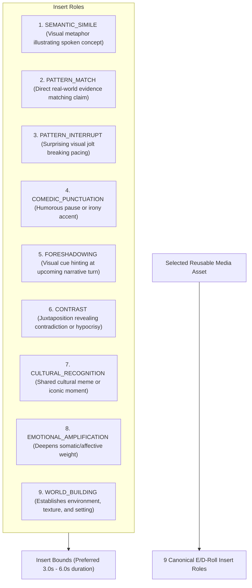

# SPEC-AST-001: Multimodal Asset Intelligence and E/D-Roll Pattern Taxonomy

**Document ID:** `SPEC-AST-001`  
**Governing Mandate:** `CAE-M10`  
**Status:** `CANONICAL SPECIFICATION`  
**Version:** `1.0.0`  
**Prepared:** 2026-08-28  

---

## 1. Purpose & Scope

This specification defines the multimodal asset contracts, E/D-roll editorial insert taxonomy, contextualized captioning standards, cryptographic media integrity validation, and legal rights verification for the **Asset Intelligence Layer** in CAE.

The Asset Intelligence Layer works exclusively with Operator-approved candidates (from `CAE-M09`), selecting and annotating the specific reusable quotes, clips, archival footage, and cultural references needed for production scripting (`CAE-M11`).

### Strict Prohibitions
* **No Whole-Transcript Captioning:** Only selected assets linked to approved candidates are annotated.
* **No Inferred Rights:** Legal clearance can never be inferred from filename, URL, or informal provenance.
* **No Automatic "Fair Use" Claim:** Fair use is a legal defense, not a verified license; items requiring review must be flagged `FAIR_USE_LEGAL_REVIEW_REQUIRED`.
* **No Shallow Literal Captions:** Captions must describe semantic meaning and contextual narrative function, not just literal visual objects.

---

## 2. Governed Source Categories & Media Types

### Source Categories
1. `REAL_WORLD`: Primary camera footage, B-roll, field recordings.
2. `PREVIOUS_INTERVIEW`: Earlier guest interviews, podcast clips, archival speeches.
3. `ARCHIVAL`: Historical recordings, public domain footage, institutional archives.
4. `MOVIE`: Cinema moments, iconic film dialogues, cinematic visual similes.
5. `SOCIAL_MEDIA`: Viral clips, screen recordings, tweet threads, community memes.
6. `CULTURAL`: Recognized cultural landmarks, artistic performances, memes, symbols.

### Media Types
- `VIDEO_CLIP`, `AUDIO_BITE`, `STILL_IMAGE`, `MOTION_GRAPHIC`.

---

## 3. The 9 Canonical E/D-Roll Insert Roles

---

## 4. Cryptographic & Rights Clearance Protocol

Every asset annotation requires:
- `source_sha256`: Cryptographic SHA-256 hash of the media asset.
- `rights`: `RightsMetadata` containing status (`CLEARED`, `FAIR_USE_LEGAL_REVIEW_REQUIRED`, `RESTRICTED`, `UNKNOWN_UNLICENSED`), certificate/proof URL, and license identifier.
