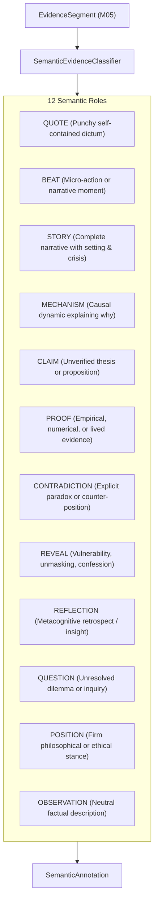

# SPEC-ATR-001: Semantic Attribution & Multi-Dimensional Evidence Classification

**Document ID:** `SPEC-ATR-001`  
**Governing Mandate:** `CAE-M06`  
**Status:** `CANONICAL SPECIFICATION`  
**Version:** `1.0.0`  
**Prepared:** 2026-08-28  

---

## 1. Purpose & Scope

This specification defines the domain contracts, role taxonomy, epistemic classification, evidence-inference partitioning, and verification standards for the **Attribution Intelligence Layer** in CAE.

The Attribution Intelligence Layer consumes `EvidenceSegment` objects (from `CAE-M05`) and produces structured, typed `SemanticAnnotation` and `EvidenceClassification` entities. It establishes the semantic foundation for Candidate Formation (`CAE-M07`) without declaring any segment publishable.

### Strict Prohibitions
* **No Premature Publishability Verdicts:** Attribution prepares structured meaning; declaring a segment or compilation publishable is strictly prohibited in this layer.
* **No Evidence-Status Inflation:** Speculative claims or personal opinions must never be marked as `FIRST_PARTY_FACT`.
* **No Quote-to-Story Conflation:** An eloquent or punchy one-liner cannot be classified as a `STORY` unless it contains setting, crisis, and resolution elements.
* **No Invariant Inflation:** Deep SDA structural invariants (e.g. `SDA-INV-*`) must not be attached to generic emotional clichés lacking concrete causal mechanisms.

---

## 2. The 12 Semantic Roles



---

## 3. Epistemic Evidence Status Tiers

Every annotation must declare its strict epistemic evidence status:

| Status Tier | Definition | Observable Linguistic & Contextual Markers |
| :--- | :--- | :--- |
| `FIRST_PARTY_FACT` | Directly witnessed, empirical, or verifiable first-hand event. | Named individuals, verified dates, concrete metrics, physical locations. |
| `LIVED_EXPERIENCE` | Autobiographical subjective experience of the guest. | Somatic sensations, internal emotional reactions, personal retrospective reflections. |
| `SPECULATIVE_INFERENCE` | Deductive thesis, theoretical model, or future projection. | *"I believe...", "If we extrapolate...", "The theory suggests..."* |
| `SECOND_PARTY_HEARSAY` | Information relayed from third parties without direct observation. | *"They told me that...", "Industry rumors indicated..."* |
| `ABSTRACT_OPINION` | Normative value judgment or philosophical preference. | *"X is good", "People should always do Y."* |

---

## 4. Evidence vs. Inference Partitioning

A `SemanticAnnotation` maintains a strict cryptographic and logical partition:

```
┌────────────────────────────────────────────────────────────────────────┐
│                          SEMANTIC ANNOTATION                           │
├───────────────────────────────────┬────────────────────────────────────┤
│ Observable Evidence (Empirical)   │ Interpretive Inference (Model)     │
├───────────────────────────────────┼────────────────────────────────────┤
│ • Segment ID & Source Reference   │ • Semantic Role & Confidence       │
│ • Verbatim Excerpt Text           │ • Tension Ref (AET-*)              │
│ • Exact Start/End Timecodes       │ • Invariant Ref (SDA-INV-*)        │
│ • Speaker Identity & SHA-256 Hash │ • Emotional Register               │
│ • Context Antecedents             │ • Story Arc Geometry               │
│                                   │ • Candidate Eligibility Flag       │
└───────────────────────────────────┴────────────────────────────────────┘
```
