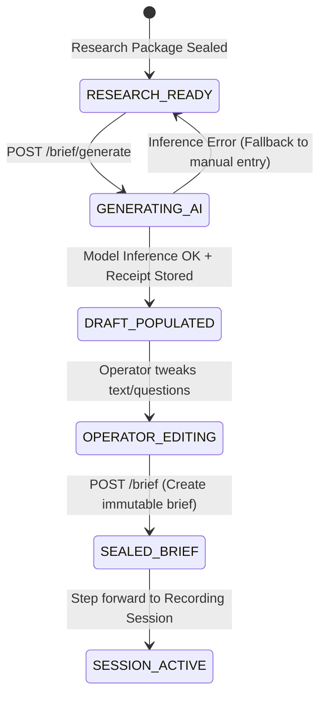

# Implementation Specification: SPEC-BRF-001
# Activative Interview Brief Generation Flow via ModelReasoningEngine

**Document ID:** SPEC-BRF-001  
**Version:** 1.0.0  
**Status:** ACCEPTED_AS_AMENDED  
**Classification:** Track A Implementation Specification  
**Authority:** Mandate CA-SPEC-02 (`docs/cae/gemini_execution/26_CA_SPEC_02_PRD_RECONCILIATION_AND_APP_COMPLETION_SPECS_MANDATE.md`)  
**Governing Constitutions:** `F21`, `F28`, `F29`, `F30`, `CA-UPTL-01`, `FR-APP-007..009`  
**Date:** 2026-08-26  

---

## 1. Files and Evidence Read

1. `services/pipeline/src/cmf_pipeline/reasoning/model_reasoning_engine.py` (lines 279–375): Live `ModelReasoningEngine` implementing genuine model-backed remote inference (`infer()`), structured JSON extraction, and SHA-256 canonical receipt hashing under `CA-UPTL-01`.
2. `api/routers/interview_composer.py` (lines 124–180): Live endpoint `POST /api/interviews/compose/brief`, invoking `resolve_brand_voice_refs()` and storing `ActivativeInterviewBrief`.
3. `api/schemas/interview_composer.py` (lines 60–130): Canonical Pydantic contracts for `ComposeBriefRequest`, `ActivativeInterviewBriefResponse`, `PlannedQuestion`, and `MatrixOfEdgingSeed`.
4. `apps/web/src/components/interview-composer/BriefPanel.tsx` (lines 1–156): React form for brief composition and question matrix editing.
5. `api/services/composer_air_bridge.py` (lines 15–50): Brand context and Voice DNA cross-referencing validator.

---

## 2. Architectural Role and Boundaries

`SPEC-BRF-001` specifies the integration of the genuine model-backed `ModelReasoningEngine` (U2) into the Interview Brief generation flow. It transitions brief authoring from purely manual text entry to governed, AI-assisted psychological tension discovery and structured question matrix synthesis, accompanied by immutable execution receipts.

### Boundaries:
- **In-Scope:**
  - Automated generation endpoint `POST /api/interviews/compose/brief/generate` calling `ModelReasoningEngine.infer()`.
  - Structured prompt compilation incorporating guest research package metadata, source URLs, and uploaded document excerpts.
  - Synthesis of canonical `tension_hypothesis`, `matrix_of_edging_seed`, and `planned_questions` with psychological roles and activation directions.
  - Two-mode brand reference handling: explicit absence of brand references is permitted and results in output marked `unbranded: true`; any declared-but-missing brand reference triggers a hard typed error (`BRAND_CONTEXT_NOT_FOUND`). Zero silent fallbacks permitted.
  - Emission and persistence of canonical SHA-256 reasoning receipts (`ReasoningInferenceResult.receipt_sha256`).
  - Interactive operator review, editing, and final submission UI in `BriefPanel.tsx`.
- **Out-of-Scope (Non-Goals):**
  - Live video recording or real-time teleprompter streaming (handled in downstream Session phase).
  - Unverified mock/fake inference generators (strictly prohibited under `CA-UPTL-01`).

---

## 3. Brownfield Reality & Component Disposition

- **Live Code Anchor:** `cmf_pipeline.reasoning.model_reasoning_engine.ModelReasoningEngine` is live and tested. `api/routers/interview_composer.py::create_brief` exists but only handles manual submission without an AI generation endpoint.
- **Brand Context Anchor:** `resolve_brand_voice_refs` in `composer_air_bridge.py:20` raises `BrandCrossReferenceError` if brand context is missing.
- **Disposition:**
  - Add `@router.post("/brief/generate")` in `api/routers/interview_composer.py` backed by `ModelReasoningEngine`.
  - Update `BriefPanel.tsx` with an "AI Generate Brief" button that auto-populates the hypothesis and question rows.
  - Implement graceful fallback when `brand_context_ref` is omitted (`OPEN_DECISION: Brand Context Optionality`).

---

## 4. Functional Requirement Traceability

- **FR-APP-007 (Psychological Tension Discovery):** The engine analyzes guest research to formulate an authentic, polarizing tension hypothesis.
- **FR-APP-008 (Matrix of Edging & Role Architecture):** The system synthesizes the smallest commitment, pressure paths, and counter-activation strategies.
- **FR-APP-009 (Planned Question Sequencing):** The system generates structured interview questions mapped to specific psychological roles and activation vectors.

---

## 5. Canonical Object & Schema Contract

```typescript
export interface PlannedQuestion {
  question_text: string;
  activation_direction: string;
  psychological_role: string;
}

export interface MatrixOfEdgingSeed {
  psychological_role: string;
  tension: string;
  activation_direction_set: string;
  pressure_path: string;
  stance: string;
  counteractivation_strategy: string;
  smallest_commitment: string;
}

export interface GenerateBriefRequest {
  research_package_id: string;
  brand_context_ref?: { object_id: string; version: number; sha256: string } | null;
  voice_dna_ref?: { object_id: string; version: number; sha256: string } | null;
  target_question_count?: number; // default 5
}

export interface GenerateBriefResponse {
  tension_hypothesis: string;
  expression_targets: string;
  matrix_of_edging_seed: MatrixOfEdgingSeed;
  planned_questions: PlannedQuestion[];
  reasoning_receipt: {
    model_id: string;
    receipt_sha256: string;
    latency_micros: number;
    prompt_tokens: number;
    completion_tokens: number;
  };
}
```

---

## 6. API Contracts & Endpoint Shapes

### 6.1 Generate Brief via Reasoning Engine
- **Endpoint:** `POST /api/interviews/compose/brief/generate`
- **Request Body:**
```json
{
  "research_package_id": "grp_01j9b2c3d4e5f6g7h8j9k0m1n2",
  "target_question_count": 4
}
```
- **Response (200 OK):**
```json
{
  "tension_hypothesis": "The paradox between institutional validation and radical creative sovereignty.",
  "expression_targets": "Expose the unspoken cost of algorithmic compliance in professional coaching.",
  "matrix_of_edging_seed": {
    "psychological_role": "Sovereign Heretic",
    "tension": "Approval vs Truth",
    "activation_direction_set": "Defy consensus norms",
    "pressure_path": "Incremental concession leading to identity erasure",
    "stance": "Uncompromising authenticity",
    "counteractivation_strategy": "Direct confrontation of comfortable rationalizations",
    "smallest_commitment": "Admit one instance of compromising truth for client retention"
  },
  "planned_questions": [
    {
      "question_text": "What is the single belief about your industry that you know is true but cannot say publicly?",
      "activation_direction": "Truth revelation",
      "psychological_role": "Sovereign Heretic"
    },
    {
      "question_text": "When did you last trade your authentic standard for a high-ticket contract?",
      "activation_direction": "Vulnerability pressure",
      "psychological_role": "Accountable Leader"
    }
  ],
  "reasoning_receipt": {
    "model_id": "gpt-4o-2024-08-06",
    "receipt_sha256": "4a7d889b91c1d8821fa55b81a79f182f09918bc27732d84732d66579822a1b9c",
    "latency_micros": 1845200,
    "prompt_tokens": 482,
    "completion_tokens": 310
  }
}
```

### 6.2 Error Envelope (TS-APP-API-004 §5)
```json
{
  "error_code": "INFERENCE_PROVIDER_UNAVAILABLE",
  "message": "Remote inference call failed on model 'gpt-4o-2024-08-06': Connection timeout after 10000ms",
  "timestamp": "2026-08-26T12:15:00Z",
  "context": {
    "provider": "openai",
    "model_id": "gpt-4o-2024-08-06"
  }
}
```

---

## 7. State Machines & Transition Grammar

### Brief Generation & Mutation Lifecycle


- **Illegal Transitions:**
  - Generating brief without valid `research_package_id` $\rightarrow$ HTTP 404 `RESEARCH_PACKAGE_NOT_FOUND`.
  - Creating brief with empty `planned_questions` $\rightarrow$ HTTP 422 `VALIDATION_FAILED`.

---

## 8. Error Taxonomy & Hard Failures

| Error Code | HTTP Status | Cause | UI Behavior |
|---|---|---|---|
| `RESEARCH_PACKAGE_NOT_FOUND` | 404 | Research package ID does not exist | Display error banner and return to Step 1 |
| `INFERENCE_PROVIDER_UNAVAILABLE` | 503 | Remote AI provider timeout or rate limit | Toast: "AI Generation unavailable. Please enter brief manually." |
| `PROVIDER_CREDENTIALS_MISSING` | 500 | `OPENAI_API_KEY` or `LLM_API_KEY` not configured | Toast warning with administrator remediation guidance |
| `BRAND_VOICE_MISMATCH` | 422 | Voice DNA ref does not match Brand Context ref | Highlight brand selector field with mismatch warning |
| `VALIDATION_FAILED` | 422 | Empty tension hypothesis or question fields | Red border around empty required fields |

---

## 9. Implementation File Allowlist & Scope Boundary

```
api/
  ├── routers/
  │   └── interview_composer.py          # [MODIFY] Add POST /brief/generate endpoint
  └── services/
      └── brief_generation_service.py    # [NEW] Service integrating ModelReasoningEngine
apps/web/src/
  ├── api/
  │   └── interviewComposer.ts           # [MODIFY] Add generateBrief API client method
  └── components/interview-composer/
      ├── BriefPanel.tsx                 # [MODIFY] Add "AI Generate" trigger & receipt badge
      └── ReasoningReceiptModal.tsx      # [NEW] Modal inspecting token usage and SHA-256
```

---

## 10. Test Plan with Hard Negatives

### Automated Component & Integration Tests:
1. **HN-BRF-01 (Reject Missing API Key without Synthetic Fallback):** When no provider key is configured, `POST /brief/generate` must raise `ProviderCredentialsMissingError` (500) and never return hardcoded synthetic text (`CA-UPTL-01`).
2. **HN-BRF-02 (Enforce Immutable Receipt Hash):** Every generated brief response must include a verified SHA-256 checksum matching `canonical_sha256(receipt_payload)`.
3. **HN-BRF-03 (Reject Empty Question Array):** Attempting to seal a brief with 0 planned questions must be rejected with HTTP 422 `VALIDATION_FAILED`.
4. **HN-BRF-04 (Reject Brand/Voice Mismatch):** Supplying a `voice_dna_ref` belonging to Brand B with `brand_context_ref` belonging to Brand A must return HTTP 422 `BRAND_VOICE_MISMATCH`.
5. **HN-BRF-05 (Reject Malformed Matrix Seed):** Submitting a brief with any missing matrix seed string (e.g., blank `smallest_commitment`) must be rejected with HTTP 422.

---

## 11. Evidence & Verification Protocol

### Verification Commands:
```bash
# 1. Run reasoning engine unit & adversarial tests
pytest tests/cae/test_model_reasoning_engine.py -v

# 2. Test brief generation endpoint integration
pytest tests/api/test_interview_composer_generate.py -v

# 3. Verify frontend BriefPanel component tests
cd apps/web && npm test src/components/interview-composer/BriefPanel.test.tsx
```

---

## 12. Risk Register & Failure Modes

| Risk ID | Description | Impact | Mitigation |
|---|---|---|---|
| `RSK-BRF-01` | LLM outputs non-JSON or malformed structure | Medium | `ModelReasoningEngine` includes markdown fence stripper and substring `{...}` JSON recovery parser. |
| `RSK-BRF-02` | High latency on remote model inference | Low | 15-second client-side spinner with cancellation token and manual entry bypass. |

---

## 13. Rollback & Backout Procedure

1. Remove `@router.post("/brief/generate")` from `interview_composer.py`.
2. Delete `api/services/brief_generation_service.py`.
3. Revert `BriefPanel.tsx` to manual-only input mode.

---

## 14. Open Decisions & Human Review Prompts
 
> [!NOTE]
> **OPEN_DECISION DEC-BRF-001 (Brand Context Reference Optionality & Two-Mode Handling):**
> - **Operator Gate Decision:** `ACCEPT AS AMENDED` (2026-08-26)
> - **Zero Silent Fallback Rule:** Silent fallbacks are strictly prohibited (`DEC-BRF-001` silent fallback posture rejected).
> - **Two-Mode Architecture:**
>   1. **Explicit Unbranded Mode:** Explicit absence of `brand_context_ref` and `voice_dna_ref` (omitted or `null`) is permitted; output brief is generated using general activative archetype prompts and explicitly flagged `unbranded: true`.
>   2. **Declared Brand Mode:** If a `brand_context_ref` or `voice_dna_ref` is supplied but the referenced object does not exist or fails cryptographic verification, the API MUST reject the request with a hard typed error (`HTTP 404 BRAND_CONTEXT_NOT_FOUND` / `HTTP 422 BRAND_VOICE_MISMATCH`). No fallback to unbranded mode is permitted once a brand reference is asserted.

