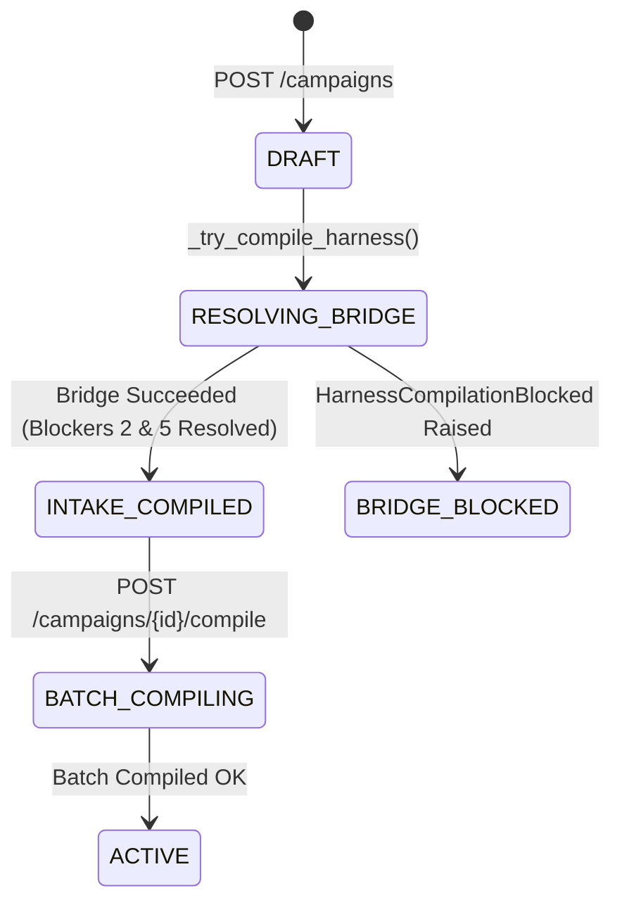

# Implementation Specification: SPEC-CMP-002
# Campaign Boundary Resolution: Blocker 2 & Blocker 5 Harness Integration

**Document ID:** SPEC-CMP-002  
**Version:** 1.0.0  
**Status:** ACCEPTED_AS_AMENDED  
**Classification:** Track A Implementation Specification  
**Authority:** Mandate CA-SPEC-02 (`docs/cae/gemini_execution/26_CA_SPEC_02_PRD_RECONCILIATION_AND_APP_COMPLETION_SPECS_MANDATE.md`)  
**Governing Constitutions:** `F02`, `F03`, `F05`, `TS-APP-BRIDGE-001 §4`, `Sequencing 0-F / 1-C`  
**Date:** 2026-08-26  

---

## 1. Files and Evidence Read

1. `api/routers/campaigns.py` (lines 129–177, 275–304): `_try_compile_harness()` calls `compile_portable_to_intake()` with hardcoded `capability_metadata={}` (tripping Blocker 2) and `workflow=None` (tripping Blocker 5), catching `HarnessCompilationBlocked` and logging generic blocker reasons.
2. `services/pipeline/src/cmf_pipeline/intake/harness_compiler.py` (lines 130–180): Canonical compiler enforcing non-empty `capability_metadata` when `capability_requirements` are declared, and requiring non-null `workflow`.
3. `services/pipeline/src/cmf_pipeline/workflow/application/compiler.py` (lines 45–150): `RuntimeWorkflowCompiler.compile()` - compiles validated execution graphs with node role bindings.
4. `services/pipeline/src/cmf_pipeline/workflow/domain/capability_ownership.py` (lines 20–85): `CapabilityOwnershipGraph` providing canonical metadata and ownership mapping for pipeline capabilities.
5. `services/pipeline/src/cmf_pipeline/workflow/application/service.py` (lines 50–160): `WorkflowRunService` managing state transitions, execution checkpoints, and runtime recovery.

---

## 2. Architectural Role and Boundaries

`SPEC-CMP-002` specifies the architectural bridge resolving the two live blockers that currently prevent atomic harness definitions from compiling into executable campaigns at campaign-creation time.

### Boundaries:
- **In-Scope:**
  - Dynamic derivation of `capability_metadata` via `CapabilityOwnershipGraph` to satisfy Blocker 2.
  - Projection and compilation of canonical 4-node runtime `workflow` graphs (`HUNTER` $\rightarrow$ `COMPOSER` $\rightarrow$ `ANALYST` $\rightarrow$ `COMMANDER`) via `RuntimeWorkflowCompiler` to satisfy Blocker 5.
  - Definition of the `ANALYST` node contract: read-only evaluation (`side_effect_class: READ_ONLY`) over draft programs, declared editorial contracts, and evidence spans, emitting `SemanticAssessment` artifacts with typed assessment-evidence links as epistemic inputs to the human operator gate.
  - Descendant repair loop integration routing detected semantic violations through existing `repair_laws` back to `COMPOSER`.
  - Updating `api/routers/campaigns.py::_try_compile_harness` to wire genuine capabilities and workflow graphs.
  - Granular error distinction in `create_campaign()` returning specific blocker cause (`field`, `reason`) instead of a single hardcoded string.
- **Out-of-Scope (Non-Goals):**
  - Modifying Builder CLI's export format (the bridge adapts `PortableAtomicHarnessDefinition` into Pipeline's execution projection).
  - External non-deterministic agentic planners (workflows adhere to deterministic role topology).

---

## 3. Brownfield Reality & Component Disposition

- **Live Code Anchor:** `api/routers/campaigns.py:163..164`:
  ```python
  intake = compile_portable_to_intake(
      definition,
      semantic_dependencies=[],
      capability_metadata={},  # ← Tripping Blocker 2
      workflow=None,           # ← Tripping Blocker 5
      evaluation_requirements=[],
      repair_laws=[],
  )
  ```
- **Disposition:**
  - Refactor `_try_compile_harness` to instantiate `CapabilityOwnershipGraph` and query registered capabilities for the target harness.
  - Wire `RuntimeWorkflowCompiler` to construct standard 3-node F03 execution graph (`COMPOSER` $\rightarrow$ `HUNTER` $\rightarrow$ `COMMANDER`).
  - Pass synthesized `capability_metadata` and compiled `workflow` object into `compile_portable_to_intake()`.
  - Achieve `ingestion_status: "BRIDGE_SUCCEEDED"` on valid campaign creations.

---

## 4. Functional Requirement Traceability

- **F02 (Atomic Harness Intake & Execution Binding):** Validates and compiles portable harness definitions into intake contracts.
- **F03 (Workflow Node Execution Kernel):** Enforces bounded role taxonomy and topological graph execution.
- **TS-APP-BRIDGE-001 §4 (Blocker 2 & 5 Resolution):** Closes the integration gap between Builder exports and Pipeline intake.

---

## 5. Canonical Object & Schema Contract

```typescript
export interface CapabilityMetadata {
  capability_id: string;
  owner_role: "COMPOSER" | "HUNTER" | "ANALYST" | "COMMANDER";
  execution_boundary: "PIPELINE" | "STUDIO" | "VAE";
  deterministic: boolean;
}

export interface WorkflowNodeProjection {
  node_id: string;
  role: "COMPOSER" | "HUNTER" | "ANALYST" | "COMMANDER";
  boundary: "PIPELINE" | "STUDIO" | "VAE";
  dependencies: string[];
}

export interface RuntimeWorkflowProjection {
  workflow_id: string;
  nodes: WorkflowNodeProjection[];
  entry_node_id: string;
}

export interface CampaignIngestionResult {
  ingestion_status: "BRIDGE_SUCCEEDED" | "BRIDGE_BLOCKED";
  blocked_reason?: string | null;
  intake_sha256?: string | null;
}
```

---

## 6. API Contracts & Endpoint Shapes

### 6.1 Create Campaign with Resolved Bridge
- **Endpoint:** `POST /api/campaigns`
- **Request Body:**
```json
{
  "workspace_id": "ws_01j9a1b2c3d4e5f6g7h8j9k0m1",
  "project_id": "proj_01",
  "category_id": "CAROUSEL",
  "harness_definition_id": "CAR-LST-Olympics-4-5-10",
  "budget_units": 100,
  "autonomy_mode": "SUPERVISED",
  "output_targets": ["INSTAGRAM_CAROUSEL"],
  "idempotency_key": "cmp:ws_01:proj_01:CAR-LST:001"
}
```
- **Response (201 Created):**
```json
{
  "campaign_id": "cmp_01j9c3d4e5f6g7h8j9k0m1n2p3",
  "order_id": "ord_01j9c3d4e5f6g7h8j9k0m1n2p4",
  "workspace_id": "ws_01j9a1b2c3d4e5f6g7h8j9k0m1",
  "project_id": "proj_01",
  "category_id": "CAROUSEL",
  "lifecycle_state": "INTAKE_COMPILED",
  "autonomy_mode": "SUPERVISED",
  "ingestion_status": "BRIDGE_SUCCEEDED",
  "blocked_reason": null,
  "version": 1,
  "created_at": "2026-08-26T12:25:00Z"
}
```

### 6.2 Error Envelope when Blocked (TS-APP-API-004 §5)
```json
{
  "error_code": "HARNESS_COMPILATION_BLOCKED",
  "message": "Harness compilation blocked on field 'capability_metadata': Missing registered capability 'custom_skia_filter'",
  "timestamp": "2026-08-26T12:25:01Z",
  "context": {
    "harness_definition_id": "CAR-LST-Olympics-4-5-10",
    "field": "capability_metadata",
    "reason": "Missing registered capability 'custom_skia_filter'"
  }
}
```

---

## 7. State Machines & Transition Grammar

### Campaign Lifecycle & Intake Compilation


---

## 8. Error Taxonomy & Hard Failures

| Error Code | HTTP Status | Cause | UI / System Action |
|---|---|---|---|
| `HARNESS_NOT_FOUND` | 404 | Harness ID not found in library root | Reject campaign creation; prompt library import |
| `HARNESS_COMPILATION_BLOCKED` | 422 | Unresolvable capability or cyclic workflow graph | Set campaign `ingestion_status: BRIDGE_BLOCKED` with explicit context |
| `INVALID_LIFECYCLE_TRANSITION` | 409 | Attempting to execute campaign before `INTAKE_COMPILED` | Reject batch execution command |

---

## 9. Implementation File Allowlist & Scope Boundary

```
api/
  ├── routers/
  │   └── campaigns.py                   # [MODIFY] Refactor _try_compile_harness and error capture
  └── services/
      └── harness_bridge_service.py      # [NEW] Synthesize capability_metadata and workflow projection
services/pipeline/src/cmf_pipeline/
  └── workflow/
      └── application/
          └── compiler.py                # [CONFIRM] Ensure export compatibility
tests/
  └── api/
      └── test_campaigns_bridge.py       # [NEW] Integration tests for Blocker 2 & 5 resolution
```

---

## 10. Test Plan with Hard Negatives

### Automated Integration & Boundary Tests:
1. **HN-CMP-01 (Reject Empty Capability Metadata on Required Capability):** Compiling a harness with `capability_requirements: ["activative_contract_validation"]` without providing valid capability metadata must raise Blocker 2.
2. **HN-CMP-02 (Reject Missing Workflow Projection):** Calling `compile_portable_to_intake()` with `workflow=None` must raise Blocker 5.
3. **HN-CMP-03 (Accurate Error Attribution):** When Blocker 2 fires, `create_campaign()` must record `field="capability_metadata"` in `blocked_reason`, NEVER mislabeling it as Blocker 5.
4. **HN-CMP-04 (Reject Cyclic Workflow Graph):** Synthesizing an invalid circular dependency in workflow nodes must be caught by `validate_runtime_workflow` and reject compilation.
5. **HN-CMP-05 (Successful Ingestion on Valid Harness):** Compiling a valid harness with synthesized capabilities and F03 workflow must produce `ingestion_status: "BRIDGE_SUCCEEDED"`.

---

## 11. Evidence & Verification Protocol

### Verification Commands:
```bash
# 1. Run pipeline intake & compiler tests
pytest services/pipeline/tests/test_harness_compiler.py -v

# 2. Run campaign router integration tests
pytest tests/api/test_campaigns.py -v
```

---

## 12. Risk Register & Failure Modes

| Risk ID | Description | Impact | Mitigation |
|---|---|---|---|
| `RSK-CMP-01` | Unknown capability requirement declared in custom harness | Medium | Fallback to default capability registry lookup; if unresolvable, record clean `BRIDGE_BLOCKED` status. |
| `RSK-CMP-02` | Workflow role execution mismatch in distributed runtime | Low | Validate all node boundaries against `ProductBoundary` enum prior to sealing intake. |

---

## 13. Rollback & Backout Procedure

1. Restore `api/routers/campaigns.py` to brownfield `_try_compile_harness` implementation.
2. Delete `api/services/harness_bridge_service.py`.

---

## 14. Open Decisions & Human Review Prompts
 
> [!NOTE]
> **OPEN_DECISION DEC-CMP-001 (Default Workflow Role Topology & ANALYST Node Contract):**
> - **Operator Gate Decision:** `ACCEPT AS AMENDED (v2)` (2026-08-26)
> - **Canonical 4-Node Topology:** The default atomic harness execution chain is established as `HUNTER` $\rightarrow$ `COMPOSER` $\rightarrow$ `ANALYST` $\rightarrow$ `COMMANDER` (mirroring `demo.py`'s topology plus one dedicated evaluation node).
> - **ANALYST Node Contract:**
>   - **Role:** `ANALYST`
>   - **Inputs:** Draft-program + declared editorial contract set + evidence spans.
>   - **Output:** `SemanticAssessment` artifact linked to the draft via typed assessment-evidence links.
>   - **Side-Effect Boundary:** Strictly `side_effect_class: READ_ONLY` over the draft artifact.
>   - **Epistemic Role:** Findings serve exclusively as epistemic inputs to the human operator gate; they do not constitute self-standing automated approvals (`COMMANDER` authority remains unchanged).
>   - **Repair Discipline:** Detected contract violations route through existing `repair_laws` (triggering descendant-only execution reruns back to `COMPOSER`).
>   - **Boundary Discipline:** Mechanical validation remains at intake boundaries and is strictly out of `ANALYST` scope.
> - **Topology Extensibility:** Harnesses may override this topology once custom workflow declarations land; the 4-node chain is the platform default baseline, not a fixed constraint.

