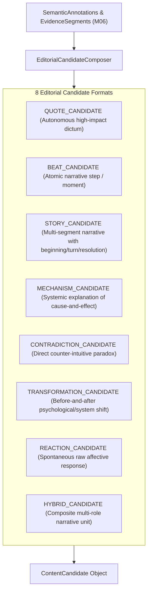

# SPEC-CND-001: Editorial Candidate Formation & Narrative Architecture

**Document ID:** `SPEC-CND-001`  
**Governing Mandate:** `CAE-M07`  
**Status:** `CANONICAL SPECIFICATION`  
**Version:** `1.0.0`  
**Prepared:** 2026-08-28  

---

## 1. Purpose & Scope

This specification defines the domain models, narrative completeness grammar, OLD CMF heritage diagnostic evaluation framework, and verification gates for the **Candidate Intelligence Layer** in CAE.

The Candidate Intelligence Layer synthesizes semantically attributed evidence segments (`CAE-M06`) into typed `ContentCandidate` entities. It establishes the structured editorial units ready for ranking, script compilation, and operator review, without granting premature production approval.

### Strict Prohibitions
* **No Automatic Production Approval:** Candidate formation produces candidates; marking a candidate as `APPROVED_FOR_PRODUCTION` belongs strictly to Operator selection gates in Mandate M10/M12.
* **No Ungrounded Candidates:** Every candidate must trace 100% of its substantive assertions to verified `segment_id` and `annotation_id` evidence links.
* **No Virality as Sole Criterion:** High viral potential or catchy hooks cannot substitute for narrative integrity or factual grounding.
* **No Word-Level Captioning of Whole Transcripts:** Full-transcript captioning remains prohibited in this layer.

---

## 2. The 8 Canonical Candidate Formats

---

## 3. Narrative Completeness Grammar

Every `ContentCandidate` must explicitly state its narrative completeness tier:

| Tier | Definition | Structural Requirements |
| :--- | :--- | :--- |
| `COMPLETE` | Fully self-contained editorial unit that functions autonomously. | Must have Setup/Context, Core Tension/Turn, and Payoff/Resolution. |
| `INTENTIONALLY_OPEN_ENDED` | Socratic inquiry, open paradox, or provocative cliffhanger. | Must possess explicit setup and dilemma, intentionally withholding easy resolution to drive audience reflection. |
| `INCOMPLETE` | Truncated excerpt lacking narrative resolution or essential context. | **REJECTED** from standalone candidate status until supplied with missing contextual antecedents. |

---

## 4. OLD CMF Heritage Diagnostic Scoring Framework

Each candidate computes a multi-axis diagnostic evaluation score based on early 2025 CCF/CMF heritage:

$$\text{Composite CMF Score} = 0.30 \cdot R_{\text{emotional}} + 0.30 \cdot N_{\text{cognitive}} + 0.25 \cdot E_{\text{authority}} + 0.15 \cdot V_{\text{velocity}}$$

Where:
- $R_{\text{emotional}} \in [0.0, 1.0]$: Somatic impact, vulnerability, emotional resonance.
- $N_{\text{cognitive}} \in [0.0, 1.0]$: Conceptual novelty, counter-intuitive insight, anti-cliché index.
- $E_{\text{authority}} \in [0.0, 1.0]$: Lived empirical grounding, first-party proof, specific data/names.
- $V_{\text{velocity}} \in [0.0, 1.0]$: Pacing, rhetorical density, efficient thought delivery.

> [!NOTE]
> CMF scores are advisory diagnostic evaluation signals. They can never override missing evidence or failing narrative completeness gates.
