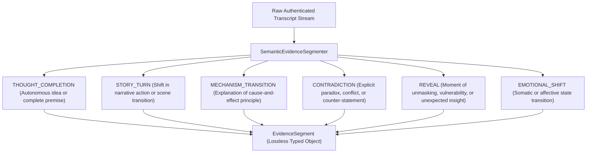

# SPEC-EVD-001: Evidence Segmentation & Semantic Boundary Preservation

**Document ID:** `SPEC-EVD-001`  
**Governing Mandate:** `CAE-M05`  
**Status:** `CANONICAL SPECIFICATION`  
**Version:** `1.0.0`  
**Prepared:** 2026-08-28  

---

## 1. Purpose & Scope

This specification defines the domain contracts, boundary classification, lossless provenance rules, and verification requirements for the **Segmentation Intelligence Layer** in CAE.

The primary objective is to transform raw, authenticated interview transcripts into typed `EvidenceSegment` objects aligned to natural semantic, narrative, and cognitive boundaries, without prematurely captioning or deeply annotating the entire transcript.

### Strict Prohibitions
* **No Word-by-Word Captioning of the Full Transcript:** Captioning consumes heavy resources and is reserved exclusively for selected editorial candidates during production formatting (Mandates M09/M11).
* **No Lossy Fixed-Window Chunking:** Slicing transcripts by mechanical token counts or arbitrary 30-second intervals that truncate sentences mid-thought is prohibited.
* **No Premature Candidate Formation / Scoring:** Ranking or creating `ContentOpportunity` objects from segments belongs to Mandates M06 and M07.
* **No Verbatim Text Rewriting:** Segments must preserve exact transcript wording for auditable legal and editorial attribution.

---

## 2. Semantic Boundary Taxonomy

| Boundary Type | Defining Epistemic Function | Typical Linguistic Marker |
| :--- | :--- | :--- |
| `THOUGHT_COMPLETION` | A self-contained assertion with complete subject-verb-predicate logic. | Full sentence termination, conclusive clause. |
| `STORY_TURN` | A shift in temporal anchor, physical setting, or dramatic action. | *"And then at 2:00 AM...", "Three weeks later..."* |
| `MECHANISM_TRANSITION` | The structural explanation of why a phenomenon occurs. | *"The reason this failed is because...", "The underlying dynamic..."* |
| `CONTRADICTION` | A direct collision against conventional wisdom or internal friction. | *"Everyone thought X, but the data proved Y."* |
| `REVEAL` | An unmasking of hidden reality or admission of personal fault. | *"What I never told anyone was...", "The truth was..."* |
| `EMOTIONAL_SHIFT` | A shift in vocal tone, somatic tension, or vulnerability state. | Pacing pause, breath shift, tone drop. |

---

## 3. Lossless Provenance & Auditability Invariants

Every `EvidenceSegment` must satisfy strict provenance invariants:

1. **Exact Timecode Preservation:** `start_time_ms` and `end_time_ms` must be non-negative integers where `start_time_ms < end_time_ms`. Timecodes across sequential segments must be monotonically non-decreasing.
2. **Lossless Text Concatenation:** Concatenating the verbatim text of all sequential segments must reconstruct the original source transcript with zero dropped words.
3. **SHA-256 Checksum Verification:** Every segment computes a SHA-256 hash of its verbatim text and references the root source transcript hash.
4. **Context Dependency Tracking:** Where a segment contains indexical pronouns (e.g. *"He told me to do it"*), `SegmentContextDependency` links the preceding turn required to resolve the referent.
