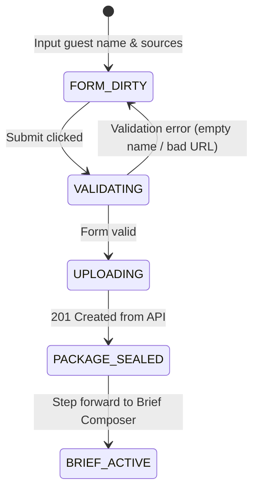

# Implementation Specification: SPEC-GST-UI-001
# Guest Registration & Context Ingestion Interface

**Document ID:** SPEC-GST-UI-001  
**Version:** 1.0.0  
**Status:** ACCEPTED_AS_AMENDED  
**Classification:** Track A Implementation Specification  
**Authority:** Mandate CA-SPEC-02 (`docs/cae/gemini_execution/26_CA_SPEC_02_PRD_RECONCILIATION_AND_APP_COMPLETION_SPECS_MANDATE.md`)  
**Governing Constitutions:** `F21`, `F22`, `FR-APP-004..006`, `MC-CAE-WS-001`  
**Date:** 2026-08-26  

---

## 1. Files and Evidence Read

1. `api/routers/interview_composer.py` (lines 44–122): Live endpoints `POST /api/interviews/compose/research` (multipart form ingestion with SHA-256 asset hashing) and `GET /api/interviews/compose/research/{id}`.
2. `api/schemas/interview_composer.py` (lines 10–55): Pydantic schemas for `GuestResearchPackageResponse`, `UploadedDocumentMetadata`, and `ComposerAuthority`.
3. `apps/web/src/routes/interviews/compose.tsx` (lines 13–60): Stepper-based wizard (`research` $\rightarrow$ `brief` $\rightarrow$ `session`).
4. `apps/web/src/components/interview-composer/ResearchPanel.tsx` (lines 1–120): Research package creation form.
5. `api/services/media_store.py` (lines 15–65): Local media file storage with deterministic UUID pathing and SHA-256 calculation.

---

## 2. Architectural Role and Boundaries

`SPEC-GST-UI-001` specifies the user interface components and state controllers in `apps/web` responsible for onboarding guest subjects, uploading research material (PDFs, transcripts, audio/video notes), capturing source URLs, and binding them into an immutable `GuestResearchPackage` under the active tenant workspace.

### Boundaries:
- **In-Scope:**
  - Guest identity fields (`guest_name`, `project_id`, `workspace_id`).
  - Source URL list management with live URL validation.
  - Per-class tiered upload handling (Documents 50MB, Compressed audio 500MB, WAV 1GB, Video 4GB default).
  - Direct presigned URL uploads to Supabase Storage with resumable/chunked transfer (zero API buffering for files >100MB).
  - Mandatory SHA-256 integrity verification on stored objects prior to `MediaAsset` registration, quarantining corrupted assets per `FR-CAE-TEN-010/011`.
  - Operator authority scope attestation (`operator_id`, `authority_scope`, `assertion_id`).
  - Read-back package inspection view rendering uploaded assets, byte sizes, and verification hashes.
- **Out-of-Scope (Non-Goals):**
  - Automatic Speech Recognition (ASR) audio transcription (transcripts are supplied as text/markdown documents).
  - Web scraping / URL crawling execution.

---

## 3. Brownfield Reality & Component Disposition

- **Live Code Anchor:** `apps/web/src/components/interview-composer/ResearchPanel.tsx` currently has basic input fields for URLs and files, but does not bind to the active `WorkspaceContext` or display uploaded asset hashes.
- **Disposition:**
  - Refactor `ResearchPanel.tsx` to automatically inject `workspace_id` from `WorkspaceContext`.
  - Add client-side drag-and-drop zone in `apps/web/src/components/interview-composer/DocumentDropzone.tsx`.
  - Add authority modal in `apps/web/src/components/interview-composer/AuthorityAssertionModal.tsx`.
  - Display verified `GuestResearchPackageResponse` summary upon creation.

---

## 4. Functional Requirement Traceability

- **FR-APP-004 (Guest Profile Registration):** Operator can create a new guest profile associated with a specific project and tenant workspace.
- **FR-APP-005 (Research Ingestion & Multi-Asset Binding):** Operator can upload multiple reference documents and input source URLs, which are cryptographically hashed and linked to the research package.
- **FR-APP-006 (Authority Scope Attestation):** Creation of a research package requires an explicit operator authority statement and assertion identifier.

---

## 5. Canonical Object & Schema Contract

```typescript
export interface UploadedDocument {
  asset_id: string;
  sha256: string;
  bytes: number;
  media_type: string;
  original_filename: string;
}

export interface ComposerAuthority {
  operator_id: string;
  authority_scope: string;
  assertion_id: string;
}

export interface GuestResearchPackage {
  research_package_id: string;
  revision: number;
  guest_name: string;
  source_urls: string[];
  uploaded_documents: UploadedDocument[];
  idempotent_replay: boolean;
}
```

---

## 6. API Contracts & Endpoint Shapes

### 6.1 Create Guest Research Package
- **Endpoint:** `POST /api/interviews/compose/research`
- **Content-Type:** `multipart/form-data`
- **Form Fields:**
  - `guest_name`: `"Dr. Elena Rostova"`
  - `workspace_id`: `"ws_01j9a1b2c3d4e5f6g7h8j9k0m1"`
  - `project_id`: `"proj_activative_01"`
  - `source_urls_json`: `["https://example.com/interview1", "https://example.com/bio"]`
  - `operator_id`: `"opr_audrey_01"`
  - `authority_scope`: `"INTERVIEW_RESEARCH_LEAD"`
  - `assertion_id`: `"ast_99881122"`
  - `documents`: Binary file attachments
- **Headers:** `Idempotency-Key: research:ws_01j9:proj_01:Elena`
- **Response (201 Created):**
```json
{
  "research_package_id": "grp_01j9b2c3d4e5f6g7h8j9k0m1n2",
  "revision": 1,
  "guest_name": "Dr. Elena Rostova",
  "source_urls": [
    "https://example.com/interview1",
    "https://example.com/bio"
  ],
  "uploaded_documents": [
    {
      "asset_id": "media/ws_01j9/composer/doc1.pdf",
      "sha256": "e3b0c44298fc1c149afbf4c8996fb92427ae41e4649b934ca495991b7852b855",
      "bytes": 1048576,
      "media_type": "application/pdf",
      "original_filename": "transcript_session1.pdf"
    }
  ],
  "idempotent_replay": false
}
```

### 6.2 Get Research Package
- **Endpoint:** `GET /api/interviews/compose/research/{research_package_id}`
- **Response (200 OK):** Same payload as 6.1 with `idempotent_replay: false`.

### 6.3 Error Envelope (TS-APP-API-004 §5)
```json
{
  "error_code": "VALIDATION_FAILED",
  "message": "source_urls_json is not valid JSON: Extra data: line 1 column 4",
  "timestamp": "2026-08-26T12:10:00Z",
  "context": {
    "field": "source_urls_json"
  }
}
```

---

## 7. State Machines & Transition Grammar

### Research Package Ingestion State Flow


- **Illegal Transitions:**
  - Proceeding to `Brief Composer` without a valid `research_package_id` (Blocked by router state guard).
  - Mutating an existing `research_package_id` in-place (Immutable; new revision requires new package creation).

---

## 8. Error Taxonomy & Hard Failures

| Error Code | HTTP Status | Cause | UI Behavior |
|---|---|---|---|
| `VALIDATION_FAILED` | 422 | Malformed JSON in URLs or empty guest name | Display red outline around invalid form control |
| `PAYLOAD_TOO_LARGE` | 413 | Uploaded documents exceed size limit | Show alert: "Total file size exceeds 100MB limit" |
| `UNSUPPORTED_MEDIA_TYPE` | 415 | File extension not in allowed whitelist | Reject file drop with warning toast |
| `NOT_FOUND` | 404 | Invalid `research_package_id` on retrieval | Reset stepper to Step 1 and notify user |

---

## 9. Implementation File Allowlist & Scope Boundary

```
apps/web/src/
  ├── api/
  │   └── interviewComposer.ts           # [MODIFY] Ensure multipart FormData typing
  ├── components/interview-composer/
  │   ├── ResearchPanel.tsx              # [MODIFY] Refactor layout and context injection
  │   ├── DocumentDropzone.tsx           # [NEW] Multi-file drag-and-drop component
  │   ├── SourceUrlList.tsx              # [NEW] Dynamic URL adder / validator
  │   └── AuthorityAssertionModal.tsx    # [NEW] Operator authority confirmation dialog
  └── routes/interviews/
      ├── compose.tsx                    # [MODIFY] Integrate WorkspaceContext and package preview
      └── compose.test.tsx               # [MODIFY] Integration tests for research flow
```

---

## 10. Test Plan with Hard Negatives

### Automated Component & Integration Tests:
1. **HN-GST-01 (Reject Empty Guest Name):** Submitting form with empty `guest_name` must fail client validation and block HTTP dispatch.
2. **HN-GST-02 (Reject Malformed URL):** Adding `"htt://invalid_url"` to source URLs must be rejected by regex validator before form submission.
3. **HN-GST-03 (Reject Disallowed File Type):** Dropping an `.exe` or `.bat` file into `DocumentDropzone` must immediately trigger `UNSUPPORTED_MEDIA_TYPE` rejection.
4. **HN-GST-04 (Enforce Authority Fields):** Form submission must be blocked if `operator_id`, `authority_scope`, or `assertion_id` is blank.
5. **HN-GST-05 (Verify Idempotent Replay Display):** Resubmitting identical form data with same `Idempotency-Key` must successfully render existing package and set badge to `Replay`.

---

## 11. Evidence & Verification Protocol

### Verification Commands:
```bash
# 1. Run web unit tests for interview composer
cd apps/web && npm test src/routes/interviews/compose.test.tsx

# 2. Test API multipart ingestion via pytest
pytest tests/api/test_interviews_import.py -v
```

---

## 12. Risk Register & Failure Modes

| Risk ID | Description | Impact | Mitigation |
|---|---|---|---|
| `RSK-GST-01` | Browser network drop during large file upload | Medium | Chunked multipart progress bar with retry button. |
| `RSK-GST-02` | Accidental navigation loss before package creation | Low | TanStack Router `beforeLoad` / `useBlocker` confirmation prompt when form is dirty. |

---

## 13. Rollback & Backout Procedure

1. Revert `ResearchPanel.tsx` to basic input fields.
2. Remove `DocumentDropzone.tsx` and `AuthorityAssertionModal.tsx`.
3. Restore `apps/web/src/routes/interviews/compose.tsx`.

---

## 14. Open Decisions & Human Review Prompts
 
> [!NOTE]
> **OPEN_DECISION DEC-GST-001 (Guest File Upload Limits, Whitelist & Transfer Architecture):**
> - **Operator Gate Decision:** `ACCEPT AS AMENDED (v2)` (2026-08-26)
> - **Per-Class Upload Tiers:** Replaced single global 100MB cap with granular per-class limits:
>   - **Documents:** `50MB` (`application/pdf`, `application/vnd.openxmlformats-officedocument.wordprocessingml.document`, `text/plain`, `text/markdown`)
>   - **Compressed Audio:** `500MB` (`audio/mp4` / `m4a`, `audio/mpeg` / `mp3`)
>   - **Uncompressed Audio:** `1GB` (`audio/wav`)
>   - **Video:** `4GB` default via `CA_MEDIA_MAX_VIDEO_MB` environment variable override (`video/mp4`, `video/quicktime` / `mov`)
> - **Direct Presigned Upload Pipeline:** All file transfers MUST use backend-issued presigned URLs directly targeting Supabase Storage with resumable/chunked upload protocols. Zero multipart-through-API buffering permitted for any payload over 100MB.
> - **Mandatory Quarantine Integrity Gate:** Backend executes cryptographic SHA-256 validation against the stored Supabase Storage object before creating or updating the `MediaAsset` registration. Any checksum mismatch triggers immediate quarantine per `FR-CAE-TEN-010/011`.
> - **Staging Storage Configuration:** Supabase Storage bucket object-size quota raised to match the 4GB video tier.

