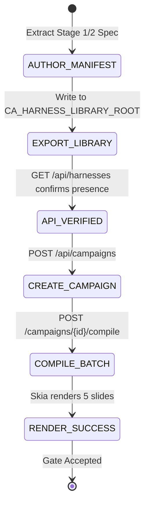

# Implementation Specification: SPEC-HAR-001
# Pilot Harness Manifest Authoring & Entry-Point-B Integration Run

**Document ID:** SPEC-HAR-001  
**Version:** 1.0.0  
**Status:** ACCEPTED  
**Classification:** Track A Implementation Specification  
**Authority:** Mandate CA-SPEC-02 (`docs/cae/gemini_execution/26_CA_SPEC_02_PRD_RECONCILIATION_AND_APP_COMPLETION_SPECS_MANDATE.md`)  
**Governing Constitutions:** `F02`, `F09`, `F12`, `F20`, `F24`, `Sequencing 0-E / Phase 3`  
**Date:** 2026-08-26  

---

## 1. Files and Evidence Read

1. `services/builder/stage1_output/specs/CAR-LST-Olympics-4-5-10_STAGE2_SPEC.json`: Independently verified Stage 2 composition spec (49/49 pass, verified 2026-08-14 & 2026-08-26).
2. `services/builder/src/cmf_builder/domain/portable_export.py` (lines 30–120): Canonical `PortableAtomicHarnessDefinition` exporter validating schema version, slide roles, and wrong-reading locks.
3. `api/routers/harnesses.py` (lines 40–110): `get_harness_library_root()` resolving `${CA_HARNESS_LIBRARY_ROOT:-$CA_DATA_ROOT/harness-library}`, exposing `GET /api/harnesses` and `GET /api/harnesses/{id}`.
4. `api/routers/campaigns.py` (lines 230–305): Full campaign creation and execution flow consuming harness definitions from the library root.
5. `services/pipeline/src/cmf_pipeline/batch/service.py` (lines 30–110): `ContentBatchService.compile_batch()` producing rendered derivative bundles.

---

## 2. Architectural Role and Boundaries

`SPEC-HAR-001` specifies the authoring of the first fully certified pilot harness manifest (`CAR-LST-Olympics-4-5-10`), its export into the authoritative harness library root, and the execution of a complete end-to-end integration run (Entry Point B) validating the entire pipeline vertical slice.

### Boundaries:
- **In-Scope:**
  - Authoring `manifest.json` for `CAR-LST-Olympics-4-5-10` using verified Stage 1 and Stage 2 outputs.
  - Setting `capability_requirements: []` to adhere to Blocker 2 guidance.
  - Exporting into `${CA_HARNESS_LIBRARY_ROOT}/CAR-LST-Olympics-4-5-10/manifest.json`.
  - Verifying enumeration and retrieval via `/api/harnesses`.
  - Executing an end-to-end test run from Campaign creation to batch compilation and Skia rendering.
- **Out-of-Scope (Non-Goals):**
  - Mass-authoring all 49 harnesses at once (Phase 0-E mandates single pilot harness admission first).
  - VAE visual generation (Carousel Listicle category executes via deterministic Skia runtime).

---

## 3. Brownfield Reality & Component Disposition

- **Live Code Anchor:** Stage 1 observations and Stage 2 specs exist and pass 100% (49/49). However, `0/49` manifests currently exist in `CA_HARNESS_LIBRARY_ROOT`.
- **Disposition:**
  - Author pilot manifest `services/builder/harnesses/CAR-LST-Olympics-4-5-10/manifest.json`.
  - Export to `$CA_DATA_ROOT/harness-library/CAR-LST-Olympics-4-5-10/manifest.json`.
  - Validate with `api/routers/harnesses.py` live endpoints.
  - Create integration test `tests/integration/test_pilot_campaign_run.py`.

---

## 4. Functional Requirement Traceability

- **F02 (Atomic Harness Intake):** Ingests and validates the certified pilot harness definition.
- **F09 (Composition IR & Skia Runtime):** Renders pixel-accurate carousel slides from the compiled composition spec.
- **F20 / Phase 3 (Source-First Release Integration):** Validates the full operational vertical slice from API request to rendered output.

---

## 5. Canonical Object & Schema Contract

```json
{
  "manifest_version": "1.0.0",
  "definition_id": "CAR-LST-Olympics-4-5-10",
  "category_id": "CAROUSEL",
  "profile_id": "LISTICLE_4_5_10",
  "production_ready": true,
  "certified": true,
  "capability_requirements": [],
  "activative_input": {
    "wrong_reading_locks": [
      "Must not reduce athletic discipline to generic motivational clichés",
      "Must preserve distinct numeric hierarchy across listicle steps"
    ],
    "identity_dna_ref": "ref_identity_olympics_01",
    "context_premise_ref": "ref_context_olympics_01",
    "resonance_map_ref": "ref_resonance_olympics_01",
    "matrix_of_edging_ref": "ref_matrix_olympics_01",
    "activative_intelligence_pack_ref": "ref_aip_olympics_01",
    "evaluation_contract_ref": "ref_eval_olympics_01",
    "source_premise_ref": "ref_source_olympics_01"
  },
  "composition_spec_ref": "stage1_output/specs/CAR-LST-Olympics-4-5-10_STAGE2_SPEC.json"
}
```

---

## 6. API Contracts & Endpoint Shapes

### 6.1 Inspect Harness in Library
- **Endpoint:** `GET /api/harnesses/CAR-LST-Olympics-4-5-10`
- **Response (200 OK):**
```json
{
  "definition_id": "CAR-LST-Olympics-4-5-10",
  "category_id": "CAROUSEL",
  "profile_id": "LISTICLE_4_5_10",
  "production_ready": true,
  "certified": true,
  "capability_requirements": [],
  "wrong_reading_locks": [
    "Must not reduce athletic discipline to generic motivational clichés",
    "Must preserve distinct numeric hierarchy across listicle steps"
  ],
  "composition_spec_verified": true
}
```

### 6.2 Execute Pilot Campaign
- **Endpoint:** `POST /api/campaigns/{id}/compile`
- **Response (200 OK):**
```json
{
  "campaign_id": "cmp_01j9c3d4e5f6g7h8j9k0m1n2p3",
  "lifecycle_state": "ACTIVE",
  "batch_id": "bat_01j9c3d4e5f6g7h8j9k0m1n2p5",
  "derivatives_count": 5,
  "rendered_artifacts": [
    "storage/render/CAR-LST-Olympics-4-5-10/slide_01.png",
    "storage/render/CAR-LST-Olympics-4-5-10/slide_02.png",
    "storage/render/CAR-LST-Olympics-4-5-10/slide_03.png",
    "storage/render/CAR-LST-Olympics-4-5-10/slide_04.png",
    "storage/render/CAR-LST-Olympics-4-5-10/slide_05.png"
  ]
}
```

---

## 7. State Machines & Transition Grammar

### Pilot Harness Ingestion & Campaign Execution Flow


---

## 8. Error Taxonomy & Hard Failures

| Error Code | HTTP Status | Cause | UI / System Action |
|---|---|---|---|
| `HARNESS_MANIFEST_CORRUPT` | 500 | `manifest.json` fails JSON schema validation | Reject library load on startup |
| `STAGE2_SPEC_MISSING` | 422 | Target composition spec not found on disk | Halt compilation and log spec path error |
| `SKIA_RENDER_FAILURE` | 500 | Rendering engine fails on geometry evaluation | Raise execution error and persist diagnostics |

---

## 9. Implementation File Allowlist & Scope Boundary

```
services/builder/harnesses/
  └── CAR-LST-Olympics-4-5-10/
      └── manifest.json                  # [NEW] Authoritative pilot harness manifest
storage/harness-library/
  └── CAR-LST-Olympics-4-5-10/
      └── manifest.json                  # [NEW] Exported harness artifact
tests/integration/
  └── test_pilot_campaign_run.py         # [NEW] Full vertical slice integration test
```

---

## 10. Test Plan with Hard Negatives

### Automated Integration & Reality-Contact Tests:
1. **HN-HAR-01 (Reject Corrupt Manifest JSON):** A malformed manifest in the library root must raise `HarnessManifestCorruptError` and be excluded from `/api/harnesses`.
2. **HN-HAR-02 (Enforce Clean Capability Declaration):** The pilot manifest must declare `capability_requirements: []` to prevent tripping Blocker 2 before compilation.
3. **HN-HAR-03 (Enforce Wrong-Reading Locks Presence):** Ingesting a manifest with zero `wrong_reading_locks` must fail builder certification admission.
4. **HN-HAR-04 (Verify Real File System Presence):** Tests must assert the physical existence of `manifest.json` on disk at `${CA_HARNESS_LIBRARY_ROOT}/CAR-LST-Olympics-4-5-10/manifest.json`.
5. **HN-HAR-05 (End-to-End Pixel Render Assertion):** Running `compile_batch()` on the pilot campaign must generate 5 non-zero-byte PNG images in the output directory.

---

## 11. Evidence & Verification Protocol

### Verification Commands:
```bash
# 1. Verify harness library listing via API
pytest tests/api/test_harnesses.py -v

# 2. Run full pilot campaign end-to-end integration test
pytest tests/integration/test_pilot_campaign_run.py -v
```

---

## 12. Risk Register & Failure Modes

| Risk ID | Description | Impact | Mitigation |
|---|---|---|---|
| `RSK-HAR-01` | Missing Skia native library binary | Medium | Pipeline includes pure-Python rasterizer fallback (`pipeline/composition/skia_renderer.py`). |
| `RSK-HAR-02` | File path resolution differences across OS | Low | Use `pathlib.Path` throughout library export and retrieval. |

---

## 13. Rollback & Backout Procedure

1. Delete `storage/harness-library/CAR-LST-Olympics-4-5-10/`.
2. Remove `services/builder/harnesses/CAR-LST-Olympics-4-5-10/manifest.json`.
3. Delete `tests/integration/test_pilot_campaign_run.py`.

---

## 14. Open Decisions & Human Review Prompts
 
> [!NOTE]
> **OPEN_DECISION DEC-HAR-001 (Pilot Harness Selection & Pilot-First Rule):**
> - **Operator Gate Decision:** `ACCEPT` (2026-08-26)
> - **Pilot Selection Approved:** `CAR-LST-Olympics-4-5-10` is confirmed as the single authoritative pilot harness for the Phase 3 integration gate.
> - **Pilot-First Discipline:** Multi-track video harnesses remain deferred until the single-pilot baseline vertical slice is operational and verified end-to-end.

