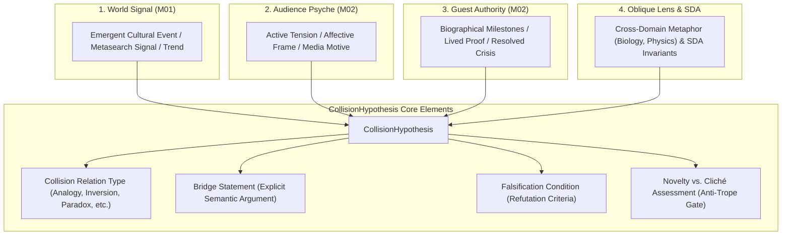

# SPEC-HYP-001: Collision Hypothesis & Multi-World Intersection

**Document ID:** `SPEC-HYP-001`  
**Governing Mandate:** `CAE-M03`  
**Status:** `CANONICAL SPECIFICATION`  
**Version:** `1.0.0`  
**Prepared:** 2026-08-28  

---

## 1. Purpose & Scope

This specification defines the domain contracts, composition grammar, collision relation taxonomy, falsification standards, and verification requirements for the **Collision Intelligence Layer** in CAE.

The Collision Intelligence Layer operates between the Relational Intelligence Layer (`CAE-M02`) and Interview Planning (`CAE-M04`). Its primary role is to intersect empirical World Signals, Audience acute tensions, Guest lived authority, Structural Dynamics of Activation (SDA) invariants, and Oblique Lenses into grounded `CollisionHypothesis` objects.

### Strict Prohibitions
* **No Interview Brief / Question Generation:** A hypothesis defines an editorial collision field; turning it into specific elicitation turns or question sequences belongs to Mandate `CAE-M04`.
* **No Publication from Hypothesis Alone:** A hypothesis is an unproven thesis; it cannot be published directly or treated as factual truth without interview elicitation and empirical verification.
* **No Vector Proximity Fallacy:** Semantic embedding similarity is strictly a retrieval heuristic and must never be equated with factual truth or editorial validity.
* **No "Viral Score = Truth":** High engagement or novelty metrics cannot override missing evidence or lack of guest lived authority.

---

## 2. The 4-World Collision Field

---

## 3. Collision Relation Taxonomy

A `CollisionHypothesis` must declare its structural relation type:

| Relation Type | Semantic Definition | Example Collision |
| :--- | :--- | :--- |
| `ANALOGY` | Maps structural invariants from an external domain to the guest-audience tension. | *"Neural pruning during deep sleep mirrors corporate organization restructuring."* |
| `INVERSION` | Flips an established default assumption into its opposite. | *"High motivation is not the cause of action, but the biological byproduct of early action."* |
| `PARADOX` | Reconciles two seemingly contradictory truths held simultaneously. | *"Extreme vulnerability produces impenetrable psychological resilience."* |
| `SYSTEMS_LENS` | Reframes an individual failure or tension as a structural feedback loop. | *"Burnout is not personal weakness, but the rational optimization of an unconstrained incentive system."* |
| `COUNTER_POSITION` | Directly challenges a consensus dogma with guest's contrarian lived proof. | *"Standard industry advice to 'diversify' is a defensive mask for lack of conviction."* |

---

## 4. Falsification & Anti-Centroid Standards

Every valid `CollisionHypothesis` must satisfy three non-negotiable verification gates:

1. **Grounded Guest Authority:** The guest must possess verifiable biographical evidence or lived proof relevant to the bridge statement. Clever analogies without guest lived authority are rejected with `UngroundedAnalogyError`.
2. **Explicit Falsification Condition:** The hypothesis must state what empirical evidence, counter-example, or guest testimony would disprove the thesis. Unfalsifiable claims are rejected with `MissingFalsificationError`.
3. **Anti-Cliché & Trope Penalty:** If a hypothesis recombines generic viral buzzwords ("10x your productivity with morning routines") without unique guest lived proof, it is quarantined with `ClicheTropeError`.
