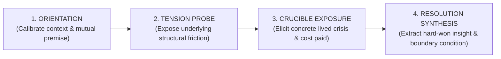

# SPEC-INT-001: Interview Semantic Program & Human-First Elicitation

**Document ID:** `SPEC-INT-001`  
**Governing Mandate:** `CAE-M04`  
**Status:** `CANONICAL SPECIFICATION`  
**Version:** `1.0.0`  
**Prepared:** 2026-08-28  

---

## 1. Purpose & Human-First Doctrine

This specification defines the domain models, question progression grammar, Matrix of Edging protocols, adaptive follow-up policies, and verification standards for the **Interview Intelligence Layer** in CAE.

The foundational doctrine governing this layer is:
> **The system does the structuring; the Guest does the talking.**

The AI never scripts the guest's answers, never forces confirmation of an editorial hypothesis, and never replaces authentic lived experience with simulated conversational compliance.

### Strict Prohibitions
* **No Leading / Scripted Questions:** Questions must not embed their own desired answers (e.g. *"Don't you agree that X is Y?"* is strictly rejected).
* **No Premature Content Generation:** This layer outputs interview briefs and evaluates elicitation turns; it does not generate finished articles, hooks, or social video scripts (deferred to Mandates M05+).
* **No False-Success Pass on Generic Slop:** An interview session that executes all turns but produces vague, platitudinous, or unauthenticated responses must be marked `INCOMPLETE`.

---

## 2. The 4-Stage Question Progression Grammar

An `InterviewBrief` organizes elicitation into four distinct epistemological stages:



| Stage | Epistemic Goal | Allowed Formats | Example Question Archetype |
| :--- | :--- | :--- | :--- |
| `ORIENTATION` | Anchor context and establish safety. | Open factual ground. | *"When you first took over the ICU unit in 2021, what was the unspoken reality nobody was talking about?"* |
| `TENSION_PROBE` | Surface the collision between two competing values. | Dilemma exploration. | *"Where did standard medical protocol directly collide with patient survival?"* |
| `CRUCIBLE_EXPOSURE` | Require specific, sensory, verifiable autobiographical evidence. | Specific scene request. | *"Take me to the exact moment you realized the existing system had failed. What was the tangible cost paid?"* |
| `RESOLUTION_SYNTHESIS` | Extract generalizable, non-obvious insight. | Boundary & mechanism synthesis. | *"Looking back, what is the single counter-intuitive rule you now operate by that younger leaders would reject?"* |

---

## 3. Matrix of Edging & Adaptive Probing

The Matrix of Edging applies controlled psychological and intellectual pressure to move past canned public-relations soundbites into authentic lived truth.

```
┌────────────────────────────────────────────────────────────────────────────────────────────────────────┐
│                                       ADAPTIVE FOLLOW-UP RULES                                         │
├───────────────────────────┬───────────────────────────────────┬────────────────────────────────────────┤
│ Observed Guest Signal     │ Psychological Mechanism           │ Prescribed Adaptive Probing Strategy   │
├───────────────────────────┼───────────────────────────────────┼────────────────────────────────────────┤
│ Intellectualization       │ Guest retreats to abstract theory │ Request concrete sensory scene / time: │
│                           │ to avoid emotional vulnerability. │ *"What did that look like on Tuesday?" │
├───────────────────────────┼───────────────────────────────────┼────────────────────────────────────────┤
│ High Vagueness / Slop     │ Guest provides generic platitudes │ Ask for specific numbers, costs, names:│
│                           │ or corporate talking points.      │ *"What was the exact dollar cost?"     │
├───────────────────────────┼───────────────────────────────────┼────────────────────────────────────────┤
│ Defensive Stance          │ Guest hardens ego-defense around  │ Mirror emotional stance and pivot to   │
│                           │ controversial topic.              │ external systemic perspective.         │
└───────────────────────────┴───────────────────────────────────┴────────────────────────────────────────┘
```
