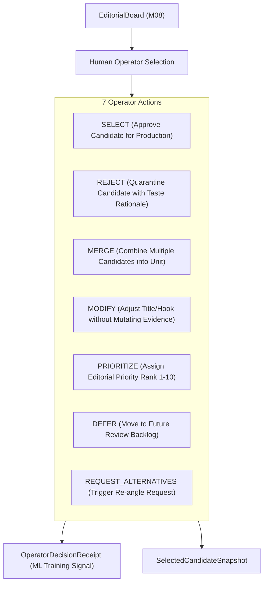

# SPEC-OPS-001: Human-in-the-Loop Operator Editorial Selection Gate

**Document ID:** `SPEC-OPS-001`  
**Governing Mandate:** `CAE-M09`  
**Status:** `CANONICAL SPECIFICATION`  
**Version:** `1.0.0`  
**Prepared:** 2026-08-28  

---

## 1. Purpose & Scope

This specification defines the domain contracts, operator state transitions, decision receipts, learning feedback signals, and verification standards for the **Operator Intelligence Layer** in CAE.

The Operator Intelligence Layer establishes the human-in-the-loop selection gate. It presents the evaluated `EditorialBoard` (from `CAE-M08`) to the human Operator, executing 7 typed editorial actions (`SELECT`, `REJECT`, `MERGE`, `MODIFY`, `PRIORITIZE`, `DEFER`, `REQUEST_ALTERNATIVES`) and capturing decision receipts to fine-tune future evaluations.

### Strict Prohibitions
* **No Silent Auto-Selection:** Algorithmic scores and CMF metrics inform the Operator, but never silently approve content. The highest-scoring candidate remains unapproved until explicitly selected by human action.
* **No Evidence Mutation:** Framing edits, title revisions, or hook modifications may adjust candidate presentation fields, but MUST NOT alter underlying evidence transcript text or SHA-256 hashes.
* **No Unauthenticated or Rationale-Free Approvals:** Every operator decision must record a valid `operator_id` and explicit rationale.
* **No Auto-Publishing:** Selected candidates transition to `APPROVED_FOR_PRODUCTION` to enter asset intelligence (M10) and production scripting (M11), but are not automatically published.

---

## 2. The 7 Typed Operator Actions

---

## 3. Decision Receipt & Learning Signal Protocol

Every action emits an immutable `OperatorDecisionReceipt`:
- `receipt_id`: Unique identifier (`RCP-*`).
- `operator_id`: Human identifier (e.g. `OP-LEAD-EDITOR-01`).
- `candidate_id`: Target candidate ID.
- `action_type`: One of the 7 actions.
- `rationale`: Verifiable reason explaining taste and editorial intent.
- `taste_delta`: Comparative feedback between algorithmic score and human judgment.
- `timestamp`: UTC ISO-8601.
