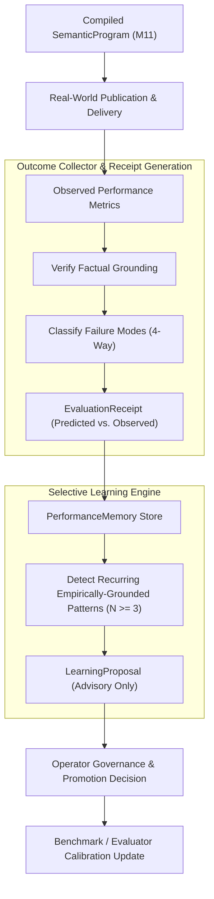

# SPEC-OUT-001: Outcome Intelligence, Selective Learning & Anti-Reward-Hacking

**Document ID:** `SPEC-OUT-001`  
**Governing Mandate:** `CAE-M12`  
**Status:** `CANONICAL SPECIFICATION`  
**Version:** `1.0.0`  
**Prepared:** 2026-08-28  

---

## 1. Purpose & Scope

This specification defines the domain contracts, failure-mode taxonomy, selective learning rules, and anti-reward-hacking verification standards for the **Outcome Intelligence Layer** in CAE.

Outcome Intelligence closes the loop between upstream editorial predictions and observed real-world performance across semantic, perceptual, distribution, commercial, and operator taste dimensions. It enables selective, empirically-grounded evolution of evaluators and benchmarks without allowing isolated performance noise to corrupt canonical doctrine.

### Strict Prohibitions
* **No Automatic Ontology Mutation:** Isolated outcome signals CANNOT automatically modify canonical schemas, registries, or story arcs without Operator ratification.
* **No Engagement as Truth:** Viral reach or high view counts gained without factual grounding or semantic coherence is treated as an adversarial failure, not a positive learning signal.
* **No Score Laundering / Deleting Negatives:** Negative outcomes and polarized evaluator disagreements MUST be permanently preserved.
* **No Averaged Disagreement Concealment:** Discrepancies between evaluators or operators must remain transparent and auditable.

---

## 2. Failure-Mode Differentiation

Outcome analysis must distinguish four distinct failure classes:
1. `SEMANTIC_FAILURE`: The core thesis, collision logic, or evidence interpretation was flawed or invalid.
2. `PERCEPTUAL_FAILURE`: The visual editing, pacing, kinetic typography, or auditory delivery was dead, awkward, or distracting.
3. `DISTRIBUTION_FAILURE`: The piece was semantically and perceptually sound, but failed due to adverse distribution timing, algorithmic suppression, or inappropriate audience targeting.
4. `GROUNDING_FAILURE`: The piece achieved high engagement through sensationalized distortion, clickbait framing, or ungrounded claims (Reward Hack).

---

## 3. Selective Learning Protocol

