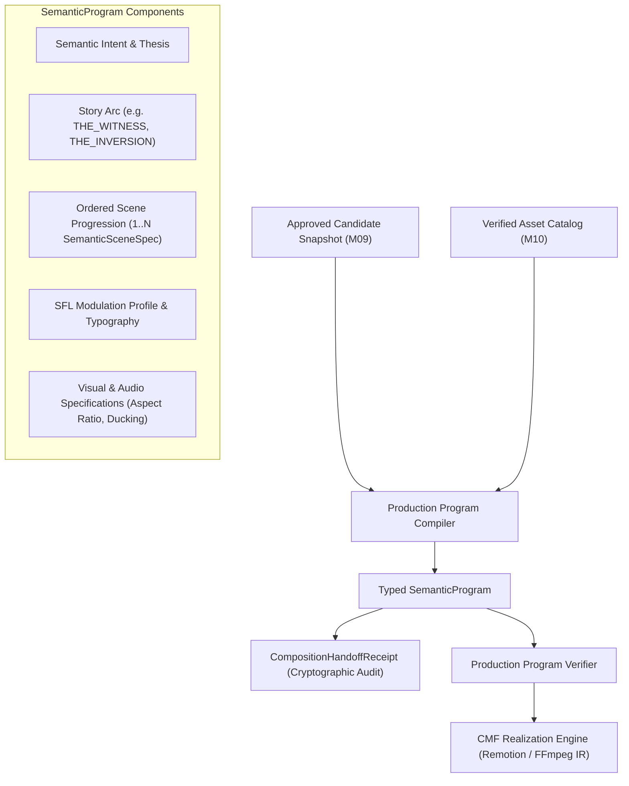

# SPEC-PRG-001: Production Semantic Program & Upstream Semantic Authority

**Document ID:** `SPEC-PRG-001`  
**Governing Mandate:** `CAE-M11`  
**Status:** `CANONICAL SPECIFICATION`  
**Version:** `1.0.0`  
**Prepared:** 2026-08-28  

---

## 1. Purpose & Scope

This specification defines the compilation contracts, scene progression schemas, upstream semantic authority invariants, and composition handoff protocols for the **Production Semantic Program Layer** in CAE.

The Production Semantic Program compiles Operator-approved editorial candidates (`CAE-M09`) and verified multimodal asset catalogs (`CAE-M10`) into a typed `SemanticProgram`. This program provides a deterministic blueprint for downstream CMF realization engines (Scene, Composition, Visual Syntax, Remotion/FFmpeg IR) without permitting downstream components to re-decide meaning.

### Strict Prohibitions
* **No Downstream Semantic Re-Deciding:** Downstream renderers realize visual layout, typography, and video pacing, but CANNOT alter the underlying spoken evidence, thesis, or story arc.
* **No Silent Evidence Substitution:** The verbatim spoken segments in the compiled program are locked to upstream `EvidenceSegment` SHA-256 checksums.
* **No Unapproved Asset Injections:** Renderers may only load assets present in the compiled program's verified asset catalog.
* **No Story Arc Mutation:** The structural narrative arc container approved by the Operator is immutable during rendering.

---

## 2. Program Structure & Scene Progression

---

## 3. Composition Handoff Receipt Protocol

Every compilation emits an immutable `CompositionHandoffReceipt`:
- `receipt_id`: Unique identifier (`PRG-RCP-*`).
- `program_id`: Target `SemanticProgram` identifier.
- `candidate_id`: Source candidate ID.
- `compiler_version`: Compiler release version.
- `evidence_sha256_list`: Locked list of spoken evidence checksums.
- `asset_id_list`: Locked list of verified asset identifiers.
- `created_at`: UTC ISO-8601 timestamp.
