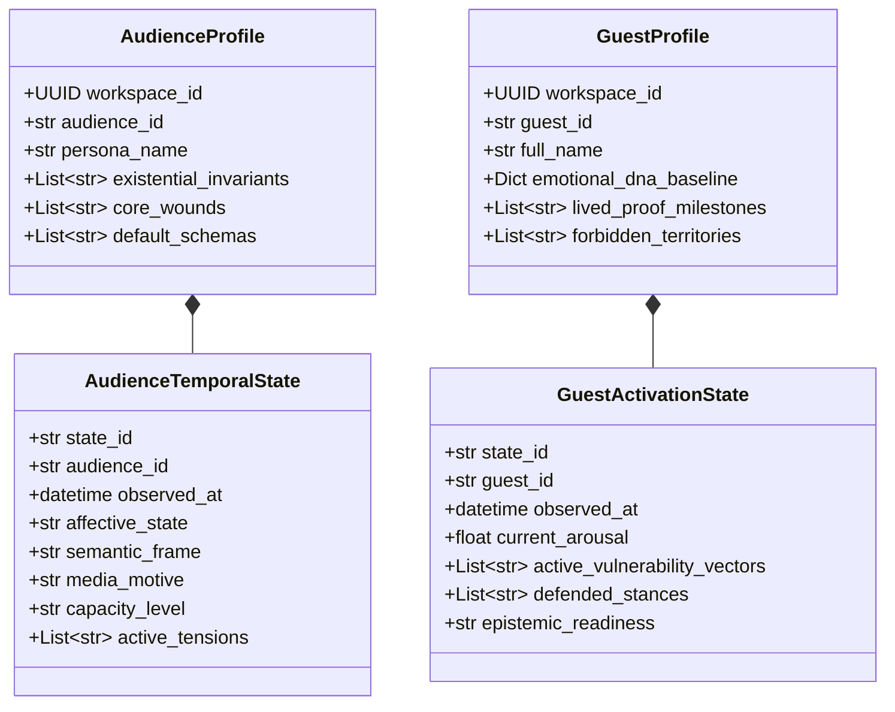

# SPEC-REL-001: Audience × Guest State Synthesis & Relational Intelligence

**Document ID:** `SPEC-REL-001`  
**Governing Mandate:** `CAE-M02`  
**Status:** `CANONICAL SPECIFICATION`  
**Version:** `1.0.0`  
**Prepared:** 2026-08-28  

---

## 1. Purpose & Architectural Boundaries

This specification defines the domain contracts, temporal state separation, four-axis relational evidence model, tenant containment rules, and verification requirements for the **Relational Intelligence Layer** in CAE.

The Relational Intelligence Layer maps the psycho-emotional state of the target audience and the lived authority of the guest without prematurely jumping to content generation.

### Strict Prohibitions
* **No Content Drafting / Opportunity Synthesis:** This layer models relational states and congruences. Generating specific content topics or script angles is strictly deferred to Mandate `CAE-M03`.
* **No Cross-Workspace Identity Merging:** Guest entities are strictly workspace-local. Automatic merging across tenant boundaries based on name, email, or biometric similarity is constitutionally forbidden (`CA-CAN-01B`).
* **No Unprovenanced Temporal State:** Dynamic state claims must possess verified observation timestamps and source evidence.

---

## 2. Persistent Schema vs. Dynamic Temporal State

A critical failure in relational AI is confusing persistent identity/schema with transient affective conditions. This layer models both axes separately:



---

## 3. The Four-Axis Relational Evidence Framework

Relational congruence between Guest and Audience is never reduced to a single opaque vector cosine similarity. In alignment with CCP and Moral Foundations research, congruence requires explicit evidence across four distinct psychological axes:

```
┌────────────────────────────────────────────────────────────────────────────────────────────────────────┐
│                                   THE 4-AXIS RELATIONAL FRAMEWORK                                      │
├───────────────────────────┬───────────────────────────────────┬────────────────────────────────────────┤
│ Axis                      │ Theoretical Origin                │ Metric Space & Classifications         │
├───────────────────────────┼───────────────────────────────────┼────────────────────────────────────────┤
│ 1. Moral Foundation       │ Haidt (Moral Foundations Theory)  │ Care/Harm, Fairness/Cheating, Loyalty, │
│                           │                                   │ Authority, Sanctity, Liberty           │
├───────────────────────────┼───────────────────────────────────┼────────────────────────────────────────┤
│ 2. Coping Potential       │ Lazarus (Cognitive Appraisal)     │ Problem-Focused, Emotion-Focused,      │
│                           │                                   │ Helplessness, Avoidance                │
├───────────────────────────┼───────────────────────────────────┼────────────────────────────────────────┤
│ 3. Agency Attribution     │ Weiner (Attribution Theory)       │ Internal, External, Systemic, Fate     │
├───────────────────────────┼───────────────────────────────────┼────────────────────────────────────────┤
│ 4. Temporal Position      │ Narrative Psychology              │ Past Trauma, Present Acute Struggle,   │
│                           │                                   │ Future Crisis, Transcended Resolution  │
└───────────────────────────┴───────────────────────────────────┴────────────────────────────────────────┘
```

### Non-Compensable Congruence Rule
High alignment in one axis (e.g. sharing a Moral Foundation of "Liberty") **cannot compensate** for complete divergence in the other three axes (e.g., Guest has Transcended Problem-Solving agency while Audience is in Acute Helplessness with zero shared tension).

---

## 4. Relational Graph Contracts

1. **`GuestExperiencedTension`**: Records that a specific guest personally lived, struggled with, or resolved a specific tension, backed by verifiable onboarding/interview citations.
2. **`AudienceExperiencesTension`**: Records that the target audience is currently grappling with a specific tension.
3. **`GuestAudienceCongruence`**: Represents the synthesized relational bridge between Audience and Guest states, carrying full 4-axis evidence breakdowns and workspace lineage.
