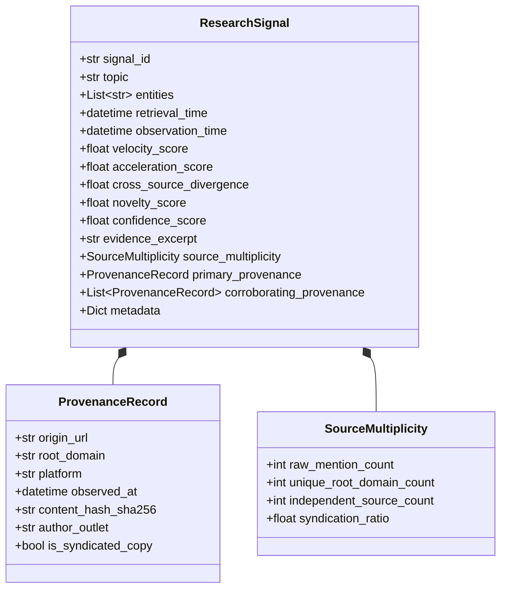

# SPEC-RSRCH-001: World Signal Ingestion & Provenance Verification

**Document ID:** `SPEC-RSRCH-001`  
**Governing Mandate:** `CAE-M01`  
**Status:** `CANONICAL SPECIFICATION`  
**Version:** `1.0.0`  
**Prepared:** 2026-08-28  

---

## 1. Purpose & Scope

This specification defines the contract, ingestion boundaries, normalization grammar, source multiplicity model, and verification requirements for the **World Intelligence Layer** in CAE.

The World Intelligence Layer is responsible for transforming raw external observations (from search engines, social platforms, news feeds, prediction markets, and forum discussions) into immutable, provenance-bearing `ResearchSignal` objects.

### Non-Goals (Strict Prohibitions)
* **No Guest Conditioning:** `ResearchSignal` objects represent facts about the external world; they must not contain guest ratings or emotional DNA hypotheses.
* **No Interview Elicitation:** Signals do not contain interview questions or psychological edging plans.
* **No Direct Publication:** A `ResearchSignal` is an environmental observation, not an authorized content candidate or publication recommendation.

---

## 2. Domain Data Model

---

## 3. Signal Parameters (14 Feature Space)

In alignment with CCP and SearXNG metasearch intelligence, each `ResearchSignal` captures 14 analytical features:

| Parameter Category | Feature Name | Range | Description |
| :--- | :--- | :--- | :--- |
| **Query & Topic Level** | `velocity_score` | $[0.0, 1.0]$ | Frequency of query / entity mentions over the last 24h/7d window. |
| | `acceleration_score` | $[0.0, 1.0]$ | 2nd derivative of velocity (detects inflection points before consensus). |
| | `novelty_score` | $[0.0, 1.0]$ | Semantic distance from established discourse baselines. |
| | `mutation_rate` | $[0.0, 1.0]$ | Rate of lexical/framing drift across discussions. |
| **Cross-Engine & Platform** | `engine_agreement` | $[0.0, 1.0]$ | Ratio of top search engines ranking the topic in top 10. |
| | `cross_source_divergence` | $[0.0, 1.0]$ | Disparity in framing between platforms (e.g., Reddit vs News vs Polymarket). |
| | `rank_volatility` | $[0.0, 1.0]$ | Variance of SERP rankings across hourly query sampling. |
| **Freshness & Velocity** | `publication_density` | $[0.0, 1.0]$ | Density of new publications in the last 48 hours. |
| | `new_domain_emergence` | $[0.0, 1.0]$ | Proportion of non-legacy domains publishing on the topic. |
| | `volume_spike_ratio` | $\ge 0.0$ | Current volume divided by 30-day moving average. |
| **Content Structure** | `entity_density` | $[0.0, 1.0]$ | Ratio of recognized Named Entities (people, orgs, laws, models) in excerpt. |
| | `headline_clustering` | $[0.0, 1.0]$ | Semantic tightness of headline clusters. |
| **Engagement & Entropy** | `serp_feature_presence` | $[0.0, 1.0]$ | Presence of Knowledge Graph, Discussions, or Video Carousels. |
| | `click_entropy_proxy` | $[0.0, 1.0]$ | Measure of user click dispersion across diverse search results. |

---

## 4. Multiplicity & Anti-Inflation Rules

A recurring vulnerability in automated market intelligence is **duplicate-source inflation**: when a single news agency release (e.g., Reuters wire) is syndicated across 200 blog scrapers, naive algorithms treat this as 200 independent corroborations.

### De-Inflation Invariants
1. **Root Domain Canonicalization:** Multiple URLs under `*.yahoo.com` or identical syndication networks count as **one** root domain.
2. **Content Hash Deduplication:** If two excerpts share $> 85\%$ normalized text or an identical SHA-256 sentence hash, they are tagged `is_syndicated_copy = True`.
3. **Independent Source Calculation:**
   $$\text{independent\_source\_count} = \text{unique\_root\_domains} - \text{syndicated\_mirrors}$$
   A signal cannot claim high confidence ($\ge 0.8$) unless $\text{independent\_source\_count} \ge 2$.

---

## 5. Verification & Gating Protocol

Every `ResearchSignal` must pass `ResearchSignalVerifier.verify(signal)` before persistence:

* **`PROVENANCE_ERROR`**: Emitted if `origin_url`, `observed_at`, or `content_hash_sha256` is missing.
* **`STALE_OBSERVATION_ERROR`**: Emitted if `observation_time` is older than the configured TTL (default: 30 days) without explicit archival flag.
* **`DUPLICATE_SOURCE_INFLATION_ERROR`**: Emitted if `independent_source_count` is reported higher than unique un-syndicated root domains.
* **`EVIDENCE_ERROR`**: Emitted if the `evidence_excerpt` is empty or fabricated (failed text hash check).
