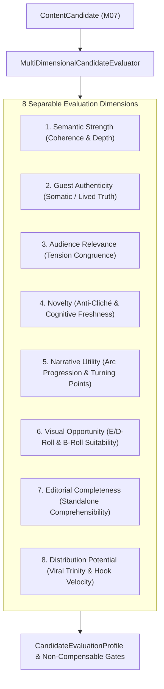

# SPEC-SCR-001: Multi-Dimensional Scoring, Clustering, and Portfolio Optimization

**Document ID:** `SPEC-SCR-001`  
**Governing Mandate:** `CAE-M08`  
**Status:** `CANONICAL SPECIFICATION`  
**Version:** `1.0.0`  
**Prepared:** 2026-08-28  

---

## 1. Purpose & Scope

This specification defines the domain contracts, multi-dimensional scoring models, evaluator provenance standards, clustering mechanics, non-compensable safety gates, and anti-reward-hacking validators for the **Scoring Intelligence Layer** in CAE.

The Scoring Intelligence Layer evaluates `ContentCandidate` entities (from `CAE-M07`), groups them into semantic clusters to analyze narrative coverage and redundancy, and outputs an auditable `EditorialBoard` ready for Operator selection (`CAE-M09`).

### Strict Prohibitions
* **No Single-Score Override:** A high distribution or virality score can never compensate for low guest authenticity ($< 0.40$), ungrounded claims, or missing narrative turns.
* **No Quality Conflation with Clusters:** Clustering groups candidates by semantic proximity to measure portfolio coverage; a cluster assignment never constitutes a qualitative approval.
* **No Vector Proximity as Semantic Proof:** Embedding similarity is an exploratory grouping heuristic, not ground truth.
* **No Automated Production Approvals:** All evaluated candidates remain in `DRAFT_CANDIDATE` or `PENDING_OPERATOR_REVIEW`.

---

## 2. The 8 Separable Evaluation Dimensions

---

## 3. Non-Compensable Safety Gates

A candidate must satisfy three non-negotiable minimum thresholds to pass evaluation:
1. **Authenticity Gate:** $\text{guest\_authenticity} \ge 0.40$. If below, status is `FAILED_AUTHENTICITY`.
2. **Evidence Grounding Gate:** If $\text{distribution\_potential} > 0.80$, $\text{guest\_authenticity}$ and $\text{semantic\_strength}$ must both be $\ge 0.50$ (anti-clickbait / low-evidence virality block).
3. **Completeness Gate:** $\text{editorial\_completeness} \ge 0.40$.

---

## 4. Evaluator Provenance Contract

Every score profile records explicit lineage:
- `evaluator_id`: e.g. `EVAL-CMF-HERITAGE-V2`
- `evaluator_version`: Semantic versioning of scoring weights.
- `scored_at`: UTC timestamp.
- `rationale`: Human-auditable trace explaining score assignments.
