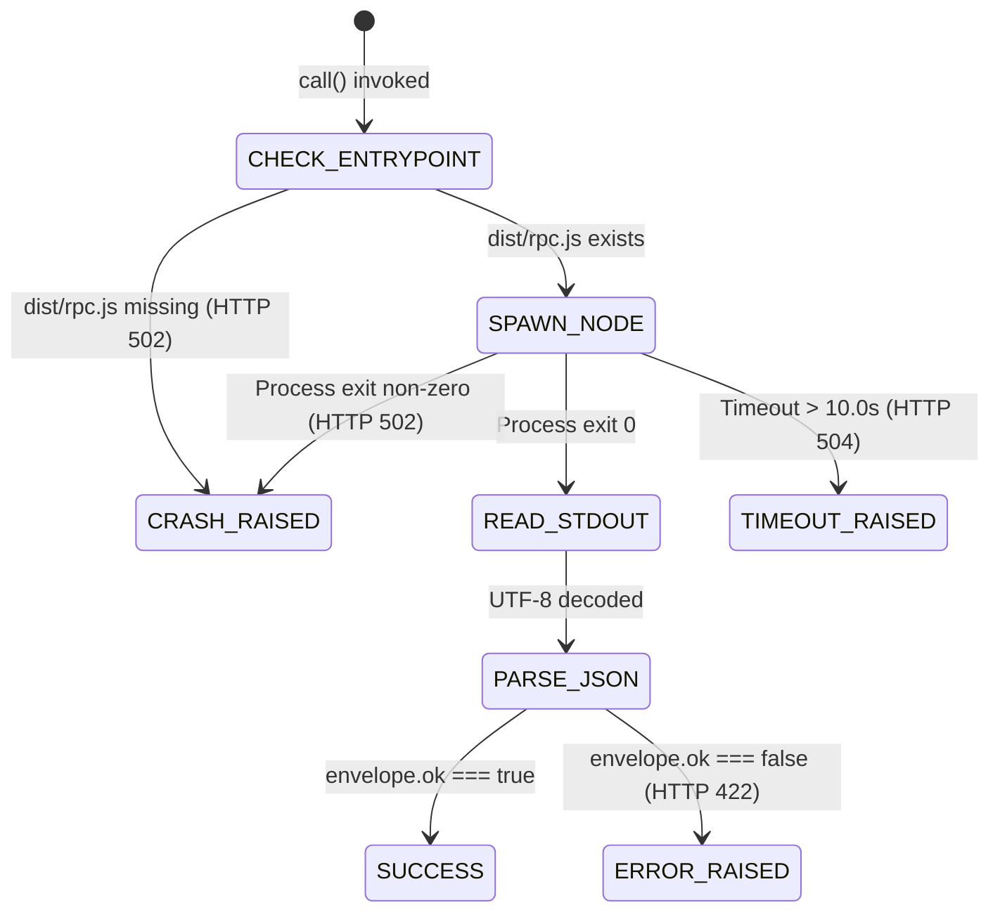

# Implementation Specification: SPEC-STU-001
# Studio Build Repair & Deterministic RPC Bridge

**Document ID:** SPEC-STU-001  
**Version:** 1.0.0  
**Status:** ACCEPTED_AS_AMENDED  
**Classification:** Track A Implementation Specification  
**Authority:** Mandate CA-SPEC-02 (`docs/cae/gemini_execution/26_CA_SPEC_02_PRD_RECONCILIATION_AND_APP_COMPLETION_SPECS_MANDATE.md`)  
**Governing Constitutions:** `F19`, `F26`, `F27`, `TS-APP-API-006`, `Sequencing 0-C`  
**Date:** 2026-08-26  

---

## 1. Files and Evidence Read

1. `services/studio/package.json` (lines 1–14): Contains npm scripts `"build": "tsc -p tsconfig.json"`, `"rpc": "node dist/rpc.js"`, `"health": "node dist/index.js health --json"`.
2. `services/studio/src/rpc.ts` (lines 1–90): Entrypoint handling stdin JSON commands (`compileNaturalLanguageRevision`, `validateCampaignDraft`, `healthCheck`) and outputting JSON envelopes to stdout.
3. `api/services/studio_bridge.py` (lines 1–62): Python subprocess bridge spawning `node <rpc_entrypoint> <command>`, catching `StudioBridgeCrash` on non-zero exit and `StudioBridgeError` on `{ "ok": false }`.
4. `api/routers/revisions.py` (lines 25–120): Live FastAPI endpoints (`POST /api/revisions`, `POST /api/revisions/direct`, `POST /api/revisions/{id}/execute`) invoking `StudioBridge`.

---

## 2. Architectural Role and Boundaries

`SPEC-STU-001` specifies the repair, standardized build orchestration, and robust RPC bridging between the FastAPI Python backend and the TypeScript Conscious Activations Studio domain package (`services/studio`).

### Boundaries:
- **In-Scope:**
  - Automated compilation of TypeScript sources (`services/studio/src/*.ts`) into build artifacts (`services/studio/dist/*.js`, `dist/*.d.ts`).
  - Strict build verification script and CI pre-flight admission gate.
  - Subprocess lifecycle management in `StudioBridge` (timeouts, stdout/stderr isolation, exit-code translation).
  - Standardized error envelope mapping complying with TS-APP-API-004 §5.
- **Out-of-Scope (Non-Goals):**
  - Rewriting Studio's TypeScript domain logic into Python (preserves constitutional separation).
  - Multi-tenant persistent daemon management (retains safe per-call subprocess isolation).

---

## 3. Brownfield Reality & Component Disposition

- **Live Code Anchor:** `api/services/studio_bridge.py:43` executes `subprocess.run([self.node_binary, str(self.rpc_entrypoint), command], ...)` pointing to `services/studio/dist/rpc.js`.
- **Defect Reality:** `services/studio/dist/` is not committed in repository control and is absent upon clean checkouts, resulting in immediate `StudioBridgeCrash` whenever `/api/revisions` is called.
- **Disposition:**
  - Establish automated pre-build hooks in repository initialization scripts (`scripts/build_studio.py` / `npm run build`).
  - Add build artifact verification in CI admission gates (`verify_studio_build.py`).
  - Enhance `StudioBridge` with explicit path check and structured diagnostics if `dist/rpc.js` is missing.

---

## 4. Functional Requirement Traceability

- **F26 (Operator Revision Compiler):** Studio compiles natural language revision prompts into structured patch instructions.
- **TS-APP-API-006 §5 (RPC Bridge Protocol):** Subprocess bridge adheres strictly to one-shot stdin/stdout JSON protocol with 10.0s timeout.
- **Sequencing 0-C (Studio Build Resolution):** Closes the runtime crash risk identified in PRD §1.3a/§1.4.

---

## 5. Canonical Object & Schema Contract

```typescript
// Studio RPC Inbound Envelope
export interface StudioRpcRequest<T = unknown> {
  command: "compileNaturalLanguageRevision" | "validateCampaignDraft" | "healthCheck";
  payload: T;
}

// Studio RPC Outbound Envelope
export interface StudioRpcSuccess<T = unknown> {
  ok: true;
  data: T;
}

export interface StudioRpcFailure {
  ok: false;
  error: {
    code: string;
    message: string;
    context?: Record<string, unknown>;
  };
}

export type StudioRpcResponse<T = unknown> = StudioRpcSuccess<T> | StudioRpcFailure;
```

---

## 6. API Contracts & Endpoint Shapes

### 6.1 Revision Compilation via RPC
- **Endpoint:** `POST /api/revisions`
- **Request Body:**
```json
{
  "campaign_id": "cmp_01j9a1b2c3d4",
  "instruction": "Make the second hook more confrontational regarding industry metrics",
  "operator_id": "opr_audrey_01"
}
```
- **Backend Internal Subprocess Call:**
  `node services/studio/dist/rpc.js compileNaturalLanguageRevision`
  - **Inbound Stdin:**
    ```json
    {
      "campaign_id": "cmp_01j9a1b2c3d4",
      "instruction": "Make the second hook more confrontational regarding industry metrics"
    }
    ```
  - **Outbound Stdout:**
    ```json
    {
      "ok": true,
      "data": {
        "revision_id": "rev_01j9a1b2c3d4e5",
        "patch_action": "REPLACE_PRIMITIVE",
        "target_node": "hook_02",
        "status": "COMPILED"
      }
    }
    ```
- **Response (201 Created):**
```json
{
  "revision_id": "rev_01j9a1b2c3d4e5",
  "campaign_id": "cmp_01j9a1b2c3d4",
  "status": "COMPILED",
  "patch_summary": "Replace primitive at hook_02",
  "created_at": "2026-08-26T12:20:00Z"
}
```

### 6.2 Error Envelope (TS-APP-API-004 §5)
```json
{
  "error_code": "STUDIO_BRIDGE_CRASH",
  "message": "Studio RPC 'compileNaturalLanguageRevision' failed: dist/rpc.js not found. Please run 'npm run build' in services/studio.",
  "timestamp": "2026-08-26T12:20:01Z",
  "context": {
    "entrypoint": "services/studio/dist/rpc.js",
    "command": "compileNaturalLanguageRevision"
  }
}
```

---

## 7. State Machines & Transition Grammar

### Studio Bridge Subprocess Execution Flow


---

## 8. Error Taxonomy & Hard Failures

| Error Code | HTTP Status | Cause | UI / Caller Behavior |
|---|---|---|---|
| `STUDIO_NOT_BUILT` | 502 | `dist/rpc.js` does not exist on disk | Fails fast with explicit build command instructions |
| `STUDIO_BRIDGE_CRASH` | 502 | Node process exited non-zero or uncaught exception | Returns stderr excerpt for developer debugging |
| `STUDIO_BRIDGE_TIMEOUT` | 504 | Node execution exceeded 10.0 seconds | Cancels subprocess and alerts operator |
| `STUDIO_VALIDATION_ERROR` | 422 | Well-formed rejection from Studio domain | Passes domain error code and message to client |

---

## 9. Implementation File Allowlist & Scope Boundary

```
services/studio/
  ├── package.json                       # [CONFIRM] Build and rpc script declarations
  ├── tsconfig.json                      # [CONFIRM] Output directory set to "dist"
  └── src/
      └── rpc.ts                         # [MODIFY] Ensure full command coverage and error safety
api/
  └── services/
      └── studio_bridge.py               # [MODIFY] Add entrypoint check & timeout handling
scripts/
  └── build_studio.py                    # [NEW] Automated Python build trigger for Studio
tests/
  └── api/
      └── test_studio_bridge.py          # [NEW] Subprocess bridge & RPC unit tests
```

---

## 10. Test Plan with Hard Negatives

### Automated Integration & Adversarial Tests:
1. **HN-STU-01 (Reject Missing Entrypoint Fast):** When `dist/rpc.js` is intentionally moved or absent, `StudioBridge.call()` must raise an informative exception immediately without hanging.
2. **HN-STU-02 (Subprocess Timeout Enforcement):** A simulated hanging RPC script must be killed exactly after 10.0s and raise `StudioBridgeCrash` / HTTP 504.
3. **HN-STU-03 (Catch Syntax / Execution Crashes):** Triggering an unhandled exception inside Node must return non-zero exit code, captured by Python as `StudioBridgeCrash` containing stderr.
4. **HN-STU-04 (Reject Non-JSON Output):** If Node outputs corrupted non-JSON text to stdout, bridge must raise JSONDecodeError / 502 error instead of crashing silently.
5. **HN-STU-05 (Verify Domain Error Propagation):** When Studio returns `{ "ok": false, "error": { "code": "INVALID_REVISION_PHRASE" } }`, `StudioBridge` must raise `StudioBridgeError` with code matching exactly.

---

## 11. Evidence & Verification Protocol

### Verification Commands:
```bash
# 1. Compile Studio TypeScript sources
cd services/studio && npm run build

# 2. Verify Studio RPC health check via Node
node services/studio/dist/index.js health --json

# 3. Run Studio Bridge Python unit tests
pytest tests/api/test_studio_bridge.py -v
```

---

## 12. Risk Register & Failure Modes

| Risk ID | Description | Impact | Mitigation |
|---|---|---|---|
| `RSK-STU-01` | Node.js runtime missing on deployment server | Critical | `StudioBridge` verifies `which node` on app startup and logs critical warning if absent. |
| `RSK-STU-02` | Zombie Node processes on abrupt backend crash | Low | `subprocess.run` with context manager and process group termination on timeout. |

---

## 13. Rollback & Backout Procedure

1. Clean `services/studio/dist/` via `npm run clean` or directory removal.
2. Revert changes to `api/services/studio_bridge.py`.

---

## 14. Open Decisions & Human Review Prompts
 
> [!NOTE]
> **OPEN_DECISION DEC-STU-001 (Subprocess Spawning Architecture & Timeout Configuration):**
> - **Operator Gate Decision:** `ACCEPT AS AMENDED` (2026-08-26)
> - **Subprocess Architecture Approved:** Maintain per-call short-lived Node.js subprocesses for complete state isolation and memory leak prevention.
> - **Configurable Timeout Parameter:** Subprocess execution timeout is promoted to an environment-configurable setting (`CA_STUDIO_RPC_TIMEOUT_SECONDS`, integer seconds, default `10`), enabling operational tuning under varied containerized workloads.

