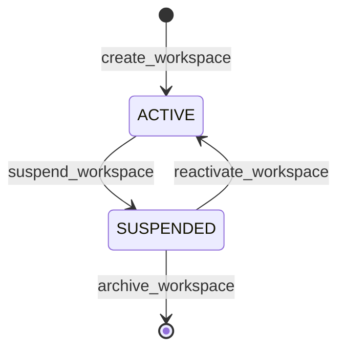

# Implementation Specification: SPEC-TWC-UI-001
# Workspace & Membership Management UI Console

**Document ID:** SPEC-TWC-UI-001  
**Version:** 1.0.0  
**Status:** ACCEPTED_AS_AMENDED  
**Classification:** Track A Implementation Specification  
**Authority:** Mandate CA-SPEC-02 (`docs/cae/gemini_execution/26_CA_SPEC_02_PRD_RECONCILIATION_AND_APP_COMPLETION_SPECS_MANDATE.md`)  
**Governing Constitutions:** `MC-CAE-WS-001`, `MEM-001`, `OPR-001`, `FR-APP-001..003`  
**Date:** 2026-08-26  

---

## 1. Files and Evidence Read

1. `api/routers/v1_tenancy.py` (lines 1–285): Live FastAPI router mounting `/api/v1/workspaces`, implementing 7 typed endpoints for workspace lifecycle and membership administration.
2. `packages/ca_runtime/src/ca_runtime/workspace_core.py` (lines 40–170): Authoritative typed core operations (`create_workspace`, `list_workspaces`, `get_workspace`, `suspend_workspace`, `create_membership`, `list_memberships`, `revoke_membership`).
3. `apps/web/src/routes/workspace/index.tsx` (lines 1–17): Brownfield placeholder route rendering `PlaceholderPage title="Workspace" frRange="FR-APP-001..003"`.
4. `apps/web/src/routes/__root.tsx` (lines 1–40): TanStack Router root navigation layout.
5. `apps/web/src/components/ui/` (`Card.tsx`, `Button.tsx`, `Badge.tsx`): Existing design system primitives.

---

## 2. Architectural Role and Boundaries

`SPEC-TWC-UI-001` specifies the user interface layer in `apps/web` that surfaces multi-tenant workspace administration and role-based access control directly against `/api/v1/workspaces`.

### Boundaries:
- **In-Scope:**
  - Workspace selector dropdown in global navigation header.
  - Workspace list and creation modal in `/workspace/`.
  - Workspace detail view with membership roster management (`TENANT_ADMIN`, `TENANT_MEMBER`, `TENANT_OPERATOR`).
  - Active tenant context synchronization across TanStack Router search params and React Context (`WorkspaceContext`).
  - Strict display of tenancy status badges (`ACTIVE`, `SUSPENDED`).
- **Out-of-Scope (Non-Goals):**
  - Direct database mutation (all mutations flow strictly via HTTP to `/api/v1/workspaces`).
  - Billing / Stripe subscription management.
  - Multi-factor authentication setup (handled at Supabase Auth boundary).

---

## 3. Brownfield Reality & Component Disposition

- **Live Code Anchor:** `apps/web/src/routes/workspace/index.tsx` currently contains an inert placeholder.
- **API Anchor:** `api/routers/v1_tenancy.py:51` (`@router.post("")`), line 148 (`@router.get("")`), line 172 (`@router.get("/{workspace_id}")`), line 192 (`@router.patch("/{workspace_id}")`), line 219 (`@router.post("/{workspace_id}/memberships")`), line 246 (`@router.get("/{workspace_id}/memberships")`), line 273 (`@router.delete("/{workspace_id}/memberships/{membership_id}")`).
- **Disposition:**
  - Replace `apps/web/src/routes/workspace/index.tsx` with full interactive console.
  - Introduce `apps/web/src/context/WorkspaceContext.tsx` to provide active workspace ID to downstream campaign, interview, and harness routes.
  - Introduce `apps/web/src/api/tenancy.ts` wrapping fetch calls to `/api/v1/workspaces`.

---

## 4. Functional Requirement Traceability

- **FR-APP-001 (Workspace Enumeration & Creation):** User can view all accessible workspaces and create new workspaces with specified human-readable display names.
- **FR-APP-002 (Workspace Context Selection):** Global application header provides instant switching between accessible workspaces, persisting active context across route transitions.
- **FR-APP-003 (Membership & Role Assignment):** Workspace administrators can invite members by email/identifier and assign roles (`TENANT_ADMIN`, `TENANT_MEMBER`, `TENANT_OPERATOR`), or revoke memberships with immediate effect.

---

## 5. Canonical Object & Schema Contract

```typescript
export type WorkspaceRole = "TENANT_ADMIN" | "TENANT_MEMBER" | "TENANT_OPERATOR";
export type WorkspaceStatus = "ACTIVE" | "SUSPENDED";

export interface Workspace {
  workspace_id: string;
  name: string;
  created_at: string;
  updated_at: string;
  status: WorkspaceStatus;
  version: number;
}

export interface WorkspaceMembership {
  membership_id: string;
  workspace_id: string;
  user_id: string;
  role: WorkspaceRole;
  created_at: string;
}

export interface CreateWorkspaceRequest {
  name: string;
}

export interface CreateMembershipRequest {
  user_id: string;
  role: WorkspaceRole;
}
```

---

## 6. API Contracts & Endpoint Shapes

### 6.1 Create Workspace
- **Endpoint:** `POST /api/v1/workspaces`
- **Headers:** `Content-Type: application/json`, `X-Operator-ID: <operator_id>`
- **Request Body:**
```json
{
  "name": "Acme Media Production"
}
```
- **Response (201 Created):**
```json
{
  "workspace_id": "ws_01j9a1b2c3d4e5f6g7h8j9k0m1",
  "name": "Acme Media Production",
  "status": "ACTIVE",
  "created_at": "2026-08-26T12:00:00Z",
  "updated_at": "2026-08-26T12:00:00Z",
  "version": 1
}
```

### 6.2 List Workspaces
- **Endpoint:** `GET /api/v1/workspaces`
- **Response (200 OK):**
```json
[
  {
    "workspace_id": "ws_01j9a1b2c3d4e5f6g7h8j9k0m1",
    "name": "Acme Media Production",
    "status": "ACTIVE",
    "created_at": "2026-08-26T12:00:00Z",
    "updated_at": "2026-08-26T12:00:00Z",
    "version": 1
  }
]
```

### 6.3 Add Membership
- **Endpoint:** `POST /api/v1/workspaces/{workspace_id}/memberships`
- **Request Body:**
```json
{
  "user_id": "usr_998877",
  "role": "TENANT_MEMBER"
}
```
- **Response (201 Created):**
```json
{
  "membership_id": "mem_01j9a1b2c3d4e5f6g7h8j9k0m2",
  "workspace_id": "ws_01j9a1b2c3d4e5f6g7h8j9k0m1",
  "user_id": "usr_998877",
  "role": "TENANT_MEMBER",
  "created_at": "2026-08-26T12:05:00Z"
}
```

### 6.4 Error Envelope (TS-APP-API-004 §5)
```json
{
  "error_code": "MEMBERSHIP_DUPLICATE",
  "message": "User 'usr_998877' already holds an active membership in workspace 'ws_01j9a1b2c3d4e5f6g7h8j9k0m1'.",
  "timestamp": "2026-08-26T12:05:01Z",
  "context": {
    "workspace_id": "ws_01j9a1b2c3d4e5f6g7h8j9k0m1",
    "user_id": "usr_998877"
  }
}
```

---

## 7. State Machines & Transition Grammar

### Workspace Status Lifecycle


- **Illegal Transitions:**
  - `SUSPENDED` $\rightarrow$ Create Membership (Rejected: HTTP 409 `WORKSPACE_SUSPENDED`).
  - Delete non-existent membership $\rightarrow$ HTTP 404 `MEMBERSHIP_NOT_FOUND`.

---

## 8. Error Taxonomy & Hard Failures

| Error Code | HTTP Status | Cause | UI Behavior |
|---|---|---|---|
| `WORKSPACE_NOT_FOUND` | 404 | Invalid `workspace_id` in URL | Redirect to workspace selector with error banner |
| `WORKSPACE_SUSPENDED` | 409 | Attempting mutation on suspended workspace | Disable action buttons; display amber suspension notice |
| `MEMBERSHIP_DUPLICATE` | 409 | User already member of target workspace | Highlight user input field with inline validation error |
| `MEMBERSHIP_NOT_FOUND` | 404 | Revoking non-existent membership | Refresh roster and display toast notice |
| `VALIDATION_FAILED` | 422 | Blank workspace name or invalid role string | Render field-level validation message |

---

## 9. Implementation File Allowlist & Scope Boundary

```
apps/web/src/
  ├── api/
  │   └── tenancy.ts                     # [NEW] Typed API client for /api/v1/workspaces
  ├── context/
  │   └── WorkspaceContext.tsx           # [NEW] Active workspace React Context provider
  ├── components/workspace/
  │   ├── WorkspaceSelector.tsx          # [NEW] Header dropdown switcher
  │   ├── WorkspaceCreateModal.tsx       # [NEW] Creation dialog
  │   ├── MembershipTable.tsx            # [NEW] Roster listing & role editor
  │   └── AddMemberModal.tsx             # [NEW] Member invitation dialog
  └── routes/workspace/
      ├── index.tsx                      # [MODIFY] Replace PlaceholderPage with console
      └── index.test.tsx                 # [MODIFY] Component integration tests
```

---

## 10. Test Plan with Hard Negatives

### Automated Component & Integration Tests:
1. **HN-TWC-01 (Reject Empty Workspace Name):** Form submission with whitespace-only workspace name must be prevented on client and rejected with 422 if forced.
2. **HN-TWC-02 (Reject Illegal Role Enum):** Manual dispatch with role `"SUPER_ADMIN"` must be rejected with 422 `VALIDATION_FAILED`.
3. **HN-TWC-03 (Reject Mutating Suspended Workspace):** UI must block adding members when `workspace.status === 'SUSPENDED'`.
4. **HN-TWC-04 (Reject Cross-Tenant Leakage):** Switching active workspace in dropdown must immediately clear stale campaign and interview query caches.
5. **HN-TWC-05 (Enforce Immediate Revocation):** Clicking revoke membership must dispatch `DELETE /api/v1/workspaces/{id}/memberships/{mem_id}` and remove row from table without full-page reload.

---

## 11. Evidence & Verification Protocol

### Verification Commands:
```bash
# 1. Run web unit tests for workspace suite
cd apps/web && npm test src/routes/workspace/index.test.tsx

# 2. Verify TypeScript type-checking across web app
cd apps/web && npm run typecheck

# 3. Verify API endpoint integration via pytest
pytest tests/api/test_v1_tenancy_integration.py -v
```

---

## 12. Risk Register & Failure Modes

| Risk ID | Description | Impact | Mitigation |
|---|---|---|---|
| `RSK-TWC-01` | User loses active workspace context on page refresh | Medium | Persist selected `workspace_id` in `localStorage` with fallback to first accessible workspace. |
| `RSK-TWC-02` | Stale memberships displayed after concurrent operator revocation | Low | React Query `invalidateQueries(['workspaces', id, 'memberships'])` on window focus. |

---

## 13. Rollback & Backout Procedure

1. Revert `apps/web/src/routes/workspace/index.tsx` to `PlaceholderPage`.
2. Delete `apps/web/src/components/workspace/` and `apps/web/src/context/WorkspaceContext.tsx`.
3. Clear `localStorage['ca_active_workspace_id']`.

---

## 14. Open Decisions & Human Review Prompts
 
> [!NOTE]
> **OPEN_DECISION DEC-TWC-001 (Default Workspace on First Login):**
> - **Operator Gate Decision:** `ACCEPT AS AMENDED` (2026-08-26)
> - **Amended Requirement:** Auto-create personal workspace upon first user login is approved. The workspace display name MUST be derived dynamically from account identity (e.g., `"${user.name}'s Workspace"` or `${account.email}`), and must NOT use a literal `"Default Workspace"` string.
> - **Receipt Discipline:** All workspace and membership creations must flow strictly via the typed core (`packages/ca_runtime/src/ca_runtime/workspace_core.py`) with append-only immutable execution receipts emitted under PostgreSQL staging isolation.

